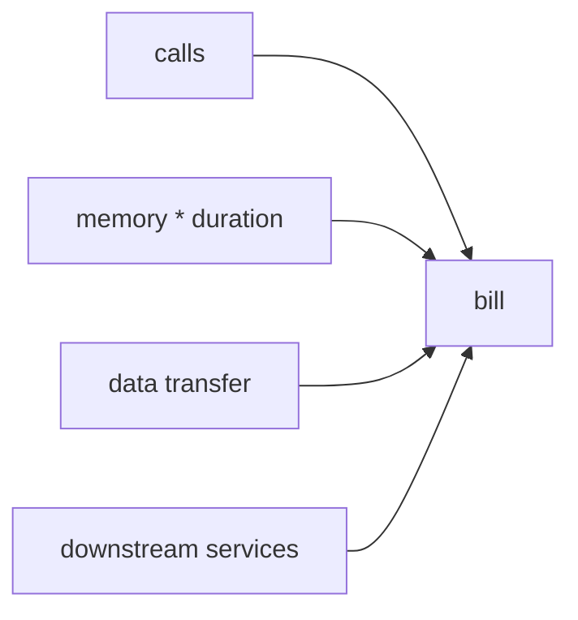

# 비용

서버리스는 종종 저렴한 선택지처럼 소개됩니다. 호출이 있을 때만 돈을 내니 당연해 보이기도 합니다. 그런데 막상 청구서를 보면 생각보다 빠르게 커지는 경우가 많습니다. 이유는 호출 단가만으로는 전체 비용을 설명할 수 없기 때문입니다.

이 글은 Serverless 101 시리즈의 9번째 글입니다.

## 이 글에서 다룰 문제

- 서버리스 비용은 어떤 항목들의 합으로 결정될까요?
- 메모리 설정은 왜 성능뿐 아니라 비용에도 직접 연결될까요?
- 데이터 전송과 연계 서비스 비용은 왜 자주 놓칠까요?
- 유휴 프로비저닝 비용은 어떤 의미를 가질까요?

> 서버리스 비용은 호출 수, 실행 시간, 메모리, 데이터 전송, 연계 서비스 비용을 모두 합쳐서 봐야 합니다.

## 왜 이 주제가 중요한가

서버리스는 항상 더 저렴하지 않습니다. 짧고 드문 작업에는 매우 효율적일 수 있지만, 지속적으로 높은 트래픽이 흐르거나 실행 시간이 긴 워크로드에서는 전통적인 고정 서버보다 비쌀 수도 있습니다. 그래서 비용은 기술 세부 옵션이 아니라 아키텍처 선택 기준입니다.

특히 입문 단계에서는 호출당 단가만 보고 안심하기 쉽습니다. 그러나 실제 청구서는 훨씬 복합적입니다. 메모리와 실행 시간의 곱, 외부로 나가는 데이터 전송, 데이터베이스와 큐 같은 관리형 서비스 요금, 프로비저닝된 동시성의 유휴 비용까지 모두 더해집니다. 서버리스 비용을 잘 읽는다는 말은 숫자를 외우는 것이 아니라, 어떤 설계 선택이 어떤 항목을 키우는지 아는 것입니다.

## 한눈에 보는 구조



이 그림은 비용이 하나의 숫자에서 오지 않는다는 점을 분명하게 보여 줍니다. 호출 수만 낮추는 것으로는 충분하지 않을 수 있고, 코드 최적화만으로도 전체 비용을 다 설명할 수 없습니다. 네트워크와 주변 서비스 비용까지 포함한 전체 시나리오를 봐야 합니다.

## 핵심 용어 먼저 정리하기

| 용어 | 뜻 | 실무에서 왜 중요한가 |
| --- | --- | --- |
| **호출 비용** | 함수가 호출될 때마다 붙는 단가 | 가장 눈에 잘 띄지만 전체의 일부일 뿐입니다 |
| **GB-초** | 메모리와 실행 시간의 곱 | 성능과 비용을 함께 묶어 봐야 하는 이유입니다 |
| **데이터 송신** | 외부로 나가는 데이터 전송 비용 | 코드보다 네트워크 설계가 더 중요할 때가 많습니다 |
| **유휴 비용** | 프로비저닝해 둔 자원이 놀고 있어도 드는 비용 | 지연 시간과 비용의 교환 관계를 보여 줍니다 |
| **단위 경제성** | 호출 한 건당 남는 마진 구조 | 제품 가격과 기능 범위 판단에 직접 연결됩니다 |

비용 논의에서 중요한 것은 단가가 아니라 시나리오입니다. 같은 함수도 트래픽 패턴과 데이터 크기, 지연 시간 요구가 달라지면 전혀 다른 비용 구조를 갖습니다.

## 무엇이 달라지는지 먼저 보기

**문제가 있는 상태**에서는 호출당 가격만 보고 전체 비용을 추정합니다.

**개선된 상태**에서는 총소유비용 관점으로 대안을 비교합니다. 즉, 함수 비용뿐 아니라 데이터 전송, 데이터베이스, 큐, 유휴 프로비저닝까지 모두 계산합니다.

이 차이가 중요한 이유는 기술 선택이 종종 비용 구조를 바꾸기 때문입니다. 같은 기능이라도 요청당 메모리 사용량을 줄일지, 네트워크 전송량을 줄일지, 프로비저닝을 끌지 말지가 서로 다른 방향으로 총비용을 바꿉니다.

## 비용 모델을 코드로 계산해 보기

아래 코드의 상수는 **AWS Lambda 요금 체계를 예시로 든 값**이지, 모든 서버리스 플랫폼에 공통으로 적용되는 기본값이 아닙니다. Azure Functions와 Google Cloud Functions는 요금 구조, 무료 구간, 세부 과금 방식이 다르므로 이 숫자는 보편 공식이 아니라 하나의 예시 계산 모델로 읽어야 합니다.

### 1단계 — 호출 비용 (AWS Lambda 예시)

```python
def calls_cost(n, unit_price=0.0000002):
    return n * unit_price
```

호출당 단가는 계산하기 쉽습니다. 하지만 바로 이 쉬움 때문에 비용 추정이 여기서 멈추기 쉽습니다.

### 2단계 — GB-초 계산

```python
def gb_seconds(memory_mb, duration_ms, n):
    return (memory_mb / 1024) * (duration_ms / 1000) * n
```

메모리와 실행 시간은 따로가 아니라 곱으로 봐야 합니다. 메모리를 올리면 단가는 비싸져도 실행 시간이 줄어 전체 비용이 낮아질 수 있습니다.

### 3단계 — 데이터 송신 비용 (예시 단가)

```python
def egress_cost(gb, price_per_gb=0.09):
    return gb * price_per_gb
```

네트워크 송신 비용은 자주 놓치는 숨은 항목입니다. 특히 이미지, 동영상, 대용량 응답을 다루는 시스템에서는 함수 비용보다 더 커질 수도 있습니다.

### 4단계 — 시나리오 총비용 비교 (AWS 형태 예시)

```python
def total(n, mem_mb, dur_ms, gb_out):
    return (
        calls_cost(n)
        + gb_seconds(mem_mb, dur_ms, n) * 0.0000166667
        + egress_cost(gb_out)
    )
```

비용 비교는 단일 항목이 아니라 시나리오 수준에서 해야 합니다. 요청 수, 평균 실행 시간, 메모리 설정, 데이터 전송량을 묶어서 봐야 실제 의사결정에 도움이 됩니다.

### 5단계 — 메모리 튜닝 스윕

```python
sizes = [128, 256, 512, 1024]
for s in sizes:
    print(s, total(1_000_000, s, 200, 5))
```

메모리 크기를 바꿔 가며 비교하면 비용이 단순히 메모리 크기에 비례하지 않는다는 점을 체감할 수 있습니다. 성능 개선이 비용 절감으로 이어지는 경우도 있기 때문입니다.

## 이 코드에서 먼저 봐야 할 점

- 숫자 상수는 **특정 클라우드 사업자의 예시 값**이지 서버리스 공통 기본값이 아닙니다.
- 메모리 크기는 CPU와 비용에 동시에 영향을 줍니다.
- 데이터 전송은 자주 놓치는 중요한 항목입니다.
- 비교는 단가가 아니라 시나리오 수준에서 해야 합니다.

서버리스 비용 최적화는 “최소 사양으로 버티기”가 아닙니다. 같은 일을 더 짧게 끝내고, 덜 보내고, 유휴 자원을 덜 남기는 구조를 찾는 일에 가깝습니다.

## 실무에서 자주 헷갈리는 지점

### 호출당 단가가 아주 낮은데 왜 총비용이 커질까

호출 수 외에도 메모리, 실행 시간, 네트워크, 관리형 서비스 비용이 함께 붙기 때문입니다. 특히 주변 서비스 비용이 더 커지는 경우가 많습니다.

### 메모리를 낮추면 무조건 절약일까

그렇지 않습니다. 메모리를 낮춰 실행 시간이 길어지면 총비용이 오를 수 있습니다. 성능과 비용은 같이 봐야 합니다.

### 프로비저닝은 성능을 위한 선택일 뿐 비용과는 무관할까

전혀 아닙니다. 실제 호출이 없더라도 미리 준비해 둔 자원에 대한 비용이 생기므로 유휴 비용을 계속 추적해야 합니다.

## 자주 하는 실수 다섯 가지

1. 특정 사업자의 공개 단가를 서버리스 전체의 공통 기본값처럼 받아들입니다.
2. 메모리를 최소값에 고정한 채 실행 시간을 측정하지 않습니다.
3. 데이터 송신 비용을 무시합니다.
4. 데이터베이스와 큐 비용을 빼먹습니다.
5. 프로비저닝된 동시성의 유휴 비용을 추적하지 않습니다.

이 실수들은 대부분 비용을 기능 바깥의 후처리 문제로 볼 때 생깁니다. 실제로는 응답 시간, 아키텍처 경계, 네트워크 설계가 모두 청구서에 직접 반영됩니다.

## 실무에서는 이렇게 생각합니다

- 비용은 기능의 일부입니다.
- 메모리 튜닝은 시간과 돈의 교환 문제입니다.
- 데이터 송신 문제는 코드보다 네트워크 설계에서 풀어야 할 때가 많습니다.
- 유휴 프로비저닝은 지연 시간 감소의 세금처럼 봅니다.
- 대안 비교는 항상 같은 시나리오 기준에서 해야 공정합니다.

## 체크리스트

- [ ] 총비용 모델을 만들어 두었는가
- [ ] 메모리 튜닝을 실제 측정값으로 검토했는가
- [ ] 데이터 송신량을 측정하는가
- [ ] 비용 대시보드나 FinOps 지표를 보고 있는가

## 정리

서버리스 비용은 결코 호출당 단가 하나로 설명되지 않습니다. 호출 수, 실행 시간, 메모리, 데이터 전송, 연계 서비스 비용이 모두 합쳐져 청구서가 됩니다. 그래서 비용 최적화도 단순 절약이 아니라 설계 선택의 결과로 봐야 합니다.

다음 글에서는 지금까지 다룬 요소를 모아 서버리스 앱을 어떻게 설계할지 살펴보겠습니다.

<!-- toc:begin -->
- [서버리스란 무엇인가?](./01-what-is-serverless.md)
- [함수형 서비스(FaaS)란 무엇인가?](./02-function-as-a-service.md)
- [트리거와 이벤트](./03-trigger-and-event.md)
- [콜드 스타트](./04-cold-start.md)
- [스케일링](./05-scaling.md)
- [상태 관리](./06-state-management.md)
- [큐와 이벤트 기반 아키텍처](./07-queue-and-event-driven.md)
- [관측성](./08-observability.md)
- **비용 (현재 글)**
- 서버리스 앱 설계 (예정)
<!-- toc:end -->

## 참고 자료

- [Lambda 요금](https://aws.amazon.com/lambda/pricing/)
- [Cloud Functions 요금](https://cloud.google.com/functions/pricing)
- [Azure Functions 요금](https://azure.microsoft.com/pricing/details/functions/)
- [FinOps Foundation](https://www.finops.org/)

Tags: Serverless, Cost, FinOps, Pricing, Cloud
