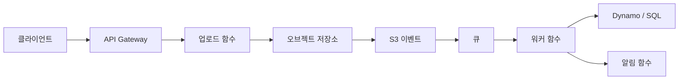

# Serverless 앱 설계

## 이 글에서 다룰 문제

- 여러 개의 작은 함수를 어떻게 하나의 애플리케이션으로 엮어야 할까요?
- 업로드, 변환, 알림 같은 단계를 왜 한 함수에 몰아넣지 말아야 할까요?
- 큐, DLQ, 멱등 키는 설계 원칙에서 어떤 역할을 맡을까요?
- 비용과 운영 복잡성을 함께 보려면 무엇을 기준으로 경계를 나눠야 할까요?

> Serverless 101 시리즈 (10/10)

함수 하나만 보면 Serverless는 단순합니다. 이벤트를 받아 코드를 실행하고 끝내면 됩니다. 하지만 실제 애플리케이션은 함수 하나로 끝나지 않습니다. 업로드를 받고, 데이터를 저장하고, 후속 처리를 큐에 넘기고, 실패를 분리하고, 사용자에게 알림을 보내는 여러 흐름이 이어집니다. 이 순간부터 우리는 Serverless를 쓰고 있어도 여전히 분산 시스템을 설계하는 중입니다.

그래서 시리즈의 마지막 주제는 개별 기능이 아니라 조합입니다. Trigger, Queue, State, Observability, Cost를 각각 아는 것만으로는 충분하지 않습니다. 이 요소들을 어떤 경계로 나누고, 어디서 재시도하게 하며, 어떤 실패를 격리할지까지 하나의 시스템으로 묶어야 합니다.

이 글에서는 이미지 처리 파이프라인 예시를 통해 Serverless 앱 설계의 기본 원칙을 정리하겠습니다. 핵심은 함수 개수를 늘리는 것이 아니라 책임 경계를 또렷하게 만들고, 실패와 비용을 예측 가능한 구조로 바꾸는 것입니다.

## 이 글에서 배울 것

- Serverless 앱 설계의 핵심 원칙
- 이미지 처리 파이프라인으로 보는 실제 조합 방식
- 함수 경계와 책임 분리 기준
- 실패, 재시도, 비용을 함께 설계하는 방법

## 왜 중요한가

단일 함수는 쉽게 만들 수 있어도 함수가 수십 개로 늘어나면 모든 분산 시스템 문제가 그대로 들어옵니다. 중복 처리, 메시지 유실, 관측성 부족, 단계 간 결합, 재시도 폭주, 데이터베이스 병목이 전부 설계 문제로 돌아옵니다. 이때 함수를 더 쪼개면 되겠지라고 접근하면 오히려 시스템이 더 읽기 어려워질 수 있습니다.

좋은 Serverless 앱 설계는 기술 스택 자랑이 아니라 경계 설계입니다. 어떤 함수가 사용자 요청 경계에 서는지, 어떤 함수가 백그라운드 작업자인지, 어떤 큐가 시간 차를 흡수하는지, 어떤 저장소가 처리 완료 사실을 기억하는지를 분명히 해야 운영이 쉬워집니다.

## 한눈에 보는 흐름



> Serverless 앱은 작은 함수들의 모음이 아니라, Trigger와 Queue로 연결된 분산 시스템입니다.

이 그림을 보면 각 단계가 맡는 책임이 다릅니다. 업로드 함수는 빠르게 요청 경계를 처리하고, 워커 함수는 시간이 걸리는 변환 작업을 맡고, 알림 함수는 사용자 피드백을 담당합니다. 큐는 이 단계들 사이의 시간 차와 실패를 흡수합니다. 그래서 큐는 단순한 버퍼가 아니라 설계 경계 자체라고 보는 편이 맞습니다.

## 핵심 용어

- **엣지 함수(edge function)**: 사용자 요청 경계에서 얇게 동작하는 함수입니다.
- **워커 함수(worker function)**: 백그라운드 처리 전용 함수입니다.
- **멱등 키**: 중복 처리를 막는 키입니다.
- **데드 레터 큐**: 반복 실패 메시지를 격리하는 큐입니다.
- **Bounded Context**: 하나의 책임 범위를 가지는 설계 경계입니다.

Serverless 앱 설계에서는 이 용어들이 추상 개념이 아니라 바로 운영 행동으로 이어집니다. 엣지 함수는 짧아야 하고, 워커 함수는 재시도를 견뎌야 하며, 멱등 키는 중복 비용을 막아야 하고, DLQ는 실패를 숨기지 말아야 합니다.

## Before / After

**Before**: 하나의 큰 함수가 업로드, 변환, 저장, 알림까지 전부 처리합니다.

**After**: 업로드, 변환, 알림을 분리하고 큐로 연결해 각 단계가 자기 재시도 정책과 실패 경로를 갖습니다.

이 차이가 중요한 이유는 실패 격리 때문입니다. 업로드는 성공했는데 변환이 실패할 수 있고, 변환은 성공했는데 알림만 실패할 수 있습니다. 모든 책임을 한 함수에 몰아넣으면 어디서 다시 시작해야 하는지조차 불분명해집니다.

## 실습: 이미지 처리 파이프라인

### 1단계 — 업로드 함수

```python
def upload(event):
    user = event["user_id"]
    key = f"raw/{user}/{event['filename']}"
    s3.put_object(Bucket="uploads", Key=key, Body=event["body"])
    return {"key": key}
```

엣지 함수는 가능한 한 얇게 유지하는 편이 좋습니다. 여기서는 업로드를 받고 저장소에 넣은 뒤 키만 반환합니다. 변환까지 여기서 같이 처리하면 사용자 응답 시간과 실패 범위가 함께 커집니다.

### 2단계 — S3 이벤트 → 큐

```python
def on_object_created(event):
    for r in event["Records"]:
        sqs.send_message(
            QueueUrl=Q,
            MessageBody=json.dumps({"key": r["s3"]["object"]["key"]}),
        )
```

스토리지 이벤트를 곧바로 워커 함수로 연결할 수도 있지만, 큐를 사이에 두면 시간 흡수와 재시도 제어가 쉬워집니다. 순간적인 부하가 몰려도 업로드 경로와 처리 경로를 분리할 수 있다는 장점이 큽니다.

### 3단계 — 워커 함수 (멱등)

```python
def worker(event):
    for r in event["Records"]:
        msg = json.loads(r["body"])
        key = msg["key"]
        if already_done(key):
            continue
        thumb = make_thumbnail(key)
        save(key, thumb)
        mark_done(key)
```

워커 함수는 중복 메시지를 견뎌야 합니다. 같은 메시지가 다시 와도 이미 끝난 작업이면 건너뛸 수 있어야 합니다. 그래서 멱등 키는 선택적 최적화가 아니라 기본 설계 요소입니다.

### 4단계 — 알림 함수

```python
def notify(event):
    for r in event["Records"]:
        msg = json.loads(r["body"])
        push(msg["user_id"], "Your thumbnail is ready")
```

알림은 비즈니스 핵심 처리와 분리하는 편이 낫습니다. 알림 실패가 썸네일 생성 자체를 실패로 만들 필요는 없기 때문입니다. 책임을 나누면 복구 전략도 각 단계에 맞게 가져갈 수 있습니다.

### 5단계 — 실패 격리

```python
# 큐 정책 예시 (의사 설정)
queue_policy = {
    "VisibilityTimeout": 60,
    "MaxReceiveCount": 5,
    "DeadLetterQueue": "arn:.../thumb-dlq",
}
```

DLQ가 있으면 반복 실패 메시지를 별도로 관찰하고 재처리할 수 있습니다. DLQ가 없으면 메시지는 계속 재시도되거나 결국 사라지고, 운영자는 왜 실패했는지 뒤늦게 로그만 뒤지게 됩니다.

## 이 코드에서 주목할 점

- 큐가 함수 경계를 명시합니다.
- 멱등성은 안전한 재시도의 전제입니다.
- DLQ는 조용히 묻힐 실패를 밖으로 드러냅니다.

이 설계가 좋은 이유는 각 단계가 독립적으로 확장되고 실패할 수 있기 때문입니다. 업로드 트래픽이 몰릴 때는 앞단을, 변환 작업이 무거울 때는 워커를, 알림이 지연될 때는 알림 단계를 따로 조정할 수 있습니다. 한 덩어리 함수로는 얻기 어려운 운영 유연성입니다.

## 자주 하는 실수 5가지

1. 업로드 함수 안에서 변환까지 같이 처리하기
2. 멱등 키 없이 중복 처리를 허용하기
3. DLQ 없이 메시지 실패를 방치하기
4. 공격적인 재시도로 데이터베이스를 압박하기
5. 로그만 보고 메트릭을 무시하기

이 가운데 특히 흔한 실수는 경계를 코드 편의성 기준으로 나누는 것입니다. 지금 짜기 쉬운 구조와 운영하기 쉬운 구조는 다를 때가 많습니다. 업로드 함수 안에서 변환까지 같이 하면 로컬에서는 편하지만, 실서비스에서는 응답 시간, 재시도, 실패 복구가 전부 얽혀 버립니다.

## 실무에서는 이렇게 쓰입니다

모바일 앱의 프로필 사진 업로드, 영수증 OCR, 동영상 트랜스코딩처럼 입력을 받고 뒤에서 단계적으로 처리하는 시스템은 거의 비슷한 패턴을 따릅니다. 엣지 함수는 빠르게 받고, 큐는 시간을 흡수하고, 워커는 무거운 작업을 처리하고, 상태 저장소는 완료 여부를 기억합니다.

이 패턴은 특정 클라우드에만 묶이지도 않습니다. 서비스 이름은 달라도 원리는 같습니다. 결국 중요한 것은 제품 기능보다 먼저 흐름을 경계로 나누는 감각입니다.

## 실무에서는 이렇게 생각합니다

- 진짜 설계는 함수 수가 아니라 경계에서 드러납니다.
- 큐는 시간을 버퍼링하는 설계 도구입니다.
- 멱등성은 업그레이드가 아니라 기본값입니다.
- DLQ는 운영자가 문제를 보는 눈입니다.
- 비용과 복잡성은 항상 함께 읽어야 합니다.

## 체크리스트

- [ ] 함수 경계를 분명히 나눴는가
- [ ] 멱등 키를 적용했는가
- [ ] DLQ를 설정했는가
- [ ] 비용 모델을 문서로 남겼는가

## 연습 문제

1. 멱등 키가 무엇인지 한 줄로 정의해 보세요.
2. DLQ의 역할을 한 줄로 설명해 보세요.
3. 큐가 시간을 버퍼링한다는 말이 무슨 뜻인지 적어 보세요.

## 정리 및 다음 단계

Serverless 앱 설계의 핵심은 함수를 잘게 쪼개는 데 있지 않습니다. 요청 경계, 백그라운드 작업, 상태 저장, 실패 격리, 관측 포인트를 어디에 둘지 분명히 나누는 데 있습니다. 큐는 그 경계를 드러내고, 멱등성은 재시도를 안전하게 만들고, DLQ는 실패를 숨기지 않게 합니다.

시리즈를 모두 마쳤다면 이제 작은 분산 시스템 하나를 직접 설계해 볼 차례입니다. 함수, 큐, 트리거, 상태 저장소를 조합해 스스로 하나의 흐름을 만들어 보시면 이 시리즈의 내용이 가장 빨리 몸에 붙습니다.

<!-- toc:begin -->
- [Serverless란 무엇인가?](./01-what-is-serverless.md)
- [Function as a Service](./02-function-as-a-service.md)
- [Trigger와 Event](./03-trigger-and-event.md)
- [Cold Start](./04-cold-start.md)
- [Scaling](./05-scaling.md)
- [State 관리](./06-state-management.md)
- [Queue와 Event-driven Architecture](./07-queue-and-event-driven.md)
- [Observability](./08-observability.md)
- [Cost](./09-cost.md)
- **Serverless 앱 설계 (현재 글)**
<!-- toc:end -->

## 참고 자료

- [AWS Serverless Application Lens](https://docs.aws.amazon.com/wellarchitected/latest/serverless-applications-lens/welcome.html)
- [Serverless Patterns Collection](https://serverlessland.com/patterns)
- [Enterprise Integration Patterns](https://www.enterpriseintegrationpatterns.com/)
- [Idempotency in Serverless](https://docs.powertools.aws.dev/lambda/python/latest/utilities/idempotency/)

Tags: Serverless, Architecture, DesignPattern, Cloud, FinOps
