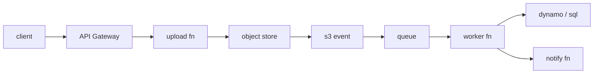

# Serverless 앱 설계

> Serverless 101 시리즈 (10/10)


## 이 글에서 다룰 문제

*함수* 하나는 *쉽지만*, *수십 개* 가 *얽히면* *분산 시스템* 의 *함정* 이 *그대로* 등장합니다.

## 개념 한눈에 보기



## Before/After

**Before**: *모놀리식 함수* 하나가 *업로드*, *변환*, *알림* 을 *모두* 처리.

**After**: *업로드*, *변환*, *알림* 을 *큐* 로 *분리* 하고 *각자* *재시도*.

## 실습: 이미지 처리 파이프라인

### 1단계 — 업로드 함수

```python
def upload(event):
    user = event["user_id"]
    key = f"raw/{user}/{event['filename']}"
    s3.put_object(Bucket="uploads", Key=key, Body=event["body"])
    return {"key": key}
```

### 2단계 — S3 이벤트 → 큐

```python
def on_object_created(event):
    for r in event["Records"]:
        sqs.send_message(
            QueueUrl=Q,
            MessageBody=json.dumps({"key": r["s3"]["object"]["key"]}),
        )
```

### 3단계 — 워커 함수 (멱등)

```python
def worker(event):
    for r in event["Records"]:
        msg = json.loads(r["body"])
        key = msg["key"]
        if already_done(key):
            continue
        thumb = make_thumbnail(key)
        save(key, thumb)
        mark_done(key)
```

### 4단계 — 알림 함수

```python
def notify(event):
    for r in event["Records"]:
        msg = json.loads(r["body"])
        push(msg["user_id"], "썸네일이 준비되었습니다")
```

### 5단계 — 실패 격리

```python
# 큐 정책 (의사 코드)
queue_policy = {
    "VisibilityTimeout": 60,
    "MaxReceiveCount": 5,
    "DeadLetterQueue": "arn:.../thumb-dlq",
}
```

## 이 코드에서 주목할 점

- *경계* 가 *큐* 로 *명시*.
- *멱등성* 이 *재시도* 의 *전제*.
- *DLQ* 가 *조용한 실패* 를 *드러냄*.

## 자주 하는 실수 5가지

1. ***업로드* 함수에서 *변환* 까지 처리.**
2. ***멱등 키* 누락으로 *중복* 처리.**
3. ***DLQ* 미설정으로 *메시지 유실*.**
4. ***재시도* 폭주로 *DB* 과부하.**
5. ***로그* 만 보고 *지표* 무시.**

## 실무에서는 이렇게 쓰입니다

*모바일 앱* 의 *프로필 사진 업로드*, *영수증 OCR*, *동영상 트랜스코딩* 모두 *같은 패턴* 입니다.

## 체크리스트

- [ ] *함수 경계* 정의.
- [ ] *멱등 키* 적용.
- [ ] *DLQ* 설정.
- [ ] *비용 모델* 작성.

## 정리 및 다음 단계

10화 완주 축하합니다. *작은 함수* 들이 *큐* 와 *트리거* 로 *엮인* *분산 시스템* 으로 한 단계 나아가세요.

<!-- toc:begin -->
- [Serverless란 무엇인가?](./01-what-is-serverless.md)
- [Function as a Service](./02-function-as-a-service.md)
- [Trigger와 Event](./03-trigger-and-event.md)
- [Cold Start](./04-cold-start.md)
- [Scaling](./05-scaling.md)
- [State 관리](./06-state-management.md)
- [Queue와 Event-driven Architecture](./07-queue-and-event-driven.md)
- [Observability](./08-observability.md)
- [Cost](./09-cost.md)
- **Serverless 앱 설계 (현재 글)**
<!-- toc:end -->

## 참고 자료

- [AWS Serverless Application Lens](https://docs.aws.amazon.com/wellarchitected/latest/serverless-applications-lens/welcome.html)
- [Serverless Patterns Collection](https://serverlessland.com/patterns)
- [Enterprise Integration Patterns](https://www.enterpriseintegrationpatterns.com/)
- [Idempotency in Serverless](https://docs.powertools.aws.dev/lambda/python/latest/utilities/idempotency/)

Tags: Serverless, Architecture, DesignPattern, Cloud, FinOps
