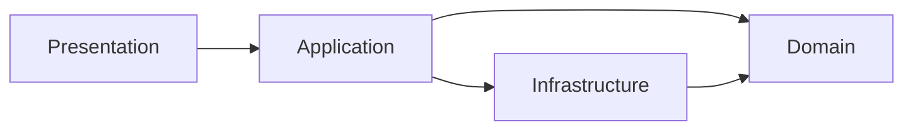

# Layered Architecture

> Software Design 101 series (6/10)

<!-- a-grade-intro:begin -->

**Core question**: Why bother with layers, and what do you split them on?

> So that code with different reasons and rates of change does not sit in the same box.

<!-- a-grade-intro:end -->

## What You Will Learn

- The classic four-layer structure
- The allowed direction of dependencies
- The anti-corruption layer that protects the domain
- The traps when you slice into layers
- Why layering helps even in small systems

## Why It Matters

Layers separate units of change. The UI, the domain, and the infrastructure all change at different rates.

> Group together what changes for the same reason.

## Concept at a Glance



The domain is the stable core that nothing points away from.

## Key Terms

- **Presentation**: HTTP, CLI, UI — the outside touch points.
- **Application**: Use case orchestration.
- **Domain**: Business rules. The most stable layer.
- **Infrastructure**: DB, third-party SaaS, files — the most volatile.
- **Anti-corruption layer (ACL)**: A translation layer that prevents external models from leaking into the domain.

## Before / After

**Before**

```python
# one function does HTTP, business, and DB
@app.route("/charge")
def charge():
    body = request.json
    if body["amount"] <= 0: return "bad", 400
    db.execute("UPDATE wallet ...")
    return "ok"
```

**After**

```python
# presentation
@app.route("/charge")
def charge_view():
    return charge_use_case(request.json)

# application
def charge_use_case(payload):
    cmd = ChargeCommand.from_payload(payload)
    return charge_service.run(cmd)
```

Each layer carries only its own responsibility.

## Hands-on: Five Steps to Introduce Layers

### Step 1 — Extract the domain

```python
# 1_domain.py
class Wallet:
    def debit(self, amount: int) -> None:
        if amount <= 0: raise ValueError
        self.balance -= amount
```

Start by isolating the most stable rules.

### Step 2 — Group into use cases

```python
# 2_usecase.py
def charge(repo, user_id, amount):
    w = repo.get(user_id); w.debit(amount); repo.save(w)
```

Flow lives in the application layer.

### Step 3 — Keep presentation thin

```python
# 3_presentation.py
@app.route("/charge")
def view():
    return charge(repo, request.json["user"], request.json["amount"])
```

The web framework only deals with input and output.

### Step 4 — Infrastructure adapter

```python
# 4_infra.py
class SqlWalletRepo:
    def get(self, uid): ...
    def save(self, w): ...
```

It implements the shape the domain defined.

### Step 5 — Anti-corruption layer

```python
# 5_acl.py
def to_domain_user(external_json):
    return User(id=external_json["uid"], name=external_json["nm"])
```

The external schema cannot pollute the domain.

## What to Notice in This Code

- Dependencies always point toward the domain.
- A thin presentation layer makes it easy to swap channels.
- External models do not enter the domain unchanged.

## Five Common Mistakes

1. **The domain is plastered with ORM decorators.** It now knows infrastructure.
2. **Use cases scatter inside the presentation layer.** Routers grow huge.
3. **Slicing layers too thinly.** All ceremony, little value.
4. **Skipping the ACL.** External changes shake the domain.
5. **Forcing four layers everywhere.** Too much for a small script.

## How This Shows Up in Production

Most backends are essentially layered already. A common split is router → service → repository → model, with an ACL added at any third-party SaaS boundary.

## How a Senior Engineer Thinks

- The domain comes first and gets protected first.
- They visualize the dependency direction.
- The presentation layer stays thin.
- They keep external schemas separate from domain models.
- Small systems get small layering.

## Checklist

- [ ] Does the domain avoid importing infrastructure?
- [ ] Are use cases gathered in the application layer?
- [ ] Is the presentation layer thin?
- [ ] Is there an ACL at the external boundary?
- [ ] Is the layer count appropriate for the system size?

## Practice Problems

1. In one of your routers, lift the business logic out into a service.
2. Separate the ORM model from the domain model.
3. Apply an ACL to a third-party SaaS response.

## Wrap-up and Next Steps

Layers absorb the shock of change. Next up we look at the data that moves between them — how to design the flow.

<!-- toc:begin -->
- [What Is Software Design?](./01-what-is-software-design.md)
- [Separation of Concerns](./02-separation-of-concerns.md)
- [Modules and Boundaries](./03-modules-and-boundaries.md)
- [Dependency Direction](./04-dependency-direction.md)
- [Interfaces and Abstraction](./05-interfaces-and-abstraction.md)
- **Layered Architecture (current)**
- Data Flow Design (upcoming)
- Reducing Change Impact (upcoming)
- Design Principles (upcoming)
- Small Design Practice (upcoming)
<!-- toc:end -->

## References

- [Clean Architecture (Uncle Bob)](https://blog.cleancoder.com/uncle-bob/2012/08/13/the-clean-architecture.html)
- [Domain-Driven Design — Layered Architecture](https://martinfowler.com/bliki/DomainDrivenDesign.html)
- [Patterns of Enterprise Application Architecture](https://martinfowler.com/eaaCatalog/)
- [Anti-Corruption Layer Pattern](https://learn.microsoft.com/en-us/azure/architecture/patterns/anti-corruption-layer)

Tags: Computer Science, SoftwareDesign, LayeredArchitecture, CleanArchitecture, Layers, Architecture
