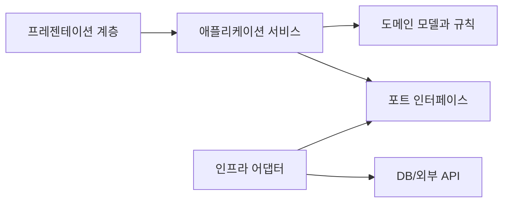

# Software Design 101 (1/10): 소프트웨어 설계란 무엇인가?

이 글은 Software Design 101 시리즈의 첫 번째 글입니다.

코드 한 줄은 바로 읽히는데, 기능 하나를 더하려는 순간 수정 범위가 예상을 훨씬 넘는 프로젝트가 있습니다. 반대로 코드가 아주 화려하지 않아도 변경이 차분하게 흘러가는 프로젝트도 있습니다. 두 코드베이스의 차이는 문법보다 설계에서 먼저 벌어집니다.

여기서는 소프트웨어 설계를 “예쁘게 코드를 쓰는 습관”이 아니라, 다음 변경의 비용을 좌우하는 결정의 묶음으로 정리합니다. 좋은 설계가 무엇인지, 나쁜 설계는 어떤 증상으로 드러나는지, 왜 설계가 시간이 갈수록 더 큰 차이를 만드는지도 함께 보겠습니다.


*Software Design 101 1장 흐름 개요*

## 먼저 던지는 질문

- 좋은 코딩과 좋은 설계는 무엇이 다를까요?
- 설계 품질은 어떤 신호로 판단할 수 있을까요?
- 설계 실패는 코드베이스에서 어떤 증상으로 드러날까요?

## 왜 중요한가

설계는 화면에 바로 드러나지 않습니다. 하지만 다음 요구사항이 들어오는 순간 바로 티가 납니다. 결제 수단 하나를 추가하려는데 파일 열두 개를 수정해야 한다면, 그 비용은 기능의 복잡도보다 설계의 구조에서 나옵니다.

처음 출시만 보면 설계는 사치처럼 보일 수 있습니다. 그러나 운영이 길어질수록 코드는 계속 바뀌고, 설계가 좋지 않은 시스템은 같은 속도로 기능을 추가해도 점점 더 비싸게 움직입니다. 그래서 설계 부채는 이자가 붙는다고 말합니다.

## 전체 그림

요구사항은 설계 결정으로 바뀌고, 설계 결정은 코드로 굳어집니다. 그리고 그 코드는 다음 요구사항이 들어왔을 때의 변경 비용을 결정합니다. 이 순환을 이해하면 설계를 단발성 산출물이 아니라 계속 누적되는 비용 구조로 보게 됩니다.

## 기본 용어

- <strong>소프트웨어 설계</strong>: 모듈, 책임, 의존성에 관해 내리는 결정의 묶음입니다.
- <strong>아키텍처</strong>: 설계 결정 가운데 가장 큰 단위의 구조를 가리킵니다.
- <strong>결합도</strong>: 모듈끼리 얼마나 강하게 얽혀 있는지를 뜻합니다.
- <strong>응집도</strong>: 한 모듈 안의 요소들이 얼마나 같은 목적을 향하는지를 뜻합니다.
- <strong>변경 비용</strong>: 다음 수정을 넣는 데 필요한 시간, 위험, 검증 범위를 뜻합니다.

## 변경 전과 변경 후

**변경 전**

```text
"동작하기만 하면 된다."
→ 첫 출시는 빠르지만, 6개월 뒤 변경이 고통스럽다.
```

**변경 후**

```text
"6개월 뒤에도 바꿀 수 있어야 한다."
→ 첫 출시는 조금 느릴 수 있지만, 누적 비용은 작아진다.
```

설계는 당장의 속도보다 누적 비용을 다루는 일입니다. 처음 며칠은 차이가 작아 보여도, 변경이 다섯 번 열 번 쌓이면 격차가 급격히 커집니다.

## 좋은 설계를 가늠하는 다섯 가지 신호

### 1단계 — 변경 시뮬레이션

```python
# 1_change_sim.py
# "결제 수단 추가" 시 몇 개 파일을 건드려야 할까요?
files_touched = ["payment.py"]  # 파일 하나면 강한 신호입니다.
```

새 결제 수단을 넣는데 파일 하나만 수정하면 꽤 좋은 출발입니다. 같은 작업에 라우터, 서비스, 저장소, 템플릿, 테스트 유틸까지 함께 수정해야 한다면 설계가 변경을 넓게 퍼뜨리고 있다고 볼 수 있습니다.

### 2단계 — 의존성 그래프

```python
# 2_deps.py
# A -> B -> C (한 방향) 구조는 괜찮습니다.
# A <-> B (cycle) 구조는 design smell입니다.
```

의존성 순환은 설계 냄새 가운데 가장 값싼 경고입니다. 두 모듈이 서로를 알아야만 유지되는 구조는 시간이 갈수록 더 단단해지고, 테스트와 리팩터링을 어렵게 만듭니다.

### 3단계 — 모듈 책임

```python
# 3_responsibility.py
# 모듈을 한 문장으로 설명하지 못하면 책임 경계가 흐릿한 것입니다.
PAYMENT = "결제 도메인 — 외부 게이트웨이를 호출하고 도메인 규칙을 적용합니다"
```

모듈을 한 문장으로 설명할 수 없다면, 그 모듈은 이미 여러 역할을 품고 있을 가능성이 큽니다. 이름과 설명이 어긋나면 응집도도 함께 낮아집니다.

### 4단계 — 테스트 가능성

```python
# 4_testable.py
# IO 없이 domain 모듈만 단독으로 테스트할 수 있나요?
def can_test_alone(module):
    return module.no_io and module.no_globals
```

설계는 테스트에서 거짓말을 덜 합니다. 도메인 모듈을 데이터베이스나 네트워크 없이 단독 검증할 수 있다면, 책임 분리와 의존성 방향이 비교적 잘 잡혀 있을 가능성이 높습니다.

### 5단계 — 온보딩 곡선

```text
# 5_onboard.txt
Can a new teammate understand a module in 30 minutes?
```

설계는 사람을 위한 일입니다. 새 팀원이 모듈 하나를 이해하는 데 한참 걸린다면 코드 양보다 구조가 더 큰 문제일 수 있습니다. 온보딩 속도는 설계 품질을 꽤 정직하게 보여 줍니다.

## 빠르게 검증해 보기

설계를 논의할 때는 감으로 말하기보다, 같은 변경을 실제 코드베이스에 대입해 보는 편이 훨씬 정확합니다. 아래처럼 가장 자주 들어오는 요구사항 하나를 고른 뒤, 수정 파일 수와 의존성 방향을 함께 적어 보세요.

```text
변경 시나리오: 결제 수단 추가
수정 파일 수: 1개 / 4개 / 9개
순환 의존: 없음 / 있음
테스트 범위: 도메인만 / 도메인+DB / 전체 회귀
```

**Expected output:** 같은 기능을 넣을 때 수정 파일 수가 적고, 순환 의존이 없고, 테스트 범위를 좁게 유지할수록 설계 품질이 더 좋다는 근거가 보입니다.

이 간단한 표만으로도 “이 코드는 읽기 좋은가?”보다 “이 구조는 다음 변경을 얼마나 비싸게 만드는가?”라는 질문으로 시선을 옮길 수 있습니다.

## 실패 신호와 먼저 볼 것

| 실패 신호 | 먼저 볼 것 |
| --- | --- |
| 기능 하나를 넣는데 여러 폴더를 모두 연다 | 변경이 어느 모듈 경계에서 새고 있는지 확인합니다 |
| 작은 수정인데 통합 테스트만 믿어야 한다 | 도메인 규칙이 IO와 붙어 있지 않은지 봅니다 |
| 새 팀원이 구조 설명을 오래 못 한다 | 모듈 책임을 한 문장으로 요약해 봅니다 |

실패 신호를 빠르게 읽는 습관이 생기면, 설계는 추상적인 미학이 아니라 운영 비용을 낮추는 진단 도구가 됩니다.

## 이 코드에서 먼저 볼 점

- 변경 범위, 의존성, 책임, 테스트 가능성을 같이 봐야 설계가 보입니다.
- 개별 함수의 아름다움보다 다음 수정의 파급 범위가 더 중요한 판단 기준입니다.
- 새 팀원이 빨리 읽을 수 있는 구조는 대개 변경에도 강합니다.

## 자주 헷갈리는 지점

많은 팀이 리팩터링과 설계를 같은 말처럼 씁니다. 둘은 겹치지만 같지는 않습니다. 리팩터링은 구조를 바꾸는 행위이고, 설계는 그 구조가 어떤 방향을 가져야 하는지에 관한 판단입니다.

또 하나 흔한 오해는 “코드가 깔끔하면 설계도 좋다”는 생각입니다. 함수 이름이 좋고 포매팅이 잘 되어 있어도, 결제 로직 하나를 바꾸기 위해 시스템 전체를 건드려야 한다면 설계는 좋은 편이 아닙니다. 읽기 좋은 코드와 바꾸기 좋은 구조는 서로 도와주지만, 동일한 목표는 아닙니다.

## 실무에서는 이렇게 본다

강한 팀은 설계를 추상적인 취향 문제가 아니라 비용 문제로 다룹니다. 어떤 변경이 몇 개 파일로 퍼졌는지, 어떤 모듈에 순환 의존이 생겼는지, 중요한 결정이 문서로 남았는지를 계속 확인합니다.

이때 ADR(Architecture Decision Record)이 큰 역할을 합니다. 설계 결정과 이유를 함께 남겨 두면 새 팀원이 같은 논쟁을 반복하지 않아도 되고, 몇 달 뒤 왜 이런 구조를 택했는지도 다시 추적할 수 있습니다.

## 체크리스트

- [ ] 각 모듈을 한 문장으로 설명할 수 있는가?
- [ ] 의존성 순환이 없는가?
- [ ] 자주 일어나는 변경의 수정 범위가 작은가?
- [ ] 도메인 모듈을 고립된 상태로 테스트할 수 있는가?
- [ ] 중요한 설계 결정이 ADR 같은 문서로 남아 있는가?

## 연습 문제

1. 현재 프로젝트의 모듈 의존성 그래프를 그려 보세요.
2. 가장 자주 들어오는 변경 하나를 골라 수정 파일 수를 세어 보세요.
3. 최근 큰 설계 결정을 한 페이지 분량의 ADR로 적어 보세요.

## 현업 적용 관점에서 다시 정리

설계를 정의할 때는 "변경 비용"을 기준축으로 잡아야 합니다. 문법 난도가 아니라, 기능 변화가 들어올 때 경계가 어디까지 흔들리는지를 봐야 설계 품질을 설명할 수 있습니다.

## 의존 관계를 수치로 읽는 실전 점검

설계 품질을 문장으로만 평가하면 팀마다 기준이 달라집니다. 그래서 실무에서는 결합도 지표를 함께 봅니다. 가장 단순한 시작점은 모듈 단위 `Ca(유입 의존성)`, `Ce(유출 의존성)`, `I=Ce/(Ca+Ce)` 입니다. 값이 정답을 보장하지는 않지만, 경계가 틀어진 지점을 빠르게 찾는 데 매우 유용합니다.

```python
from dataclasses import dataclass

@dataclass(frozen=True)
class CouplingMetric:
    module: str
    ca: int  # 외부 모듈이 이 모듈에 의존하는 수
    ce: int  # 이 모듈이 외부 모듈에 의존하는 수

    @property
    def instability(self) -> float:
        total = self.ca + self.ce
        return 0.0 if total == 0 else self.ce / total

def report(metrics: list[CouplingMetric]) -> None:
    for m in metrics:
        print(f"{m.module:12} Ca={m.ca:2d} Ce={m.ce:2d} I={m.instability:.2f}")

report(
    [
        CouplingMetric("domain", ca=6, ce=1),
        CouplingMetric("application", ca=4, ce=4),
        CouplingMetric("infrastructure", ca=1, ce=7),
    ]
)
```

도메인 모듈의 `I` 값이 0에 가깝고 인프라 모듈의 `I` 값이 1에 가깝다면 방향이 대체로 건강합니다. 반대로 도메인의 `Ce`가 늘어나면 의존성 방향이 뒤집히고 있다는 신호입니다. 이때는 코드 리뷰에서 "왜 import가 생겼는가"를 먼저 질문해야 합니다.

## 모듈 의존 그래프를 먼저 그린 뒤 코드로 옮기기

설계 회의에서 말로만 합의하면 구현 단계에서 금방 흔들립니다. 아래처럼 다이어그램을 먼저 합의하고, 그 다음 import 규칙과 테스트를 붙여 두면 경계를 유지하기 쉽습니다.



이 그림의 핵심은 화살표 개수가 아니라 방향입니다. 도메인은 외부 기술을 모른 채 규칙만 유지하고, 어댑터가 세부 구현을 담당합니다. 이렇게 분리해 두면 기능 요구가 변해도 도메인 코드의 파손 범위가 작아집니다.

## 추상 클래스와 인터페이스를 경계에 배치하기

포트-어댑터 구조를 도입할 때 가장 흔한 실수는 추상화를 인프라 패키지 안에 두는 것입니다. 추상화는 반드시 도메인 또는 애플리케이션 쪽 경계에 둬야 의존성 역전이 성립합니다.

```python
from __future__ import annotations

from abc import ABC, abstractmethod
from dataclasses import dataclass

@dataclass(frozen=True)
class PaymentCommand:
    order_id: str
    user_id: str
    amount: int

class PaymentGateway(ABC):
    @abstractmethod
    def charge(self, command: PaymentCommand) -> str:
        raise NotImplementedError

class FakePaymentGateway(PaymentGateway):
    def charge(self, command: PaymentCommand) -> str:
        return f"paid:{command.order_id}"
```

호출자는 `PaymentGateway`만 의존하고, 실제 결제 제공자 교체는 구현 클래스에서 흡수합니다. 이 방식은 테스트에도 유리합니다. 단위 테스트는 `FakePaymentGateway`를 사용해 비즈니스 규칙만 검증하고, 통합 테스트에서만 실제 I/O를 붙이면 됩니다.

## 리팩터링 전후를 나란히 비교하기

좋은 설계 글은 "좋다"고 말하는 대신 전후 차이를 보여 줘야 합니다. 아래는 책임이 섞인 코드와 책임을 분리한 코드의 대비입니다.

```python
# before.py

def place_order(request: dict) -> dict:
    # HTTP 입력 파싱, 규칙 검증, 결제 호출, 저장, 응답 구성까지 한 함수에 섞임
    user_id = request["user_id"]
    amount = int(request["amount"])
    if amount <= 0:
        return {"status": 400, "message": "invalid amount"}

    payment_id = charge_with_vendor_api(user_id, amount)
    save_order_row(user_id=user_id, amount=amount, payment_id=payment_id)
    return {"status": 200, "payment_id": payment_id}
```

```python
# after.py

def place_order_controller(request: dict, service: "PlaceOrderService") -> dict:
    command = PlaceOrderCommand.from_http(request)
    result = service.execute(command)
    return result.to_http()

class PlaceOrderService:
    def __init__(self, gateway: PaymentGateway, repo: OrderRepository) -> None:
        self.gateway = gateway
        self.repo = repo

    def execute(self, command: "PlaceOrderCommand") -> "PlaceOrderResult":
        command.validate()
        payment_id = self.gateway.charge(command.to_payment_command())
        self.repo.save(command.to_order(payment_id))
        return PlaceOrderResult.success(payment_id)
```

전후를 비교하면 무엇이 바뀌었는지 즉시 보입니다. 컨트롤러는 입력/출력 변환만 담당하고, 서비스는 유스케이스 규칙만 담당하며, 외부 연동은 포트 뒤로 이동합니다. 구조가 이렇게 바뀌면 장애 분석과 테스트 설계가 훨씬 단순해집니다.

## 계층별 체크포인트와 운영 연결

설계는 개발 단계에서 끝나지 않습니다. 운영 지표와 연결되어야 품질 개선이 누적됩니다.

- 프레젠테이션 계층: 요청 검증 실패율, 4xx 응답 분포
- 애플리케이션 계층: 유스케이스별 처리 시간, 재시도 횟수
- 도메인 계층: 규칙 위반 빈도, 불변식 실패 로그
- 인프라 계층: 외부 API 오류율, DB 지연 시간

지표를 계층별로 분리해 보면 어디를 고쳐야 하는지가 명확해집니다. 모든 지표가 한 대시보드에서 섞여 있으면 "느리다"는 사실만 보이고 원인은 보이지 않습니다. 설계 경계를 운영 지표 경계와 맞추면 개선 사이클이 빠르게 돌아갑니다.

## 리뷰와 리팩터링을 위한 실전 질문 세트

설계는 한 번 작성하고 끝나는 산출물이 아니라, 변경 요청이 들어올 때마다 점검하는 운영 습관입니다. 아래 질문은 코드 리뷰와 리팩터링 계획에서 바로 사용할 수 있는 최소 점검 세트입니다.

1. 이번 변경은 어느 계층의 책임인가요?
2. 새 의존성이 도메인 중심 방향을 깨뜨리나요?
3. 인터페이스 이름이 구현 세부를 누설하나요?
4. 테스트 더블 없이 규칙 검증이 가능한가요?
5. 다음 변경이 들어와도 같은 위치를 수정하게 되나요?

이 다섯 질문은 단순하지만 강력합니다. 특히 "다음 변경도 같은 위치를 건드리게 되는가"라는 질문은 설계의 탄력성을 빠르게 드러냅니다. 지금 요구사항을 통과하는 코드와 다음 요구사항까지 받아내는 코드는 여기서 갈립니다.

## 계층 아키텍처 예시를 한 단계 더 구체화하기

아래 예시는 요청-유스케이스-도메인-어댑터 경계를 코드로 고정하는 방법을 보여 줍니다.

```python
from dataclasses import dataclass
from typing import Protocol

@dataclass(frozen=True)
class CreateCouponCommand:
    code: str
    discount_percent: int

class CouponRepository(Protocol):
    def exists(self, code: str) -> bool: ...
    def save(self, code: str, discount_percent: int) -> None: ...

class CreateCouponService:
    def __init__(self, repo: CouponRepository) -> None:
        self.repo = repo

    def execute(self, command: CreateCouponCommand) -> None:
        if not (1 <= command.discount_percent <= 90):
            raise ValueError("할인율은 1~90 범위여야 합니다.")
        if self.repo.exists(command.code):
            raise ValueError("이미 존재하는 쿠폰 코드입니다.")
        self.repo.save(command.code, command.discount_percent)
```

핵심은 서비스가 저장소의 구체 구현을 모른다는 점입니다. SQLAlchemy를 쓰든, 파일 저장을 쓰든, 외부 API를 쓰든 서비스 규칙은 바뀌지 않습니다. 그래서 정책 변경과 기술 변경이 서로 다른 속도로 진화할 수 있습니다.

## 설계 부채를 남기지 않는 배포 순서

설계를 개선할 때 기능 배포와 구조 개선을 한 커밋에 묶으면 위험이 커집니다. 다음 순서를 지키면 안전하게 개선할 수 있습니다.

- 1단계: 새 경계와 인터페이스를 추가합니다. 기존 경로는 유지합니다.
- 2단계: 호출자를 새 경계로 점진 이행합니다. 로그로 구경로 사용량을 기록합니다.
- 3단계: 구경로 트래픽이 0에 가까워지면 제거합니다.
- 4단계: 제거 이후 메트릭과 에러율을 비교해 회귀를 확인합니다.

이 순서는 확장-이행-수축 전략과 같습니다. 설계는 깔끔해지고, 사용자 영향은 최소화됩니다. 특히 여러 팀이 동시에 작업하는 환경에서는 이 순서를 문서화해 공통 작업 규칙으로 삼는 것이 효과적입니다.

## 정리

소프트웨어 설계는 다음 변경의 비용을 결정하는 구조적 판단입니다. 코드의 미세한 아름다움보다 변경의 범위와 속도를 먼저 좌우하고, 시간이 지날수록 그 차이가 더 크게 드러납니다.

다음 글에서는 이 판단을 실제 코드로 끌어내리는 가장 기본 도구, 관심사 분리를 다룹니다.

## 처음 질문으로 돌아가기

- **좋은 코딩과 좋은 설계는 무엇이 다를까요?**
  - 본문의 기준은 소프트웨어 설계란 무엇인가?를 한 덩어리 개념으로 보지 않고 입력, 처리, 검증, 운영 신호가 만나는 경계로 나누어 확인하는 것입니다.
- **설계 품질은 어떤 신호로 판단할 수 있을까요?**
  - 예제와 그림에서는 어떤 값이 들어오고, 어느 단계에서 바뀌며, 어떤 기준으로 통과 또는 실패하는지를 먼저 확인해야 합니다.
- **설계 실패는 코드베이스에서 어떤 증상으로 드러날까요?**
  - 운영에서는 이 판단을 체크리스트, 로그, 테스트로 남겨 다음 변경에서도 같은 실패가 반복되지 않게 막아야 합니다.

<!-- toc:begin -->
## 시리즈 목차

- **소프트웨어 설계란 무엇인가? (현재 글)**
- 관심사 분리 (예정)
- 모듈과 경계 (예정)
- 의존성 방향 (예정)
- 인터페이스와 추상화 (예정)
- 계층 아키텍처 (예정)
- 데이터 흐름 설계 (예정)
- 변경 영향 줄이기 (예정)
- 설계 원칙 모음 (예정)
- 작은 프로젝트로 설계 연습 (예정)

<!-- toc:end -->

## 참고 자료

- [software-design-101 예제 코드 저장소](https://github.com/yeongseon-books/book-examples/tree/main/software-design-101/ko)

- [A Philosophy of Software Design (J. Ousterhout)](https://web.stanford.edu/~ouster/cgi-bin/aposd.php)
- [Software Architecture Guide (Martin Fowler)](https://martinfowler.com/architecture/)
- [Architecture Decision Records (ADR)](https://adr.github.io/)
- [Designing Data-Intensive Applications](https://dataintensive.net/)

### 실전 확인용 문서

- [The Python Tutorial — Modules](https://docs.python.org/3/tutorial/modules.html)
- [unittest.mock — mock object library](https://docs.python.org/3/library/unittest.mock.html)

Tags: Computer Science, SoftwareDesign, Architecture, Modularity, DesignPrinciples, Maintainability
