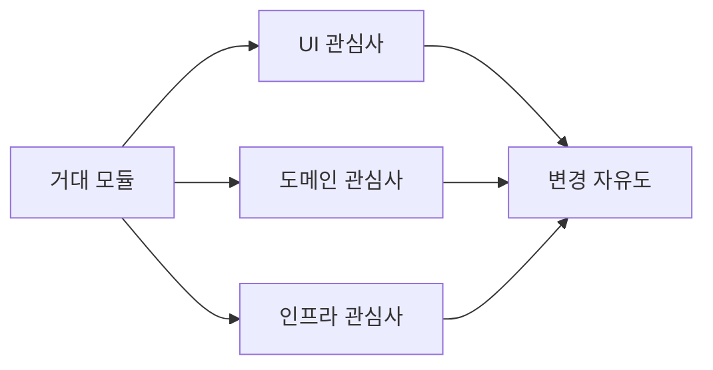

# 관심사 분리

> Software Design 101 시리즈 (2/10)


## 이 글에서 다룰 문제

관심사가 섞이면 한 가지를 바꾸기 위해 모든 것을 알아야 합니다. 분리는 다음 변경의 비용을 낮춥니다.

> 분리는 비용이 아니라 옵션의 선물이다.

## 개념 한눈에 보기



세 관심사를 분리하면 각각 독립적으로 진화합니다.

## Before/After

**Before**

```python
def process_order(req):
    # 입력 파싱 + 검증 + 가격 계산 + DB 저장 + 이메일 + 응답
    ...
```

**After**

```python
def process_order(req):
    cmd = parse(req)               # 입력
    order = build_order(cmd)       # 도메인
    saved = save_order(order)      # 인프라
    notify(saved)                  # 통신
    return to_response(saved)      # 출력
```

각 줄이 하나의 관심사를 다룹니다.

## 실습: 관심사를 분리하는 5단계

### 1단계 — 변경 이유 나열

```python
# 1_reasons.py
# Order 모듈은 왜 바뀌나?
# - 가격 정책 변경
# - DB 스키마 변경
# - 알림 채널 변경
# 세 가지면 책임도 셋이어야 함.
```

변경 이유 = 책임 후보.

### 2단계 — 도메인/인프라 분리

```python
# 2_domain_infra.py
# 도메인은 IO를 모릅니다.
def calculate_total(items, member): ...
# 인프라는 도메인을 사용합니다.
def save(order): db.execute(...)
```

도메인 코어 + 인프라 어댑터.

### 3단계 — 입력/처리/출력 분리

```python
# 3_io.py
def parse(req): ...    # 입력
def handle(cmd): ...   # 처리
def render(res): ...   # 출력
```

함수가 한 줄로 읽힙니다.

### 4단계 — 횡단 관심사 추출

```python
# 4_cross.py
def with_logging(fn):
    def w(*a, **k):
        # 로깅
        return fn(*a, **k)
    return w
```

데코레이터/미들웨어로 한 곳에.

### 5단계 — 통합 지점 점검

```python
# 5_seam.py
# 분리된 관심사들이 어디서 만나는지(이음새)를 점검.
def app(req):
    return render(handle(parse(req)))
```

이음새가 적고 명확해야 합니다.

## 이 코드에서 주목할 점

- 변경 이유가 모듈마다 한 가지입니다.
- 도메인이 IO를 모릅니다.
- 횡단 관심사가 도메인을 오염시키지 않습니다.

## 자주 하는 실수 5가지

1. **레이어 이름만 분리.** 코드는 여전히 결합.
2. **횡단 관심사를 도메인에 직접 삽입.** 테스트 불가.
3. **너무 잘게 분리.** 통합 비용이 커집니다.
4. **분리 후 인터페이스 불명확.** 이음새가 흐릿.
5. **분리에 따른 성능 두려움 과장.** 보통 측정 후 결정해도 늦지 않습니다.

## 실무에서는 이렇게 쓰입니다

좋은 팀은 도메인 패키지에서 외부 라이브러리 import를 금지하는 lint를 둡니다. 관심사 경계가 코드로 강제됩니다.

## 체크리스트

- [ ] 모듈마다 변경 이유가 한 가지인가?
- [ ] 도메인이 IO 라이브러리를 모르나?
- [ ] 횡단 관심사가 한 곳에 모였나?
- [ ] 이음새가 명확한가?
- [ ] 분리가 통합 비용을 정당화하나?

## 정리 및 다음 단계

관심사 분리는 모든 설계의 출발점입니다. 다음 글에서 분리의 단위 — 모듈과 경계 — 를 다룹니다.

<!-- toc:begin -->
- [소프트웨어 설계란 무엇인가?](./01-what-is-software-design.md)
- **관심사 분리 (현재 글)**
- 모듈과 경계 (예정)
- 의존성 방향 (예정)
- 인터페이스와 추상화 (예정)
- 계층 아키텍처 (예정)
- 데이터 흐름 설계 (예정)
- 변경 영향 줄이기 (예정)
- 설계 원칙 모음 (예정)
- 작은 프로젝트로 설계 연습 (예정)
<!-- toc:end -->

## 참고 자료

- [Separation of Concerns (Dijkstra)](https://www.cs.utexas.edu/users/EWD/transcriptions/EWD04xx/EWD447.html)
- [A Philosophy of Software Design](https://web.stanford.edu/~ouster/cgi-bin/aposd.php)
- [Hexagonal Architecture (Cockburn)](https://alistair.cockburn.us/hexagonal-architecture/)
- [Clean Architecture (Uncle Bob)](https://blog.cleancoder.com/uncle-bob/2012/08/13/the-clean-architecture.html)

Tags: Computer Science, SoftwareDesign, SeparationOfConcerns, Modularity, Cohesion, Coupling
