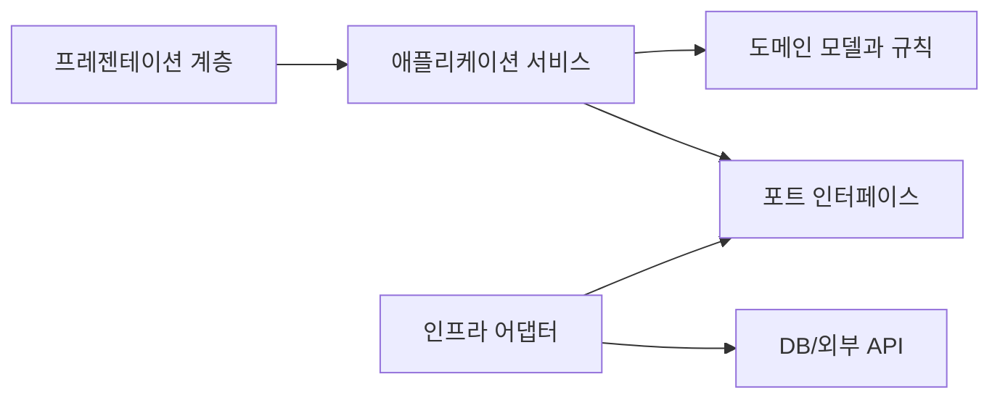

# Software Design 101 (2/10): 관심사 분리

이 글은 Software Design 101 시리즈의 두 번째 글입니다.


주문 처리 함수 하나를 열었는데 입력 검증, 가격 계산, 데이터베이스 저장, 이메일 발송, 응답 직렬화가 한곳에 몰려 있다면 코드는 대개 한 번에 바꾸기 어렵습니다. 기능 하나를 고치려 해도 다른 책임을 모두 함께 이해해야 하기 때문입니다.

이 글은 Software Design 101 시리즈의 2번째 글입니다.

여기서는 관심사 분리를 “파일을 많이 쪼개는 일”이 아니라, 다른 이유로 바뀌는 책임을 다른 경계로 나누는 설계 원칙으로 설명합니다. 결합도와 응집도가 왜 함께 나오는지, 횡단 관심사는 어디에 두어야 하는지, 분리와 통합 사이의 균형은 어떻게 잡아야 하는지도 차례로 보겠습니다.


*Software Design 101 2장 흐름 개요*

## 먼저 던지는 질문

- 관심사란 정확히 무엇일까요?
- 한 모듈이 너무 많은 일을 하는지 어떻게 알아낼 수 있을까요?
- 결합도와 응집도는 관심사 분리와 어떤 관계가 있을까요?

## 왜 중요한가

관심사가 섞인 코드는 수정 한 번에도 시스템 전체 문맥을 요구합니다. 반대로 책임이 잘 나뉜 코드는 필요한 부분만 열어도 다음 변경을 처리할 수 있습니다. 분리는 코드량을 늘리는 일이 아니라, 바뀌는 이유를 정리해 선택지를 늘리는 일입니다.

현업에서 문제가 되는 지점도 여기입니다. 같은 주문 기능인데 가격 정책 변경과 알림 채널 변경이 같은 함수에서 만난다면, 사소한 수정도 위험해집니다. 한쪽을 건드릴 때 다른 쪽이 흔들릴 가능성이 계속 남기 때문입니다.

## 전체 그림

UI, 도메인, 인프라는 바뀌는 속도도 이유도 다릅니다. 이 셋을 같은 상자에 넣으면 작은 변경도 넓게 번집니다. 분리를 잘하면 세 관심사가 서로 다른 속도로 움직일 수 있습니다.

## 기본 용어

- <strong>관심사</strong>: 시스템이 신경 써야 하는 하나의 주제입니다.
- <strong>결합도</strong>: 모듈끼리 얼마나 강하게 얽혀 있는지를 뜻합니다. 낮을수록 좋습니다.
- <strong>응집도</strong>: 한 모듈 안의 코드가 얼마나 같은 목적을 향하는지를 뜻합니다. 높을수록 좋습니다.
- <strong>횡단 관심사</strong>: 로깅, 보안처럼 여러 모듈을 가로지르는 관심사입니다.
- <strong>경계</strong>: 관심사와 관심사가 만나는 이음새입니다.

## 변경 전과 변경 후

**변경 전**

```python
def process_order(req):
    # 입력 파싱 + 검증 + 가격 계산 + DB 저장 + 이메일 + 응답
    ...
```

**변경 후**

```python
def process_order(req):
    cmd = parse(req)               # 입력
    order = build_order(cmd)       # 도메인
    saved = save_order(order)      # 인프라
    notify(saved)                  # 통신
    return to_response(saved)      # 출력
```

아래 구조에서는 각 줄이 하나의 관심사를 맡습니다. 함수 전체를 읽는 사람도 흐름을 한 번에 파악할 수 있고, 저장 방식을 바꾸더라도 도메인 로직을 크게 흔들지 않아도 됩니다.

## 관심사를 나누는 다섯 단계

### 1단계 — 변경 이유를 적어 본다

```python
# 1_reasons.py
# Why does the Order module change?
# - 가격 정책 변경
# - DB 스키마 변경
# - 알림 채널 변경
# 세 가지 이유 → 세 가지 책임입니다.
```

모듈이 왜 바뀌는지 적어 보면 책임 후보가 바로 드러납니다. 가격 정책, 저장소, 알림 채널이 모두 독립적으로 바뀐다면 같은 함수에 묶어 둘 이유가 약합니다.

### 2단계 — 도메인과 인프라를 가른다

```python
# 2_domain_infra.py
# Domain knows nothing about IO.
def calculate_total(items, member): ...
# Infra uses the domain.
def save(order): db.execute(...)
```

도메인은 업무 규칙을 알고, 인프라는 데이터베이스나 외부 시스템을 다룹니다. 둘을 섞어 두면 정책 변경과 저장 방식 변경이 같은 코드에 충돌합니다.

### 3단계 — 입력, 처리, 출력을 나눈다

```python
# 3_io.py
def parse(req): ...    # 입력
def handle(cmd): ...   # 처리
def render(res): ...   # 출력
```

입력 해석, 업무 처리, 출력 변환을 분리하면 함수가 한 줄처럼 읽힙니다. 웹 프레임워크가 바뀌어도 핵심 처리 코드는 상대적으로 덜 흔들립니다.

### 4단계 — 횡단 관심사를 밖으로 뺀다

```python
# 4_cross.py
def with_logging(fn):
    def w(*a, **k):
        # 로깅
        return fn(*a, **k)
    return w
```

로깅, 인증, 추적 같은 횡단 관심사는 데코레이터나 미들웨어로 모으는 편이 낫습니다. 도메인 코드 안에 흩어 두면 핵심 규칙을 읽기가 빠르게 어려워집니다.

### 5단계 — 이음새를 점검한다

```python
# 5_seam.py
# Inspect where the separated concerns meet (the seams).
def app(req):
    return render(handle(parse(req)))
```

분리가 끝이 아닙니다. 분리된 관심사가 만나는 지점이 적고 명확해야 합니다. 이음새가 많아지면 통합 비용이 커지고, 구조가 다시 흐려집니다.

## 빠르게 검증해 보기

주문 처리 함수 하나를 골라 아래처럼 책임을 색칠해 보면 관심사가 실제로 얼마나 섞였는지 금방 드러납니다.

```text
parse_request()      -> 입력
validate_order()     -> 도메인 규칙
save_order()         -> 저장소
send_notification()  -> 외부 통신
to_response()        -> 출력
```

**Expected output:** 같은 함수 안에 입력·도메인·인프라·출력이 모두 들어 있으면 분리 후보가 뚜렷하게 보입니다.

가능하면 색칠한 결과를 기준으로 “이 단계는 왜 바뀌는가?”를 한 줄씩 적어 보세요. 변경 이유가 다르면 경계 후보도 다릅니다.

## 실패 신호와 먼저 볼 것

| 실패 신호 | 먼저 볼 것 |
| --- | --- |
| 검증 규칙 변경이 API 응답 코드까지 흔든다 | 입력과 도메인 처리가 섞여 있는지 확인합니다 |
| 로깅 정책 변경이 핵심 규칙을 건드린다 | 횡단 관심사가 도메인 안에 퍼져 있는지 봅니다 |
| 함수 수는 많은데 수정 범위는 여전히 넓다 | 이름만 나눈 계층인지, 실제 책임이 분리됐는지 점검합니다 |

관심사 분리는 파일 수를 늘리는 일이 아니라, 다른 이유로 바뀌는 코드를 다른 경계에 두는 일입니다.

## 이 코드에서 먼저 볼 점

- 모듈마다 변경 이유를 하나로 모으려는 방향이 보입니다.
- 도메인이 입출력 세부를 모르면 테스트와 재사용이 쉬워집니다.
- 횡단 관심사를 도메인 밖으로 밀어내야 핵심 규칙이 선명해집니다.

## 어디서 많이 헷갈릴까

관심사 분리를 “폴더만 나누는 일”로 이해하면 효과가 거의 없습니다. presentation, service, repository 같은 이름을 붙여도 실제 함수 안에서 여전히 모든 책임을 다루고 있다면 구조만 복잡해졌을 뿐입니다.

반대로 너무 잘게 자르는 것도 문제입니다. 함수 하나마다 파일 하나를 만들고, 모듈 하나마다 인터페이스 하나를 둔다고 해서 자동으로 좋은 설계가 되지는 않습니다. 분리는 통합 비용과 함께 봐야 합니다. 같은 변경을 처리하려고 모듈 여덟 개를 왕복해야 한다면 그 또한 나쁜 신호입니다.

## 실무에서는 이렇게 본다

강한 팀은 관심사 분리를 규칙으로만 두지 않고 코드 수준에서 강제합니다. 예를 들어 도메인 패키지 안에서 외부 라이브러리 import를 막는 린트를 두면, 분리가 문서가 아니라 실행되는 제약이 됩니다.

코드 리뷰에서도 질문은 비슷합니다. “이 함수는 왜 바뀌는가?”, “이 로깅이 정말 도메인 안으로 들어가야 하는가?”, “입력 파싱을 분리하면 테스트가 쉬워지지 않는가?” 이런 질문이 반복되면 설계 감각도 함께 올라갑니다.

## 체크리스트

- [ ] 각 모듈에 변경 이유가 하나만 남아 있는가?
- [ ] 도메인이 IO 라이브러리를 직접 알지 않는가?
- [ ] 로깅과 보안 같은 횡단 관심사가 한곳에 모여 있는가?
- [ ] 분리된 관심사가 만나는 이음새가 명확한가?
- [ ] 분리로 얻는 이익이 통합 비용보다 큰가?

## 연습 문제

1. 현재 코드에서 한 모듈의 변경 이유를 세 가지 적어 보세요.
2. 함수 하나를 입력, 처리, 출력 단계로 분리해 보세요.
3. 도메인 코드에 있는 외부 import를 찾아 어댑터 쪽으로 옮겨 보세요.

## 정리

관심사 분리는 모든 설계의 출발점입니다. 무엇이 왜 바뀌는지 구분하면 결합도는 낮아지고 응집도는 높아집니다. 그 위에서 모듈과 경계도 훨씬 또렷해집니다.

다음 글에서는 이 분리를 담는 단위, 모듈과 경계를 다룹니다.

## 설계 경계를 코드로 내리는 추가 예시

실무에서 설계 논의가 길어지는 이유는 "모듈 경계"가 문장으로만 남기 쉽기 때문입니다. 경계를 글로 합의한 뒤 코드로 고정하지 않으면 다음 기능을 붙이는 순간 경계가 다시 흐려집니다. 그래서 설계 문서와 함께, 경계를 강제하는 최소한의 구조를 코드에 먼저 두는 방식이 안전합니다.

### 모듈 경계 예시: 주문 결제 도메인

아래 구조는 결제 정책, 결제 수단 어댑터, 외부 API 호출을 분리합니다. 핵심은 도메인 모듈이 인프라 구현을 직접 모르고, 인터페이스를 통해서만 협력한다는 점입니다.

```text
order/
  domain/
    payment_policy.py
    ports.py
  application/
    checkout_service.py
  infrastructure/
    stripe_gateway.py
    kakao_gateway.py
```

```python
# domain/ports.py
from typing import Protocol

class PaymentGateway(Protocol):
    def authorize(self, order_id: str, amount: int) -> str: ...
    def capture(self, payment_id: str) -> None: ...

class RiskChecker(Protocol):
    def is_suspicious(self, user_id: str, amount: int) -> bool: ...
```

이렇게 포트를 먼저 정의하면 애플리케이션 계층은 "무엇을 요청하는가"만 알면 됩니다. Stripe, KakaoPay, 사내 결제 모듈처럼 구현체가 달라져도 애플리케이션 서비스의 제어 흐름은 유지됩니다. 변경 비용을 구현체 내부로 가두는 효과가 생깁니다.

### 의존성 주입(DI) 예시: 생성 시점에서 연결

```python
# application/checkout_service.py
from dataclasses import dataclass
from domain.ports import PaymentGateway, RiskChecker

@dataclass
class CheckoutService:
    gateway: PaymentGateway
    risk_checker: RiskChecker

    def checkout(self, order_id: str, user_id: str, amount: int) -> str:
        if self.risk_checker.is_suspicious(user_id, amount):
            raise ValueError("risk blocked")
        payment_id = self.gateway.authorize(order_id, amount)
        self.gateway.capture(payment_id)
        return payment_id
```

```python
# composition_root.py
from application.checkout_service import CheckoutService
from infrastructure.stripe_gateway import StripeGateway
from infrastructure.simple_risk_checker import SimpleRiskChecker

service = CheckoutService(
    gateway=StripeGateway(api_key="masked"),
    risk_checker=SimpleRiskChecker(),
)
```

DI의 핵심은 프레임워크 사용 여부가 아니라 "조립 위치"를 분리하는 것입니다. 비즈니스 로직 내부에서 구현체를 `new` 하지 않으면 테스트에서 대체 객체를 넣기 쉬워지고, 운영에서 구현체 교체 시 영향 범위가 줄어듭니다.

### 인터페이스 패턴: 정책 객체 분리

가격 계산이나 할인 규칙은 가장 자주 바뀌는 영역입니다. 이 규칙을 서비스 코드 안에 `if` 체인으로 붙이면 기능은 빠르게 나오지만 변경 지점이 폭발합니다. 아래처럼 정책 인터페이스를 두면 규칙 추가를 클래스 추가로 제한할 수 있습니다.

```python
from typing import Protocol

class DiscountPolicy(Protocol):
    def discount(self, amount: int) -> int: ...

class RatePolicy:
    def __init__(self, rate: float) -> None:
        self.rate = rate

    def discount(self, amount: int) -> int:
        return int(amount * self.rate)

class FixedPolicy:
    def __init__(self, fixed: int) -> None:
        self.fixed = fixed

    def discount(self, amount: int) -> int:
        return min(self.fixed, amount)
```

정책 인터페이스를 쓰면 런타임 선택도 단순해집니다. 신규 캠페인 규칙은 기존 서비스 코드를 수정하기보다 새 정책 클래스를 추가하고 조립부에서 연결하면 끝납니다. 이 방식은 OCP를 실무적으로 지키는 가장 단순한 패턴입니다.

### 경계 품질을 확인하는 운영 체크

- 모듈 경계를 넘는 import가 늘어나는지 주간으로 확인합니다.
- 애플리케이션 계층에서 인프라 타입을 직접 참조하는지 검사합니다.
- 변경 요청 하나당 수정 파일 수를 기록해 경계 누수를 추적합니다.
- 구현체 교체(예: 결제 게이트웨이 변경) 리허설을 분기마다 1회 실행합니다.

설계는 문서에서 시작하지만, 유지보수성은 경계 강제 구조와 조립 규칙에서 결정됩니다. 경계를 합의한 다음 즉시 포트, 조립부, 테스트 대역을 갖춘 최소 코드를 두면 다음 변경에서 체감되는 비용 차이가 명확하게 나타납니다.

## 현업 적용 관점에서 다시 정리

관심사 분리는 함수를 여러 개 만드는 작업이 아니라 변경 이유를 분리하는 작업입니다. 책임을 분리하면 배포 리스크와 회귀 테스트 범위가 함께 줄어듭니다.

## 의존 관계를 수치로 읽는 실전 점검

설계 품질을 문장으로만 평가하면 팀마다 기준이 달라집니다. 그래서 실무에서는 결합도 지표를 함께 봅니다. 가장 단순한 시작점은 모듈 단위 `Ca(유입 의존성)`, `Ce(유출 의존성)`, `I=Ce/(Ca+Ce)` 입니다. 값이 정답을 보장하지는 않지만, 경계가 틀어진 지점을 빠르게 찾는 데 매우 유용합니다.

```python
from dataclasses import dataclass

@dataclass(frozen=True)
class CouplingMetric:
    module: str
    ca: int  # 외부 모듈이 이 모듈에 의존하는 수
    ce: int  # 이 모듈이 외부 모듈에 의존하는 수

    @property
    def instability(self) -> float:
        total = self.ca + self.ce
        return 0.0 if total == 0 else self.ce / total


def report(metrics: list[CouplingMetric]) -> None:
    for m in metrics:
        print(f"{m.module:12} Ca={m.ca:2d} Ce={m.ce:2d} I={m.instability:.2f}")


report(
    [
        CouplingMetric("domain", ca=6, ce=1),
        CouplingMetric("application", ca=4, ce=4),
        CouplingMetric("infrastructure", ca=1, ce=7),
    ]
)
```

도메인 모듈의 `I` 값이 0에 가깝고 인프라 모듈의 `I` 값이 1에 가깝다면 방향이 대체로 건강합니다. 반대로 도메인의 `Ce`가 늘어나면 의존성 방향이 뒤집히고 있다는 신호입니다. 이때는 코드 리뷰에서 "왜 import가 생겼는가"를 먼저 질문해야 합니다.

## 모듈 의존 그래프를 먼저 그린 뒤 코드로 옮기기

설계 회의에서 말로만 합의하면 구현 단계에서 금방 흔들립니다. 아래처럼 다이어그램을 먼저 합의하고, 그 다음 import 규칙과 테스트를 붙여 두면 경계를 유지하기 쉽습니다.



이 그림의 핵심은 화살표 개수가 아니라 방향입니다. 도메인은 외부 기술을 모른 채 규칙만 유지하고, 어댑터가 세부 구현을 담당합니다. 이렇게 분리해 두면 기능 요구가 변해도 도메인 코드의 파손 범위가 작아집니다.

## 추상 클래스와 인터페이스를 경계에 배치하기

포트-어댑터 구조를 도입할 때 가장 흔한 실수는 추상화를 인프라 패키지 안에 두는 것입니다. 추상화는 반드시 도메인 또는 애플리케이션 쪽 경계에 둬야 의존성 역전이 성립합니다.

```python
from __future__ import annotations

from abc import ABC, abstractmethod
from dataclasses import dataclass


@dataclass(frozen=True)
class PaymentCommand:
    order_id: str
    user_id: str
    amount: int


class PaymentGateway(ABC):
    @abstractmethod
    def charge(self, command: PaymentCommand) -> str:
        raise NotImplementedError


class FakePaymentGateway(PaymentGateway):
    def charge(self, command: PaymentCommand) -> str:
        return f"paid:{command.order_id}"
```

호출자는 `PaymentGateway`만 의존하고, 실제 결제 제공자 교체는 구현 클래스에서 흡수합니다. 이 방식은 테스트에도 유리합니다. 단위 테스트는 `FakePaymentGateway`를 사용해 비즈니스 규칙만 검증하고, 통합 테스트에서만 실제 I/O를 붙이면 됩니다.

## 리팩터링 전후를 나란히 비교하기

좋은 설계 글은 "좋다"고 말하는 대신 전후 차이를 보여 줘야 합니다. 아래는 책임이 섞인 코드와 책임을 분리한 코드의 대비입니다.

```python
# before.py

def place_order(request: dict) -> dict:
    # HTTP 입력 파싱, 규칙 검증, 결제 호출, 저장, 응답 구성까지 한 함수에 섞임
    user_id = request["user_id"]
    amount = int(request["amount"])
    if amount <= 0:
        return {"status": 400, "message": "invalid amount"}

    payment_id = charge_with_vendor_api(user_id, amount)
    save_order_row(user_id=user_id, amount=amount, payment_id=payment_id)
    return {"status": 200, "payment_id": payment_id}
```

```python
# after.py

def place_order_controller(request: dict, service: "PlaceOrderService") -> dict:
    command = PlaceOrderCommand.from_http(request)
    result = service.execute(command)
    return result.to_http()


class PlaceOrderService:
    def __init__(self, gateway: PaymentGateway, repo: OrderRepository) -> None:
        self.gateway = gateway
        self.repo = repo

    def execute(self, command: "PlaceOrderCommand") -> "PlaceOrderResult":
        command.validate()
        payment_id = self.gateway.charge(command.to_payment_command())
        self.repo.save(command.to_order(payment_id))
        return PlaceOrderResult.success(payment_id)
```

전후를 비교하면 무엇이 바뀌었는지 즉시 보입니다. 컨트롤러는 입력/출력 변환만 담당하고, 서비스는 유스케이스 규칙만 담당하며, 외부 연동은 포트 뒤로 이동합니다. 구조가 이렇게 바뀌면 장애 분석과 테스트 설계가 훨씬 단순해집니다.

## 계층별 체크포인트와 운영 연결

설계는 개발 단계에서 끝나지 않습니다. 운영 지표와 연결되어야 품질 개선이 누적됩니다.

- 프레젠테이션 계층: 요청 검증 실패율, 4xx 응답 분포
- 애플리케이션 계층: 유스케이스별 처리 시간, 재시도 횟수
- 도메인 계층: 규칙 위반 빈도, 불변식 실패 로그
- 인프라 계층: 외부 API 오류율, DB 지연 시간

지표를 계층별로 분리해 보면 어디를 고쳐야 하는지가 명확해집니다. 모든 지표가 한 대시보드에서 섞여 있으면 "느리다"는 사실만 보이고 원인은 보이지 않습니다. 설계 경계를 운영 지표 경계와 맞추면 개선 사이클이 빠르게 돌아갑니다.


## 리뷰와 리팩터링을 위한 실전 질문 세트

설계는 한 번 작성하고 끝나는 산출물이 아니라, 변경 요청이 들어올 때마다 점검하는 운영 습관입니다. 아래 질문은 코드 리뷰와 리팩터링 계획에서 바로 사용할 수 있는 최소 점검 세트입니다.

1. 이번 변경은 어느 계층의 책임인가요?
2. 새 의존성이 도메인 중심 방향을 깨뜨리나요?
3. 인터페이스 이름이 구현 세부를 누설하나요?
4. 테스트 더블 없이 규칙 검증이 가능한가요?
5. 다음 변경이 들어와도 같은 위치를 수정하게 되나요?

이 다섯 질문은 단순하지만 강력합니다. 특히 "다음 변경도 같은 위치를 건드리게 되는가"라는 질문은 설계의 탄력성을 빠르게 드러냅니다. 지금 요구사항을 통과하는 코드와 다음 요구사항까지 받아내는 코드는 여기서 갈립니다.

## 계층 아키텍처 예시를 한 단계 더 구체화하기

아래 예시는 요청-유스케이스-도메인-어댑터 경계를 코드로 고정하는 방법을 보여 줍니다.

```python
from dataclasses import dataclass
from typing import Protocol


@dataclass(frozen=True)
class CreateCouponCommand:
    code: str
    discount_percent: int


class CouponRepository(Protocol):
    def exists(self, code: str) -> bool: ...
    def save(self, code: str, discount_percent: int) -> None: ...


class CreateCouponService:
    def __init__(self, repo: CouponRepository) -> None:
        self.repo = repo

    def execute(self, command: CreateCouponCommand) -> None:
        if not (1 <= command.discount_percent <= 90):
            raise ValueError("할인율은 1~90 범위여야 합니다.")
        if self.repo.exists(command.code):
            raise ValueError("이미 존재하는 쿠폰 코드입니다.")
        self.repo.save(command.code, command.discount_percent)
```

핵심은 서비스가 저장소의 구체 구현을 모른다는 점입니다. SQLAlchemy를 쓰든, 파일 저장을 쓰든, 외부 API를 쓰든 서비스 규칙은 바뀌지 않습니다. 그래서 정책 변경과 기술 변경이 서로 다른 속도로 진화할 수 있습니다.

## 설계 부채를 남기지 않는 배포 순서

설계를 개선할 때 기능 배포와 구조 개선을 한 커밋에 묶으면 위험이 커집니다. 다음 순서를 지키면 안전하게 개선할 수 있습니다.

- 1단계: 새 경계와 인터페이스를 추가합니다. 기존 경로는 유지합니다.
- 2단계: 호출자를 새 경계로 점진 이행합니다. 로그로 구경로 사용량을 기록합니다.
- 3단계: 구경로 트래픽이 0에 가까워지면 제거합니다.
- 4단계: 제거 이후 메트릭과 에러율을 비교해 회귀를 확인합니다.

이 순서는 확장-이행-수축 전략과 같습니다. 설계는 깔끔해지고, 사용자 영향은 최소화됩니다. 특히 여러 팀이 동시에 작업하는 환경에서는 이 순서를 문서화해 공통 작업 규칙으로 삼는 것이 효과적입니다.

## 처음 질문으로 돌아가기

- **관심사란 정확히 무엇일까요?**
  - 본문의 기준은 관심사 분리를 한 덩어리 개념으로 보지 않고 입력, 처리, 검증, 운영 신호가 만나는 경계로 나누어 확인하는 것입니다.
- **한 모듈이 너무 많은 일을 하는지 어떻게 알아낼 수 있을까요?**
  - 예제와 그림에서는 어떤 값이 들어오고, 어느 단계에서 바뀌며, 어떤 기준으로 통과 또는 실패하는지를 먼저 확인해야 합니다.
- **결합도와 응집도는 관심사 분리와 어떤 관계가 있을까요?**
  - 운영에서는 이 판단을 체크리스트, 로그, 테스트로 남겨 다음 변경에서도 같은 실패가 반복되지 않게 막아야 합니다.

<!-- toc:begin -->
## 시리즈 목차

- [Software Design 101 (1/10): 소프트웨어 설계란 무엇인가?](./01-what-is-software-design.md)
- **관심사 분리 (현재 글)**
- 모듈과 경계 (예정)
- 의존성 방향 (예정)
- 인터페이스와 추상화 (예정)
- 계층 아키텍처 (예정)
- 데이터 흐름 설계 (예정)
- 변경 영향 줄이기 (예정)
- 설계 원칙 모음 (예정)
- 작은 프로젝트로 설계 연습 (예정)

<!-- toc:end -->

## 참고 자료

- [software-design-101 예제 코드 저장소](https://github.com/yeongseon-books/book-examples/tree/main/software-design-101/ko)

- [Separation of Concerns (Dijkstra)](https://www.cs.utexas.edu/users/EWD/transcriptions/EWD04xx/EWD447.html)
- [A Philosophy of Software Design](https://web.stanford.edu/~ouster/cgi-bin/aposd.php)
- [Hexagonal Architecture (Cockburn)](https://alistair.cockburn.us/hexagonal-architecture/)
- [Clean Architecture (Uncle Bob)](https://blog.cleancoder.com/uncle-bob/2012/08/13/the-clean-architecture.html)

### 실전 확인용 문서

- [functools — Higher-order functions and operations on callable objects](https://docs.python.org/3/library/functools.html)
- [Logging Cookbook](https://docs.python.org/3/howto/logging-cookbook.html)

Tags: Computer Science, SoftwareDesign, SeparationOfConcerns, Modularity, Cohesion, Coupling
