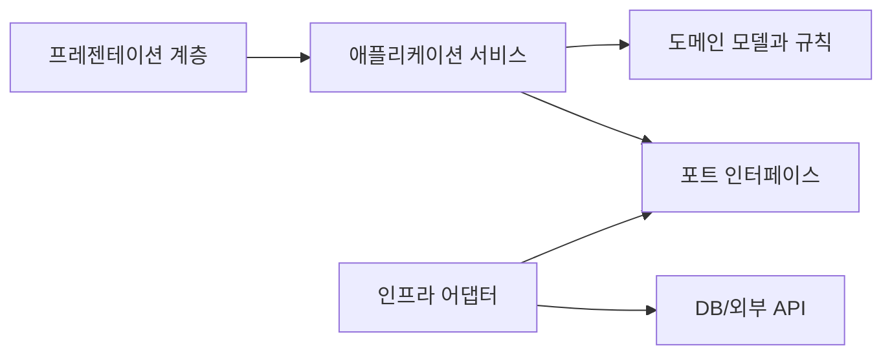

# Software Design 101 (3/10): 모듈과 경계

이 글은 Software Design 101 시리즈의 세 번째 글입니다.

모듈을 나눴다고 해도 외부에서 내부 구조를 전부 알아야만 쓸 수 있다면 경계는 사실상 없는 것과 비슷합니다. 좋은 모듈은 기능을 숨기는 것이 아니라, 내부 복잡도를 안으로 가두고 외부에는 작은 약속만 드러냅니다.

이 글은 Software Design 101 시리즈의 3번째 글입니다.

여기서는 모듈을 어떻게 정의해야 하는지, 왜 깊은 모듈이 얕은 모듈보다 강한지, 공개 API는 얼마나 작아야 하는지, 변경이 잦은 결정을 내부에 숨긴다는 것이 무슨 뜻인지 정리합니다. 경계가 좋다는 말이 실무에서 무엇을 의미하는지도 함께 보겠습니다.


*Software Design 101 3장 흐름 개요*

## 먼저 던지는 질문

- 좋은 모듈 경계는 어떤 조건을 갖춰야 할까요?
- 깊은 모듈과 얕은 모듈은 무엇이 다를까요?
- 공개 API는 어디까지 드러내야 할까요?

## 왜 중요한가

모듈 경계는 변경을 가두는 벽입니다. 벽이 약하면 내부 수정이 외부 호출자까지 흔들고, 벽이 강하면 같은 수정도 모듈 안에서 끝납니다. 설계를 잘했다는 말은 종종 “이 변경이 여기서 멈춘다”는 말과 같습니다.

실무에서 진짜 차이는 API의 표면적에서 드러납니다. 함수 열 개를 공개하는 모듈은 호출자에게 그 열 개의 관계를 모두 이해하라고 요구합니다. 반대로 공개 진입점 하나가 내부 복잡도를 흡수하면 호출자는 적게 알고도 많은 일을 할 수 있습니다.

## 전체 그림

좋은 모듈은 표면이 작고 내부가 깊습니다. 외부에는 간단한 약속만 보이지만, 내부에서는 의미 있는 일을 많이 처리합니다.

## 기본 용어

- <strong>모듈</strong>: 하나의 책임으로 묶인 코드 단위입니다.
- <strong>공개 API</strong>: 모듈이 바깥에 약속하는 사용 방식입니다.
- <strong>깊은 모듈</strong>: 표면은 작지만 내부 기능은 풍부한 모듈입니다.
- <strong>캡슐화</strong>: 내부 구현을 숨기고 인터페이스를 통해 소통하는 방식입니다.
- <strong>정보 은닉</strong>: 변경 가능성이 큰 결정을 모듈 안에 감추는 원칙입니다.

## 변경 전과 변경 후

**변경 전**

```python
# 얕은 모듈: 내부 절차가 함수 단위로 그대로 드러납니다.
def open_file(p): ...
def read_chunk(f, n): ...
def close_file(f): ...
```

**변경 후**

```python
# 깊은 모듈: 작은 표면이 전체 책임을 맡습니다.
def read_file(path) -> bytes: ...
```

호출자는 파일을 열고 읽고 닫는 순서를 몰라도 됩니다. 내부 구현을 바꿔도 외부 계약은 그대로 유지할 수 있습니다.

## 좋은 경계를 만드는 다섯 단계

### 1단계 — 표면을 줄인다

```python
# 1_surface.py
# public symbol이 10개면 노출되는 dependency도 10개입니다.
# 정말 필요한 것만 export하세요.
__all__ = ["read_file"]
```

공개 심볼 수는 곧 외부가 알아야 할 약속의 수입니다. 정말 필요한 것만 export해야 경계가 생깁니다.

### 2단계 — 내부를 깊게 만든다

```python
# 2_deep.py
def read_file(path):
    f = _open(path)
    try: return _read_all(f)
    finally: _close(f)
```

좋은 추상화는 호출자를 단순하게 만듭니다. 내부에서 여러 단계를 처리해 주어야 모듈이 깊어집니다.

### 3단계 — 변하기 쉬운 결정을 숨긴다

```python
# 3_hide.py
class CacheBackend:  # outside knows only the interface
    def get(self, k): ...
    def set(self, k, v): ...
```

Redis를 쓸지, 메모리 캐시를 쓸지 같은 선택은 외부가 알 필요가 없습니다. 이런 결정이 밖으로 새면 모듈은 진화할 자유를 잃습니다.

### 4단계 — 데이터 노출을 제한한다

```python
# 4_dto.py
# 내부 모델을 직접 노출하지 말고 DTO를 사용하세요.
def public_user(u): return {"id": u.id, "name": u.name}
```

내부 모델을 그대로 반환하면 외부 코드가 내부 구조에 결합됩니다. DTO를 두면 내부 변경이 외부 계약으로 새는 일을 줄일 수 있습니다.

### 5단계 — 의존성을 한 방향으로 둔다

```python
# 5_one_way.py
# Domain은 infra를 알면 안 됩니다.
# Infra가 domain을 import합니다.
```

경계는 의존성 방향으로 강화됩니다. 도메인이 인프라를 모를수록 내부 규칙을 더 오래 안정적으로 유지할 수 있습니다.

## 빠르게 검증해 보기

모듈 하나를 고른 뒤 공개 심볼과 내부 헬퍼를 나눠 적어 보세요. 공개 심볼이 많은데 외부 호출자가 꼭 그만큼 알아야 하는지 검토하면 경계 품질이 바로 보입니다.

```python
__all__ = [
    "read_file",
    "read_chunk",
    "open_file",
    "close_file",
]
```

**Expected output:** 호출자가 실제로 필요한 진입점이 1~2개뿐이라면, 나머지는 내부로 숨길 수 있는 후보라는 사실이 드러납니다.

그다음 내부 자료구조가 외부로 그대로 새는지 함께 확인해 보세요. 표면적보다 데이터 노출이 더 큰 누수를 만들 때가 많습니다.

## 실패 신호와 먼저 볼 것

| 실패 신호 | 먼저 볼 것 |
| --- | --- |
| 구현 세부를 고칠 때 호출자까지 같이 수정한다 | 공개 API가 내부 절차를 너무 많이 드러내는지 봅니다 |
| 외부 코드가 내부 dict 구조를 직접 안다 | DTO 없이 내부 모델을 그대로 노출했는지 확인합니다 |
| 함수는 많은데 추상화 이익이 작다 | 얕은 모듈만 늘어난 것은 아닌지 점검합니다 |

좋은 경계는 외부 호출자에게 “적게 알고도 많이 하게” 만들어 줍니다.

## 이 코드에서 먼저 볼 점

- 공개 표면이 작고 의도적으로 관리됩니다.
- 내부 구현이 바뀌어도 외부 계약은 비교적 안정적으로 남습니다.
- 호출자는 적게 아는 대신 더 많은 기능을 얻습니다.

## 어디서 많이 헷갈릴까

모듈을 잘게 쪼개는 것과 경계를 잘 만드는 것은 다릅니다. 파일 수가 많아도 내부 함수와 데이터 구조를 죄다 공개하고 있다면 경계 품질은 낮습니다. 얕은 모듈이 많이 쌓인 시스템은 오히려 의존성 그래프만 복잡해지기 쉽습니다.

또 다른 함정은 내부 자료구조를 편의상 그대로 반환하는 일입니다. 처음에는 빠르지만, 나중에 필드 하나를 바꾸려 할 때 외부 코드가 전부 영향을 받습니다. 경계가 얇아 보이는 이유의 상당수는 사실 데이터 노출에서 옵니다.

## 실무에서는 이렇게 본다

좋은 라이브러리는 대개 표면이 작고 내부가 깊습니다. `requests`처럼 사용자는 몇 개 함수만 알아도 되지만, 내부에서는 세션 관리, 직렬화, 오류 처리, 재시도 같은 복잡도를 흡수합니다. 이런 성격이 바로 깊은 모듈의 힘입니다.

팀 코드에서도 같은 질문을 던질 수 있습니다. “정말 외부에 이 함수가 필요할까?”, “이 DTO 없이 내부 모델을 그대로 넘겨도 괜찮을까?”, “변하기 쉬운 선택이 밖으로 새어 있지 않은가?” 이런 질문이 경계를 단단하게 만듭니다.

## 체크리스트

- [ ] 모듈의 공개 표면이 작은가?
- [ ] 작은 표면 뒤에 충분한 내부 책임이 들어 있는가?
- [ ] 외부 계약을 DTO 같은 형태로 보호하고 있는가?
- [ ] 변하기 쉬운 구현 선택이 모듈 안에 숨겨져 있는가?
- [ ] 의존성이 한 방향으로 흘러 경계를 강화하는가?

## 연습 문제

1. 현재 모듈 하나를 골라 공개 표면을 절반으로 줄여 보세요.
2. 외부에 노출된 내부 자료구조 하나를 DTO로 감싸 보세요.
3. 모듈 안에서 변동성이 큰 결정을 하나 찾아 내부로 숨겨 보세요.

## 현업 적용 관점에서 다시 정리

모듈 경계는 폴더 이름으로 생기지 않습니다. 외부에 노출하는 표면적, 내부 모델 은닉, 의존성 단방향성까지 맞춰야 경계가 실제 동작합니다.

## 의존 관계를 수치로 읽는 실전 점검

설계 품질을 문장으로만 평가하면 팀마다 기준이 달라집니다. 그래서 실무에서는 결합도 지표를 함께 봅니다. 가장 단순한 시작점은 모듈 단위 `Ca(유입 의존성)`, `Ce(유출 의존성)`, `I=Ce/(Ca+Ce)` 입니다. 값이 정답을 보장하지는 않지만, 경계가 틀어진 지점을 빠르게 찾는 데 매우 유용합니다.

```python
from dataclasses import dataclass

@dataclass(frozen=True)
class CouplingMetric:
    module: str
    ca: int  # 외부 모듈이 이 모듈에 의존하는 수
    ce: int  # 이 모듈이 외부 모듈에 의존하는 수

    @property
    def instability(self) -> float:
        total = self.ca + self.ce
        return 0.0 if total == 0 else self.ce / total

def report(metrics: list[CouplingMetric]) -> None:
    for m in metrics:
        print(f"{m.module:12} Ca={m.ca:2d} Ce={m.ce:2d} I={m.instability:.2f}")

report(
    [
        CouplingMetric("domain", ca=6, ce=1),
        CouplingMetric("application", ca=4, ce=4),
        CouplingMetric("infrastructure", ca=1, ce=7),
    ]
)
```

도메인 모듈의 `I` 값이 0에 가깝고 인프라 모듈의 `I` 값이 1에 가깝다면 방향이 대체로 건강합니다. 반대로 도메인의 `Ce`가 늘어나면 의존성 방향이 뒤집히고 있다는 신호입니다. 이때는 코드 리뷰에서 "왜 import가 생겼는가"를 먼저 질문해야 합니다.

## 모듈 의존 그래프를 먼저 그린 뒤 코드로 옮기기

설계 회의에서 말로만 합의하면 구현 단계에서 금방 흔들립니다. 아래처럼 다이어그램을 먼저 합의하고, 그 다음 import 규칙과 테스트를 붙여 두면 경계를 유지하기 쉽습니다.



이 그림의 핵심은 화살표 개수가 아니라 방향입니다. 도메인은 외부 기술을 모른 채 규칙만 유지하고, 어댑터가 세부 구현을 담당합니다. 이렇게 분리해 두면 기능 요구가 변해도 도메인 코드의 파손 범위가 작아집니다.

## 추상 클래스와 인터페이스를 경계에 배치하기

포트-어댑터 구조를 도입할 때 가장 흔한 실수는 추상화를 인프라 패키지 안에 두는 것입니다. 추상화는 반드시 도메인 또는 애플리케이션 쪽 경계에 둬야 의존성 역전이 성립합니다.

```python
from __future__ import annotations

from abc import ABC, abstractmethod
from dataclasses import dataclass

@dataclass(frozen=True)
class PaymentCommand:
    order_id: str
    user_id: str
    amount: int

class PaymentGateway(ABC):
    @abstractmethod
    def charge(self, command: PaymentCommand) -> str:
        raise NotImplementedError

class FakePaymentGateway(PaymentGateway):
    def charge(self, command: PaymentCommand) -> str:
        return f"paid:{command.order_id}"
```

호출자는 `PaymentGateway`만 의존하고, 실제 결제 제공자 교체는 구현 클래스에서 흡수합니다. 이 방식은 테스트에도 유리합니다. 단위 테스트는 `FakePaymentGateway`를 사용해 비즈니스 규칙만 검증하고, 통합 테스트에서만 실제 I/O를 붙이면 됩니다.

## 리팩터링 전후를 나란히 비교하기

좋은 설계 글은 "좋다"고 말하는 대신 전후 차이를 보여 줘야 합니다. 아래는 책임이 섞인 코드와 책임을 분리한 코드의 대비입니다.

```python
# before.py

def place_order(request: dict) -> dict:
    # HTTP 입력 파싱, 규칙 검증, 결제 호출, 저장, 응답 구성까지 한 함수에 섞임
    user_id = request["user_id"]
    amount = int(request["amount"])
    if amount <= 0:
        return {"status": 400, "message": "invalid amount"}

    payment_id = charge_with_vendor_api(user_id, amount)
    save_order_row(user_id=user_id, amount=amount, payment_id=payment_id)
    return {"status": 200, "payment_id": payment_id}
```

```python
# after.py

def place_order_controller(request: dict, service: "PlaceOrderService") -> dict:
    command = PlaceOrderCommand.from_http(request)
    result = service.execute(command)
    return result.to_http()

class PlaceOrderService:
    def __init__(self, gateway: PaymentGateway, repo: OrderRepository) -> None:
        self.gateway = gateway
        self.repo = repo

    def execute(self, command: "PlaceOrderCommand") -> "PlaceOrderResult":
        command.validate()
        payment_id = self.gateway.charge(command.to_payment_command())
        self.repo.save(command.to_order(payment_id))
        return PlaceOrderResult.success(payment_id)
```

전후를 비교하면 무엇이 바뀌었는지 즉시 보입니다. 컨트롤러는 입력/출력 변환만 담당하고, 서비스는 유스케이스 규칙만 담당하며, 외부 연동은 포트 뒤로 이동합니다. 구조가 이렇게 바뀌면 장애 분석과 테스트 설계가 훨씬 단순해집니다.

## 계층별 체크포인트와 운영 연결

설계는 개발 단계에서 끝나지 않습니다. 운영 지표와 연결되어야 품질 개선이 누적됩니다.

- 프레젠테이션 계층: 요청 검증 실패율, 4xx 응답 분포
- 애플리케이션 계층: 유스케이스별 처리 시간, 재시도 횟수
- 도메인 계층: 규칙 위반 빈도, 불변식 실패 로그
- 인프라 계층: 외부 API 오류율, DB 지연 시간

지표를 계층별로 분리해 보면 어디를 고쳐야 하는지가 명확해집니다. 모든 지표가 한 대시보드에서 섞여 있으면 "느리다"는 사실만 보이고 원인은 보이지 않습니다. 설계 경계를 운영 지표 경계와 맞추면 개선 사이클이 빠르게 돌아갑니다.

## 리뷰와 리팩터링을 위한 실전 질문 세트

설계는 한 번 작성하고 끝나는 산출물이 아니라, 변경 요청이 들어올 때마다 점검하는 운영 습관입니다. 아래 질문은 코드 리뷰와 리팩터링 계획에서 바로 사용할 수 있는 최소 점검 세트입니다.

1. 이번 변경은 어느 계층의 책임인가요?
2. 새 의존성이 도메인 중심 방향을 깨뜨리나요?
3. 인터페이스 이름이 구현 세부를 누설하나요?
4. 테스트 더블 없이 규칙 검증이 가능한가요?
5. 다음 변경이 들어와도 같은 위치를 수정하게 되나요?

이 다섯 질문은 단순하지만 강력합니다. 특히 "다음 변경도 같은 위치를 건드리게 되는가"라는 질문은 설계의 탄력성을 빠르게 드러냅니다. 지금 요구사항을 통과하는 코드와 다음 요구사항까지 받아내는 코드는 여기서 갈립니다.

## 계층 아키텍처 예시를 한 단계 더 구체화하기

아래 예시는 요청-유스케이스-도메인-어댑터 경계를 코드로 고정하는 방법을 보여 줍니다.

```python
from dataclasses import dataclass
from typing import Protocol

@dataclass(frozen=True)
class CreateCouponCommand:
    code: str
    discount_percent: int

class CouponRepository(Protocol):
    def exists(self, code: str) -> bool: ...
    def save(self, code: str, discount_percent: int) -> None: ...

class CreateCouponService:
    def __init__(self, repo: CouponRepository) -> None:
        self.repo = repo

    def execute(self, command: CreateCouponCommand) -> None:
        if not (1 <= command.discount_percent <= 90):
            raise ValueError("할인율은 1~90 범위여야 합니다.")
        if self.repo.exists(command.code):
            raise ValueError("이미 존재하는 쿠폰 코드입니다.")
        self.repo.save(command.code, command.discount_percent)
```

핵심은 서비스가 저장소의 구체 구현을 모른다는 점입니다. SQLAlchemy를 쓰든, 파일 저장을 쓰든, 외부 API를 쓰든 서비스 규칙은 바뀌지 않습니다. 그래서 정책 변경과 기술 변경이 서로 다른 속도로 진화할 수 있습니다.

## 설계 부채를 남기지 않는 배포 순서

설계를 개선할 때 기능 배포와 구조 개선을 한 커밋에 묶으면 위험이 커집니다. 다음 순서를 지키면 안전하게 개선할 수 있습니다.

- 1단계: 새 경계와 인터페이스를 추가합니다. 기존 경로는 유지합니다.
- 2단계: 호출자를 새 경계로 점진 이행합니다. 로그로 구경로 사용량을 기록합니다.
- 3단계: 구경로 트래픽이 0에 가까워지면 제거합니다.
- 4단계: 제거 이후 메트릭과 에러율을 비교해 회귀를 확인합니다.

이 순서는 확장-이행-수축 전략과 같습니다. 설계는 깔끔해지고, 사용자 영향은 최소화됩니다. 특히 여러 팀이 동시에 작업하는 환경에서는 이 순서를 문서화해 공통 작업 규칙으로 삼는 것이 효과적입니다.

## 정리

좋은 모듈 경계는 내부 복잡도를 숨기고 변경을 가둡니다. 표면은 작게, 내부는 깊게, 변하기 쉬운 결정은 안쪽으로 밀어 넣어야 다음 수정이 외부로 덜 번집니다.

다음 글에서는 이 경계를 실제로 더 강하게 만드는 도구, 의존성 방향을 다룹니다.

## 처음 질문으로 돌아가기

- **좋은 모듈 경계는 어떤 조건을 갖춰야 할까요?**
  - 본문의 기준은 모듈과 경계를 한 덩어리 개념으로 보지 않고 입력, 처리, 검증, 운영 신호가 만나는 경계로 나누어 확인하는 것입니다.
- **깊은 모듈과 얕은 모듈은 무엇이 다를까요?**
  - 예제와 그림에서는 어떤 값이 들어오고, 어느 단계에서 바뀌며, 어떤 기준으로 통과 또는 실패하는지를 먼저 확인해야 합니다.
- **공개 API는 어디까지 드러내야 할까요?**
  - 운영에서는 이 판단을 체크리스트, 로그, 테스트로 남겨 다음 변경에서도 같은 실패가 반복되지 않게 막아야 합니다.

<!-- toc:begin -->
## 시리즈 목차

- [Software Design 101 (1/10): 소프트웨어 설계란 무엇인가?](./01-what-is-software-design.md)
- [Software Design 101 (2/10): 관심사 분리](./02-separation-of-concerns.md)
- **모듈과 경계 (현재 글)**
- 의존성 방향 (예정)
- 인터페이스와 추상화 (예정)
- 계층 아키텍처 (예정)
- 데이터 흐름 설계 (예정)
- 변경 영향 줄이기 (예정)
- 설계 원칙 모음 (예정)
- 작은 프로젝트로 설계 연습 (예정)

<!-- toc:end -->

## 참고 자료

- [software-design-101 예제 코드 저장소](https://github.com/yeongseon-books/book-examples/tree/main/software-design-101/ko)

- [Parnas — On the Criteria To Be Used in Decomposing Systems into Modules](https://www.win.tue.nl/~wstomv/edu/2ip30/references/criteria_for_modularization.pdf)
- [A Philosophy of Software Design — Deep Modules](https://web.stanford.edu/~ouster/cgi-bin/aposd.php)
- [Effective Java — API Design](https://www.oracle.com/technical-resources/articles/java/bloch-effective-08-qa.html)
- [Domain-Driven Design — Bounded Context](https://martinfowler.com/bliki/BoundedContext.html)

### 실전 확인용 문서

- [The Python Tutorial — Modules](https://docs.python.org/3/tutorial/modules.html)
- [Python Reference — import statement](https://docs.python.org/3/reference/simple_stmts.html#import)

Tags: Computer Science, SoftwareDesign, Modules, Boundaries, Encapsulation, PackageDesign
