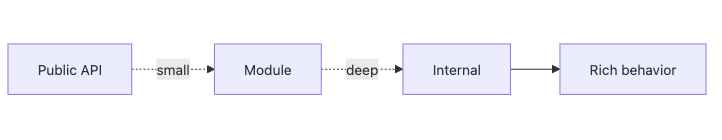

# 모듈과 경계

모듈을 나눴다고 해도 외부에서 내부 구조를 전부 알아야만 쓸 수 있다면 경계는 사실상 없는 것과 비슷합니다. 좋은 모듈은 기능을 숨기는 것이 아니라, 내부 복잡도를 안으로 가두고 외부에는 작은 약속만 드러냅니다.

이 글은 Software Design 101 시리즈의 3번째 글입니다.

여기서는 모듈을 어떻게 정의해야 하는지, 왜 깊은 모듈이 얕은 모듈보다 강한지, 공개 API는 얼마나 작아야 하는지, 변경이 잦은 결정을 내부에 숨긴다는 것이 무슨 뜻인지 정리합니다. 경계가 좋다는 말이 실무에서 무엇을 의미하는지도 함께 보겠습니다.

## 이 글에서 다룰 문제

- 좋은 모듈 경계는 어떤 조건을 갖춰야 할까요?
- 깊은 모듈과 얕은 모듈은 무엇이 다를까요?
- 공개 API는 어디까지 드러내야 할까요?
- 내부 자료구조를 그대로 노출하면 왜 문제가 될까요?
- 패키지 구조만 봐도 경계 품질을 짐작할 수 있을까요?

> 좋은 경계는 외부 호출자가 내부를 몰라도 되게 만듭니다.

## 왜 중요한가

모듈 경계는 변경을 가두는 벽입니다. 벽이 약하면 내부 수정이 외부 호출자까지 흔들고, 벽이 강하면 같은 수정도 모듈 안에서 끝납니다. 설계를 잘했다는 말은 종종 “이 변경이 여기서 멈춘다”는 말과 같습니다.

실무에서 진짜 차이는 API의 표면적에서 드러납니다. 함수 열 개를 공개하는 모듈은 호출자에게 그 열 개의 관계를 모두 이해하라고 요구합니다. 반대로 공개 진입점 하나가 내부 복잡도를 흡수하면 호출자는 적게 알고도 많은 일을 할 수 있습니다.

## 전체 그림


*작은 공개 표면 뒤에 내부 복잡도를 숨기는 깊은 모듈의 형태*

좋은 모듈은 표면이 작고 내부가 깊습니다. 외부에는 간단한 약속만 보이지만, 내부에서는 의미 있는 일을 많이 처리합니다.

## 기본 용어

- <strong>모듈</strong>: 하나의 책임으로 묶인 코드 단위입니다.
- <strong>공개 API</strong>: 모듈이 바깥에 약속하는 사용 방식입니다.
- <strong>깊은 모듈</strong>: 표면은 작지만 내부 기능은 풍부한 모듈입니다.
- <strong>캡슐화</strong>: 내부 구현을 숨기고 인터페이스를 통해 소통하는 방식입니다.
- <strong>정보 은닉</strong>: 변경 가능성이 큰 결정을 모듈 안에 감추는 원칙입니다.

## 변경 전과 변경 후

**변경 전**

```python
# 얕은 모듈: 내부 절차가 함수 단위로 그대로 드러납니다.
def open_file(p): ...
def read_chunk(f, n): ...
def close_file(f): ...
```

**변경 후**

```python
# 깊은 모듈: 작은 표면이 전체 책임을 맡습니다.
def read_file(path) -> bytes: ...
```

호출자는 파일을 열고 읽고 닫는 순서를 몰라도 됩니다. 내부 구현을 바꿔도 외부 계약은 그대로 유지할 수 있습니다.

## 좋은 경계를 만드는 다섯 단계

### 1단계 — 표면을 줄인다

```python
# 1_surface.py
# Ten public symbols expose ten dependencies.
# Export only what truly needs to be exported.
__all__ = ["read_file"]
```

공개 심볼 수는 곧 외부가 알아야 할 약속의 수입니다. 정말 필요한 것만 export해야 경계가 생깁니다.

### 2단계 — 내부를 깊게 만든다

```python
# 2_deep.py
def read_file(path):
    f = _open(path)
    try: return _read_all(f)
    finally: _close(f)
```

좋은 추상화는 호출자를 단순하게 만듭니다. 내부에서 여러 단계를 처리해 주어야 모듈이 깊어집니다.

### 3단계 — 변하기 쉬운 결정을 숨긴다

```python
# 3_hide.py
class CacheBackend:  # outside knows only the interface
    def get(self, k): ...
    def set(self, k, v): ...
```

Redis를 쓸지, 메모리 캐시를 쓸지 같은 선택은 외부가 알 필요가 없습니다. 이런 결정이 밖으로 새면 모듈은 진화할 자유를 잃습니다.

### 4단계 — 데이터 노출을 제한한다

```python
# 4_dto.py
# Do not expose internal models directly; use DTOs.
def public_user(u): return {"id": u.id, "name": u.name}
```

내부 모델을 그대로 반환하면 외부 코드가 내부 구조에 결합됩니다. DTO를 두면 내부 변경이 외부 계약으로 새는 일을 줄일 수 있습니다.

### 5단계 — 의존성을 한 방향으로 둔다

```python
# 5_one_way.py
# Domain must not know about infra.
# Infra imports the domain.
```

경계는 의존성 방향으로 강화됩니다. 도메인이 인프라를 모를수록 내부 규칙을 더 오래 안정적으로 유지할 수 있습니다.

## 빠르게 검증해 보기

모듈 하나를 고른 뒤 공개 심볼과 내부 헬퍼를 나눠 적어 보세요. 공개 심볼이 많은데 외부 호출자가 꼭 그만큼 알아야 하는지 검토하면 경계 품질이 바로 보입니다.

```python
__all__ = [
    "read_file",
    "read_chunk",
    "open_file",
    "close_file",
]
```

**Expected output:** 호출자가 실제로 필요한 진입점이 1~2개뿐이라면, 나머지는 내부로 숨길 수 있는 후보라는 사실이 드러납니다.

그다음 내부 자료구조가 외부로 그대로 새는지 함께 확인해 보세요. 표면적보다 데이터 노출이 더 큰 누수를 만들 때가 많습니다.

## 실패 신호와 먼저 볼 것

| 실패 신호 | 먼저 볼 것 |
| --- | --- |
| 구현 세부를 고칠 때 호출자까지 같이 수정한다 | 공개 API가 내부 절차를 너무 많이 드러내는지 봅니다 |
| 외부 코드가 내부 dict 구조를 직접 안다 | DTO 없이 내부 모델을 그대로 노출했는지 확인합니다 |
| 함수는 많은데 추상화 이익이 작다 | 얕은 모듈만 늘어난 것은 아닌지 점검합니다 |

좋은 경계는 외부 호출자에게 “적게 알고도 많이 하게” 만들어 줍니다.

## 이 코드에서 먼저 볼 점

- 공개 표면이 작고 의도적으로 관리됩니다.
- 내부 구현이 바뀌어도 외부 계약은 비교적 안정적으로 남습니다.
- 호출자는 적게 아는 대신 더 많은 기능을 얻습니다.

## 어디서 많이 헷갈릴까

모듈을 잘게 쪼개는 것과 경계를 잘 만드는 것은 다릅니다. 파일 수가 많아도 내부 함수와 데이터 구조를 죄다 공개하고 있다면 경계 품질은 낮습니다. 얕은 모듈이 많이 쌓인 시스템은 오히려 의존성 그래프만 복잡해지기 쉽습니다.

또 다른 함정은 내부 자료구조를 편의상 그대로 반환하는 일입니다. 처음에는 빠르지만, 나중에 필드 하나를 바꾸려 할 때 외부 코드가 전부 영향을 받습니다. 경계가 얇아 보이는 이유의 상당수는 사실 데이터 노출에서 옵니다.

## 실무에서는 이렇게 본다

좋은 라이브러리는 대개 표면이 작고 내부가 깊습니다. `requests`처럼 사용자는 몇 개 함수만 알아도 되지만, 내부에서는 세션 관리, 직렬화, 오류 처리, 재시도 같은 복잡도를 흡수합니다. 이런 성격이 바로 깊은 모듈의 힘입니다.

팀 코드에서도 같은 질문을 던질 수 있습니다. “정말 외부에 이 함수가 필요할까?”, “이 DTO 없이 내부 모델을 그대로 넘겨도 괜찮을까?”, “변하기 쉬운 선택이 밖으로 새어 있지 않은가?” 이런 질문이 경계를 단단하게 만듭니다.

## 체크리스트

- [ ] 모듈의 공개 표면이 작은가?
- [ ] 작은 표면 뒤에 충분한 내부 책임이 들어 있는가?
- [ ] 외부 계약을 DTO 같은 형태로 보호하고 있는가?
- [ ] 변하기 쉬운 구현 선택이 모듈 안에 숨겨져 있는가?
- [ ] 의존성이 한 방향으로 흘러 경계를 강화하는가?

## 연습 문제

1. 현재 모듈 하나를 골라 공개 표면을 절반으로 줄여 보세요.
2. 외부에 노출된 내부 자료구조 하나를 DTO로 감싸 보세요.
3. 모듈 안에서 변동성이 큰 결정을 하나 찾아 내부로 숨겨 보세요.

## 정리

좋은 모듈 경계는 내부 복잡도를 숨기고 변경을 가둡니다. 표면은 작게, 내부는 깊게, 변하기 쉬운 결정은 안쪽으로 밀어 넣어야 다음 수정이 외부로 덜 번집니다.

다음 글에서는 이 경계를 실제로 더 강하게 만드는 도구, 의존성 방향을 다룹니다.

<!-- toc:begin -->
- [소프트웨어 설계란 무엇인가?](./01-what-is-software-design.md)
- [관심사 분리](./02-separation-of-concerns.md)
- **모듈과 경계 (현재 글)**
- 의존성 방향 (예정)
- 인터페이스와 추상화 (예정)
- 계층 아키텍처 (예정)
- 데이터 흐름 설계 (예정)
- 변경 영향 줄이기 (예정)
- 설계 원칙 모음 (예정)
- 작은 프로젝트로 설계 연습 (예정)
<!-- toc:end -->

## 참고 자료

- [Parnas — On the Criteria To Be Used in Decomposing Systems into Modules](https://www.win.tue.nl/~wstomv/edu/2ip30/references/criteria_for_modularization.pdf)
- [A Philosophy of Software Design — Deep Modules](https://web.stanford.edu/~ouster/cgi-bin/aposd.php)
- [Effective Java — API Design](https://www.oracle.com/technical-resources/articles/java/bloch-effective-08-qa.html)
- [Domain-Driven Design — Bounded Context](https://martinfowler.com/bliki/BoundedContext.html)

### 실전 확인용 문서

- [The Python Tutorial — Modules](https://docs.python.org/3/tutorial/modules.html)
- [Python Reference — import statement](https://docs.python.org/3/reference/simple_stmts.html#import)


Tags: Computer Science, SoftwareDesign, Modules, Boundaries, Encapsulation, PackageDesign
