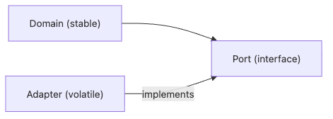

# 의존성 방향

도메인 규칙을 고치려는데 데이터베이스 드라이버와 외부 SDK까지 함께 따라오면 변경 비용은 빠르게 커집니다. 모듈 사이 연결 자체보다 더 중요한 것은 그 화살표가 어디를 향하느냐입니다.

이 글은 Software Design 101 시리즈의 4번째 글입니다.

여기서는 의존성이 결합도와 어떻게 이어지는지, 안정적인 모듈과 변동이 큰 모듈은 어떻게 구분하는지, DIP와 포트·어댑터 패턴이 왜 실무에서 자주 쓰이는지 정리합니다. 설계에서 “방향”이 왜 자유를 사는 문제인지도 함께 보겠습니다.

## 이 글에서 다룰 문제

- 의존성 방향은 왜 변경 비용을 크게 좌우할까요?
- 안정적인 모듈과 변동이 큰 모듈은 어떻게 구분할까요?
- 도메인이 세부 구현을 모르게 만드는 방법은 무엇일까요?
- 포트와 어댑터는 DIP를 코드로 어떻게 표현할까요?
- 의존성 역전을 모든 곳에 적용하면 왜 오히려 과할 수 있을까요?

> 화살표가 향하는 쪽이 변경 비용을 부담합니다. 안정적인 코어는 변동이 큰 세부를 알지 않는 편이 좋습니다.

## 왜 중요한가

코드는 결국 그래프입니다. 한 모듈이 다른 모듈을 import하거나 호출하면 둘 사이에는 화살표가 생깁니다. 그 화살표가 불안정한 세부를 향하면 작은 변경도 핵심 규칙으로 쉽게 번집니다.

데이터베이스, HTTP 클라이언트, 외부 SaaS는 자주 바뀌는 편입니다. 반대로 도메인 규칙은 비교적 오래 유지됩니다. 그래서 안정적인 것과 변동이 큰 것을 같은 방향으로 묶어 두면, 덜 바뀌어야 할 코드가 더 자주 흔들립니다.

## 전체 그림


*안정적인 도메인 쪽에서 포트를 정의하고 변동이 큰 어댑터가 이를 구현하는 의존성 방향*

핵심 아이디어는 간단합니다. 세부 구현이 코어를 향하게 하고, 코어는 자신이 필요한 모양만 추상으로 선언합니다. 그러면 구현 교체가 코어를 직접 흔들지 않습니다.

## 기본 용어

- <strong>의존성</strong>: A가 B를 import하거나 호출하면 A는 B에 의존합니다.
- <strong>안정적인 모듈</strong>: 자주 바뀌지 않는 모듈입니다. 대개 더 추상적인 쪽입니다.
- <strong>변동이 큰 모듈</strong>: DB, HTTP, 외부 SaaS처럼 변경 가능성이 큰 모듈입니다.
- <strong>DIP</strong>: 코어는 구체 구현이 아니라 추상에 의존하고, 세부 구현이 그 추상을 따르는 원칙입니다.
- <strong>포트 / 어댑터</strong>: 코어가 인터페이스를 정의하고, 외부 어댑터가 그것을 구현하는 구조입니다.

## 변경 전과 변경 후

**변경 전**

```python
# domain knows the DB directly
import psycopg2

def charge(user_id, amount):
    conn = psycopg2.connect(...)
    conn.execute("UPDATE wallet SET ...")
```

**변경 후**

```python
# domain only knows an abstraction
class WalletRepo:
    def debit(self, user_id, amount): ...

def charge(repo: WalletRepo, user_id, amount):
    repo.debit(user_id, amount)
```

이 구조에서는 데이터베이스 구현이 바뀌어도 도메인 함수 `charge`는 거의 손대지 않아도 됩니다. 변경의 충격이 어댑터 쪽에 머물 가능성이 커집니다.

## 의존성 방향을 바로잡는 다섯 단계

### 1단계 — 화살표를 그린다

```python
# 1_arrows.py
# On paper, draw which module imports which.
# If the core imports the details, that is a red flag.
```

눈에 보이지 않는 구조는 고치기 어렵습니다. 종이나 화이트보드에 import 방향만 그려도 설계 문제가 금방 드러납니다.

### 2단계 — 코어에서 추상을 정의한다

```python
# 2_port.py
from typing import Protocol

class WalletRepo(Protocol):
    def debit(self, user_id: str, amount: int) -> None: ...
```

중요한 점은 추상이 인프라 폴더가 아니라 코어 쪽에 놓여야 한다는 사실입니다. 코어가 필요한 모양을 직접 말해야 방향이 유지됩니다.

### 3단계 — 어댑터에서 구현한다

```python
# 3_adapter.py
class PostgresWalletRepo:
    def debit(self, user_id, amount):
        # 구체적인 SQL 구현
        ...
```

세부 구현은 추상에 맞춰집니다. 반대로 추상이 구현 세부에 끌려가면 의존성은 다시 뒤집힙니다.

### 4단계 — 조립은 가장자리에서 한다

```python
# 4_compose.py
def main():
    repo = PostgresWalletRepo()
    charge(repo, "u-1", 1000)
```

도메인은 어떤 구현이 들어왔는지 몰라야 합니다. 객체 조립은 `main` 같은 composition root에 몰아 두는 편이 좋습니다.

### 5단계 — 가짜 구현으로 검증한다

```python
# 5_fake.py
class FakeRepo:
    def __init__(self): self.calls = []
    def debit(self, u, a): self.calls.append((u, a))

def test_charge():
    repo = FakeRepo()
    charge(repo, "u-1", 500)
    assert repo.calls == [("u-1", 500)]
```

가짜 어댑터로 도메인을 검증할 수 있다면 방향이 잘 잡혔을 가능성이 높습니다. 이 단계에서 DB 연결이 필요하다면 코어와 세부가 너무 가깝게 붙어 있는 편입니다.

## 빠르게 검증해 보기

의존성 방향은 import 목록만 그려도 상당 부분 확인할 수 있습니다. 도메인 패키지에서 외부 DB 드라이버나 HTTP 클라이언트를 직접 import하는지 먼저 적어 보세요.

```text
domain -> typing, dataclasses
domain -> psycopg2        # 위험 신호
infra  -> domain          # 기대하는 방향
```

**Expected output:** 도메인에서 인프라 라이브러리로 가는 화살표가 보이면, 포트 위치나 구현 조립 위치를 다시 봐야 한다는 결론이 나옵니다.

이 확인은 테스트로도 이어집니다. 가짜 저장소로 도메인 테스트가 가능하면 방향이 맞을 가능성이 높습니다.

## 실패 신호와 먼저 볼 것

| 실패 신호 | 먼저 볼 것 |
| --- | --- |
| 도메인 테스트가 DB 없이는 못 돈다 | 도메인이 구체 저장소를 직접 아는지 확인합니다 |
| 인터페이스가 인프라 폴더에 있다 | 필요를 누가 정의하는지 다시 봅니다 |
| 포트 수가 지나치게 많다 | 안정적/변동 경계가 아닌 곳까지 역전했는지 점검합니다 |

의존성 방향을 바로잡는 목적은 추상화를 늘리는 것이 아니라, 코어를 세부 구현 변경에서 보호하는 데 있습니다.

## 이 코드에서 먼저 볼 점

- 도메인 코드가 외부 라이브러리로부터 비교적 자유롭습니다.
- 추상은 인프라가 아니라 도메인 쪽에 놓입니다.
- 실제 구현 선택은 가장자리에서만 일어납니다.

## 어디서 많이 헷갈릴까

인터페이스를 만들어 두기만 하면 DIP가 적용됐다고 생각하기 쉽습니다. 하지만 그 인터페이스가 인프라 폴더에 있다면 방향은 여전히 인프라 중심일 수 있습니다. 추상은 누가 필요를 정의하는가와 함께 봐야 합니다.

또 다른 실수는 모든 경계에 포트를 남발하는 것입니다. 안정적인 코어와 변동이 큰 세부가 만나는 곳에서는 유용하지만, 단순한 내부 헬퍼 함수까지 전부 역전시키면 구조가 과하게 무거워집니다. 실제로 바뀔 가능성이 높은 경계에서 먼저 쓰는 편이 낫습니다.

## 실무에서는 이렇게 본다

결제 게이트웨이, 알림 채널, 외부 SaaS 연동은 의존성 방향이 특히 중요합니다. 벤더를 교체하거나 테스트에서 가짜 구현을 써야 할 때, 도메인이 구체 구현을 모르고 있으면 변경은 훨씬 조용하게 끝납니다.

코드 리뷰에서도 경고 신호는 분명합니다. 도메인이 ORM 모델을 import하는가, `new PostgresRepo()` 같은 구체 생성이 업무 로직 안에 들어왔는가, 포트 수가 실제 필요보다 과도한가를 먼저 봅니다.

## 체크리스트

- [ ] 도메인이 인프라 라이브러리를 직접 import하지 않는가?
- [ ] 포트가 도메인 쪽에 정의되어 있는가?
- [ ] 구현 조립이 가장자리에 모여 있는가?
- [ ] 가짜 어댑터로 도메인 테스트를 작성할 수 있는가?
- [ ] 포트 수가 실제 경계 수에 비해 과하지 않은가?

## 연습 문제

1. 현재 도메인이 직접 import하는 외부 모듈 하나를 골라 DIP 적용이 필요한지 판단해 보세요.
2. 결제 모듈의 DB 호출을 포트와 어댑터로 분리해 보세요.
3. 가짜 어댑터를 사용하는 도메인 단위 테스트를 하나 작성해 보세요.

## 정리

의존성 방향이 맞으면 변경 비용은 줄어듭니다. 코어가 세부 구현을 모르게 만들수록 시스템은 더 오래 자유를 유지합니다. 포트와 어댑터는 그 자유를 코드로 구현하는 실용적인 도구입니다.

다음 글에서는 이 방향을 더 안정적으로 붙잡아 두는 수단, 인터페이스와 추상화를 다룹니다.

<!-- toc:begin -->
- [소프트웨어 설계란 무엇인가?](./01-what-is-software-design.md)
- [관심사 분리](./02-separation-of-concerns.md)
- [모듈과 경계](./03-modules-and-boundaries.md)
- **의존성 방향 (현재 글)**
- 인터페이스와 추상화 (예정)
- 계층 아키텍처 (예정)
- 데이터 흐름 설계 (예정)
- 변경 영향 줄이기 (예정)
- 설계 원칙 모음 (예정)
- 작은 프로젝트로 설계 연습 (예정)
<!-- toc:end -->

## 참고 자료

- [Robert C. Martin — Dependency Inversion Principle](https://web.archive.org/web/20110714224327/http://www.objectmentor.com/resources/articles/dip.pdf)
- [Hexagonal Architecture (Alistair Cockburn)](https://alistair.cockburn.us/hexagonal-architecture/)
- [Clean Architecture — Dependency Rule](https://blog.cleancoder.com/uncle-bob/2012/08/13/the-clean-architecture.html)
- [Ports and Adapters Pattern](https://herbertograca.com/2017/09/14/ports-adapters-architecture/)

### 실전 확인용 문서

- [typing — Support for type hints](https://docs.python.org/3/library/typing.html)
- [abc — Abstract Base Classes](https://docs.python.org/3/library/abc.html)


Tags: Computer Science, SoftwareDesign, Dependencies, DIP, Inversion, Architecture
