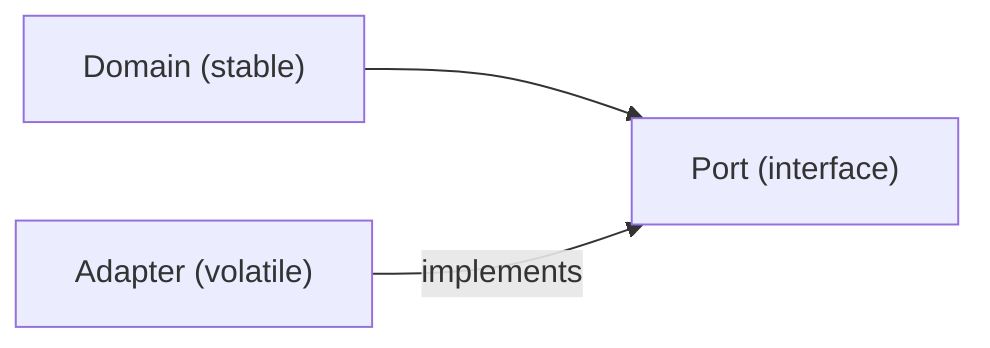

# 의존성 방향

> Software Design 101 시리즈 (4/10)


## 이 글에서 다룰 문제

코드는 결국 그래프입니다. 어디로 화살표가 향하느냐에 따라 한쪽 변경이 다른 쪽으로 새는지가 결정됩니다.

> 안정적인 것이 불안정한 것을 향해서는 안 된다.

## 개념 한눈에 보기



세부가 핵심을 향한다.

## Before/After

**Before**

```python
# domain이 직접 DB를 안다
import psycopg2

def charge(user_id, amount):
    conn = psycopg2.connect(...)
    conn.execute("UPDATE wallet SET ...")
```

**After**

```python
# domain은 추상만 안다
class WalletRepo:
    def debit(self, user_id, amount): ...

def charge(repo: WalletRepo, user_id, amount):
    repo.debit(user_id, amount)
```

DB 교체가 도메인을 흔들지 않는다.

## 실습: 의존성 방향을 바로잡는 5단계

### 1단계 — 화살표 그려 보기

```python
# 1_arrows.py
# 어떤 모듈이 어떤 모듈을 import하는지 종이에 그려 본다.
# 핵심이 세부를 import하면 빨간 신호.
```

먼저 보이게 만들어야 고칠 수 있습니다.

### 2단계 — 핵심에서 추상 정의

```python
# 2_port.py
from typing import Protocol

class WalletRepo(Protocol):
    def debit(self, user_id: str, amount: int) -> None: ...
```

핵심이 필요한 모양을 직접 선언합니다.

### 3단계 — 어댑터에서 구현

```python
# 3_adapter.py
class PostgresWalletRepo:
    def debit(self, user_id, amount):
        # SQL 구체 구현
        ...
```

세부가 추상에 맞춥니다 — 반대가 아닙니다.

### 4단계 — 조립은 가장자리에서

```python
# 4_compose.py
def main():
    repo = PostgresWalletRepo()
    charge(repo, "u-1", 1000)
```

도메인은 어떤 구현이 들어올지 모릅니다.

### 5단계 — 테스트는 가짜로

```python
# 5_fake.py
class FakeRepo:
    def __init__(self): self.calls = []
    def debit(self, u, a): self.calls.append((u, a))

def test_charge():
    repo = FakeRepo()
    charge(repo, "u-1", 500)
    assert repo.calls == [("u-1", 500)]
```

DB 없이도 도메인을 검증할 수 있습니다.

## 이 코드에서 주목할 점

- 도메인이 외부 라이브러리에서 자유롭습니다.
- 추상은 도메인 쪽에 있습니다 — 인프라가 아니라.
- 조립은 가장자리(`main`, `composition root`)에서만 일어납니다.

## 자주 하는 실수 5가지

1. **인터페이스를 인프라 폴더에 둠.** 의존이 다시 뒤집힌다.
2. **추상을 너무 잘게 자름.** 포트가 100개면 의미가 없다.
3. **어댑터 안에 비즈니스 로직.** 도메인이 새 나간다.
4. **조립을 도메인 안에서 함.** `new PostgresRepo()`가 도메인에 등장.
5. **DIP를 모든 곳에 적용.** 정말 안정/불안정이 갈리는 경계에서만 쓴다.

## 실무에서는 이렇게 쓰입니다

결제, 알림, 외부 SaaS 연동에 DIP가 빛납니다. 벤더 교체나 모킹이 도메인을 건드리지 않고 끝납니다.

## 체크리스트

- [ ] 도메인이 인프라를 import하지 않는가?
- [ ] 포트가 도메인 쪽에 정의돼 있는가?
- [ ] 조립이 가장자리에 모여 있는가?
- [ ] 가짜 구현으로 도메인을 테스트할 수 있는가?
- [ ] 포트 수가 과하지 않은가?

## 정리 및 다음 단계

방향을 잡으면 변경 비용이 줄어듭니다. 다음 글에서는 그 방향을 떠받치는 도구 — 인터페이스와 추상 — 를 봅니다.

<!-- toc:begin -->
- [소프트웨어 설계란 무엇인가?](./01-what-is-software-design.md)
- [관심사 분리](./02-separation-of-concerns.md)
- [모듈과 경계](./03-modules-and-boundaries.md)
- **의존성 방향 (현재 글)**
- 인터페이스와 추상화 (예정)
- 계층 아키텍처 (예정)
- 데이터 흐름 설계 (예정)
- 변경 영향 줄이기 (예정)
- 설계 원칙 모음 (예정)
- 작은 프로젝트로 설계 연습 (예정)
<!-- toc:end -->

## 참고 자료

- [Robert C. Martin — Dependency Inversion Principle](https://web.archive.org/web/20110714224327/http://www.objectmentor.com/resources/articles/dip.pdf)
- [Hexagonal Architecture (Alistair Cockburn)](https://alistair.cockburn.us/hexagonal-architecture/)
- [Clean Architecture — Dependency Rule](https://blog.cleancoder.com/uncle-bob/2012/08/13/the-clean-architecture.html)
- [Ports and Adapters Pattern](https://herbertograca.com/2017/09/14/ports-adapters-architecture/)

Tags: Computer Science, SoftwareDesign, Dependencies, DIP, Inversion, Architecture
