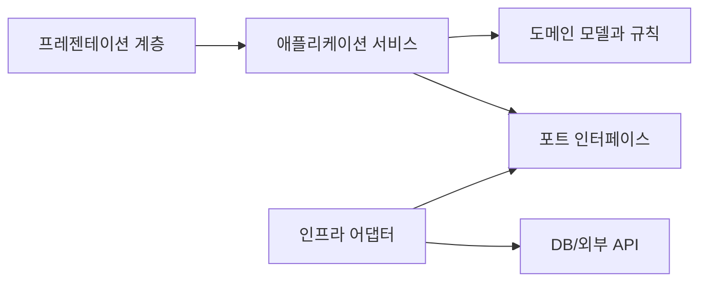

# Software Design 101 (4/10): 의존성 방향

이 글은 Software Design 101 시리즈의 네 번째 글입니다.


도메인 규칙을 고치려는데 데이터베이스 드라이버와 외부 SDK까지 함께 따라오면 변경 비용은 빠르게 커집니다. 모듈 사이 연결 자체보다 더 중요한 것은 그 화살표가 어디를 향하느냐입니다.

이 글은 Software Design 101 시리즈의 4번째 글입니다.

여기서는 의존성이 결합도와 어떻게 이어지는지, 안정적인 모듈과 변동이 큰 모듈은 어떻게 구분하는지, DIP와 포트·어댑터 패턴이 왜 실무에서 자주 쓰이는지 정리합니다. 설계에서 “방향”이 왜 자유를 사는 문제인지도 함께 보겠습니다.

## 먼저 던지는 질문

- 의존성 방향은 왜 변경 비용을 크게 좌우할까요?
- 안정적인 모듈과 변동이 큰 모듈은 어떻게 구분할까요?
- 도메인이 세부 구현을 모르게 만드는 방법은 무엇일까요?

## 큰 그림


*Software Design 101 4장 흐름 개요*

## 왜 중요한가

코드는 결국 그래프입니다. 한 모듈이 다른 모듈을 import하거나 호출하면 둘 사이에는 화살표가 생깁니다. 그 화살표가 불안정한 세부를 향하면 작은 변경도 핵심 규칙으로 쉽게 번집니다.

데이터베이스, HTTP 클라이언트, 외부 SaaS는 자주 바뀌는 편입니다. 반대로 도메인 규칙은 비교적 오래 유지됩니다. 그래서 안정적인 것과 변동이 큰 것을 같은 방향으로 묶어 두면, 덜 바뀌어야 할 코드가 더 자주 흔들립니다.

## 전체 그림

핵심 아이디어는 간단합니다. 세부 구현이 코어를 향하게 하고, 코어는 자신이 필요한 모양만 추상으로 선언합니다. 그러면 구현 교체가 코어를 직접 흔들지 않습니다.

## 기본 용어

- <strong>의존성</strong>: A가 B를 import하거나 호출하면 A는 B에 의존합니다.
- <strong>안정적인 모듈</strong>: 자주 바뀌지 않는 모듈입니다. 대개 더 추상적인 쪽입니다.
- <strong>변동이 큰 모듈</strong>: DB, HTTP, 외부 SaaS처럼 변경 가능성이 큰 모듈입니다.
- <strong>DIP</strong>: 코어는 구체 구현이 아니라 추상에 의존하고, 세부 구현이 그 추상을 따르는 원칙입니다.
- <strong>포트 / 어댑터</strong>: 코어가 인터페이스를 정의하고, 외부 어댑터가 그것을 구현하는 구조입니다.

## 변경 전과 변경 후

**변경 전**

```python
# domain knows the DB directly
import psycopg2

def charge(user_id, amount):
    conn = psycopg2.connect(...)
    conn.execute("UPDATE wallet SET ...")
```

**변경 후**

```python
# domain only knows an abstraction
class WalletRepo:
    def debit(self, user_id, amount): ...

def charge(repo: WalletRepo, user_id, amount):
    repo.debit(user_id, amount)
```

이 구조에서는 데이터베이스 구현이 바뀌어도 도메인 함수 `charge`는 거의 손대지 않아도 됩니다. 변경의 충격이 어댑터 쪽에 머물 가능성이 커집니다.

## 의존성 방향을 바로잡는 다섯 단계

### 1단계 — 화살표를 그린다

```python
# 1_arrows.py
# On paper, draw which module imports which.
# If the core imports the details, that is a red flag.
```

눈에 보이지 않는 구조는 고치기 어렵습니다. 종이나 화이트보드에 import 방향만 그려도 설계 문제가 금방 드러납니다.

### 2단계 — 코어에서 추상을 정의한다

```python
# 2_port.py
from typing import Protocol

class WalletRepo(Protocol):
    def debit(self, user_id: str, amount: int) -> None: ...
```

중요한 점은 추상이 인프라 폴더가 아니라 코어 쪽에 놓여야 한다는 사실입니다. 코어가 필요한 모양을 직접 말해야 방향이 유지됩니다.

### 3단계 — 어댑터에서 구현한다

```python
# 3_adapter.py
class PostgresWalletRepo:
    def debit(self, user_id, amount):
        # 구체적인 SQL 구현
        ...
```

세부 구현은 추상에 맞춰집니다. 반대로 추상이 구현 세부에 끌려가면 의존성은 다시 뒤집힙니다.

### 4단계 — 조립은 가장자리에서 한다

```python
# 4_compose.py
def main():
    repo = PostgresWalletRepo()
    charge(repo, "u-1", 1000)
```

도메인은 어떤 구현이 들어왔는지 몰라야 합니다. 객체 조립은 `main` 같은 composition root에 몰아 두는 편이 좋습니다.

### 5단계 — 가짜 구현으로 검증한다

```python
# 5_fake.py
class FakeRepo:
    def __init__(self): self.calls = []
    def debit(self, u, a): self.calls.append((u, a))

def test_charge():
    repo = FakeRepo()
    charge(repo, "u-1", 500)
    assert repo.calls == [("u-1", 500)]
```

가짜 어댑터로 도메인을 검증할 수 있다면 방향이 잘 잡혔을 가능성이 높습니다. 이 단계에서 DB 연결이 필요하다면 코어와 세부가 너무 가깝게 붙어 있는 편입니다.

## 빠르게 검증해 보기

의존성 방향은 import 목록만 그려도 상당 부분 확인할 수 있습니다. 도메인 패키지에서 외부 DB 드라이버나 HTTP 클라이언트를 직접 import하는지 먼저 적어 보세요.

```text
domain -> typing, dataclasses
domain -> psycopg2        # 위험 신호
infra  -> domain          # 기대하는 방향
```

**Expected output:** 도메인에서 인프라 라이브러리로 가는 화살표가 보이면, 포트 위치나 구현 조립 위치를 다시 봐야 한다는 결론이 나옵니다.

이 확인은 테스트로도 이어집니다. 가짜 저장소로 도메인 테스트가 가능하면 방향이 맞을 가능성이 높습니다.

## 실패 신호와 먼저 볼 것

| 실패 신호 | 먼저 볼 것 |
| --- | --- |
| 도메인 테스트가 DB 없이는 못 돈다 | 도메인이 구체 저장소를 직접 아는지 확인합니다 |
| 인터페이스가 인프라 폴더에 있다 | 필요를 누가 정의하는지 다시 봅니다 |
| 포트 수가 지나치게 많다 | 안정적/변동 경계가 아닌 곳까지 역전했는지 점검합니다 |

의존성 방향을 바로잡는 목적은 추상화를 늘리는 것이 아니라, 코어를 세부 구현 변경에서 보호하는 데 있습니다.

## 이 코드에서 먼저 볼 점

- 도메인 코드가 외부 라이브러리로부터 비교적 자유롭습니다.
- 추상은 인프라가 아니라 도메인 쪽에 놓입니다.
- 실제 구현 선택은 가장자리에서만 일어납니다.

## 어디서 많이 헷갈릴까

인터페이스를 만들어 두기만 하면 DIP가 적용됐다고 생각하기 쉽습니다. 하지만 그 인터페이스가 인프라 폴더에 있다면 방향은 여전히 인프라 중심일 수 있습니다. 추상은 누가 필요를 정의하는가와 함께 봐야 합니다.

또 다른 실수는 모든 경계에 포트를 남발하는 것입니다. 안정적인 코어와 변동이 큰 세부가 만나는 곳에서는 유용하지만, 단순한 내부 헬퍼 함수까지 전부 역전시키면 구조가 과하게 무거워집니다. 실제로 바뀔 가능성이 높은 경계에서 먼저 쓰는 편이 낫습니다.

## 실무에서는 이렇게 본다

결제 게이트웨이, 알림 채널, 외부 SaaS 연동은 의존성 방향이 특히 중요합니다. 벤더를 교체하거나 테스트에서 가짜 구현을 써야 할 때, 도메인이 구체 구현을 모르고 있으면 변경은 훨씬 조용하게 끝납니다.

코드 리뷰에서도 경고 신호는 분명합니다. 도메인이 ORM 모델을 import하는가, `new PostgresRepo()` 같은 구체 생성이 업무 로직 안에 들어왔는가, 포트 수가 실제 필요보다 과도한가를 먼저 봅니다.

## 체크리스트

- [ ] 도메인이 인프라 라이브러리를 직접 import하지 않는가?
- [ ] 포트가 도메인 쪽에 정의되어 있는가?
- [ ] 구현 조립이 가장자리에 모여 있는가?
- [ ] 가짜 어댑터로 도메인 테스트를 작성할 수 있는가?
- [ ] 포트 수가 실제 경계 수에 비해 과하지 않은가?

## 연습 문제

1. 현재 도메인이 직접 import하는 외부 모듈 하나를 골라 DIP 적용이 필요한지 판단해 보세요.
2. 결제 모듈의 DB 호출을 포트와 어댑터로 분리해 보세요.
3. 가짜 어댑터를 사용하는 도메인 단위 테스트를 하나 작성해 보세요.

## 정리

의존성 방향이 맞으면 변경 비용은 줄어듭니다. 코어가 세부 구현을 모르게 만들수록 시스템은 더 오래 자유를 유지합니다. 포트와 어댑터는 그 자유를 코드로 구현하는 실용적인 도구입니다.

다음 글에서는 이 방향을 더 안정적으로 붙잡아 두는 수단, 인터페이스와 추상화를 다룹니다.

## 설계 경계를 코드로 내리는 추가 예시

실무에서 설계 논의가 길어지는 이유는 "모듈 경계"가 문장으로만 남기 쉽기 때문입니다. 경계를 글로 합의한 뒤 코드로 고정하지 않으면 다음 기능을 붙이는 순간 경계가 다시 흐려집니다. 그래서 설계 문서와 함께, 경계를 강제하는 최소한의 구조를 코드에 먼저 두는 방식이 안전합니다.

### 모듈 경계 예시: 주문 결제 도메인

아래 구조는 결제 정책, 결제 수단 어댑터, 외부 API 호출을 분리합니다. 핵심은 도메인 모듈이 인프라 구현을 직접 모르고, 인터페이스를 통해서만 협력한다는 점입니다.

```text
order/
  domain/
    payment_policy.py
    ports.py
  application/
    checkout_service.py
  infrastructure/
    stripe_gateway.py
    kakao_gateway.py
```

```python
# domain/ports.py
from typing import Protocol

class PaymentGateway(Protocol):
    def authorize(self, order_id: str, amount: int) -> str: ...
    def capture(self, payment_id: str) -> None: ...

class RiskChecker(Protocol):
    def is_suspicious(self, user_id: str, amount: int) -> bool: ...
```

이렇게 포트를 먼저 정의하면 애플리케이션 계층은 "무엇을 요청하는가"만 알면 됩니다. Stripe, KakaoPay, 사내 결제 모듈처럼 구현체가 달라져도 애플리케이션 서비스의 제어 흐름은 유지됩니다. 변경 비용을 구현체 내부로 가두는 효과가 생깁니다.

### 의존성 주입(DI) 예시: 생성 시점에서 연결

```python
# application/checkout_service.py
from dataclasses import dataclass
from domain.ports import PaymentGateway, RiskChecker

@dataclass
class CheckoutService:
    gateway: PaymentGateway
    risk_checker: RiskChecker

    def checkout(self, order_id: str, user_id: str, amount: int) -> str:
        if self.risk_checker.is_suspicious(user_id, amount):
            raise ValueError("risk blocked")
        payment_id = self.gateway.authorize(order_id, amount)
        self.gateway.capture(payment_id)
        return payment_id
```

```python
# composition_root.py
from application.checkout_service import CheckoutService
from infrastructure.stripe_gateway import StripeGateway
from infrastructure.simple_risk_checker import SimpleRiskChecker

service = CheckoutService(
    gateway=StripeGateway(api_key="masked"),
    risk_checker=SimpleRiskChecker(),
)
```

DI의 핵심은 프레임워크 사용 여부가 아니라 "조립 위치"를 분리하는 것입니다. 비즈니스 로직 내부에서 구현체를 `new` 하지 않으면 테스트에서 대체 객체를 넣기 쉬워지고, 운영에서 구현체 교체 시 영향 범위가 줄어듭니다.

### 인터페이스 패턴: 정책 객체 분리

가격 계산이나 할인 규칙은 가장 자주 바뀌는 영역입니다. 이 규칙을 서비스 코드 안에 `if` 체인으로 붙이면 기능은 빠르게 나오지만 변경 지점이 폭발합니다. 아래처럼 정책 인터페이스를 두면 규칙 추가를 클래스 추가로 제한할 수 있습니다.

```python
from typing import Protocol

class DiscountPolicy(Protocol):
    def discount(self, amount: int) -> int: ...

class RatePolicy:
    def __init__(self, rate: float) -> None:
        self.rate = rate

    def discount(self, amount: int) -> int:
        return int(amount * self.rate)

class FixedPolicy:
    def __init__(self, fixed: int) -> None:
        self.fixed = fixed

    def discount(self, amount: int) -> int:
        return min(self.fixed, amount)
```

정책 인터페이스를 쓰면 런타임 선택도 단순해집니다. 신규 캠페인 규칙은 기존 서비스 코드를 수정하기보다 새 정책 클래스를 추가하고 조립부에서 연결하면 끝납니다. 이 방식은 OCP를 실무적으로 지키는 가장 단순한 패턴입니다.

### 경계 품질을 확인하는 운영 체크

- 모듈 경계를 넘는 import가 늘어나는지 주간으로 확인합니다.
- 애플리케이션 계층에서 인프라 타입을 직접 참조하는지 검사합니다.
- 변경 요청 하나당 수정 파일 수를 기록해 경계 누수를 추적합니다.
- 구현체 교체(예: 결제 게이트웨이 변경) 리허설을 분기마다 1회 실행합니다.

설계는 문서에서 시작하지만, 유지보수성은 경계 강제 구조와 조립 규칙에서 결정됩니다. 경계를 합의한 다음 즉시 포트, 조립부, 테스트 대역을 갖춘 최소 코드를 두면 다음 변경에서 체감되는 비용 차이가 명확하게 나타납니다.

## 현업 적용 관점에서 다시 정리

의존성 방향은 아키텍처의 중력 방향입니다. 핵심 규칙이 세부 구현을 바라보는 순간 테스트 비용이 커지고, 기술 교체가 사실상 불가능해집니다.

## 의존 관계를 수치로 읽는 실전 점검

설계 품질을 문장으로만 평가하면 팀마다 기준이 달라집니다. 그래서 실무에서는 결합도 지표를 함께 봅니다. 가장 단순한 시작점은 모듈 단위 `Ca(유입 의존성)`, `Ce(유출 의존성)`, `I=Ce/(Ca+Ce)` 입니다. 값이 정답을 보장하지는 않지만, 경계가 틀어진 지점을 빠르게 찾는 데 매우 유용합니다.

```python
from dataclasses import dataclass

@dataclass(frozen=True)
class CouplingMetric:
    module: str
    ca: int  # 외부 모듈이 이 모듈에 의존하는 수
    ce: int  # 이 모듈이 외부 모듈에 의존하는 수

    @property
    def instability(self) -> float:
        total = self.ca + self.ce
        return 0.0 if total == 0 else self.ce / total


def report(metrics: list[CouplingMetric]) -> None:
    for m in metrics:
        print(f"{m.module:12} Ca={m.ca:2d} Ce={m.ce:2d} I={m.instability:.2f}")


report(
    [
        CouplingMetric("domain", ca=6, ce=1),
        CouplingMetric("application", ca=4, ce=4),
        CouplingMetric("infrastructure", ca=1, ce=7),
    ]
)
```

도메인 모듈의 `I` 값이 0에 가깝고 인프라 모듈의 `I` 값이 1에 가깝다면 방향이 대체로 건강합니다. 반대로 도메인의 `Ce`가 늘어나면 의존성 방향이 뒤집히고 있다는 신호입니다. 이때는 코드 리뷰에서 "왜 import가 생겼는가"를 먼저 질문해야 합니다.

## 모듈 의존 그래프를 먼저 그린 뒤 코드로 옮기기

설계 회의에서 말로만 합의하면 구현 단계에서 금방 흔들립니다. 아래처럼 다이어그램을 먼저 합의하고, 그 다음 import 규칙과 테스트를 붙여 두면 경계를 유지하기 쉽습니다.



이 그림의 핵심은 화살표 개수가 아니라 방향입니다. 도메인은 외부 기술을 모른 채 규칙만 유지하고, 어댑터가 세부 구현을 담당합니다. 이렇게 분리해 두면 기능 요구가 변해도 도메인 코드의 파손 범위가 작아집니다.

## 추상 클래스와 인터페이스를 경계에 배치하기

포트-어댑터 구조를 도입할 때 가장 흔한 실수는 추상화를 인프라 패키지 안에 두는 것입니다. 추상화는 반드시 도메인 또는 애플리케이션 쪽 경계에 둬야 의존성 역전이 성립합니다.

```python
from __future__ import annotations

from abc import ABC, abstractmethod
from dataclasses import dataclass


@dataclass(frozen=True)
class PaymentCommand:
    order_id: str
    user_id: str
    amount: int


class PaymentGateway(ABC):
    @abstractmethod
    def charge(self, command: PaymentCommand) -> str:
        raise NotImplementedError


class FakePaymentGateway(PaymentGateway):
    def charge(self, command: PaymentCommand) -> str:
        return f"paid:{command.order_id}"
```

호출자는 `PaymentGateway`만 의존하고, 실제 결제 제공자 교체는 구현 클래스에서 흡수합니다. 이 방식은 테스트에도 유리합니다. 단위 테스트는 `FakePaymentGateway`를 사용해 비즈니스 규칙만 검증하고, 통합 테스트에서만 실제 I/O를 붙이면 됩니다.

## 리팩터링 전후를 나란히 비교하기

좋은 설계 글은 "좋다"고 말하는 대신 전후 차이를 보여 줘야 합니다. 아래는 책임이 섞인 코드와 책임을 분리한 코드의 대비입니다.

```python
# before.py

def place_order(request: dict) -> dict:
    # HTTP 입력 파싱, 규칙 검증, 결제 호출, 저장, 응답 구성까지 한 함수에 섞임
    user_id = request["user_id"]
    amount = int(request["amount"])
    if amount <= 0:
        return {"status": 400, "message": "invalid amount"}

    payment_id = charge_with_vendor_api(user_id, amount)
    save_order_row(user_id=user_id, amount=amount, payment_id=payment_id)
    return {"status": 200, "payment_id": payment_id}
```

```python
# after.py

def place_order_controller(request: dict, service: "PlaceOrderService") -> dict:
    command = PlaceOrderCommand.from_http(request)
    result = service.execute(command)
    return result.to_http()


class PlaceOrderService:
    def __init__(self, gateway: PaymentGateway, repo: OrderRepository) -> None:
        self.gateway = gateway
        self.repo = repo

    def execute(self, command: "PlaceOrderCommand") -> "PlaceOrderResult":
        command.validate()
        payment_id = self.gateway.charge(command.to_payment_command())
        self.repo.save(command.to_order(payment_id))
        return PlaceOrderResult.success(payment_id)
```

전후를 비교하면 무엇이 바뀌었는지 즉시 보입니다. 컨트롤러는 입력/출력 변환만 담당하고, 서비스는 유스케이스 규칙만 담당하며, 외부 연동은 포트 뒤로 이동합니다. 구조가 이렇게 바뀌면 장애 분석과 테스트 설계가 훨씬 단순해집니다.

## 계층별 체크포인트와 운영 연결

설계는 개발 단계에서 끝나지 않습니다. 운영 지표와 연결되어야 품질 개선이 누적됩니다.

- 프레젠테이션 계층: 요청 검증 실패율, 4xx 응답 분포
- 애플리케이션 계층: 유스케이스별 처리 시간, 재시도 횟수
- 도메인 계층: 규칙 위반 빈도, 불변식 실패 로그
- 인프라 계층: 외부 API 오류율, DB 지연 시간

지표를 계층별로 분리해 보면 어디를 고쳐야 하는지가 명확해집니다. 모든 지표가 한 대시보드에서 섞여 있으면 "느리다"는 사실만 보이고 원인은 보이지 않습니다. 설계 경계를 운영 지표 경계와 맞추면 개선 사이클이 빠르게 돌아갑니다.


## 리뷰와 리팩터링을 위한 실전 질문 세트

설계는 한 번 작성하고 끝나는 산출물이 아니라, 변경 요청이 들어올 때마다 점검하는 운영 습관입니다. 아래 질문은 코드 리뷰와 리팩터링 계획에서 바로 사용할 수 있는 최소 점검 세트입니다.

1. 이번 변경은 어느 계층의 책임인가요?
2. 새 의존성이 도메인 중심 방향을 깨뜨리나요?
3. 인터페이스 이름이 구현 세부를 누설하나요?
4. 테스트 더블 없이 규칙 검증이 가능한가요?
5. 다음 변경이 들어와도 같은 위치를 수정하게 되나요?

이 다섯 질문은 단순하지만 강력합니다. 특히 "다음 변경도 같은 위치를 건드리게 되는가"라는 질문은 설계의 탄력성을 빠르게 드러냅니다. 지금 요구사항을 통과하는 코드와 다음 요구사항까지 받아내는 코드는 여기서 갈립니다.

## 계층 아키텍처 예시를 한 단계 더 구체화하기

아래 예시는 요청-유스케이스-도메인-어댑터 경계를 코드로 고정하는 방법을 보여 줍니다.

```python
from dataclasses import dataclass
from typing import Protocol


@dataclass(frozen=True)
class CreateCouponCommand:
    code: str
    discount_percent: int


class CouponRepository(Protocol):
    def exists(self, code: str) -> bool: ...
    def save(self, code: str, discount_percent: int) -> None: ...


class CreateCouponService:
    def __init__(self, repo: CouponRepository) -> None:
        self.repo = repo

    def execute(self, command: CreateCouponCommand) -> None:
        if not (1 <= command.discount_percent <= 90):
            raise ValueError("할인율은 1~90 범위여야 합니다.")
        if self.repo.exists(command.code):
            raise ValueError("이미 존재하는 쿠폰 코드입니다.")
        self.repo.save(command.code, command.discount_percent)
```

핵심은 서비스가 저장소의 구체 구현을 모른다는 점입니다. SQLAlchemy를 쓰든, 파일 저장을 쓰든, 외부 API를 쓰든 서비스 규칙은 바뀌지 않습니다. 그래서 정책 변경과 기술 변경이 서로 다른 속도로 진화할 수 있습니다.

## 설계 부채를 남기지 않는 배포 순서

설계를 개선할 때 기능 배포와 구조 개선을 한 커밋에 묶으면 위험이 커집니다. 다음 순서를 지키면 안전하게 개선할 수 있습니다.

- 1단계: 새 경계와 인터페이스를 추가합니다. 기존 경로는 유지합니다.
- 2단계: 호출자를 새 경계로 점진 이행합니다. 로그로 구경로 사용량을 기록합니다.
- 3단계: 구경로 트래픽이 0에 가까워지면 제거합니다.
- 4단계: 제거 이후 메트릭과 에러율을 비교해 회귀를 확인합니다.

이 순서는 확장-이행-수축 전략과 같습니다. 설계는 깔끔해지고, 사용자 영향은 최소화됩니다. 특히 여러 팀이 동시에 작업하는 환경에서는 이 순서를 문서화해 공통 작업 규칙으로 삼는 것이 효과적입니다.

## 처음 질문으로 돌아가기

- **의존성 방향은 왜 변경 비용을 크게 좌우할까요?**
  - 본문의 기준은 의존성 방향를 한 덩어리 개념으로 보지 않고 입력, 처리, 검증, 운영 신호가 만나는 경계로 나누어 확인하는 것입니다.
- **안정적인 모듈과 변동이 큰 모듈은 어떻게 구분할까요?**
  - 예제와 그림에서는 어떤 값이 들어오고, 어느 단계에서 바뀌며, 어떤 기준으로 통과 또는 실패하는지를 먼저 확인해야 합니다.
- **도메인이 세부 구현을 모르게 만드는 방법은 무엇일까요?**
  - 운영에서는 이 판단을 체크리스트, 로그, 테스트로 남겨 다음 변경에서도 같은 실패가 반복되지 않게 막아야 합니다.

<!-- toc:begin -->
## 시리즈 목차

- [Software Design 101 (1/10): 소프트웨어 설계란 무엇인가?](./01-what-is-software-design.md)
- [Software Design 101 (2/10): 관심사 분리](./02-separation-of-concerns.md)
- [Software Design 101 (3/10): 모듈과 경계](./03-modules-and-boundaries.md)
- **의존성 방향 (현재 글)**
- 인터페이스와 추상화 (예정)
- 계층 아키텍처 (예정)
- 데이터 흐름 설계 (예정)
- 변경 영향 줄이기 (예정)
- 설계 원칙 모음 (예정)
- 작은 프로젝트로 설계 연습 (예정)

<!-- toc:end -->

## 참고 자료

- [software-design-101 예제 코드 저장소](https://github.com/yeongseon-books/book-examples/tree/main/software-design-101/ko)

- [Robert C. Martin — Dependency Inversion Principle](https://web.archive.org/web/20110714224327/http://www.objectmentor.com/resources/articles/dip.pdf)
- [Hexagonal Architecture (Alistair Cockburn)](https://alistair.cockburn.us/hexagonal-architecture/)
- [Clean Architecture — Dependency Rule](https://blog.cleancoder.com/uncle-bob/2012/08/13/the-clean-architecture.html)
- [Ports and Adapters Pattern](https://herbertograca.com/2017/09/14/ports-adapters-architecture/)

### 실전 확인용 문서

- [typing — Support for type hints](https://docs.python.org/3/library/typing.html)
- [abc — Abstract Base Classes](https://docs.python.org/3/library/abc.html)

Tags: Computer Science, SoftwareDesign, Dependencies, DIP, Inversion, Architecture
