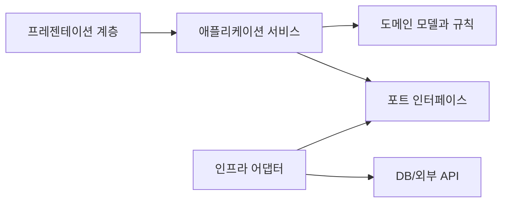

# Software Design 101 (5/10): 인터페이스와 추상화

알림 기능 하나를 만들 때 `notify("email", ...)`, `notify("sms", ...)`, `notify("push", ...)` 같은 분기가 계속 늘어나기 시작하면 인터페이스가 구현 세부를 바깥으로 흘리고 있다는 신호일 수 있습니다. 호출자가 원하는 일보다 구현 방식이 더 많이 드러날수록 구조는 빨리 뻣뻣해집니다.

여기서는 좋은 인터페이스가 무엇인지, 추상화 수준을 어떻게 맞춰야 하는지, 다형성이 분기를 어떻게 줄이는지, LSP와 ISP가 왜 인터페이스 품질을 판단하는 기준이 되는지 설명합니다. 구현 교체가 쉬운 구조가 어떻게 만들어지는지도 함께 보겠습니다.


*Software Design 101 5장 흐름 개요*

## 먼저 던지는 질문

- 더 나은 인터페이스는 무엇으로 판단할 수 있을까요?
- 추상화 수준이 너무 낮거나 높으면 어떤 문제가 생길까요?
- 다형성은 분기문을 어떻게 줄여 줄까요?

## 왜 중요한가

인터페이스는 약속입니다. 약속이 작고 분명하면 구현과 호출자 양쪽 모두 움직일 여지가 생깁니다. 반대로 인터페이스에 구현 세부가 너무 많이 드러나면 호출자는 내부 사정을 함께 떠안게 됩니다.

실무에서 인터페이스 품질은 교체 비용으로 드러납니다. 같은 결제 게이트웨이인데 벤더만 바꾸려 했을 뿐인데 호출자 전부를 손봐야 한다면, 문제는 구현체보다 인터페이스 설계에 있을 가능성이 큽니다.

## 전체 그림

호출자는 하나의 모양만 알고, 여러 구현은 그 뒤에 놓입니다. 이 구조가 잘 작동하려면 인터페이스가 호출자의 관심사와 같은 높이에서 설계되어야 합니다.

## 기본 용어

- <strong>인터페이스</strong>: 호출 가능한 약속의 모양입니다.
- <strong>추상화 수준</strong>: 인터페이스가 호출자의 어휘와 얼마나 잘 맞는지를 뜻합니다.
- <strong>다형성</strong>: 같은 호출이 여러 구현으로 분기될 수 있는 성질입니다.
- <strong>LSP</strong>: 하위 타입은 상위 타입이 쓰이는 자리에 문제없이 들어갈 수 있어야 한다는 원칙입니다.
- <strong>누수된 추상화</strong>: 내부 구현 세부가 인터페이스 밖으로 새는 상태입니다.

## 변경 전과 변경 후

**변경 전**

```python
def notify(kind, user, msg):
    if kind == "email": send_email(user, msg)
    elif kind == "sms": send_sms(user, msg)
    elif kind == "push": send_push(user, msg)
```

**변경 후**

```python
class Notifier:
    def send(self, user, msg): ...

def notify(notifier: Notifier, user, msg):
    notifier.send(user, msg)
```

두 번째 구조에서는 새 채널을 추가할 때 기존 함수 내부 분기를 늘릴 필요가 없습니다. 호출자는 “보낸다”는 의도만 알고 있으면 됩니다.

## 좋은 인터페이스를 만드는 다섯 단계

### 1단계 — 호출자의 언어로 이름 짓기

```python
# 1_naming.py
# Bad: process_data()
# Good: charge_user()
```

메서드 이름은 구현 절차보다 의도를 담아야 합니다. `process_data`보다 `charge_user`가 훨씬 많은 문맥을 전달합니다.

### 2단계 — 추상화 높이를 맞춘다

```python
# 2_level.py
# Bad: send_bytes_over_tcp(host, port, payload)
# Good: notify(user, message)
```

호출자가 네트워크 소켓 세부를 신경 쓰지 않아도 된다면 인터페이스에 올릴 이유도 없습니다. 추상화는 필요한 디테일만 남기고 나머지는 숨기는 일입니다.

### 3단계 — 인자는 적게, 의도는 분명하게 둔다

```python
# 3_params.py
# 나쁜 예: charge(u, a, c, r, m, x, y)
# Good: charge(user, amount, *, reason)
```

위치 인자가 계속 늘어나면 호출 의도가 흐려집니다. 인자 수가 많아질수록 인터페이스가 너무 많은 일을 요구하는지 의심해 볼 필요가 있습니다.

### 4단계 — LSP를 확인한다

```python
# 4_lsp.py
class Bird:
    def fly(self): ...

class Penguin(Bird):
    def fly(self): raise NotImplementedError
# 호출부가 깨집니다 — Bird 자체를 재설계해야 합니다.
```

하위 타입이 상위 타입의 약속을 깨면, 문제는 펭귄 하나가 아니라 상위 인터페이스 설계일 가능성이 큽니다. 타입 계층을 다시 생각해야 합니다.

### 5단계 — 큰 인터페이스 하나보다 작은 인터페이스 여러 개를 둔다

```python
# 5_isp.py
class Reader:
    def read(self): ...

class Writer:
    def write(self, x): ...
# 거대한 IO 인터페이스 하나보다 낫습니다.
```

읽기만 필요한 호출자에게 쓰기 메서드까지 강요하면 불필요한 결합이 생깁니다. 인터페이스도 책임별로 나뉘는 편이 좋습니다.

## 빠르게 검증해 보기

인터페이스 품질을 빠르게 보려면 메서드 이름과 인자 목록만 따로 빼서 읽어 보세요. 구현 설명 없이도 호출 의도가 보이면 추상화 높이가 맞을 가능성이 큽니다.

```python
class Notifier:
    def send(self, user, msg): ...
```

**Expected output:** 이름만 봐도 호출자가 무엇을 원하는지 읽히고, 구현 교체가 필요할 때도 호출 코드가 크게 바뀌지 않아야 합니다.

그다음 하위 구현 하나를 골라 상위 계약을 깨지 않는지 확인합니다. `NotImplementedError`를 던지기 시작하면 인터페이스 설계를 다시 봐야 합니다.

## 실패 신호와 먼저 볼 것

| 실패 신호 | 먼저 볼 것 |
| --- | --- |
| 메서드 이름이 구현 용어로 가득하다 | 호출자 언어가 아니라 구현자 언어인지 봅니다 |
| 인자가 계속 늘어난다 | 인터페이스가 여러 책임을 품고 있는지 확인합니다 |
| 하위 타입이 예외로 계약을 회피한다 | 상위 타입의 약속 자체를 다시 설계합니다 |

좋은 인터페이스는 구현을 감추는 것보다, 호출자의 의도를 짧고 안정적으로 표현하는 데 더 가깝습니다.

## 이 코드에서 먼저 볼 점

- 이름이 구현이 아니라 호출자의 어휘에 맞춰져 있습니다.
- 인자 목록이 짧고 의미가 선명합니다.
- 구현을 바꿔도 호출자 쪽 파급이 작습니다.

## 어디서 많이 헷갈릴까

인터페이스를 추가하는 것과 추상화를 잘하는 것은 다릅니다. 메서드 이름이 `flush_buffer`, `get_redis_client`처럼 구현 용어를 그대로 담고 있다면, 타입만 인터페이스일 뿐 추상화 높이는 거의 그대로일 수 있습니다.

또 하나 흔한 실수는 LSP 문제를 하위 클래스 탓으로만 보는 것입니다. 펭귄이 날 수 없는 것이 잘못이 아니라, `Bird`라는 상위 타입이 “날 수 있음”을 기본 약속으로 삼은 설계가 잘못됐을 가능성이 큽니다.

## 실무에서는 이렇게 본다

결제 게이트웨이, 저장소, 알림 채널처럼 구현 교체가 자주 일어나는 곳에서 인터페이스 품질은 바로 비용으로 이어집니다. 잘 설계된 인터페이스는 벤더 교체나 테스트 대체 구현이 들어와도 호출자가 거의 변하지 않게 합니다.

코드 리뷰에서는 이런 질문을 던지면 좋습니다. “이 이름이 호출자의 의도를 말하는가?”, “이 인자 중 구현 세부가 섞여 있지 않은가?”, “하위 타입이 상위 계약을 정말 지키는가?”, “읽기 전용 호출자에게 쓰기까지 강요하고 있지 않은가?”

## 체크리스트

- [ ] 메서드 이름이 호출자의 언어로 읽히는가?
- [ ] 인자 수가 적고 의도가 분명한가?
- [ ] 하위 타입이 상위 타입의 계약을 깨지 않는가?
- [ ] 인터페이스가 한 가지 책임에 집중하는가?
- [ ] 구현 세부가 인터페이스 밖으로 새지 않는가?

## 연습 문제

1. 현재 코드의 인터페이스 하나를 골라 인자 수를 줄여 보세요.
2. 큰 인터페이스 하나를 두 개의 좁은 인터페이스로 나눠 보세요.
3. 코드베이스에서 LSP 위반 사례 하나를 찾고 무엇을 바꿔야 할지 적어 보세요.

## 현업 적용 관점에서 다시 정리

인터페이스는 "무엇을 할 수 있는가"를 드러내고 "어떻게 하는가"를 숨겨야 합니다. 추상화 레벨이 흔들리면 호출자가 구현 세부를 알게 되고 결합도가 급격히 커집니다.

## 의존 관계를 수치로 읽는 실전 점검

설계 품질을 문장으로만 평가하면 팀마다 기준이 달라집니다. 그래서 실무에서는 결합도 지표를 함께 봅니다. 가장 단순한 시작점은 모듈 단위 `Ca(유입 의존성)`, `Ce(유출 의존성)`, `I=Ce/(Ca+Ce)` 입니다. 값이 정답을 보장하지는 않지만, 경계가 틀어진 지점을 빠르게 찾는 데 매우 유용합니다.

```python
from dataclasses import dataclass

@dataclass(frozen=True)
class CouplingMetric:
    module: str
    ca: int  # 외부 모듈이 이 모듈에 의존하는 수
    ce: int  # 이 모듈이 외부 모듈에 의존하는 수

    @property
    def instability(self) -> float:
        total = self.ca + self.ce
        return 0.0 if total == 0 else self.ce / total

def report(metrics: list[CouplingMetric]) -> None:
    for m in metrics:
        print(f"{m.module:12} Ca={m.ca:2d} Ce={m.ce:2d} I={m.instability:.2f}")

report(
    [
        CouplingMetric("domain", ca=6, ce=1),
        CouplingMetric("application", ca=4, ce=4),
        CouplingMetric("infrastructure", ca=1, ce=7),
    ]
)
```

도메인 모듈의 `I` 값이 0에 가깝고 인프라 모듈의 `I` 값이 1에 가깝다면 방향이 대체로 건강합니다. 반대로 도메인의 `Ce`가 늘어나면 의존성 방향이 뒤집히고 있다는 신호입니다. 이때는 코드 리뷰에서 "왜 import가 생겼는가"를 먼저 질문해야 합니다.

## 모듈 의존 그래프를 먼저 그린 뒤 코드로 옮기기

설계 회의에서 말로만 합의하면 구현 단계에서 금방 흔들립니다. 아래처럼 다이어그램을 먼저 합의하고, 그 다음 import 규칙과 테스트를 붙여 두면 경계를 유지하기 쉽습니다.



이 그림의 핵심은 화살표 개수가 아니라 방향입니다. 도메인은 외부 기술을 모른 채 규칙만 유지하고, 어댑터가 세부 구현을 담당합니다. 이렇게 분리해 두면 기능 요구가 변해도 도메인 코드의 파손 범위가 작아집니다.

## 추상 클래스와 인터페이스를 경계에 배치하기

포트-어댑터 구조를 도입할 때 가장 흔한 실수는 추상화를 인프라 패키지 안에 두는 것입니다. 추상화는 반드시 도메인 또는 애플리케이션 쪽 경계에 둬야 의존성 역전이 성립합니다.

```python
from __future__ import annotations

from abc import ABC, abstractmethod
from dataclasses import dataclass

@dataclass(frozen=True)
class PaymentCommand:
    order_id: str
    user_id: str
    amount: int

class PaymentGateway(ABC):
    @abstractmethod
    def charge(self, command: PaymentCommand) -> str:
        raise NotImplementedError

class FakePaymentGateway(PaymentGateway):
    def charge(self, command: PaymentCommand) -> str:
        return f"paid:{command.order_id}"
```

호출자는 `PaymentGateway`만 의존하고, 실제 결제 제공자 교체는 구현 클래스에서 흡수합니다. 이 방식은 테스트에도 유리합니다. 단위 테스트는 `FakePaymentGateway`를 사용해 비즈니스 규칙만 검증하고, 통합 테스트에서만 실제 I/O를 붙이면 됩니다.

## 리팩터링 전후를 나란히 비교하기

좋은 설계 글은 "좋다"고 말하는 대신 전후 차이를 보여 줘야 합니다. 아래는 책임이 섞인 코드와 책임을 분리한 코드의 대비입니다.

```python
# before.py

def place_order(request: dict) -> dict:
    # HTTP 입력 파싱, 규칙 검증, 결제 호출, 저장, 응답 구성까지 한 함수에 섞임
    user_id = request["user_id"]
    amount = int(request["amount"])
    if amount <= 0:
        return {"status": 400, "message": "invalid amount"}

    payment_id = charge_with_vendor_api(user_id, amount)
    save_order_row(user_id=user_id, amount=amount, payment_id=payment_id)
    return {"status": 200, "payment_id": payment_id}
```

```python
# after.py

def place_order_controller(request: dict, service: "PlaceOrderService") -> dict:
    command = PlaceOrderCommand.from_http(request)
    result = service.execute(command)
    return result.to_http()

class PlaceOrderService:
    def __init__(self, gateway: PaymentGateway, repo: OrderRepository) -> None:
        self.gateway = gateway
        self.repo = repo

    def execute(self, command: "PlaceOrderCommand") -> "PlaceOrderResult":
        command.validate()
        payment_id = self.gateway.charge(command.to_payment_command())
        self.repo.save(command.to_order(payment_id))
        return PlaceOrderResult.success(payment_id)
```

전후를 비교하면 무엇이 바뀌었는지 즉시 보입니다. 컨트롤러는 입력/출력 변환만 담당하고, 서비스는 유스케이스 규칙만 담당하며, 외부 연동은 포트 뒤로 이동합니다. 구조가 이렇게 바뀌면 장애 분석과 테스트 설계가 훨씬 단순해집니다.

## 계층별 체크포인트와 운영 연결

설계는 개발 단계에서 끝나지 않습니다. 운영 지표와 연결되어야 품질 개선이 누적됩니다.

- 프레젠테이션 계층: 요청 검증 실패율, 4xx 응답 분포
- 애플리케이션 계층: 유스케이스별 처리 시간, 재시도 횟수
- 도메인 계층: 규칙 위반 빈도, 불변식 실패 로그
- 인프라 계층: 외부 API 오류율, DB 지연 시간

지표를 계층별로 분리해 보면 어디를 고쳐야 하는지가 명확해집니다. 모든 지표가 한 대시보드에서 섞여 있으면 "느리다"는 사실만 보이고 원인은 보이지 않습니다. 설계 경계를 운영 지표 경계와 맞추면 개선 사이클이 빠르게 돌아갑니다.

## 리뷰와 리팩터링을 위한 실전 질문 세트

설계는 한 번 작성하고 끝나는 산출물이 아니라, 변경 요청이 들어올 때마다 점검하는 운영 습관입니다. 아래 질문은 코드 리뷰와 리팩터링 계획에서 바로 사용할 수 있는 최소 점검 세트입니다.

1. 이번 변경은 어느 계층의 책임인가요?
2. 새 의존성이 도메인 중심 방향을 깨뜨리나요?
3. 인터페이스 이름이 구현 세부를 누설하나요?
4. 테스트 더블 없이 규칙 검증이 가능한가요?
5. 다음 변경이 들어와도 같은 위치를 수정하게 되나요?

이 다섯 질문은 단순하지만 강력합니다. 특히 "다음 변경도 같은 위치를 건드리게 되는가"라는 질문은 설계의 탄력성을 빠르게 드러냅니다. 지금 요구사항을 통과하는 코드와 다음 요구사항까지 받아내는 코드는 여기서 갈립니다.

## 계층 아키텍처 예시를 한 단계 더 구체화하기

아래 예시는 요청-유스케이스-도메인-어댑터 경계를 코드로 고정하는 방법을 보여 줍니다.

```python
from dataclasses import dataclass
from typing import Protocol

@dataclass(frozen=True)
class CreateCouponCommand:
    code: str
    discount_percent: int

class CouponRepository(Protocol):
    def exists(self, code: str) -> bool: ...
    def save(self, code: str, discount_percent: int) -> None: ...

class CreateCouponService:
    def __init__(self, repo: CouponRepository) -> None:
        self.repo = repo

    def execute(self, command: CreateCouponCommand) -> None:
        if not (1 <= command.discount_percent <= 90):
            raise ValueError("할인율은 1~90 범위여야 합니다.")
        if self.repo.exists(command.code):
            raise ValueError("이미 존재하는 쿠폰 코드입니다.")
        self.repo.save(command.code, command.discount_percent)
```

핵심은 서비스가 저장소의 구체 구현을 모른다는 점입니다. SQLAlchemy를 쓰든, 파일 저장을 쓰든, 외부 API를 쓰든 서비스 규칙은 바뀌지 않습니다. 그래서 정책 변경과 기술 변경이 서로 다른 속도로 진화할 수 있습니다.

## 설계 부채를 남기지 않는 배포 순서

설계를 개선할 때 기능 배포와 구조 개선을 한 커밋에 묶으면 위험이 커집니다. 다음 순서를 지키면 안전하게 개선할 수 있습니다.

- 1단계: 새 경계와 인터페이스를 추가합니다. 기존 경로는 유지합니다.
- 2단계: 호출자를 새 경계로 점진 이행합니다. 로그로 구경로 사용량을 기록합니다.
- 3단계: 구경로 트래픽이 0에 가까워지면 제거합니다.
- 4단계: 제거 이후 메트릭과 에러율을 비교해 회귀를 확인합니다.

이 순서는 확장-이행-수축 전략과 같습니다. 설계는 깔끔해지고, 사용자 영향은 최소화됩니다. 특히 여러 팀이 동시에 작업하는 환경에서는 이 순서를 문서화해 공통 작업 규칙으로 삼는 것이 효과적입니다.

## 정리

좋은 인터페이스는 자유의 단위입니다. 호출자는 의도만 말하고, 구현은 뒤에서 바뀔 수 있어야 합니다. 추상화 수준이 맞고 계약이 안정적일수록 구조는 더 오래 버팁니다.

다음 글에서는 이런 인터페이스들이 모여 만드는 큰 구조, 계층 아키텍처를 다룹니다.

## 처음 질문으로 돌아가기

- **더 나은 인터페이스는 무엇으로 판단할 수 있을까요?**
  - 더 나은 인터페이스는 구현 절차보다 호출자의 의도를 짧고 선명하게 드러내는지로 판단할 수 있습니다. `process_data()`보다 `charge_user()`, `send_bytes_over_tcp(...)`보다 `notify(user, message)`가 낫다는 예시는 이름과 추상화 높이가 호출자 언어에 맞아야 함을 보여 줍니다.
- **추상화 수준이 너무 낮거나 높으면 어떤 문제가 생길까요?**
  - 추상화가 너무 낮으면 소켓, 버퍼, 구현 용어가 인터페이스 밖으로 새어 호출자가 내부 사정을 떠안게 됩니다. 반대로 하위 타입이 `NotImplementedError`로 계약을 회피할 정도로 추상화가 잘못 잡히면 LSP가 깨지고, 상위 타입 자체를 다시 설계해야 합니다.
- **다형성은 분기문을 어떻게 줄여 줄까요?**
  - `notify("email")`, `notify("sms")`, `notify("push")`처럼 분기하던 코드를 `Notifier.send()` 호출 하나로 바꾸면 새 채널 추가가 기존 분기 수정이 아니라 구현 추가로 바뀝니다. 같은 호출 모양 뒤에 여러 구현을 숨기기 때문에 호출자 파급도 작아집니다.

<!-- toc:begin -->
## 시리즈 목차

- [Software Design 101 (1/10): 소프트웨어 설계란 무엇인가?](./01-what-is-software-design.md)
- [Software Design 101 (2/10): 관심사 분리](./02-separation-of-concerns.md)
- [Software Design 101 (3/10): 모듈과 경계](./03-modules-and-boundaries.md)
- [Software Design 101 (4/10): 의존성 방향](./04-dependency-direction.md)
- **인터페이스와 추상화 (현재 글)**
- 계층 아키텍처 (예정)
- 데이터 흐름 설계 (예정)
- 변경 영향 줄이기 (예정)
- 설계 원칙 모음 (예정)
- 작은 프로젝트로 설계 연습 (예정)

<!-- toc:end -->

## 참고 자료

- [software-design-101 예제 코드 저장소](https://github.com/yeongseon-books/book-examples/tree/main/software-design-101/ko)

- [Liskov Substitution Principle (Barbara Liskov)](https://www.cs.cmu.edu/~wing/publications/LiskovWing94.pdf)
- [Interface Segregation Principle](https://web.archive.org/web/20150905081110/http://www.objectmentor.com/resources/articles/isp.pdf)
- [Joshua Bloch — How to Design a Good API](https://www.youtube.com/watch?v=heh4OeB9A-c)
- [Designing Data-Intensive Applications — Abstractions](https://dataintensive.net/)

### 실전 확인용 문서

- [typing.Protocol](https://docs.python.org/3/library/typing.html#typing.Protocol)
- [abc — Abstract Base Classes](https://docs.python.org/3/library/abc.html)

Tags: Computer Science, SoftwareDesign, Interfaces, Abstraction, LSP, Polymorphism
