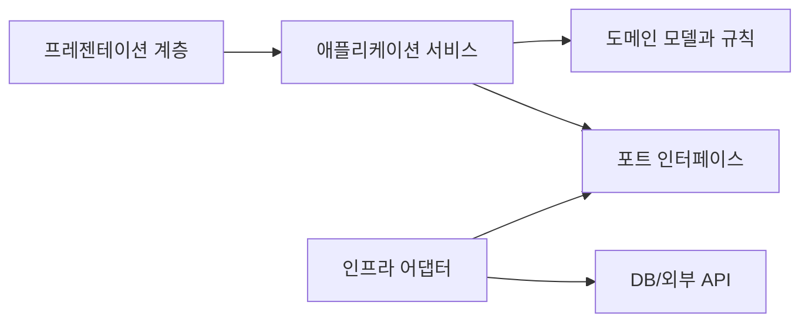

# Software Design 101 (6/10): 계층 아키텍처

이 글은 Software Design 101 시리즈의 여섯 번째 글입니다.

라우터에서 요청을 받고, 그 안에서 바로 검증하고, 비즈니스 규칙을 처리하고, 데이터베이스까지 두드리는 코드는 처음에는 빠르게 완성됩니다. 하지만 채널이 하나 더 늘거나 저장 방식이 바뀌는 순간 책임이 한곳에 엉켜 있었다는 사실이 바로 드러납니다.

이 글은 Software Design 101 시리즈의 6번째 글입니다.

여기서는 계층 아키텍처를 왜 쓰는지, presentation·application·domain·infrastructure를 어떤 기준으로 나누는지, 허용되는 의존성 방향은 무엇인지, 외부 모델이 도메인으로 그대로 새지 않게 막는 부패 방지 계층은 어디에 필요한지 살펴봅니다.


*Software Design 101 6장 흐름 개요*

## 먼저 던지는 질문

- 계층을 왜 나누고, 무엇을 기준으로 나눌까요?
- 각 계층은 어떤 책임을 가져야 할까요?
- 의존성은 어떤 방향으로만 흘러야 할까요?

## 왜 중요한가

UI, 비즈니스 규칙, 인프라는 바뀌는 이유도 속도도 다릅니다. 웹 요청 형식은 자주 바뀔 수 있고, 외부 데이터베이스나 SaaS는 더 자주 흔들릴 수 있습니다. 반면 핵심 도메인 규칙은 상대적으로 천천히 변합니다.

이 셋을 한 계층에 섞으면 외부 변화가 내부 규칙까지 밀고 들어옵니다. 계층 아키텍처는 이 변동성 차이를 구조로 분리하는 방식입니다. 책임이 잘 나뉘면 웹 프레임워크를 바꾸더라도 도메인 규칙은 그대로 남기기 쉬워집니다.

## 전체 그림

계층 구조에서 먼저 기억할 점은 도메인이 가장 안정적인 중심이라는 사실입니다. 바깥 채널과 저장소는 도메인을 향해 붙지만, 도메인은 바깥 세부를 모르는 편이 좋습니다.

## 기본 용어

- <strong>표현 계층</strong>: HTTP, CLI, UI처럼 바깥과 만나는 접점입니다.
- <strong>애플리케이션 계층</strong>: 유스케이스 흐름을 조율하는 계층입니다.
- <strong>도메인 계층</strong>: 업무 규칙이 있는 가장 안정적인 계층입니다.
- <strong>인프라 계층</strong>: DB, 파일, 외부 SaaS 같은 변동이 큰 세부를 다룹니다.
- <strong>부패 방지 계층</strong>: 외부 모델이 도메인으로 그대로 스며드는 것을 막는 번역 계층입니다.

## 변경 전과 변경 후

**변경 전**

```python
# 한 함수가 HTTP, business, DB를 모두 처리함
@app.route("/charge")
def charge():
    body = request.json
    if body["amount"] <= 0: return "bad", 400
    db.execute("UPDATE wallet ...")
    return "ok"
```

**변경 후**

```python
# presentation
@app.route("/charge")
def charge_view():
    return charge_use_case(request.json)

# application
def charge_use_case(payload):
    cmd = ChargeCommand.from_payload(payload)
    return charge_service.run(cmd)
```

두 번째 구조에서는 표현 계층이 얇고, 업무 흐름은 애플리케이션 계층으로 이동합니다. 각 계층이 자기 책임만 맡으므로 수정 범위도 더 예측하기 쉬워집니다.

## 계층을 도입하는 다섯 단계

### 1단계 — 도메인을 먼저 분리한다

```python
# 1_domain.py
class Wallet:
    def debit(self, amount: int) -> None:
        if amount <= 0: raise ValueError
        self.balance -= amount
```

가장 먼저 분리할 것은 업무 규칙입니다. 금액이 0보다 커야 한다는 규칙은 웹 프레임워크나 DB 종류와 무관하게 살아남아야 합니다.

### 2단계 — 흐름을 유스케이스로 묶는다

```python
# 2_usecase.py
def charge(repo, user_id, amount):
    w = repo.get(user_id); w.debit(amount); repo.save(w)
```

유스케이스는 “무엇을 하는가”의 흐름을 담당합니다. 도메인 객체를 조합해 작업을 완료하지만, 표현 세부나 저장 구현은 직접 품지 않습니다.

### 3단계 — 표현 계층을 얇게 유지한다

```python
# 3_presentation.py
@app.route("/charge")
def view():
    return charge(repo, request.json["user"], request.json["amount"])
```

표현 계층은 입력을 받고 출력을 돌려주는 일에 집중해야 합니다. 라우터 안에서 업무 규칙이 커지기 시작하면 계층이 다시 흐려집니다.

### 4단계 — 인프라 어댑터를 둔다

```python
# 4_infra.py
class SqlWalletRepo:
    def get(self, uid): ...
    def save(self, w): ...
```

인프라는 도메인이 필요로 하는 모양을 구현합니다. 데이터베이스를 PostgreSQL에서 Redis로 바꿔도 도메인 규칙 자체는 그대로 남길 수 있어야 합니다.

### 5단계 — 부패 방지 계층으로 번역한다

```python
# 5_acl.py
def to_domain_user(external_json):
    return User(id=external_json["uid"], name=external_json["nm"])
```

외부 API 응답을 도메인 모델로 바로 쓰기 시작하면 외부 스키마가 도메인 내부 어휘를 오염시킵니다. 번역 계층을 두면 외부 변경 충격을 그 지점에서 흡수할 수 있습니다.

## 빠르게 검증해 보기

라우터 하나를 열고 HTTP 처리, 유스케이스 흐름, 도메인 규칙, 저장소 접근이 몇 줄씩 섞여 있는지 세어 보세요. 계층이 무너진 코드는 이 네 종류가 한 함수 안에 모여 있는 경우가 많습니다.

```text
router lines: input parsing, status code, JSON response
use-case lines: orchestration, transaction boundary
domain lines: validation, policy, invariant
infra lines: ORM call, SQL, SDK
```

**Expected output:** 표현 계층에는 HTTP 입출력만, 도메인에는 규칙만 남겨야 한다는 정리 포인트가 분명해집니다.

작은 프로젝트라면 네 계층을 모두 강제할 필요는 없습니다. 다만 서로 다른 이유로 바뀌는 코드를 한 함수에 쌓아 두는 상태는 피해야 합니다.

## 실패 신호와 먼저 볼 것

| 실패 신호 | 먼저 볼 것 |
| --- | --- |
| 라우터 함수가 길고 테스트도 어렵다 | 업무 흐름이 표현 계층에 남아 있는지 봅니다 |
| 도메인 모델에 ORM 세부가 많다 | 인프라가 도메인 안으로 새는지 확인합니다 |
| 외부 SaaS 응답 필드명이 도메인 곳곳에 보인다 | 부패 방지 계층이 필요한지 점검합니다 |

계층의 목적은 파일 구조를 예쁘게 만드는 것이 아니라, 바깥 변화가 안쪽 규칙을 직접 흔들지 못하게 막는 데 있습니다.

## 이 코드에서 먼저 볼 점

- 의존성은 도메인을 향하도록 정리됩니다.
- 표현 계층이 얇을수록 채널 교체 비용이 낮아집니다.
- 외부 모델은 번역을 거친 뒤 도메인으로 들어갑니다.

## 어디서 많이 헷갈릴까

계층 이름을 붙이는 것만으로 계층 아키텍처가 되는 것은 아닙니다. router 폴더, service 폴더, repository 폴더가 있어도 서비스가 ORM 모델과 HTTP 요청을 동시에 들고 있다면 실질적인 분리는 거의 없습니다.

또 다른 흔한 오해는 네 계층을 모든 프로젝트에 똑같이 강제하는 일입니다. 작은 스크립트나 단일 배치 작업에는 과할 수 있습니다. 중요한 것은 계층 개수보다, 서로 다른 이유로 바뀌는 코드를 같은 상자에 넣지 않는 감각입니다.

## 실무에서는 이렇게 본다

대부분의 백엔드는 이미 어떤 형태로든 계층 구조를 가집니다. 흔한 구성은 router → service → repository → model입니다. 여기에 외부 SaaS 연동이 들어오면 ACL을 추가해 외부 스키마를 도메인 바깥에서 번역하는 식입니다.

도메인 모델에 ORM 데코레이터가 잔뜩 붙기 시작하거나, 라우터가 업무 규칙을 대부분 품고 있으면 경계가 무너지고 있다는 신호로 봐도 됩니다. 계층 구조는 이런 누수를 빨리 발견하게 해 줍니다.

## 체크리스트

- [ ] 도메인이 인프라 라이브러리를 직접 import하지 않는가?
- [ ] 유스케이스가 애플리케이션 계층에 모여 있는가?
- [ ] 표현 계층이 입력과 출력 처리에 집중하는가?
- [ ] 외부 경계에 부패 방지 계층이 필요한지 검토했는가?
- [ ] 계층 수가 시스템 크기에 비해 과하지 않은가?

## 연습 문제

1. 라우터 하나에서 업무 로직을 서비스로 끌어내려 보세요.
2. ORM 모델과 도메인 모델을 분리해 보세요.
3. 외부 SaaS 응답 하나에 ACL을 적용해 보세요.

## 정리

계층 아키텍처는 다른 속도로 바뀌는 코드를 분리해 변경 충격을 흡수하는 구조입니다. 도메인을 중심에 두고, 표현과 인프라는 가장자리에서 협력하게 만들면 수정 범위가 훨씬 예측 가능해집니다.

다음 글에서는 계층 사이를 오가는 데이터 자체를 어떻게 설계할지, 데이터 흐름 설계를 다룹니다.

## 현업 적용 관점에서 다시 정리

계층 아키텍처의 핵심은 호출 순서가 아니라 책임 분리입니다. 프레젠테이션·애플리케이션·도메인·인프라가 각자 다른 변경 리듬을 갖도록 만드는 것이 목적입니다.

## 의존 관계를 수치로 읽는 실전 점검

설계 품질을 문장으로만 평가하면 팀마다 기준이 달라집니다. 그래서 실무에서는 결합도 지표를 함께 봅니다. 가장 단순한 시작점은 모듈 단위 `Ca(유입 의존성)`, `Ce(유출 의존성)`, `I=Ce/(Ca+Ce)` 입니다. 값이 정답을 보장하지는 않지만, 경계가 틀어진 지점을 빠르게 찾는 데 매우 유용합니다.

```python
from dataclasses import dataclass

@dataclass(frozen=True)
class CouplingMetric:
    module: str
    ca: int  # 외부 모듈이 이 모듈에 의존하는 수
    ce: int  # 이 모듈이 외부 모듈에 의존하는 수

    @property
    def instability(self) -> float:
        total = self.ca + self.ce
        return 0.0 if total == 0 else self.ce / total

def report(metrics: list[CouplingMetric]) -> None:
    for m in metrics:
        print(f"{m.module:12} Ca={m.ca:2d} Ce={m.ce:2d} I={m.instability:.2f}")

report(
    [
        CouplingMetric("domain", ca=6, ce=1),
        CouplingMetric("application", ca=4, ce=4),
        CouplingMetric("infrastructure", ca=1, ce=7),
    ]
)
```

도메인 모듈의 `I` 값이 0에 가깝고 인프라 모듈의 `I` 값이 1에 가깝다면 방향이 대체로 건강합니다. 반대로 도메인의 `Ce`가 늘어나면 의존성 방향이 뒤집히고 있다는 신호입니다. 이때는 코드 리뷰에서 "왜 import가 생겼는가"를 먼저 질문해야 합니다.

## 모듈 의존 그래프를 먼저 그린 뒤 코드로 옮기기

설계 회의에서 말로만 합의하면 구현 단계에서 금방 흔들립니다. 아래처럼 다이어그램을 먼저 합의하고, 그 다음 import 규칙과 테스트를 붙여 두면 경계를 유지하기 쉽습니다.



이 그림의 핵심은 화살표 개수가 아니라 방향입니다. 도메인은 외부 기술을 모른 채 규칙만 유지하고, 어댑터가 세부 구현을 담당합니다. 이렇게 분리해 두면 기능 요구가 변해도 도메인 코드의 파손 범위가 작아집니다.

## 추상 클래스와 인터페이스를 경계에 배치하기

포트-어댑터 구조를 도입할 때 가장 흔한 실수는 추상화를 인프라 패키지 안에 두는 것입니다. 추상화는 반드시 도메인 또는 애플리케이션 쪽 경계에 둬야 의존성 역전이 성립합니다.

```python
from __future__ import annotations

from abc import ABC, abstractmethod
from dataclasses import dataclass

@dataclass(frozen=True)
class PaymentCommand:
    order_id: str
    user_id: str
    amount: int

class PaymentGateway(ABC):
    @abstractmethod
    def charge(self, command: PaymentCommand) -> str:
        raise NotImplementedError

class FakePaymentGateway(PaymentGateway):
    def charge(self, command: PaymentCommand) -> str:
        return f"paid:{command.order_id}"
```

호출자는 `PaymentGateway`만 의존하고, 실제 결제 제공자 교체는 구현 클래스에서 흡수합니다. 이 방식은 테스트에도 유리합니다. 단위 테스트는 `FakePaymentGateway`를 사용해 비즈니스 규칙만 검증하고, 통합 테스트에서만 실제 I/O를 붙이면 됩니다.

## 리팩터링 전후를 나란히 비교하기

좋은 설계 글은 "좋다"고 말하는 대신 전후 차이를 보여 줘야 합니다. 아래는 책임이 섞인 코드와 책임을 분리한 코드의 대비입니다.

```python
# before.py

def place_order(request: dict) -> dict:
    # HTTP 입력 파싱, 규칙 검증, 결제 호출, 저장, 응답 구성까지 한 함수에 섞임
    user_id = request["user_id"]
    amount = int(request["amount"])
    if amount <= 0:
        return {"status": 400, "message": "invalid amount"}

    payment_id = charge_with_vendor_api(user_id, amount)
    save_order_row(user_id=user_id, amount=amount, payment_id=payment_id)
    return {"status": 200, "payment_id": payment_id}
```

```python
# after.py

def place_order_controller(request: dict, service: "PlaceOrderService") -> dict:
    command = PlaceOrderCommand.from_http(request)
    result = service.execute(command)
    return result.to_http()

class PlaceOrderService:
    def __init__(self, gateway: PaymentGateway, repo: OrderRepository) -> None:
        self.gateway = gateway
        self.repo = repo

    def execute(self, command: "PlaceOrderCommand") -> "PlaceOrderResult":
        command.validate()
        payment_id = self.gateway.charge(command.to_payment_command())
        self.repo.save(command.to_order(payment_id))
        return PlaceOrderResult.success(payment_id)
```

전후를 비교하면 무엇이 바뀌었는지 즉시 보입니다. 컨트롤러는 입력/출력 변환만 담당하고, 서비스는 유스케이스 규칙만 담당하며, 외부 연동은 포트 뒤로 이동합니다. 구조가 이렇게 바뀌면 장애 분석과 테스트 설계가 훨씬 단순해집니다.

## 계층별 체크포인트와 운영 연결

설계는 개발 단계에서 끝나지 않습니다. 운영 지표와 연결되어야 품질 개선이 누적됩니다.

- 프레젠테이션 계층: 요청 검증 실패율, 4xx 응답 분포
- 애플리케이션 계층: 유스케이스별 처리 시간, 재시도 횟수
- 도메인 계층: 규칙 위반 빈도, 불변식 실패 로그
- 인프라 계층: 외부 API 오류율, DB 지연 시간

지표를 계층별로 분리해 보면 어디를 고쳐야 하는지가 명확해집니다. 모든 지표가 한 대시보드에서 섞여 있으면 "느리다"는 사실만 보이고 원인은 보이지 않습니다. 설계 경계를 운영 지표 경계와 맞추면 개선 사이클이 빠르게 돌아갑니다.

## 리뷰와 리팩터링을 위한 실전 질문 세트

설계는 한 번 작성하고 끝나는 산출물이 아니라, 변경 요청이 들어올 때마다 점검하는 운영 습관입니다. 아래 질문은 코드 리뷰와 리팩터링 계획에서 바로 사용할 수 있는 최소 점검 세트입니다.

1. 이번 변경은 어느 계층의 책임인가요?
2. 새 의존성이 도메인 중심 방향을 깨뜨리나요?
3. 인터페이스 이름이 구현 세부를 누설하나요?
4. 테스트 더블 없이 규칙 검증이 가능한가요?
5. 다음 변경이 들어와도 같은 위치를 수정하게 되나요?

이 다섯 질문은 단순하지만 강력합니다. 특히 "다음 변경도 같은 위치를 건드리게 되는가"라는 질문은 설계의 탄력성을 빠르게 드러냅니다. 지금 요구사항을 통과하는 코드와 다음 요구사항까지 받아내는 코드는 여기서 갈립니다.

## 계층 아키텍처 예시를 한 단계 더 구체화하기

아래 예시는 요청-유스케이스-도메인-어댑터 경계를 코드로 고정하는 방법을 보여 줍니다.

```python
from dataclasses import dataclass
from typing import Protocol

@dataclass(frozen=True)
class CreateCouponCommand:
    code: str
    discount_percent: int

class CouponRepository(Protocol):
    def exists(self, code: str) -> bool: ...
    def save(self, code: str, discount_percent: int) -> None: ...

class CreateCouponService:
    def __init__(self, repo: CouponRepository) -> None:
        self.repo = repo

    def execute(self, command: CreateCouponCommand) -> None:
        if not (1 <= command.discount_percent <= 90):
            raise ValueError("할인율은 1~90 범위여야 합니다.")
        if self.repo.exists(command.code):
            raise ValueError("이미 존재하는 쿠폰 코드입니다.")
        self.repo.save(command.code, command.discount_percent)
```

핵심은 서비스가 저장소의 구체 구현을 모른다는 점입니다. SQLAlchemy를 쓰든, 파일 저장을 쓰든, 외부 API를 쓰든 서비스 규칙은 바뀌지 않습니다. 그래서 정책 변경과 기술 변경이 서로 다른 속도로 진화할 수 있습니다.

## 설계 부채를 남기지 않는 배포 순서

설계를 개선할 때 기능 배포와 구조 개선을 한 커밋에 묶으면 위험이 커집니다. 다음 순서를 지키면 안전하게 개선할 수 있습니다.

- 1단계: 새 경계와 인터페이스를 추가합니다. 기존 경로는 유지합니다.
- 2단계: 호출자를 새 경계로 점진 이행합니다. 로그로 구경로 사용량을 기록합니다.
- 3단계: 구경로 트래픽이 0에 가까워지면 제거합니다.
- 4단계: 제거 이후 메트릭과 에러율을 비교해 회귀를 확인합니다.

이 순서는 확장-이행-수축 전략과 같습니다. 설계는 깔끔해지고, 사용자 영향은 최소화됩니다. 특히 여러 팀이 동시에 작업하는 환경에서는 이 순서를 문서화해 공통 작업 규칙으로 삼는 것이 효과적입니다.

## 처음 질문으로 돌아가기

- **계층을 왜 나누고, 무엇을 기준으로 나눌까요?**
  - 본문의 기준은 계층 아키텍처를 한 덩어리 개념으로 보지 않고 입력, 처리, 검증, 운영 신호가 만나는 경계로 나누어 확인하는 것입니다.
- **각 계층은 어떤 책임을 가져야 할까요?**
  - 예제와 그림에서는 어떤 값이 들어오고, 어느 단계에서 바뀌며, 어떤 기준으로 통과 또는 실패하는지를 먼저 확인해야 합니다.
- **의존성은 어떤 방향으로만 흘러야 할까요?**
  - 운영에서는 이 판단을 체크리스트, 로그, 테스트로 남겨 다음 변경에서도 같은 실패가 반복되지 않게 막아야 합니다.

<!-- toc:begin -->
## 시리즈 목차

- [Software Design 101 (1/10): 소프트웨어 설계란 무엇인가?](./01-what-is-software-design.md)
- [Software Design 101 (2/10): 관심사 분리](./02-separation-of-concerns.md)
- [Software Design 101 (3/10): 모듈과 경계](./03-modules-and-boundaries.md)
- [Software Design 101 (4/10): 의존성 방향](./04-dependency-direction.md)
- [Software Design 101 (5/10): 인터페이스와 추상화](./05-interfaces-and-abstraction.md)
- **계층 아키텍처 (현재 글)**
- 데이터 흐름 설계 (예정)
- 변경 영향 줄이기 (예정)
- 설계 원칙 모음 (예정)
- 작은 프로젝트로 설계 연습 (예정)

<!-- toc:end -->

## 참고 자료

- [software-design-101 예제 코드 저장소](https://github.com/yeongseon-books/book-examples/tree/main/software-design-101/ko)

- [Clean Architecture (Uncle Bob)](https://blog.cleancoder.com/uncle-bob/2012/08/13/the-clean-architecture.html)
- [Domain-Driven Design — Layered Architecture](https://martinfowler.com/bliki/DomainDrivenDesign.html)
- [Patterns of Enterprise Application Architecture](https://martinfowler.com/eaaCatalog/)
- [Anti-Corruption Layer Pattern](https://learn.microsoft.com/en-us/azure/architecture/patterns/anti-corruption-layer)

### 실전 확인용 문서

- [Flask Quickstart](https://flask.palletsprojects.com/en/stable/quickstart/)
- [dataclasses — Data Classes](https://docs.python.org/3/library/dataclasses.html)

Tags: Computer Science, SoftwareDesign, LayeredArchitecture, CleanArchitecture, Layers, Architecture
