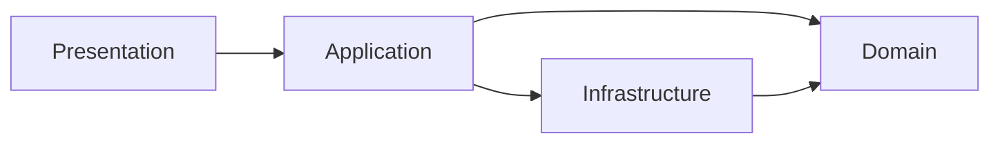

# 계층 아키텍처

> Software Design 101 시리즈 (6/10)

<!-- a-grade-intro:begin -->

**핵심 질문**: 왜 계층을 나누고, 무엇을 기준으로 나눌까요?

> 변경의 이유와 속도가 다른 코드를 같은 칸에 두지 않기 위해서입니다.

<!-- a-grade-intro:end -->

## 이 글에서 배울 것

- 전형적인 4계층 구조
- 허용된 의존 방향
- 도메인을 보호하는 부패 방지 계층
- 계층을 나눌 때의 함정
- 작은 시스템에서도 계층이 주는 이득

## 왜 중요한가

계층은 변경의 단위를 분리합니다. UI가 바뀌는 빈도, 도메인이 바뀌는 빈도, 인프라가 바뀌는 빈도는 다릅니다.

> 같은 이유로 함께 변하는 것을 한 곳에 모은다.

## 개념 한눈에 보기



도메인은 누구도 아래로 향하지 않는 안정의 핵.

## 핵심 용어 정리

- **Presentation**: HTTP, CLI, UI — 외부와의 접점.
- **Application**: 유스케이스 단위의 흐름 제어.
- **Domain**: 비즈니스 규칙. 가장 안정.
- **Infrastructure**: DB, 외부 SaaS, 파일 — 가장 변동.
- **Anti-corruption layer (ACL)**: 외부 모델이 도메인에 그대로 흘러들지 않게 막는 변환 계층.

## Before/After

**Before**

```python
# 한 함수가 HTTP, 비즈니스, DB를 모두 한다
@app.route("/charge")
def charge():
    body = request.json
    if body["amount"] <= 0: return "bad", 400
    db.execute("UPDATE wallet ...")
    return "ok"
```

**After**

```python
# presentation
@app.route("/charge")
def charge_view():
    return charge_use_case(request.json)

# application
def charge_use_case(payload):
    cmd = ChargeCommand.from_payload(payload)
    return charge_service.run(cmd)
```

각 계층이 자기 책임만 집니다.

## 실습: 계층을 도입하는 5단계

### 1단계 — 도메인 추출

```python
# 1_domain.py
class Wallet:
    def debit(self, amount: int) -> None:
        if amount <= 0: raise ValueError
        self.balance -= amount
```

가장 안정적인 규칙부터 분리.

### 2단계 — 유스케이스 묶기

```python
# 2_usecase.py
def charge(repo, user_id, amount):
    w = repo.get(user_id); w.debit(amount); repo.save(w)
```

흐름은 application 계층이 담당.

### 3단계 — 표현 계층 얇게

```python
# 3_presentation.py
@app.route("/charge")
def view():
    return charge(repo, request.json["user"], request.json["amount"])
```

웹 프레임워크는 입출력만.

### 4단계 — 인프라 어댑터

```python
# 4_infra.py
class SqlWalletRepo:
    def get(self, uid): ...
    def save(self, w): ...
```

도메인이 정의한 모양을 구현.

### 5단계 — 부패 방지 계층

```python
# 5_acl.py
def to_domain_user(external_json):
    return User(id=external_json["uid"], name=external_json["nm"])
```

외부 스키마가 도메인을 더럽히지 않게.

## 이 코드에서 주목할 점

- 의존이 항상 도메인을 향합니다.
- 표현 계층이 얇아서 다른 채널로 바꾸기 쉽습니다.
- 외부 모델이 도메인에 그대로 들어오지 않습니다.

## 자주 하는 실수 5가지

1. **도메인이 ORM 데코레이터로 도배됨.** 도메인이 인프라를 안다.
2. **유스케이스가 표현 계층 안에 흩어짐.** 라우터가 비대.
3. **계층을 너무 잘게 나눔.** 의식만 늘고 가치는 적다.
4. **ACL 생략.** 외부 변경이 도메인을 흔든다.
5. **모든 프로젝트에 4계층 강요.** 작은 스크립트에는 과하다.

## 실무에서는 이렇게 쓰입니다

대부분의 백엔드는 사실상 어떤 형태의 계층을 따릅니다. 흔한 분리는 router → service → repository → model이며, ACL은 외부 SaaS 연동 지점에서 추가됩니다.

## 시니어 엔지니어는 이렇게 생각합니다

- 도메인을 가장 먼저, 가장 보호한다.
- 의존 방향을 시각화해 둔다.
- 표현 계층은 얇게 유지한다.
- 외부 스키마와 도메인 모델을 분리한다.
- 작은 시스템엔 작은 계층을 적용한다.

## 체크리스트

- [ ] 도메인이 인프라를 import하지 않는가?
- [ ] 유스케이스가 application 계층에 모여 있는가?
- [ ] 표현 계층이 얇은가?
- [ ] ACL이 외부 경계에 있는가?
- [ ] 계층 수가 시스템 크기에 어울리는가?

## 연습 문제

1. 본인 라우터 한 개에서 비즈니스 로직을 service로 빼 보세요.
2. ORM 모델과 도메인 모델을 분리해 보세요.
3. 외부 SaaS 응답에 ACL을 적용해 보세요.

## 정리 및 다음 단계

계층은 변경의 충격을 흡수합니다. 다음 글에서는 계층 사이의 데이터 — 그 흐름을 어떻게 설계할지 — 를 봅니다.

<!-- toc:begin -->
- [소프트웨어 설계란 무엇인가?](./01-what-is-software-design.md)
- [관심사 분리](./02-separation-of-concerns.md)
- [모듈과 경계](./03-modules-and-boundaries.md)
- [의존성 방향](./04-dependency-direction.md)
- [인터페이스와 추상화](./05-interfaces-and-abstraction.md)
- **계층 아키텍처 (현재 글)**
- 데이터 흐름 설계 (예정)
- 변경 영향 줄이기 (예정)
- 설계 원칙 모음 (예정)
- 작은 프로젝트로 설계 연습 (예정)
<!-- toc:end -->

## 참고 자료

- [Clean Architecture (Uncle Bob)](https://blog.cleancoder.com/uncle-bob/2012/08/13/the-clean-architecture.html)
- [Domain-Driven Design — Layered Architecture](https://martinfowler.com/bliki/DomainDrivenDesign.html)
- [Patterns of Enterprise Application Architecture](https://martinfowler.com/eaaCatalog/)
- [Anti-Corruption Layer Pattern](https://learn.microsoft.com/en-us/azure/architecture/patterns/anti-corruption-layer)

Tags: Computer Science, SoftwareDesign, LayeredArchitecture, CleanArchitecture, Layers, Architecture
