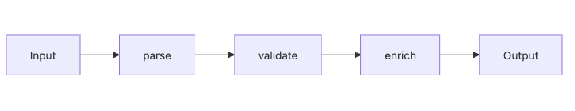

# 데이터 흐름 설계

같은 요청 객체를 여러 함수가 돌려 가며 수정하는 코드는 디버깅이 어렵습니다. 어디에서 이메일 값이 바뀌었는지, 어느 단계에서 유효성 검사가 통과됐는지, 왜 마지막 응답이 예상과 달라졌는지 한 번에 추적하기 힘들기 때문입니다.

이 글은 Software Design 101 시리즈의 7번째 글입니다.

여기서는 데이터 흐름을 설계한다는 말이 무엇인지, 입력에서 출력까지 한 방향 흐름을 어떻게 만들지, 작은 변환 함수의 파이프라인은 왜 유리한지, 불변 데이터와 부수효과 분리가 구조를 어떻게 단순하게 만드는지 살펴봅니다.

## 이 글에서 다룰 문제

- 데이터 흐름을 설계한다는 말은 구체적으로 무엇일까요?
- 입력과 출력 사이를 왜 한 방향으로만 흐르게 해야 할까요?
- 변환 단계와 부수효과는 어떻게 나누는 편이 좋을까요?
- 불변 데이터는 디버깅과 변경에 어떤 도움을 줄까요?
- push 모델과 pull 모델은 어떤 감각 차이를 만들까요?

> 데이터는 어디서 와서 어디로 가는지, 중간에 무엇으로 바뀌는지를 한 방향으로 드러낼 때 다루기 쉬워집니다.

## 왜 중요한가

많은 버그는 데이터가 예상하지 못한 곳에서 조용히 바뀔 때 생깁니다. 공유된 가변 객체를 여러 단계가 수정하면 누가 상태를 바꿨는지 추적하기가 매우 어렵습니다.

반대로 데이터가 한 방향으로만 흐르고, 각 단계가 입력과 출력이 분명한 작은 변환으로 나뉘어 있으면 문제 범위를 빠르게 줄일 수 있습니다. 디버깅도 “어느 단계에서 값이 틀어졌는가”라는 질문으로 바뀝니다.

## 전체 그림


*입력에서 검증과 정규화, 보강 단계를 거쳐 출력으로 이어지는 단방향 데이터 흐름*

좋은 흐름은 짧고 분명합니다. 각 단계는 작은 책임만 맡고, 다음 단계로 값을 넘깁니다.

## 기본 용어

- <strong>파이프라인</strong>: 작은 변환 함수들을 순서대로 연결한 구조입니다.
- <strong>순수 함수</strong>: 같은 입력에 같은 출력을 돌려주고, 부수효과가 없는 함수입니다.
- <strong>불변성</strong>: 값이 만들어진 뒤 바뀌지 않는 성질입니다.
- <strong>push 모델</strong>: 생산자가 소비자에게 데이터를 밀어 넣는 방식입니다.
- <strong>pull 모델</strong>: 소비자가 필요한 데이터를 가져오는 방식입니다.

## 변경 전과 변경 후

**변경 전**

```python
def process(req):
    if not req.get("email"): raise ValueError
    req["email"] = req["email"].lower()
    db.save(req)
    send_welcome(req["email"])
    return req
```

**변경 후**

```python
def parse(payload): ...
def validate(user): ...
def normalize(user): ...
def persist(user): ...
def notify(user): ...

def signup(payload):
    return notify(persist(normalize(validate(parse(payload)))))
```

두 번째 구조에서는 각 단계의 책임이 훨씬 분명합니다. 검증이 실패했는지, 정규화가 잘못됐는지, 저장 단계가 문제인지 흐름을 따라가며 바로 좁힐 수 있습니다.

## 흐름을 정리하는 다섯 단계

### 1단계 — 입력과 출력 모양을 적는다

```python
# 1_io.py
# In: dict from HTTP
# Out: User row id
# Sketch what happens between, one line per step.
```

코드보다 먼저 입출력 형태를 적어 두면 변환 단계가 훨씬 선명해집니다. 어떤 값을 받고 어떤 값을 돌려주는지 모호하면 흐름도 쉽게 흐려집니다.

### 2단계 — 단계를 작은 함수로 나눈다

```python
# 2_steps.py
def parse(payload) -> SignupCommand: ...
def validate(cmd: SignupCommand) -> SignupCommand: ...
def to_user(cmd: SignupCommand) -> User: ...
```

각 단계는 입력과 출력이 분명해야 합니다. “무엇을 받아 무엇을 돌려주는가”가 보이면 조합도 쉬워지고 테스트도 단순해집니다.

### 3단계 — 부수효과를 끝으로 민다

```python
# 3_side_effects.py
def signup(payload):
    user = to_user(validate(parse(payload)))   # 순수 처리
    repo.save(user)                            # 부수효과
    mailer.send(user.email)                    # 부수효과
```

검증과 변환은 가능한 한 순수하게 두고, 저장과 발송 같은 IO는 가장자리에서 처리하는 편이 좋습니다. 이 구분이 선명할수록 테스트와 디버깅이 쉬워집니다.

### 4단계 — 불변 데이터를 기본값으로 둔다

```python
# 4_immutable.py
from dataclasses import dataclass
@dataclass(frozen=True)
class User:
    id: str
    email: str
```

값을 제자리에서 고치기보다 새 값을 만들어 반환하면 누가 상태를 바꿨는지 추적하기 쉽습니다. 여러 단계가 같은 객체를 몰래 수정하는 문제도 줄어듭니다.

### 5단계 — 흐름을 한 방향으로 유지한다

```python
# 5_one_way.py
# UI -> command -> domain -> event
# events flow back to UI.
# No silent mid-flow data updates.
```

순환이나 중간 갱신이 많아질수록 디버깅 난도는 올라갑니다. 흐름이 한 방향이면 문제 원인도 단계별로 따라갈 수 있습니다.

## 빠르게 검증해 보기

문제가 자주 나는 요청 하나를 골라, 각 단계가 입력과 출력을 무엇으로 받는지 한 줄씩 적어 보세요. 이 작업만으로도 중간에 값이 어디서 몰래 바뀌는지 보이기 시작합니다.

```text
payload(dict) -> SignupCommand -> User -> saved User -> notification event
```

**Expected output:** 단계마다 데이터 모양이 드러나고, 어느 단계가 순수 변환인지 어느 단계가 부수효과인지 분리해서 설명할 수 있어야 합니다.

가능하면 각 단계 전후 값을 로그 한 줄로 남긴다고 가정해 보세요. 한 방향 흐름은 그 로그를 읽는 순서까지 단순하게 만듭니다.

## 실패 신호와 먼저 볼 것

| 실패 신호 | 먼저 볼 것 |
| --- | --- |
| 같은 dict를 여러 함수가 계속 수정한다 | 불변 데이터나 새 객체 반환으로 바꿀 수 있는지 봅니다 |
| 검증 중간에 DB 호출이 들어간다 | 순수 변환과 부수효과 경계를 다시 나눕니다 |
| 디버깅할 때 값이 어디서 바뀌었는지 모르겠다 | 단계별 입력/출력 타입을 먼저 적어 봅니다 |

흐름이 선명해지면 버그를 잡을 때도 “모든 코드를 본다”가 아니라 “어느 단계에서 값이 틀어졌는가”라는 질문으로 바로 들어갈 수 있습니다.

## 이 코드에서 먼저 볼 점

- 단계마다 책임이 좁고 선명합니다.
- 부수효과는 한쪽 가장자리로 몰립니다.
- 데이터가 중간에 되돌아가거나 몰래 수정되지 않습니다.

## 어디서 많이 헷갈릴까

함수를 잘게 나누기만 하면 데이터 흐름 설계가 된다고 생각하기 쉽습니다. 하지만 각 함수가 공유 객체를 계속 수정한다면 흐름은 여전히 탁합니다. 분해보다 더 중요한 것은 값이 어떻게 이동하고 언제 바뀌는지입니다.

또 하나 흔한 문제는 중간 단계에서 바로 데이터베이스나 외부 API를 호출하는 습관입니다. 검증과 변환 중간에 IO가 끼어들면 흐름이 진흙처럼 섞입니다. 어떤 단계가 순수한 변환인지, 어떤 단계가 부수효과인지 경계가 흐려지기 때문입니다.

## 실무에서는 이렇게 본다

ETL 파이프라인, 요청 처리 흐름, React의 단방향 상태 흐름처럼 데이터 흐름 설계는 여러 곳에 반복해서 등장합니다. 한 방향 흐름이 익숙한 팀은 장애가 나도 “값이 어디서 바뀌었나”를 빠르게 좁힙니다.

코드 리뷰에서는 입력과 출력 타입이 분명한가, 중간 단계가 공유 상태를 수정하는가, 부수효과가 끝에 몰려 있는가를 먼저 보는 편이 좋습니다. 이 질문만으로도 구조의 대부분이 드러납니다.

## 체크리스트

- [ ] 데이터가 한 방향으로 흐르는가?
- [ ] 부수효과가 가장자리에 모여 있는가?
- [ ] 각 단계가 작은 책임만 맡는가?
- [ ] 가능한 곳에서는 불변 데이터를 쓰는가?
- [ ] 타입이나 구조로 데이터 모양이 보장되는가?

## 연습 문제

1. 현재 함수 하나를 골라 순수 변환과 부수효과를 나눠 보세요.
2. dict 기반 입력 하나를 dataclass 기반 구조로 바꿔 보세요.
3. 데이터가 거꾸로 흐르거나 중간에서 갱신되는 지점을 하나 찾아 개선 방향을 적어 보세요.

## 정리

데이터 흐름 설계는 값이 어디서 와서 어디로 가며, 중간에 어떤 변환을 거치는지 한 방향으로 드러내는 일입니다. 이 흐름이 선명할수록 디버깅, 테스트, 변경 모두 쉬워집니다.

다음 글에서는 이렇게 정리한 흐름 위에서 변경의 파급 범위를 더 줄이는 방법, 변경 영향 줄이기를 다룹니다.

<!-- toc:begin -->
- [소프트웨어 설계란 무엇인가?](./01-what-is-software-design.md)
- [관심사 분리](./02-separation-of-concerns.md)
- [모듈과 경계](./03-modules-and-boundaries.md)
- [의존성 방향](./04-dependency-direction.md)
- [인터페이스와 추상화](./05-interfaces-and-abstraction.md)
- [계층 아키텍처](./06-layered-architecture.md)
- **데이터 흐름 설계 (현재 글)**
- 변경 영향 줄이기 (예정)
- 설계 원칙 모음 (예정)
- 작은 프로젝트로 설계 연습 (예정)
<!-- toc:end -->

## 참고 자료

- [Functional Core, Imperative Shell (Gary Bernhardt)](https://www.destroyallsoftware.com/screencasts/catalog/functional-core-imperative-shell)
- [Out of the Tar Pit (Moseley & Marks)](https://curtclifton.net/papers/MoseleyMarks06a.pdf)
- [Flux Architecture — Unidirectional Data Flow](https://facebookarchive.github.io/flux/)
- [Designing Data-Intensive Applications — Batch and Stream](https://dataintensive.net/)

### 실전 확인용 문서

- [dataclasses — Data Classes](https://docs.python.org/3/library/dataclasses.html)
- [typing.NamedTuple](https://docs.python.org/3/library/typing.html#typing.NamedTuple)


Tags: Computer Science, SoftwareDesign, DataFlow, Pipelines, Immutability, FunctionalDesign
