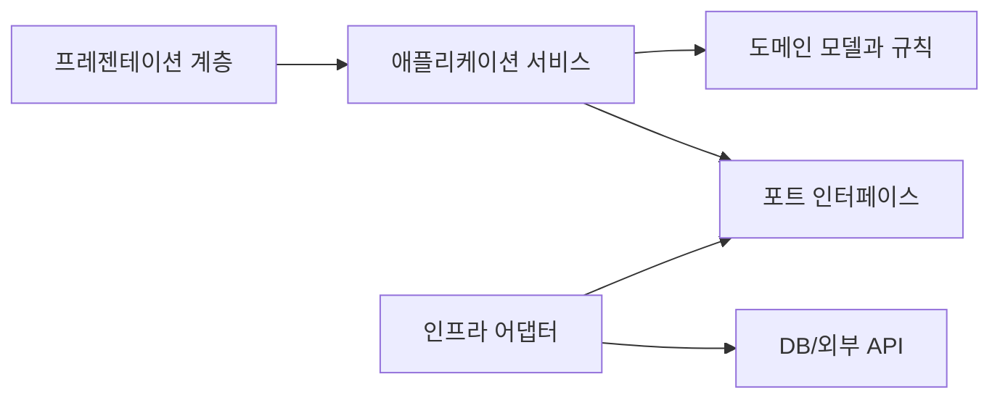

# Software Design 101 (7/10): 데이터 흐름 설계

같은 요청 객체를 여러 함수가 돌려 가며 수정하는 코드는 디버깅이 어렵습니다. 어디에서 이메일 값이 바뀌었는지, 어느 단계에서 유효성 검사가 통과됐는지, 왜 마지막 응답이 예상과 달라졌는지 한 번에 추적하기 힘들기 때문입니다.

여기서는 데이터 흐름을 설계한다는 말이 무엇인지, 입력에서 출력까지 한 방향 흐름을 어떻게 만들지, 작은 변환 함수의 파이프라인은 왜 유리한지, 불변 데이터와 부수효과 분리가 구조를 어떻게 단순하게 만드는지 살펴봅니다.


*Software Design 101 7장 흐름 개요*

## 먼저 던지는 질문

- 데이터 흐름을 설계한다는 말은 구체적으로 무엇일까요?
- 입력과 출력 사이를 왜 한 방향으로만 흐르게 해야 할까요?
- 변환 단계와 부수효과는 어떻게 나누는 편이 좋을까요?

## 왜 중요한가

많은 버그는 데이터가 예상하지 못한 곳에서 조용히 바뀔 때 생깁니다. 공유된 가변 객체를 여러 단계가 수정하면 누가 상태를 바꿨는지 추적하기가 매우 어렵습니다.

반대로 데이터가 한 방향으로만 흐르고, 각 단계가 입력과 출력이 분명한 작은 변환으로 나뉘어 있으면 문제 범위를 빠르게 줄일 수 있습니다. 디버깅도 “어느 단계에서 값이 틀어졌는가”라는 질문으로 바뀝니다.

## 전체 그림

좋은 흐름은 짧고 분명합니다. 각 단계는 작은 책임만 맡고, 다음 단계로 값을 넘깁니다.

## 기본 용어

- <strong>파이프라인</strong>: 작은 변환 함수들을 순서대로 연결한 구조입니다.
- <strong>순수 함수</strong>: 같은 입력에 같은 출력을 돌려주고, 부수효과가 없는 함수입니다.
- <strong>불변성</strong>: 값이 만들어진 뒤 바뀌지 않는 성질입니다.
- <strong>push 모델</strong>: 생산자가 소비자에게 데이터를 밀어 넣는 방식입니다.
- <strong>pull 모델</strong>: 소비자가 필요한 데이터를 가져오는 방식입니다.

## 변경 전과 변경 후

**변경 전**

```python
def process(req):
    if not req.get("email"): raise ValueError
    req["email"] = req["email"].lower()
    db.save(req)
    send_welcome(req["email"])
    return req
```

**변경 후**

```python
def parse(payload): ...
def validate(user): ...
def normalize(user): ...
def persist(user): ...
def notify(user): ...

def signup(payload):
    return notify(persist(normalize(validate(parse(payload)))))
```

두 번째 구조에서는 각 단계의 책임이 훨씬 분명합니다. 검증이 실패했는지, 정규화가 잘못됐는지, 저장 단계가 문제인지 흐름을 따라가며 바로 좁힐 수 있습니다.

## 흐름을 정리하는 다섯 단계

### 1단계 — 입력과 출력 모양을 적는다

```python
# 1_io.py
# 입력: HTTP에서 온 dict
# 출력: User row id
# 그 사이 과정을 단계별 한 줄씩 스케치하세요.
```

코드보다 먼저 입출력 형태를 적어 두면 변환 단계가 훨씬 선명해집니다. 어떤 값을 받고 어떤 값을 돌려주는지 모호하면 흐름도 쉽게 흐려집니다.

### 2단계 — 단계를 작은 함수로 나눈다

```python
# 2_steps.py
def parse(payload) -> SignupCommand: ...
def validate(cmd: SignupCommand) -> SignupCommand: ...
def to_user(cmd: SignupCommand) -> User: ...
```

각 단계는 입력과 출력이 분명해야 합니다. “무엇을 받아 무엇을 돌려주는가”가 보이면 조합도 쉬워지고 테스트도 단순해집니다.

### 3단계 — 부수효과를 끝으로 민다

```python
# 3_side_effects.py
def signup(payload):
    user = to_user(validate(parse(payload)))   # 순수 처리
    repo.save(user)                            # 부수효과
    mailer.send(user.email)                    # 부수효과
```

검증과 변환은 가능한 한 순수하게 두고, 저장과 발송 같은 IO는 가장자리에서 처리하는 편이 좋습니다. 이 구분이 선명할수록 테스트와 디버깅이 쉬워집니다.

### 4단계 — 불변 데이터를 기본값으로 둔다

```python
# 4_immutable.py
from dataclasses import dataclass
@dataclass(frozen=True)
class User:
    id: str
    email: str
```

값을 제자리에서 고치기보다 새 값을 만들어 반환하면 누가 상태를 바꿨는지 추적하기 쉽습니다. 여러 단계가 같은 객체를 몰래 수정하는 문제도 줄어듭니다.

### 5단계 — 흐름을 한 방향으로 유지한다

```python
# 5_one_way.py
# UI -> command -> domain -> event
# event는 다시 UI로 흐릅니다.
# 중간 흐름에서 조용히 데이터를 바꾸지 않습니다.
```

순환이나 중간 갱신이 많아질수록 디버깅 난도는 올라갑니다. 흐름이 한 방향이면 문제 원인도 단계별로 따라갈 수 있습니다.

## 빠르게 검증해 보기

문제가 자주 나는 요청 하나를 골라, 각 단계가 입력과 출력을 무엇으로 받는지 한 줄씩 적어 보세요. 이 작업만으로도 중간에 값이 어디서 몰래 바뀌는지 보이기 시작합니다.

```text
payload(dict) -> SignupCommand -> User -> saved User -> notification event
```

**Expected output:** 단계마다 데이터 모양이 드러나고, 어느 단계가 순수 변환인지 어느 단계가 부수효과인지 분리해서 설명할 수 있어야 합니다.

가능하면 각 단계 전후 값을 로그 한 줄로 남긴다고 가정해 보세요. 한 방향 흐름은 그 로그를 읽는 순서까지 단순하게 만듭니다.

## 실패 신호와 먼저 볼 것

| 실패 신호 | 먼저 볼 것 |
| --- | --- |
| 같은 dict를 여러 함수가 계속 수정한다 | 불변 데이터나 새 객체 반환으로 바꿀 수 있는지 봅니다 |
| 검증 중간에 DB 호출이 들어간다 | 순수 변환과 부수효과 경계를 다시 나눕니다 |
| 디버깅할 때 값이 어디서 바뀌었는지 모르겠다 | 단계별 입력/출력 타입을 먼저 적어 봅니다 |

흐름이 선명해지면 버그를 잡을 때도 “모든 코드를 본다”가 아니라 “어느 단계에서 값이 틀어졌는가”라는 질문으로 바로 들어갈 수 있습니다.

## 이 코드에서 먼저 볼 점

- 단계마다 책임이 좁고 선명합니다.
- 부수효과는 한쪽 가장자리로 몰립니다.
- 데이터가 중간에 되돌아가거나 몰래 수정되지 않습니다.

## 어디서 많이 헷갈릴까

함수를 잘게 나누기만 하면 데이터 흐름 설계가 된다고 생각하기 쉽습니다. 하지만 각 함수가 공유 객체를 계속 수정한다면 흐름은 여전히 탁합니다. 분해보다 더 중요한 것은 값이 어떻게 이동하고 언제 바뀌는지입니다.

또 하나 흔한 문제는 중간 단계에서 바로 데이터베이스나 외부 API를 호출하는 습관입니다. 검증과 변환 중간에 IO가 끼어들면 흐름이 진흙처럼 섞입니다. 어떤 단계가 순수한 변환인지, 어떤 단계가 부수효과인지 경계가 흐려지기 때문입니다.

## 실무에서는 이렇게 본다

ETL 파이프라인, 요청 처리 흐름, React의 단방향 상태 흐름처럼 데이터 흐름 설계는 여러 곳에 반복해서 등장합니다. 한 방향 흐름이 익숙한 팀은 장애가 나도 “값이 어디서 바뀌었나”를 빠르게 좁힙니다.

코드 리뷰에서는 입력과 출력 타입이 분명한가, 중간 단계가 공유 상태를 수정하는가, 부수효과가 끝에 몰려 있는가를 먼저 보는 편이 좋습니다. 이 질문만으로도 구조의 대부분이 드러납니다.

## 체크리스트

- [ ] 데이터가 한 방향으로 흐르는가?
- [ ] 부수효과가 가장자리에 모여 있는가?
- [ ] 각 단계가 작은 책임만 맡는가?
- [ ] 가능한 곳에서는 불변 데이터를 쓰는가?
- [ ] 타입이나 구조로 데이터 모양이 보장되는가?

## 연습 문제

1. 현재 함수 하나를 골라 순수 변환과 부수효과를 나눠 보세요.
2. dict 기반 입력 하나를 dataclass 기반 구조로 바꿔 보세요.
3. 데이터가 거꾸로 흐르거나 중간에서 갱신되는 지점을 하나 찾아 개선 방향을 적어 보세요.

## 현업 적용 관점에서 다시 정리

데이터 흐름 설계는 디버깅 비용을 줄이는 가장 직접적인 방법입니다. 입력과 출력의 형태를 단계별로 고정해 두면 추적 가능성이 크게 좋아집니다.

## 의존 관계를 수치로 읽는 실전 점검

설계 품질을 문장으로만 평가하면 팀마다 기준이 달라집니다. 그래서 실무에서는 결합도 지표를 함께 봅니다. 가장 단순한 시작점은 모듈 단위 `Ca(유입 의존성)`, `Ce(유출 의존성)`, `I=Ce/(Ca+Ce)` 입니다. 값이 정답을 보장하지는 않지만, 경계가 틀어진 지점을 빠르게 찾는 데 매우 유용합니다.

```python
from dataclasses import dataclass

@dataclass(frozen=True)
class CouplingMetric:
    module: str
    ca: int  # 외부 모듈이 이 모듈에 의존하는 수
    ce: int  # 이 모듈이 외부 모듈에 의존하는 수

    @property
    def instability(self) -> float:
        total = self.ca + self.ce
        return 0.0 if total == 0 else self.ce / total

def report(metrics: list[CouplingMetric]) -> None:
    for m in metrics:
        print(f"{m.module:12} Ca={m.ca:2d} Ce={m.ce:2d} I={m.instability:.2f}")

report(
    [
        CouplingMetric("domain", ca=6, ce=1),
        CouplingMetric("application", ca=4, ce=4),
        CouplingMetric("infrastructure", ca=1, ce=7),
    ]
)
```

도메인 모듈의 `I` 값이 0에 가깝고 인프라 모듈의 `I` 값이 1에 가깝다면 방향이 대체로 건강합니다. 반대로 도메인의 `Ce`가 늘어나면 의존성 방향이 뒤집히고 있다는 신호입니다. 이때는 코드 리뷰에서 "왜 import가 생겼는가"를 먼저 질문해야 합니다.

## 모듈 의존 그래프를 먼저 그린 뒤 코드로 옮기기

설계 회의에서 말로만 합의하면 구현 단계에서 금방 흔들립니다. 아래처럼 다이어그램을 먼저 합의하고, 그 다음 import 규칙과 테스트를 붙여 두면 경계를 유지하기 쉽습니다.



이 그림의 핵심은 화살표 개수가 아니라 방향입니다. 도메인은 외부 기술을 모른 채 규칙만 유지하고, 어댑터가 세부 구현을 담당합니다. 이렇게 분리해 두면 기능 요구가 변해도 도메인 코드의 파손 범위가 작아집니다.

## 추상 클래스와 인터페이스를 경계에 배치하기

포트-어댑터 구조를 도입할 때 가장 흔한 실수는 추상화를 인프라 패키지 안에 두는 것입니다. 추상화는 반드시 도메인 또는 애플리케이션 쪽 경계에 둬야 의존성 역전이 성립합니다.

```python
from __future__ import annotations

from abc import ABC, abstractmethod
from dataclasses import dataclass

@dataclass(frozen=True)
class PaymentCommand:
    order_id: str
    user_id: str
    amount: int

class PaymentGateway(ABC):
    @abstractmethod
    def charge(self, command: PaymentCommand) -> str:
        raise NotImplementedError

class FakePaymentGateway(PaymentGateway):
    def charge(self, command: PaymentCommand) -> str:
        return f"paid:{command.order_id}"
```

호출자는 `PaymentGateway`만 의존하고, 실제 결제 제공자 교체는 구현 클래스에서 흡수합니다. 이 방식은 테스트에도 유리합니다. 단위 테스트는 `FakePaymentGateway`를 사용해 비즈니스 규칙만 검증하고, 통합 테스트에서만 실제 I/O를 붙이면 됩니다.

## 리팩터링 전후를 나란히 비교하기

좋은 설계 글은 "좋다"고 말하는 대신 전후 차이를 보여 줘야 합니다. 아래는 책임이 섞인 코드와 책임을 분리한 코드의 대비입니다.

```python
# before.py

def place_order(request: dict) -> dict:
    # HTTP 입력 파싱, 규칙 검증, 결제 호출, 저장, 응답 구성까지 한 함수에 섞임
    user_id = request["user_id"]
    amount = int(request["amount"])
    if amount <= 0:
        return {"status": 400, "message": "invalid amount"}

    payment_id = charge_with_vendor_api(user_id, amount)
    save_order_row(user_id=user_id, amount=amount, payment_id=payment_id)
    return {"status": 200, "payment_id": payment_id}
```

```python
# after.py

def place_order_controller(request: dict, service: "PlaceOrderService") -> dict:
    command = PlaceOrderCommand.from_http(request)
    result = service.execute(command)
    return result.to_http()

class PlaceOrderService:
    def __init__(self, gateway: PaymentGateway, repo: OrderRepository) -> None:
        self.gateway = gateway
        self.repo = repo

    def execute(self, command: "PlaceOrderCommand") -> "PlaceOrderResult":
        command.validate()
        payment_id = self.gateway.charge(command.to_payment_command())
        self.repo.save(command.to_order(payment_id))
        return PlaceOrderResult.success(payment_id)
```

전후를 비교하면 무엇이 바뀌었는지 즉시 보입니다. 컨트롤러는 입력/출력 변환만 담당하고, 서비스는 유스케이스 규칙만 담당하며, 외부 연동은 포트 뒤로 이동합니다. 구조가 이렇게 바뀌면 장애 분석과 테스트 설계가 훨씬 단순해집니다.

## 계층별 체크포인트와 운영 연결

설계는 개발 단계에서 끝나지 않습니다. 운영 지표와 연결되어야 품질 개선이 누적됩니다.

- 프레젠테이션 계층: 요청 검증 실패율, 4xx 응답 분포
- 애플리케이션 계층: 유스케이스별 처리 시간, 재시도 횟수
- 도메인 계층: 규칙 위반 빈도, 불변식 실패 로그
- 인프라 계층: 외부 API 오류율, DB 지연 시간

지표를 계층별로 분리해 보면 어디를 고쳐야 하는지가 명확해집니다. 모든 지표가 한 대시보드에서 섞여 있으면 "느리다"는 사실만 보이고 원인은 보이지 않습니다. 설계 경계를 운영 지표 경계와 맞추면 개선 사이클이 빠르게 돌아갑니다.

## 리뷰와 리팩터링을 위한 실전 질문 세트

설계는 한 번 작성하고 끝나는 산출물이 아니라, 변경 요청이 들어올 때마다 점검하는 운영 습관입니다. 아래 질문은 코드 리뷰와 리팩터링 계획에서 바로 사용할 수 있는 최소 점검 세트입니다.

1. 이번 변경은 어느 계층의 책임인가요?
2. 새 의존성이 도메인 중심 방향을 깨뜨리나요?
3. 인터페이스 이름이 구현 세부를 누설하나요?
4. 테스트 더블 없이 규칙 검증이 가능한가요?
5. 다음 변경이 들어와도 같은 위치를 수정하게 되나요?

이 다섯 질문은 단순하지만 강력합니다. 특히 "다음 변경도 같은 위치를 건드리게 되는가"라는 질문은 설계의 탄력성을 빠르게 드러냅니다. 지금 요구사항을 통과하는 코드와 다음 요구사항까지 받아내는 코드는 여기서 갈립니다.

## 계층 아키텍처 예시를 한 단계 더 구체화하기

아래 예시는 요청-유스케이스-도메인-어댑터 경계를 코드로 고정하는 방법을 보여 줍니다.

```python
from dataclasses import dataclass
from typing import Protocol

@dataclass(frozen=True)
class CreateCouponCommand:
    code: str
    discount_percent: int

class CouponRepository(Protocol):
    def exists(self, code: str) -> bool: ...
    def save(self, code: str, discount_percent: int) -> None: ...

class CreateCouponService:
    def __init__(self, repo: CouponRepository) -> None:
        self.repo = repo

    def execute(self, command: CreateCouponCommand) -> None:
        if not (1 <= command.discount_percent <= 90):
            raise ValueError("할인율은 1~90 범위여야 합니다.")
        if self.repo.exists(command.code):
            raise ValueError("이미 존재하는 쿠폰 코드입니다.")
        self.repo.save(command.code, command.discount_percent)
```

핵심은 서비스가 저장소의 구체 구현을 모른다는 점입니다. SQLAlchemy를 쓰든, 파일 저장을 쓰든, 외부 API를 쓰든 서비스 규칙은 바뀌지 않습니다. 그래서 정책 변경과 기술 변경이 서로 다른 속도로 진화할 수 있습니다.

## 설계 부채를 남기지 않는 배포 순서

설계를 개선할 때 기능 배포와 구조 개선을 한 커밋에 묶으면 위험이 커집니다. 다음 순서를 지키면 안전하게 개선할 수 있습니다.

- 1단계: 새 경계와 인터페이스를 추가합니다. 기존 경로는 유지합니다.
- 2단계: 호출자를 새 경계로 점진 이행합니다. 로그로 구경로 사용량을 기록합니다.
- 3단계: 구경로 트래픽이 0에 가까워지면 제거합니다.
- 4단계: 제거 이후 메트릭과 에러율을 비교해 회귀를 확인합니다.

이 순서는 확장-이행-수축 전략과 같습니다. 설계는 깔끔해지고, 사용자 영향은 최소화됩니다. 특히 여러 팀이 동시에 작업하는 환경에서는 이 순서를 문서화해 공통 작업 규칙으로 삼는 것이 효과적입니다.

## 정리

데이터 흐름 설계는 값이 어디서 와서 어디로 가며, 중간에 어떤 변환을 거치는지 한 방향으로 드러내는 일입니다. 이 흐름이 선명할수록 디버깅, 테스트, 변경 모두 쉬워집니다.

다음 글에서는 이렇게 정리한 흐름 위에서 변경의 파급 범위를 더 줄이는 방법, 변경 영향 줄이기를 다룹니다.

## 처음 질문으로 돌아가기

- **데이터 흐름을 설계한다는 말은 구체적으로 무엇일까요?**
  - 데이터 흐름을 설계한다는 말은 `payload(dict) -> SignupCommand -> User -> saved User -> notification event`처럼 입력부터 출력까지 데이터 모양과 변환 단계를 명시하는 일입니다. `parse`, `validate`, `normalize`, `persist`, `notify`처럼 각 단계의 입출력을 분명하게 만드는 것이 핵심입니다.
- **입력과 출력 사이를 왜 한 방향으로만 흐르게 해야 할까요?**
  - 같은 `req` dict를 여러 함수가 돌려 가며 수정하면 어디서 값이 틀어졌는지 추적하기 어렵지만, 한 방향 파이프라인은 문제 단계를 바로 좁힐 수 있습니다. UI에서 command로, 도메인으로, 이벤트로 이어지는 흐름을 유지해야 디버깅과 로그 해석도 단순해집니다.
- **변환 단계와 부수효과는 어떻게 나누는 편이 좋을까요?**
  - `to_user(validate(parse(payload)))` 같은 순수 변환은 안쪽에 두고, `repo.save(user)`와 `mailer.send(user.email)` 같은 저장·발송은 가장자리로 미루는 편이 좋습니다. 여기에 `@dataclass(frozen=True)` 같은 불변 데이터를 쓰면 중간 단계의 몰래 수정도 크게 줄일 수 있습니다.

<!-- toc:begin -->
## 시리즈 목차

- [Software Design 101 (1/10): 소프트웨어 설계란 무엇인가?](./01-what-is-software-design.md)
- [Software Design 101 (2/10): 관심사 분리](./02-separation-of-concerns.md)
- [Software Design 101 (3/10): 모듈과 경계](./03-modules-and-boundaries.md)
- [Software Design 101 (4/10): 의존성 방향](./04-dependency-direction.md)
- [Software Design 101 (5/10): 인터페이스와 추상화](./05-interfaces-and-abstraction.md)
- [Software Design 101 (6/10): 계층 아키텍처](./06-layered-architecture.md)
- **데이터 흐름 설계 (현재 글)**
- 변경 영향 줄이기 (예정)
- 설계 원칙 모음 (예정)
- 작은 프로젝트로 설계 연습 (예정)

<!-- toc:end -->

## 참고 자료

- [software-design-101 예제 코드 저장소](https://github.com/yeongseon-books/book-examples/tree/main/software-design-101/ko)

- [Functional Core, Imperative Shell (Gary Bernhardt)](https://www.destroyallsoftware.com/screencasts/catalog/functional-core-imperative-shell)
- [Out of the Tar Pit (Moseley & Marks)](https://curtclifton.net/papers/MoseleyMarks06a.pdf)
- [Flux Architecture — Unidirectional Data Flow](https://facebookarchive.github.io/flux/)
- [Designing Data-Intensive Applications — Batch and Stream](https://dataintensive.net/)

### 실전 확인용 문서

- [dataclasses — Data Classes](https://docs.python.org/3/library/dataclasses.html)
- [typing.NamedTuple](https://docs.python.org/3/library/typing.html#typing.NamedTuple)

Tags: Computer Science, SoftwareDesign, DataFlow, Pipelines, Immutability, FunctionalDesign
