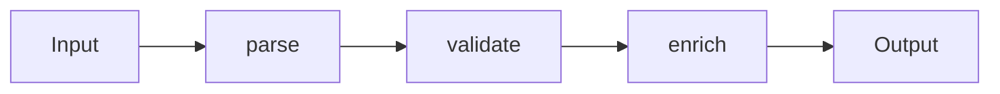

# 데이터 흐름 설계

> Software Design 101 시리즈 (7/10)


## 이 글에서 다룰 문제

대부분의 버그는 데이터가 예상치 않은 방향에서 갑자기 변할 때 생깁니다. 흐름이 한 방향이면 추적이 쉽고, 변경의 영향이 좁아집니다.

> 좋은 코드는 입력과 출력 사이의 거리가 짧다.

## 개념 한눈에 보기



각 단계는 작고, 다음 단계로 넘기기만 한다.

## Before/After

**Before**

```python
def process(req):
    if not req.get("email"): raise ValueError
    req["email"] = req["email"].lower()
    db.save(req)
    send_welcome(req["email"])
    return req
```

**After**

```python
def parse(payload): ...
def validate(user): ...
def normalize(user): ...
def persist(user): ...
def notify(user): ...

def signup(payload):
    return notify(persist(normalize(validate(parse(payload)))))
```

각 단계의 책임이 분명합니다.

## 실습: 흐름을 정리하는 5단계

### 1단계 — 입출력 모양 적기

```python
# 1_io.py
# In: dict from HTTP
# Out: User row id
# 그 사이에 무엇이 일어나는지 한 줄씩 적기.
```

타입과 모양을 먼저 정합니다.

### 2단계 — 단계 함수 분리

```python
# 2_steps.py
def parse(payload) -> SignupCommand: ...
def validate(cmd: SignupCommand) -> SignupCommand: ...
def to_user(cmd: SignupCommand) -> User: ...
```

각 단계는 "무엇을 받고 무엇을 돌려주는지"가 명확.

### 3단계 — 부수효과 끝으로 미루기

```python
# 3_side_effects.py
def signup(payload):
    user = to_user(validate(parse(payload)))   # pure
    repo.save(user)                            # effect
    mailer.send(user.email)                    # effect
```

검증과 변환은 순수, IO는 마지막.

### 4단계 — 불변 데이터 사용

```python
# 4_immutable.py
from dataclasses import dataclass
@dataclass(frozen=True)
class User:
    id: str
    email: str
```

상태 변경 대신 새 값을 반환.

### 5단계 — 한 방향으로만

```python
# 5_one_way.py
# UI -> command -> domain -> event
# event가 다시 UI로 되돌아온다.
# 중간에서 임의로 데이터를 갱신하지 않는다.
```

순환을 끊으면 디버깅이 쉬워집니다.

## 이 코드에서 주목할 점

- 단계마다 책임이 좁습니다.
- 부수효과가 한쪽에 모여 있습니다.
- 데이터가 거꾸로 흐르지 않습니다.

## 자주 하는 실수 5가지

1. **부수효과를 변환 함수 안에 섞음.** 테스트가 어려워진다.
2. **공유된 가변 객체를 여러 단계가 수정.** 어느 단계가 바꿨는지 모름.
3. **중간 단계에서 IO 호출.** 흐름이 진흙탕.
4. **타입 없는 dict로만 흐름 구성.** 모양이 매 호출마다 다름.
5. **양방향 데이터 바인딩 남용.** 원인 추적 불가.

## 실무에서는 이렇게 쓰입니다

ETL, 요청 처리 파이프라인, React 같은 단방향 UI 흐름까지 — 데이터 흐름 설계가 깔린 곳은 매우 많습니다.

## 체크리스트

- [ ] 데이터가 한 방향으로 흐르는가?
- [ ] 부수효과가 가장자리에 있는가?
- [ ] 단계가 작고 책임이 분명한가?
- [ ] 데이터가 불변인가?
- [ ] 타입으로 모양이 보장되는가?

## 정리 및 다음 단계

흐름이 보이면 변경이 두렵지 않습니다. 다음 글에서는 그 변경의 폭을 줄이는 설계 — 변경 영향 줄이기 — 를 봅니다.

<!-- toc:begin -->
- [소프트웨어 설계란 무엇인가?](./01-what-is-software-design.md)
- [관심사 분리](./02-separation-of-concerns.md)
- [모듈과 경계](./03-modules-and-boundaries.md)
- [의존성 방향](./04-dependency-direction.md)
- [인터페이스와 추상화](./05-interfaces-and-abstraction.md)
- [계층 아키텍처](./06-layered-architecture.md)
- **데이터 흐름 설계 (현재 글)**
- 변경 영향 줄이기 (예정)
- 설계 원칙 모음 (예정)
- 작은 프로젝트로 설계 연습 (예정)
<!-- toc:end -->

## 참고 자료

- [Functional Core, Imperative Shell (Gary Bernhardt)](https://www.destroyallsoftware.com/screencasts/catalog/functional-core-imperative-shell)
- [Out of the Tar Pit (Moseley & Marks)](https://curtclifton.net/papers/MoseleyMarks06a.pdf)
- [Flux Architecture — Unidirectional Data Flow](https://facebookarchive.github.io/flux/)
- [Designing Data-Intensive Applications — Batch and Stream](https://dataintensive.net/)

Tags: Computer Science, SoftwareDesign, DataFlow, Pipelines, Immutability, FunctionalDesign
