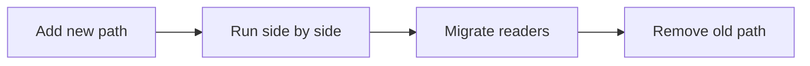

# 변경 영향 줄이기

카테고리 하나를 더 추가하려고 기존 가격 계산 함수에 `if-elif`를 계속 덧붙이다 보면 언젠가 작은 수정 하나가 전체 시스템을 긴장시키는 시점이 옵니다. 변경이 필요한 것은 한 줄인데, 검증 범위와 배포 불안은 그보다 훨씬 커집니다.

이 글은 Software Design 101 시리즈의 8번째 글입니다.

여기서는 변경의 폭발 반경을 어떻게 줄일지, OCP를 실무에서 어떻게 해석해야 할지, expand-contract 패턴과 feature flag를 어떻게 조합할지, 운영 중인 시스템에서 새 경로와 옛 경로를 병행하는 감각은 무엇인지 설명합니다.

## 이 글에서 다룰 문제

- 한 번의 변경이 얼마나 넓게 퍼지는지 어떻게 가늠할까요?
- OCP는 실제 코드에서 어떤 모습으로 나타날까요?
- 새 경로를 추가할 때 왜 기존 경로를 바로 지우지 않을까요?
- 기능 플래그는 배포와 활성화를 어떻게 분리할까요?
- expand-contract를 모든 변경에 쓰지 말아야 하는 이유는 무엇일까요?

> 좋은 설계는 변경을 막지 않습니다. 대신 변경의 파급 범위를 좁힙니다.

## 왜 중요한가

대부분의 시스템은 처음부터 완벽하지 않습니다. 실제로는 계속 바뀌면서 좋아집니다. 그래서 중요한 것은 “변경이 필요한가”가 아니라 “변경이 어디까지 흔드는가”입니다.

폭발 반경이 작은 시스템은 더 자주, 더 안전하게 진화할 수 있습니다. 새 기능을 넣더라도 기존 경로를 건드리지 않고 옆에 붙일 수 있고, 운영 중에도 비교 검증을 하면서 천천히 전환할 수 있기 때문입니다.

## 전체 그림



흐름은 보통 확장하고, 나란히 돌려 보고, 점진적으로 갈아탄 뒤, 마지막에 옛 경로를 정리하는 순서로 갑니다. 정리까지 끝나야 변경이 완료됩니다.

## 기본 용어

- <strong>폭발 반경</strong>: 한 번의 변경이 퍼질 수 있는 범위입니다.
- <strong>OCP</strong>: 확장에는 열려 있고 기존 코드 수정에는 닫혀 있는 구조를 지향하는 원칙입니다.
- <strong>expand-contract</strong>: 새 경로와 옛 경로를 함께 운영하며 점진적으로 이주하는 패턴입니다.
- <strong>feature flag</strong>: 코드 배포와 기능 활성화를 분리하는 스위치입니다.
- <strong>strangler fig</strong>: 레거시 바깥을 감싼 뒤 점진적으로 대체해 가는 전환 방식입니다.

## 변경 전과 변경 후

**변경 전**

```python
def price(item, kind):
    if kind == "book": return item.cost * 0.9
    elif kind == "food": return item.cost * 0.95
    elif kind == "lux": return item.cost * 1.1
    # adding a new category = editing this function
```

**변경 후**

```python
class PricingRule:
    def apply(self, item) -> float: ...

PRICING: dict[str, PricingRule] = {}

def price(item, kind):
    return PRICING[kind].apply(item)
```

두 번째 구조에서는 새 카테고리를 추가할 때 기존 분기문을 직접 수정하지 않아도 됩니다. 확장을 데이터 등록으로 표현하므로 파급 범위를 줄이기 쉽습니다.

## 변경 영향을 줄이는 다섯 단계

### 1단계 — 폭발 반경을 먼저 잰다

```bash
# 1_blast.sh
git grep -n "kind ==" | wc -l
# Has one variable's comparison spread across the system?
```

현재 구조에서 같은 분기가 몇 군데로 퍼져 있는지부터 봐야 합니다. 어디까지 번져 있는지 모르면 줄일 수도 없습니다.

### 2단계 — 새 경로를 옆에 확장한다

```python
# 2_expand.py
# Add the new path only; leave the old one intact.
def price_v2(item, kind): ...
```

새 구현을 추가할 때 기존 경로를 바로 뜯어고치지 않는 편이 좋습니다. 운영 중인 시스템이라면 특히 비교 기준을 남겨 둬야 합니다.

### 3단계 — 기능 플래그로 점진 전환한다

```python
# 3_migrate.py
def price(item, kind):
    if FF.use_v2: return price_v2(item, kind)
    return price_v1(item, kind)
```

배포와 활성화를 분리하면 새 코드를 미리 올려 두고도 천천히 사용자 일부부터 전환할 수 있습니다. 변경을 작은 단계로 나누는 효과가 있습니다.

### 4단계 — 병렬 비교로 검증한다

```python
# 4_compare.py
def price(item, kind):
    a, b = price_v1(item, kind), price_v2(item, kind)
    if a != b: log.warn("price drift", a, b)
    return a if not FF.use_v2 else b
```

옛 경로와 새 경로를 나란히 돌려 보면 잠복 회귀를 빨리 잡을 수 있습니다. 운영 중인 데이터를 기준으로 비교할 수 있다는 점이 큽니다.

### 5단계 — 마지막에 수축하고 정리한다

```python
# 5_contract.py
# Once everyone is on v2, remove v1 and the flag.
```

새 경로가 안정화되면 옛 코드와 플래그를 지워야 합니다. 정리를 미루면 운영 부채가 쌓입니다.

## 이 코드에서 먼저 볼 점

- 새 경로가 기존 경로를 바로 덮어쓰지 않습니다.
- 변경이 분기 증가보다 데이터와 설정으로 표현됩니다.
- 비교 검증이 구조 안에 자연스럽게 들어옵니다.

## 어디서 많이 헷갈릴까

개방 폐쇄 원칙을 “기존 코드는 절대 수정하면 안 된다”로 받아들이면 곤란합니다. 실제 의미는 새 기능 추가가 기존 구조 전체를 흔들지 않도록 설계하자는 쪽에 가깝습니다. 작은 버그 수정까지 모두 거대한 확장 패턴으로 처리할 필요는 없습니다.

또 하나 큰 함정은 expand만 하고 contract를 하지 않는 일입니다. 플래그와 구버전 코드가 계속 남아 있으면 한때 안전장치였던 것이 나중에는 운영 부담이 됩니다. 변경의 마지막 단계는 청소까지 포함합니다.

## 실무에서는 이렇게 본다

스키마 마이그레이션, API 버전 교체, 가격 계산 로직 개편, 외부 SaaS 전환처럼 운영 중 시스템을 바꾸는 작업에서 이 패턴은 특히 강합니다. 새 경로와 옛 경로를 함께 두고 관측하면서 옮길 수 있기 때문입니다.

강한 팀은 기능 플래그에도 만료일을 둡니다. 영구 플래그는 보통 숨은 부채입니다. 변경을 끝냈다면 안전하게 제거하는 계획까지 포함해야 합니다.

## 체크리스트

- [ ] 변경의 폭발 반경을 먼저 가늠했는가?
- [ ] 새 경로를 옛 경로 옆에 둘 수 있는가?
- [ ] 병렬 비교나 회귀 검증 수단이 있는가?
- [ ] 기능 플래그에 만료일이 있는가?
- [ ] 전환 뒤 옛 코드 정리 계획까지 세웠는가?

## 연습 문제

1. 현재 코드에서 분기가 가장 많은 함수를 골라 데이터 기반 분배로 바꿔 보세요.
2. API 하나를 v2로 옮기는 expand-contract 계획을 적어 보세요.
3. 만료일이 없는 기능 플래그 목록을 만들고 정리 우선순위를 매겨 보세요.

## 정리

좋은 설계는 변경 자체를 두려워하지 않게 만듭니다. 새 경로를 확장하고, 나란히 검증하고, 점진적으로 전환한 뒤, 마지막에 정리하는 흐름을 익히면 운영 중인 시스템도 훨씬 차분하게 바꿀 수 있습니다.

다음 글에서는 이런 판단을 압축해 설명하는 공통 언어, 설계 원칙 모음을 다룹니다.

<!-- toc:begin -->
- [소프트웨어 설계란 무엇인가?](./01-what-is-software-design.md)
- [관심사 분리](./02-separation-of-concerns.md)
- [모듈과 경계](./03-modules-and-boundaries.md)
- [의존성 방향](./04-dependency-direction.md)
- [인터페이스와 추상화](./05-interfaces-and-abstraction.md)
- [계층 아키텍처](./06-layered-architecture.md)
- [데이터 흐름 설계](./07-data-flow-design.md)
- **변경 영향 줄이기 (현재 글)**
- 설계 원칙 모음 (예정)
- 작은 프로젝트로 설계 연습 (예정)
<!-- toc:end -->

## 참고 자료

- [Open/Closed Principle (Robert C. Martin)](https://web.archive.org/web/20060822033314/http://www.objectmentor.com/resources/articles/ocp.pdf)
- [ParallelChange (Expand-Contract) — Danilo Sato](https://martinfowler.com/bliki/ParallelChange.html)
- [Feature Toggles — Pete Hodgson](https://martinfowler.com/articles/feature-toggles.html)
- [Strangler Fig Application — Martin Fowler](https://martinfowler.com/bliki/StranglerFigApplication.html)

Tags: Computer Science, SoftwareDesign, ChangeImpact, OpenClosed, FeatureFlags, Refactoring
