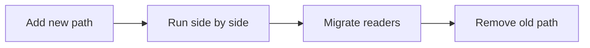

# 변경 영향 줄이기

> Software Design 101 시리즈 (8/10)


## 이 글에서 다룰 문제

대부분의 시스템은 처음부터 잘 만들어지지 않습니다. 잘 *바뀌게* 만들어집니다. 변경 영향이 작을수록 자주, 안전하게 진화할 수 있습니다.

> 변경에 강한 코드가 좋은 코드다.

## 전체 흐름


확장하고 → 갈아타고 → 수축한다.

## Before/After

**Before**

```python
def price(item, kind):
    if kind == "book": return item.cost * 0.9
    elif kind == "food": return item.cost * 0.95
    elif kind == "lux": return item.cost * 1.1
    # 새 카테고리 추가 = 이 함수 수정
```

**After**

```python
class PricingRule:
    def apply(self, item) -> float: ...

PRICING: dict[str, PricingRule] = {}

def price(item, kind):
    return PRICING[kind].apply(item)
```

새 카테고리는 PRICING에 등록만 하면 됩니다.

## 변경 영향을 줄이는 5단계

### 1단계 — 폭발 반경 측정

```bash
# 1_blast.sh
git grep -n "kind ==" | wc -l
# 한 변수의 비교가 시스템 전체에 흩어졌나?
```

먼저 현재 반경을 본다.

### 2단계 — 확장 (Expand)

```python
# 2_expand.py
# 신 경로를 추가만 한다, 옛 경로는 그대로.
def price_v2(item, kind): ...
```

옛 사용자는 영향을 받지 않습니다.

### 3단계 — 점진 이주 (Migrate)

```python
# 3_migrate.py
def price(item, kind):
    if FF.use_v2: return price_v2(item, kind)
    return price_v1(item, kind)
```

기능 플래그로 사용자별 단계 전환.

### 4단계 — 검증 (Compare)

```python
# 4_compare.py
def price(item, kind):
    a, b = price_v1(item, kind), price_v2(item, kind)
    if a != b: log.warn("price drift", a, b)
    return a if not FF.use_v2 else b
```

병렬 비교로 회귀 검증.

### 5단계 — 수축 (Contract)

```python
# 5_contract.py
# 모든 사용자가 v2로 옮긴 뒤 v1과 플래그를 제거한다.
```

마무리는 청소까지.

## 이 코드에서 주목할 점

- 새 경로 추가가 옛 경로를 건드리지 않습니다.
- 변경이 데이터(설정/플래그)로 표현됩니다.
- 회귀 검증이 자연스럽게 따라옵니다.

## 자주 하는 실수 5가지

1. **수정해서 끼워 넣기.** 분기가 무한 증식.
2. **확장만 하고 수축 안 함.** 죽은 코드와 플래그가 누적.
3. **플래그를 영원히 둠.** 운영 부담.
4. **검증 없이 갈아탐.** 잠복 회귀.
5. **모든 변경에 expand-contract 강요.** 한 줄 수정엔 과하다.

## 실무에서는 이렇게 쓰입니다

스키마 마이그레이션, API v1→v2 교체, 가격/할인 로직 개편, 외부 SaaS 교체 — 운영 중인 시스템을 안전하게 바꾸는 실전 도구입니다.

## 체크리스트

- [ ] 변경의 폭발 반경을 가늠했는가?
- [ ] 새 경로를 옛 경로 옆에 둘 수 있는가?
- [ ] 회귀 검증 수단이 있는가?
- [ ] 플래그에 만료일이 있는가?
- [ ] 마이그레이션 후 청소가 계획돼 있는가?

## 정리 및 다음 단계

좋은 설계는 변경을 두렵지 않게 만듭니다. 다음 글에서는 이런 생각을 압축한 — 설계 원칙 모음 — 을 봅니다.

<!-- toc:begin -->
- [소프트웨어 설계란 무엇인가?](./01-what-is-software-design.md)
- [관심사 분리](./02-separation-of-concerns.md)
- [모듈과 경계](./03-modules-and-boundaries.md)
- [의존성 방향](./04-dependency-direction.md)
- [인터페이스와 추상화](./05-interfaces-and-abstraction.md)
- [계층 아키텍처](./06-layered-architecture.md)
- [데이터 흐름 설계](./07-data-flow-design.md)
- **변경 영향 줄이기 (현재 글)**
- 설계 원칙 모음 (예정)
- 작은 프로젝트로 설계 연습 (예정)
<!-- toc:end -->

## 참고 자료

- [Open/Closed Principle (Robert C. Martin)](https://web.archive.org/web/20060822033314/http://www.objectmentor.com/resources/articles/ocp.pdf)
- [ParallelChange (Expand-Contract) — Danilo Sato](https://martinfowler.com/bliki/ParallelChange.html)
- [Feature Toggles — Pete Hodgson](https://martinfowler.com/articles/feature-toggles.html)
- [Strangler Fig Application — Martin Fowler](https://martinfowler.com/bliki/StranglerFigApplication.html)

Tags: Computer Science, SoftwareDesign, ChangeImpact, OpenClosed, FeatureFlags, Refactoring
