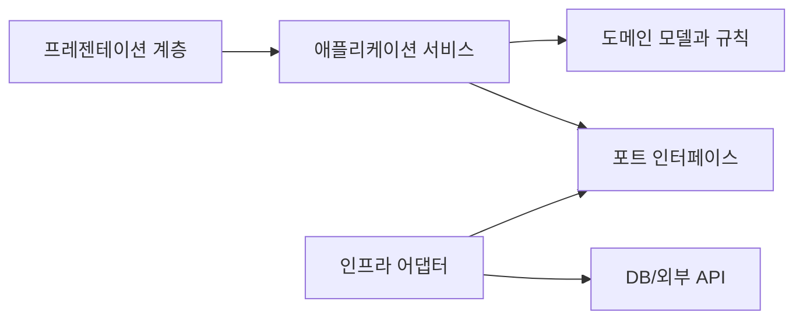

# Software Design 101 (8/10): 변경 영향 줄이기

카테고리 하나를 더 추가하려고 기존 가격 계산 함수에 `if-elif`를 계속 덧붙이다 보면 언젠가 작은 수정 하나가 전체 시스템을 긴장시키는 시점이 옵니다. 변경이 필요한 것은 한 줄인데, 검증 범위와 배포 불안은 그보다 훨씬 커집니다.

이 글은 Software Design 101 시리즈의 8번째 글입니다.

여기서는 변경의 폭발 반경을 어떻게 줄일지, OCP를 실무에서 어떻게 해석해야 할지, expand-contract 패턴과 feature flag를 어떻게 조합할지, 운영 중인 시스템에서 새 경로와 옛 경로를 병행하는 감각은 무엇인지 설명합니다.


*Software Design 101 8장 흐름 개요*

> 좋은 설계는 변경을 없애는 것이 아니라 변경의 폭발 반경을 작게 만드는 일입니다 — 새 카테고리 하나에 `if-elif`를 덧붙이는 대신 확장 지점을 미리 열어 두고, expand-contract로 옛 경로와 새 경로를 잠시 병행시키는 감각이 운영 중 변경을 가능하게 합니다.

## 먼저 던지는 질문

- 한 번의 변경이 얼마나 넓게 퍼지는지 어떻게 가늠할까요?
- OCP는 실제 코드에서 어떤 모습으로 나타날까요?
- 새 경로를 추가할 때 왜 기존 경로를 바로 지우지 않을까요?

## 왜 중요한가

대부분의 시스템은 처음부터 완벽하지 않습니다. 실제로는 계속 바뀌면서 좋아집니다. 그래서 중요한 것은 “변경이 필요한가”가 아니라 “변경이 어디까지 흔드는가”입니다.

폭발 반경이 작은 시스템은 더 자주, 더 안전하게 진화할 수 있습니다. 새 기능을 넣더라도 기존 경로를 건드리지 않고 옆에 붙일 수 있고, 운영 중에도 비교 검증을 하면서 천천히 전환할 수 있기 때문입니다.

## 전체 그림

흐름은 보통 확장하고, 나란히 돌려 보고, 점진적으로 갈아탄 뒤, 마지막에 옛 경로를 정리하는 순서로 갑니다. 정리까지 끝나야 변경이 완료됩니다.

## 기본 용어

- <strong>폭발 반경</strong>: 한 번의 변경이 퍼질 수 있는 범위입니다.
- <strong>OCP</strong>: 확장에는 열려 있고 기존 코드 수정에는 닫혀 있는 구조를 지향하는 원칙입니다.
- <strong>expand-contract</strong>: 새 경로와 옛 경로를 함께 운영하며 점진적으로 이주하는 패턴입니다.
- <strong>feature flag</strong>: 코드 배포와 기능 활성화를 분리하는 스위치입니다.
- <strong>strangler fig</strong>: 레거시 바깥을 감싼 뒤 점진적으로 대체해 가는 전환 방식입니다.

## 변경 전과 변경 후

**변경 전**

```python
def price(item, kind):
    if kind == "book": return item.cost * 0.9
    elif kind == "food": return item.cost * 0.95
    elif kind == "lux": return item.cost * 1.1
    # 새 category 추가 = 이 함수 수정
```

**변경 후**

```python
class PricingRule:
    def apply(self, item) -> float: ...

PRICING: dict[str, PricingRule] = {}

def price(item, kind):
    return PRICING[kind].apply(item)
```

두 번째 구조에서는 새 카테고리를 추가할 때 기존 분기문을 직접 수정하지 않아도 됩니다. 확장을 데이터 등록으로 표현하므로 파급 범위를 줄이기 쉽습니다.

## 변경 영향을 줄이는 다섯 단계

### 1단계 — 폭발 반경을 먼저 잰다

```bash
# 1_blast.sh
git grep -n "kind ==" | wc -l
# Has one variable's comparison spread across the system?
```

현재 구조에서 같은 분기가 몇 군데로 퍼져 있는지부터 봐야 합니다. 어디까지 번져 있는지 모르면 줄일 수도 없습니다.

### 2단계 — 새 경로를 옆에 확장한다

```python
# 2_expand.py
# 새 경로만 추가하고 기존 경로는 그대로 둡니다.
def price_v2(item, kind): ...
```

새 구현을 추가할 때 기존 경로를 바로 뜯어고치지 않는 편이 좋습니다. 운영 중인 시스템이라면 특히 비교 기준을 남겨 둬야 합니다.

### 3단계 — 기능 플래그로 점진 전환한다

```python
# 3_migrate.py
def price(item, kind):
    if FF.use_v2: return price_v2(item, kind)
    return price_v1(item, kind)
```

배포와 활성화를 분리하면 새 코드를 미리 올려 두고도 천천히 사용자 일부부터 전환할 수 있습니다. 변경을 작은 단계로 나누는 효과가 있습니다.

### 4단계 — 병렬 비교로 검증한다

```python
# 4_compare.py
def price(item, kind):
    a, b = price_v1(item, kind), price_v2(item, kind)
    if a != b: log.warn("price drift", a, b)
    return a if not FF.use_v2 else b
```

옛 경로와 새 경로를 나란히 돌려 보면 잠복 회귀를 빨리 잡을 수 있습니다. 운영 중인 데이터를 기준으로 비교할 수 있다는 점이 큽니다.

### 5단계 — 마지막에 수축하고 정리한다

```python
# 5_contract.py
# 모두가 v2로 전환되면 v1과 flag를 제거합니다.
```

새 경로가 안정화되면 옛 코드와 플래그를 지워야 합니다. 정리를 미루면 운영 부채가 쌓입니다.

## 빠르게 검증해 보기

운영 중 코드라면 새 경로를 넣기 전에 비교 기준부터 적어 두는 편이 좋습니다. 아래처럼 옛 경로와 새 경로를 어떤 값으로 비교할지 정리해 보세요.

```text
비교 대상: 가격 계산 결과
비교 시점: 요청 처리 직후
허용 오차: 0
전환 기준: 불일치 로그 0건, 회귀 테스트 통과
```

**Expected output:** 새 구현을 켜기 전에 어떤 신호가 안전한 전환 근거가 되는지 문장으로 설명할 수 있습니다.

이 단계가 있으면 기능 플래그는 단순 스위치가 아니라 검증 계획의 일부가 됩니다.

## 실패 신호와 먼저 볼 것

| 실패 신호 | 먼저 볼 것 |
| --- | --- |
| 새 구현을 켠 뒤 결과 차이를 뒤늦게 발견한다 | 병렬 비교 로그가 있었는지 확인합니다 |
| 기능 플래그가 몇 달째 남아 있다 | 만료일과 제거 계획이 있는지 봅니다 |
| 작은 변경에도 expand-contract를 강제한다 | 정말 운영 위험이 큰 변경인지 다시 판단합니다 |

변경 영향 줄이기의 핵심은 패턴을 많이 쓰는 것이 아니라, 필요한 변화만 작은 단계로 나누어 안전하게 넘기는 데 있습니다.

## 이 코드에서 먼저 볼 점

- 새 경로가 기존 경로를 바로 덮어쓰지 않습니다.
- 변경이 분기 증가보다 데이터와 설정으로 표현됩니다.
- 비교 검증이 구조 안에 자연스럽게 들어옵니다.

## 어디서 많이 헷갈릴까

개방 폐쇄 원칙을 “기존 코드는 절대 수정하면 안 된다”로 받아들이면 곤란합니다. 실제 의미는 새 기능 추가가 기존 구조 전체를 흔들지 않도록 설계하자는 쪽에 가깝습니다. 작은 버그 수정까지 모두 거대한 확장 패턴으로 처리할 필요는 없습니다.

또 하나 큰 함정은 expand만 하고 contract를 하지 않는 일입니다. 플래그와 구버전 코드가 계속 남아 있으면 한때 안전장치였던 것이 나중에는 운영 부담이 됩니다. 변경의 마지막 단계는 청소까지 포함합니다.

## 실무에서는 이렇게 본다

스키마 마이그레이션, API 버전 교체, 가격 계산 로직 개편, 외부 SaaS 전환처럼 운영 중 시스템을 바꾸는 작업에서 이 패턴은 특히 강합니다. 새 경로와 옛 경로를 함께 두고 관측하면서 옮길 수 있기 때문입니다.

강한 팀은 기능 플래그에도 만료일을 둡니다. 영구 플래그는 보통 숨은 부채입니다. 변경을 끝냈다면 안전하게 제거하는 계획까지 포함해야 합니다.

## 체크리스트

- [ ] 변경의 폭발 반경을 먼저 가늠했는가?
- [ ] 새 경로를 옛 경로 옆에 둘 수 있는가?
- [ ] 병렬 비교나 회귀 검증 수단이 있는가?
- [ ] 기능 플래그에 만료일이 있는가?
- [ ] 전환 뒤 옛 코드 정리 계획까지 세웠는가?

## 연습 문제

1. 현재 코드에서 분기가 가장 많은 함수를 골라 데이터 기반 분배로 바꿔 보세요.
2. API 하나를 v2로 옮기는 expand-contract 계획을 적어 보세요.
3. 만료일이 없는 기능 플래그 목록을 만들고 정리 우선순위를 매겨 보세요.

## 현업 적용 관점에서 다시 정리

변경 영향 줄이기의 핵심은 한 번에 다 바꾸지 않는 것입니다. 확장-이행-수축 단계를 분리하면 기능 출시와 구조 개선을 동시에 가져갈 수 있습니다.

## 의존 관계를 수치로 읽는 실전 점검

설계 품질을 문장으로만 평가하면 팀마다 기준이 달라집니다. 그래서 실무에서는 결합도 지표를 함께 봅니다. 가장 단순한 시작점은 모듈 단위 `Ca(유입 의존성)`, `Ce(유출 의존성)`, `I=Ce/(Ca+Ce)` 입니다. 값이 정답을 보장하지는 않지만, 경계가 틀어진 지점을 빠르게 찾는 데 매우 유용합니다.

```python
from dataclasses import dataclass

@dataclass(frozen=True)
class CouplingMetric:
    module: str
    ca: int  # 외부 모듈이 이 모듈에 의존하는 수
    ce: int  # 이 모듈이 외부 모듈에 의존하는 수

    @property
    def instability(self) -> float:
        total = self.ca + self.ce
        return 0.0 if total == 0 else self.ce / total

def report(metrics: list[CouplingMetric]) -> None:
    for m in metrics:
        print(f"{m.module:12} Ca={m.ca:2d} Ce={m.ce:2d} I={m.instability:.2f}")

report(
    [
        CouplingMetric("domain", ca=6, ce=1),
        CouplingMetric("application", ca=4, ce=4),
        CouplingMetric("infrastructure", ca=1, ce=7),
    ]
)
```

도메인 모듈의 `I` 값이 0에 가깝고 인프라 모듈의 `I` 값이 1에 가깝다면 방향이 대체로 건강합니다. 반대로 도메인의 `Ce`가 늘어나면 의존성 방향이 뒤집히고 있다는 신호입니다. 이때는 코드 리뷰에서 "왜 import가 생겼는가"를 먼저 질문해야 합니다.

## 모듈 의존 그래프를 먼저 그린 뒤 코드로 옮기기

설계 회의에서 말로만 합의하면 구현 단계에서 금방 흔들립니다. 아래처럼 다이어그램을 먼저 합의하고, 그 다음 import 규칙과 테스트를 붙여 두면 경계를 유지하기 쉽습니다.



이 그림의 핵심은 화살표 개수가 아니라 방향입니다. 도메인은 외부 기술을 모른 채 규칙만 유지하고, 어댑터가 세부 구현을 담당합니다. 이렇게 분리해 두면 기능 요구가 변해도 도메인 코드의 파손 범위가 작아집니다.

## 추상 클래스와 인터페이스를 경계에 배치하기

포트-어댑터 구조를 도입할 때 가장 흔한 실수는 추상화를 인프라 패키지 안에 두는 것입니다. 추상화는 반드시 도메인 또는 애플리케이션 쪽 경계에 둬야 의존성 역전이 성립합니다.

```python
from __future__ import annotations

from abc import ABC, abstractmethod
from dataclasses import dataclass

@dataclass(frozen=True)
class PaymentCommand:
    order_id: str
    user_id: str
    amount: int

class PaymentGateway(ABC):
    @abstractmethod
    def charge(self, command: PaymentCommand) -> str:
        raise NotImplementedError

class FakePaymentGateway(PaymentGateway):
    def charge(self, command: PaymentCommand) -> str:
        return f"paid:{command.order_id}"
```

호출자는 `PaymentGateway`만 의존하고, 실제 결제 제공자 교체는 구현 클래스에서 흡수합니다. 이 방식은 테스트에도 유리합니다. 단위 테스트는 `FakePaymentGateway`를 사용해 비즈니스 규칙만 검증하고, 통합 테스트에서만 실제 I/O를 붙이면 됩니다.

## 리팩터링 전후를 나란히 비교하기

좋은 설계 글은 "좋다"고 말하는 대신 전후 차이를 보여 줘야 합니다. 아래는 책임이 섞인 코드와 책임을 분리한 코드의 대비입니다.

```python
# before.py

def place_order(request: dict) -> dict:
    # HTTP 입력 파싱, 규칙 검증, 결제 호출, 저장, 응답 구성까지 한 함수에 섞임
    user_id = request["user_id"]
    amount = int(request["amount"])
    if amount <= 0:
        return {"status": 400, "message": "invalid amount"}

    payment_id = charge_with_vendor_api(user_id, amount)
    save_order_row(user_id=user_id, amount=amount, payment_id=payment_id)
    return {"status": 200, "payment_id": payment_id}
```

```python
# after.py

def place_order_controller(request: dict, service: "PlaceOrderService") -> dict:
    command = PlaceOrderCommand.from_http(request)
    result = service.execute(command)
    return result.to_http()

class PlaceOrderService:
    def __init__(self, gateway: PaymentGateway, repo: OrderRepository) -> None:
        self.gateway = gateway
        self.repo = repo

    def execute(self, command: "PlaceOrderCommand") -> "PlaceOrderResult":
        command.validate()
        payment_id = self.gateway.charge(command.to_payment_command())
        self.repo.save(command.to_order(payment_id))
        return PlaceOrderResult.success(payment_id)
```

전후를 비교하면 무엇이 바뀌었는지 즉시 보입니다. 컨트롤러는 입력/출력 변환만 담당하고, 서비스는 유스케이스 규칙만 담당하며, 외부 연동은 포트 뒤로 이동합니다. 구조가 이렇게 바뀌면 장애 분석과 테스트 설계가 훨씬 단순해집니다.

## 계층별 체크포인트와 운영 연결

설계는 개발 단계에서 끝나지 않습니다. 운영 지표와 연결되어야 품질 개선이 누적됩니다.

- 프레젠테이션 계층: 요청 검증 실패율, 4xx 응답 분포
- 애플리케이션 계층: 유스케이스별 처리 시간, 재시도 횟수
- 도메인 계층: 규칙 위반 빈도, 불변식 실패 로그
- 인프라 계층: 외부 API 오류율, DB 지연 시간

지표를 계층별로 분리해 보면 어디를 고쳐야 하는지가 명확해집니다. 모든 지표가 한 대시보드에서 섞여 있으면 "느리다"는 사실만 보이고 원인은 보이지 않습니다. 설계 경계를 운영 지표 경계와 맞추면 개선 사이클이 빠르게 돌아갑니다.

## 리뷰와 리팩터링을 위한 실전 질문 세트

설계는 한 번 작성하고 끝나는 산출물이 아니라, 변경 요청이 들어올 때마다 점검하는 운영 습관입니다. 아래 질문은 코드 리뷰와 리팩터링 계획에서 바로 사용할 수 있는 최소 점검 세트입니다.

1. 이번 변경은 어느 계층의 책임인가요?
2. 새 의존성이 도메인 중심 방향을 깨뜨리나요?
3. 인터페이스 이름이 구현 세부를 누설하나요?
4. 테스트 더블 없이 규칙 검증이 가능한가요?
5. 다음 변경이 들어와도 같은 위치를 수정하게 되나요?

이 다섯 질문은 단순하지만 강력합니다. 특히 "다음 변경도 같은 위치를 건드리게 되는가"라는 질문은 설계의 탄력성을 빠르게 드러냅니다. 지금 요구사항을 통과하는 코드와 다음 요구사항까지 받아내는 코드는 여기서 갈립니다.

## 계층 아키텍처 예시를 한 단계 더 구체화하기

아래 예시는 요청-유스케이스-도메인-어댑터 경계를 코드로 고정하는 방법을 보여 줍니다.

```python
from dataclasses import dataclass
from typing import Protocol

@dataclass(frozen=True)
class CreateCouponCommand:
    code: str
    discount_percent: int

class CouponRepository(Protocol):
    def exists(self, code: str) -> bool: ...
    def save(self, code: str, discount_percent: int) -> None: ...

class CreateCouponService:
    def __init__(self, repo: CouponRepository) -> None:
        self.repo = repo

    def execute(self, command: CreateCouponCommand) -> None:
        if not (1 <= command.discount_percent <= 90):
            raise ValueError("할인율은 1~90 범위여야 합니다.")
        if self.repo.exists(command.code):
            raise ValueError("이미 존재하는 쿠폰 코드입니다.")
        self.repo.save(command.code, command.discount_percent)
```

핵심은 서비스가 저장소의 구체 구현을 모른다는 사실입니다. SQLAlchemy를 쓰든, 파일 저장을 쓰든, 외부 API를 쓰든 서비스 규칙은 바뀌지 않습니다. 그래서 정책 변경과 기술 변경이 서로 다른 속도로 진화할 수 있습니다.

## 설계 부채를 남기지 않는 배포 순서

설계를 개선할 때 기능 배포와 구조 개선을 한 커밋에 묶으면 위험이 커집니다. 다음 순서를 지키면 안전하게 개선할 수 있습니다.

- 1단계: 새 경계와 인터페이스를 추가합니다. 기존 경로는 유지합니다.
- 2단계: 호출자를 새 경계로 점진 이행합니다. 로그로 구경로 사용량을 기록합니다.
- 3단계: 구경로 트래픽이 0에 가까워지면 제거합니다.
- 4단계: 제거 이후 메트릭과 에러율을 비교해 회귀를 확인합니다.

이 순서는 확장-이행-수축 전략과 같습니다. 설계는 깔끔해지고, 사용자 영향은 최소화됩니다. 특히 여러 팀이 동시에 작업하는 환경에서는 이 순서를 문서화해 공통 작업 규칙으로 삼는 것이 효과적입니다.

## 정리

좋은 설계는 변경 자체를 두려워하지 않게 만듭니다. 새 경로를 확장하고, 나란히 검증하고, 점진적으로 전환한 뒤, 마지막에 정리하는 흐름을 익히면 운영 중인 시스템도 훨씬 차분하게 바꿀 수 있습니다.

다음 글에서는 이런 판단을 압축해 설명하는 공통 언어, 설계 원칙 모음을 다룹니다.

## 처음 질문으로 돌아가기

- **한 번의 변경이 얼마나 넓게 퍼지는지 어떻게 가늠할까요?**
  - 먼저 같은 분기가 시스템에 얼마나 퍼져 있는지 `git grep -n "kind =="`처럼 세어 폭발 반경을 봐야 합니다. 가격 계산 예시처럼 새 카테고리 추가가 여러 `if-elif` 체인을 동시에 흔든다면 이미 변경 영향이 넓게 퍼진 구조입니다.
- **OCP는 실제 코드에서 어떤 모습으로 나타날까요?**
  - `PricingRule`과 `PRICING[kind].apply(item)` 구조는 새 규칙을 기존 분기 수정이 아니라 등록 추가로 표현하게 해 줍니다. 글에서 말한 OCP는 기존 코드를 절대 건드리지 말자는 구호가 아니라, 새 기능이 구조 전체를 흔들지 않게 확장 지점을 준비하자는 뜻입니다.
- **새 경로를 추가할 때 왜 기존 경로를 바로 지우지 않을까요?**
  - `price_v1`과 `price_v2`를 나란히 돌리고 기능 플래그와 drift 로그로 비교해야 운영 데이터 기준으로 회귀를 확인할 수 있기 때문입니다. expand만 하고 contract를 하지 않으면 부채가 남지만, 검증 없이 바로 구경로를 지우는 것도 더 큰 위험입니다.

<!-- toc:begin -->
## 시리즈 목차

- [Software Design 101 (1/10): 소프트웨어 설계란 무엇인가?](./01-what-is-software-design.md)
- [Software Design 101 (2/10): 관심사 분리](./02-separation-of-concerns.md)
- [Software Design 101 (3/10): 모듈과 경계](./03-modules-and-boundaries.md)
- [Software Design 101 (4/10): 의존성 방향](./04-dependency-direction.md)
- [Software Design 101 (5/10): 인터페이스와 추상화](./05-interfaces-and-abstraction.md)
- [Software Design 101 (6/10): 계층 아키텍처](./06-layered-architecture.md)
- [Software Design 101 (7/10): 데이터 흐름 설계](./07-data-flow-design.md)
- **변경 영향 줄이기 (현재 글)**
- 설계 원칙 모음 (예정)
- 작은 프로젝트로 설계 연습 (예정)

<!-- toc:end -->

## 참고 자료

- [software-design-101 예제 코드 저장소](https://github.com/yeongseon-books/book-examples/tree/main/software-design-101/ko)

- [Open/Closed Principle (Robert C. Martin)](https://web.archive.org/web/20060822033314/http://www.objectmentor.com/resources/articles/ocp.pdf)
- [ParallelChange (Expand-Contract) — Danilo Sato](https://martinfowler.com/bliki/ParallelChange.html)
- [Feature Toggles — Pete Hodgson](https://martinfowler.com/articles/feature-toggles.html)
- [Strangler Fig Application — Martin Fowler](https://martinfowler.com/bliki/StranglerFigApplication.html)

### 실전 확인용 문서

- [logging — Logging facility for Python](https://docs.python.org/3/library/logging.html)
- [enum — Support for enumerations](https://docs.python.org/3/library/enum.html)

Tags: Computer Science, SoftwareDesign, ChangeImpact, OpenClosed, FeatureFlags, Refactoring
