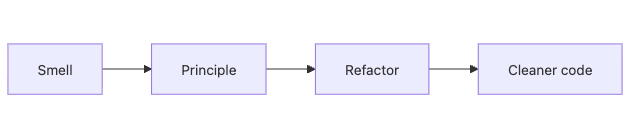

# 설계 원칙 모음

SOLID, KISS, YAGNI 같은 원칙은 이름만 외우면 금방 추상적인 구호처럼 들립니다. 실제 설계에 도움이 되는 순간은 따로 있습니다. 코드가 커지고 냄새가 나기 시작할 때, 어떤 질문을 던져야 하는지 알려 주는 진단 도구로 쓸 때입니다.

이 글은 Software Design 101 시리즈의 9번째 글입니다.

여기서는 SOLID 다섯 원칙을 평이한 언어로 다시 정리하고, KISS·YAGNI·DRY·디미터 법칙이 어디에 붙는지 설명합니다. 중요한 것은 암기가 아니라 적용 시점입니다. 각 원칙이 어떤 냄새에 반응하는지 연결해서 보겠습니다.

## 이 글에서 다룰 문제

- 설계 원칙은 외워야 하는 규칙일까요, 진단 도구일까요?
- SRP, OCP, LSP, ISP, DIP는 각각 어떤 냄새에 반응할까요?
- KISS와 YAGNI는 언제 구조를 단순하게 붙잡아 줄까요?
- DRY를 과하게 적용하면 왜 오히려 결합이 커질까요?
- 작은 프로젝트에 모든 원칙을 강하게 적용하면 왜 과할 수 있을까요?

> 원칙의 가치는 이름을 암기하는 데 있지 않고, 지금 코드에 어떤 질문을 던져야 하는지 아는 데 있습니다.

## 왜 중요한가

원칙은 명령문이 아니라 판단 보조도구입니다. 코드 냄새가 났을 때 “지금 책임이 섞인 건가?”, “불필요한 분기가 늘어난 건가?”, “하위 타입이 상위 계약을 깨는 건가?” 같은 질문을 던지게 해 줍니다.

팀 차원에서도 효과가 있습니다. 원칙이 공통 어휘가 되면 코드 리뷰에서 긴 설명 없이도 문제를 빠르게 공유할 수 있습니다. “이건 SRP 위반 같아요”라는 말 한마디에 모두가 비슷한 그림을 떠올릴 수 있습니다.

## 전체 그림


*코드 냄새를 설계 원칙으로 해석하고, 그 원칙을 바탕으로 리팩터링 방향을 정하는 흐름*

코드 냄새를 먼저 보고, 어떤 원칙이 깨졌는지 짚은 뒤, 그 원칙에 맞춰 구조를 고치는 흐름이 실전 감각에 가깝습니다.

## 기본 용어

- <strong>SRP</strong>: 모듈은 하나의 이유로만 바뀌어야 한다는 원칙입니다.
- <strong>OCP</strong>: 확장에는 열려 있고 기존 코드 수정에는 닫혀 있어야 한다는 원칙입니다.
- <strong>LSP</strong>: 하위 타입은 상위 타입 자리에 자연스럽게 들어갈 수 있어야 한다는 원칙입니다.
- <strong>ISP</strong>: 호출자가 쓰지 않는 메서드에 의존하지 않게 하자는 원칙입니다.
- <strong>DIP</strong>: 구체 구현보다 추상에 의존하자는 원칙입니다.
- <strong>KISS / YAGNI / DRY / 디미터 법칙</strong>: 단순함을 유지하고, 미리 만들지 말고, 반복을 의심하되, 멀리 있는 객체와 과하게 대화하지 말자는 보조 원칙입니다.

## 변경 전과 변경 후

**변경 전**

```python
class UserService:
    def signup(self, payload):
        # validation + storage + email + analytics + logging + billing
        ...
```

**변경 후**

```python
class SignupValidator: ...
class UserRepo: ...
class WelcomeMailer: ...
class SignupService:
    def __init__(self, validator, repo, mailer): ...
    def run(self, payload): ...
```

두 번째 구조는 SRP를 적용한 예입니다. 거대한 클래스 하나가 하던 일을 협력하는 작은 단위들로 나눠 변경 이유를 줄였습니다.

## 원칙을 꺼내는 다섯 가지 상황

### 1단계 — “이 클래스가 왜 이렇게 큰가?” → SRP

```python
# 1_srp.py
# More than one reason to change → split.
```

수정 이유가 여러 개 보이면 SRP를 먼저 떠올리면 됩니다. 저장 정책과 알림 정책이 같은 클래스에 있다면 분리 후보입니다.

### 2단계 — “또 if-elif 체인이 늘었다” → OCP

```python
# 2_ocp.py
# Replace branching with polymorphism or a registry.
```

새 기능이 들어올 때마다 기존 함수 분기를 수정해야 한다면 OCP를 의심해 볼 수 있습니다. 등록표나 다형성으로 확장 경로를 열 수 있는지 살펴봅니다.

### 3단계 — “하위 클래스가 예외를 던진다” → LSP

```python
# 3_lsp.py
# Suspect the inheritance hierarchy.
```

하위 타입이 상위 타입 자리에 들어갔을 때 호출자가 깨진다면, 상속 계층 자체가 잘못 설계됐을 수 있습니다.

### 4단계 — “쓰지도 않는 메서드를 왜 구현해야 하지?” → ISP

```python
# 4_isp.py
# Split the interface.
```

읽기만 필요한 구현체가 쓰기 메서드까지 억지로 품고 있다면 인터페이스가 너무 큽니다. 호출자 관점에서 쪼개는 편이 낫습니다.

### 5단계 — “도메인이 DB를 직접 안다” → DIP

```python
# 5_dip.py
# Move the abstraction to the domain side.
```

핵심 규칙이 구체 저장소나 외부 SDK에 매달려 있으면 DIP를 떠올리면 됩니다. 추상을 도메인 쪽으로 끌어와 방향을 다시 잡습니다.

## 빠르게 검증해 보기

원칙을 암기하고 있는지보다, 냄새를 봤을 때 어떤 질문이 떠오르는지가 더 중요합니다. 최근 리뷰에서 봤던 코드를 하나 떠올리고 아래처럼 연결해 보세요.

```text
거대한 클래스 -> SRP
분기 체인 증가 -> OCP
하위 타입 예외 -> LSP
읽기 전용 구현이 write를 구현 -> ISP
도메인이 DB import -> DIP
```

**Expected output:** 냄새와 원칙, 다음 수정 방향이 한 줄로 이어지면 원칙이 실제 도구로 작동하고 있다는 뜻입니다.

이 연습이 잘 되면 코드 리뷰에서 “이건 이상하다”가 아니라 “이건 SRP 관점에서 분리 후보다”처럼 더 구체적으로 말할 수 있습니다.

## 실패 신호와 먼저 볼 것

| 실패 신호 | 먼저 볼 것 |
| --- | --- |
| 원칙 이름은 아는데 수정 방향이 안 보인다 | 냄새와 원칙을 먼저 짝지어 봅니다 |
| DRY를 적용할수록 결합이 커진다 | 반복보다 변경 이유가 같은지 확인합니다 |
| 작은 스크립트가 지나치게 무거워진다 | YAGNI와 KISS 강도를 다시 조정합니다 |

원칙은 만능 규칙이 아니라, 문제를 본 뒤 어떤 질문을 꺼낼지 정하는 진단 카드에 가깝습니다.

## 이 코드에서 먼저 볼 점

- 각 원칙은 서로 다른 냄새를 겨냥합니다.
- 원칙은 코드를 판단만 하는 것이 아니라 수정 방향까지 제시합니다.
- 한 번에 하나씩 적용해야 가독성과 균형을 잃지 않습니다.

## 어디서 많이 헷갈릴까

DRY는 특히 자주 오해됩니다. 비슷해 보이는 코드를 너무 빨리 합치면 우연한 공통점 때문에 결합이 커질 수 있습니다. 반복 자체보다 변화의 이유가 같은지를 먼저 보는 편이 낫습니다.

YAGNI도 마찬가지입니다. 미래를 대비한다는 명분으로 아직 필요하지 않은 추상화를 미리 넣으면 현재 구조만 무거워집니다. 작은 시스템이라면 작은 원칙 강도로 시작하는 편이 대개 더 낫습니다.

## 실무에서는 이렇게 본다

코드 리뷰에서 원칙은 공통 언어가 됩니다. SRP 위반, OCP가 필요한 분기, LSP를 깨는 타입 계층 같은 표현이 팀 내에서 바로 이해되면 설계 논의가 훨씬 빨라집니다.

좋은 시니어 엔지니어는 원칙을 만능 규칙으로 들이대지 않습니다. 시스템 크기와 변경 압력을 보고 강도를 조절합니다. 작은 스크립트에 다섯 계층을 강요하지 않고, 큰 시스템에서는 필요한 경계를 더 분명히 세웁니다.

## 체크리스트

- [ ] 이 모듈은 하나의 이유로만 바뀌는가? (SRP)
- [ ] 새 기능을 넣을 때 기존 코드를 크게 수정하지 않아도 되는가? (OCP)
- [ ] 하위 타입이 상위 계약을 자연스럽게 지키는가? (LSP)
- [ ] 인터페이스가 실제 호출자 크기에 맞는가? (ISP)
- [ ] 도메인이 구체 구현보다 추상에 기대는가? (DIP)

## 연습 문제

1. 가장 큰 클래스 하나를 골라 SRP 위반 지점을 찾아 분리해 보세요.
2. `if-elif` 체인 하나를 OCP 관점에서 다시 설계해 보세요.
3. 지난해 만든 추상화 가운데 YAGNI에 어긋났던 사례를 하나 적어 보세요.

## 정리

설계 원칙은 외울 목록이 아니라, 코드 냄새를 읽고 다음 질문을 정하는 도구입니다. 문제를 본 뒤 적절한 원칙을 꺼내 쓰는 감각이 생기면 설계 논의도 훨씬 실전적이 됩니다.

다음 글에서는 시리즈 마지막으로, 지금까지 다룬 도구를 작은 프로젝트에 한 번에 적용해 봅니다.

<!-- toc:begin -->
- [소프트웨어 설계란 무엇인가?](./01-what-is-software-design.md)
- [관심사 분리](./02-separation-of-concerns.md)
- [모듈과 경계](./03-modules-and-boundaries.md)
- [의존성 방향](./04-dependency-direction.md)
- [인터페이스와 추상화](./05-interfaces-and-abstraction.md)
- [계층 아키텍처](./06-layered-architecture.md)
- [데이터 흐름 설계](./07-data-flow-design.md)
- [변경 영향 줄이기](./08-reducing-change-impact.md)
- **설계 원칙 모음 (현재 글)**
- 작은 프로젝트로 설계 연습 (예정)
<!-- toc:end -->

## 참고 자료

- [SOLID Principles (Robert C. Martin)](https://web.archive.org/web/20151010224057/http://www.objectmentor.com/resources/articles/Principles_and_Patterns.pdf)
- [Law of Demeter](https://en.wikipedia.org/wiki/Law_of_Demeter)
- [The Wrong Abstraction (Sandi Metz)](https://sandimetz.com/blog/2016/1/20/the-wrong-abstraction)
- [YAGNI (Martin Fowler)](https://martinfowler.com/bliki/Yagni.html)

### 실전 확인용 문서

- [abc — Abstract Base Classes](https://docs.python.org/3/library/abc.html)
- [typing.Protocol](https://docs.python.org/3/library/typing.html#typing.Protocol)


Tags: Computer Science, SoftwareDesign, SOLID, KISS, YAGNI, Principles
