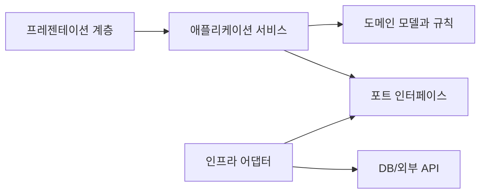

# Software Design 101 (9/10): 설계 원칙 모음

이 글은 Software Design 101 시리즈의 아홉 번째 글입니다.


SOLID, KISS, YAGNI 같은 원칙은 이름만 외우면 금방 추상적인 구호처럼 들립니다. 실제 설계에 도움이 되는 순간은 따로 있습니다. 코드가 커지고 냄새가 나기 시작할 때, 어떤 질문을 던져야 하는지 알려 주는 진단 도구로 쓸 때입니다.

이 글은 Software Design 101 시리즈의 9번째 글입니다.

여기서는 SOLID 다섯 원칙을 평이한 언어로 다시 정리하고, KISS·YAGNI·DRY·디미터 법칙이 어디에 붙는지 설명합니다. 중요한 것은 암기가 아니라 적용 시점입니다. 각 원칙이 어떤 냄새에 반응하는지 연결해서 보겠습니다.

## 먼저 던지는 질문

- 설계 원칙은 외워야 하는 규칙일까요, 진단 도구일까요?
- SRP, OCP, LSP, ISP, DIP는 각각 어떤 냄새에 반응할까요?
- KISS와 YAGNI는 언제 구조를 단순하게 붙잡아 줄까요?

## 큰 그림


*Software Design 101 9장 흐름 개요*

## 왜 중요한가

원칙은 명령문이 아니라 판단 보조도구입니다. 코드 냄새가 났을 때 “지금 책임이 섞인 건가?”, “불필요한 분기가 늘어난 건가?”, “하위 타입이 상위 계약을 깨는 건가?” 같은 질문을 던지게 해 줍니다.

팀 차원에서도 효과가 있습니다. 원칙이 공통 어휘가 되면 코드 리뷰에서 긴 설명 없이도 문제를 빠르게 공유할 수 있습니다. “이건 SRP 위반 같아요”라는 말 한마디에 모두가 비슷한 그림을 떠올릴 수 있습니다.

## 전체 그림

코드 냄새를 먼저 보고, 어떤 원칙이 깨졌는지 짚은 뒤, 그 원칙에 맞춰 구조를 고치는 흐름이 실전 감각에 가깝습니다.

## 기본 용어

- <strong>SRP</strong>: 모듈은 하나의 이유로만 바뀌어야 한다는 원칙입니다.
- <strong>OCP</strong>: 확장에는 열려 있고 기존 코드 수정에는 닫혀 있어야 한다는 원칙입니다.
- <strong>LSP</strong>: 하위 타입은 상위 타입 자리에 자연스럽게 들어갈 수 있어야 한다는 원칙입니다.
- <strong>ISP</strong>: 호출자가 쓰지 않는 메서드에 의존하지 않게 하자는 원칙입니다.
- <strong>DIP</strong>: 구체 구현보다 추상에 의존하자는 원칙입니다.
- <strong>KISS / YAGNI / DRY / 디미터 법칙</strong>: 단순함을 유지하고, 미리 만들지 말고, 반복을 의심하되, 멀리 있는 객체와 과하게 대화하지 말자는 보조 원칙입니다.

## 변경 전과 변경 후

**변경 전**

```python
class UserService:
    def signup(self, payload):
        # validation + storage + email + analytics + logging + billing
        ...
```

**변경 후**

```python
class SignupValidator: ...
class UserRepo: ...
class WelcomeMailer: ...
class SignupService:
    def __init__(self, validator, repo, mailer): ...
    def run(self, payload): ...
```

두 번째 구조는 SRP를 적용한 예입니다. 거대한 클래스 하나가 하던 일을 협력하는 작은 단위들로 나눠 변경 이유를 줄였습니다.

## 원칙을 꺼내는 다섯 가지 상황

### 1단계 — “이 클래스가 왜 이렇게 큰가?” → SRP

```python
# 1_srp.py
# More than one reason to change → split.
```

수정 이유가 여러 개 보이면 SRP를 먼저 떠올리면 됩니다. 저장 정책과 알림 정책이 같은 클래스에 있다면 분리 후보입니다.

### 2단계 — “또 if-elif 체인이 늘었다” → OCP

```python
# 2_ocp.py
# Replace branching with polymorphism or a registry.
```

새 기능이 들어올 때마다 기존 함수 분기를 수정해야 한다면 OCP를 의심해 볼 수 있습니다. 등록표나 다형성으로 확장 경로를 열 수 있는지 살펴봅니다.

### 3단계 — “하위 클래스가 예외를 던진다” → LSP

```python
# 3_lsp.py
# Suspect the inheritance hierarchy.
```

하위 타입이 상위 타입 자리에 들어갔을 때 호출자가 깨진다면, 상속 계층 자체가 잘못 설계됐을 수 있습니다.

### 4단계 — “쓰지도 않는 메서드를 왜 구현해야 하지?” → ISP

```python
# 4_isp.py
# Split the interface.
```

읽기만 필요한 구현체가 쓰기 메서드까지 억지로 품고 있다면 인터페이스가 너무 큽니다. 호출자 관점에서 쪼개는 편이 낫습니다.

### 5단계 — “도메인이 DB를 직접 안다” → DIP

```python
# 5_dip.py
# Move the abstraction to the domain side.
```

핵심 규칙이 구체 저장소나 외부 SDK에 매달려 있으면 DIP를 떠올리면 됩니다. 추상을 도메인 쪽으로 끌어와 방향을 다시 잡습니다.

## 빠르게 검증해 보기

원칙을 암기하고 있는지보다, 냄새를 봤을 때 어떤 질문이 떠오르는지가 더 중요합니다. 최근 리뷰에서 봤던 코드를 하나 떠올리고 아래처럼 연결해 보세요.

```text
거대한 클래스 -> SRP
분기 체인 증가 -> OCP
하위 타입 예외 -> LSP
읽기 전용 구현이 write를 구현 -> ISP
도메인이 DB import -> DIP
```

**Expected output:** 냄새와 원칙, 다음 수정 방향이 한 줄로 이어지면 원칙이 실제 도구로 작동하고 있다는 뜻입니다.

이 연습이 잘 되면 코드 리뷰에서 “이건 이상하다”가 아니라 “이건 SRP 관점에서 분리 후보다”처럼 더 구체적으로 말할 수 있습니다.

## 실패 신호와 먼저 볼 것

| 실패 신호 | 먼저 볼 것 |
| --- | --- |
| 원칙 이름은 아는데 수정 방향이 안 보인다 | 냄새와 원칙을 먼저 짝지어 봅니다 |
| DRY를 적용할수록 결합이 커진다 | 반복보다 변경 이유가 같은지 확인합니다 |
| 작은 스크립트가 지나치게 무거워진다 | YAGNI와 KISS 강도를 다시 조정합니다 |

원칙은 만능 규칙이 아니라, 문제를 본 뒤 어떤 질문을 꺼낼지 정하는 진단 카드에 가깝습니다.

## 이 코드에서 먼저 볼 점

- 각 원칙은 서로 다른 냄새를 겨냥합니다.
- 원칙은 코드를 판단만 하는 것이 아니라 수정 방향까지 제시합니다.
- 한 번에 하나씩 적용해야 가독성과 균형을 잃지 않습니다.

## 어디서 많이 헷갈릴까

DRY는 특히 자주 오해됩니다. 비슷해 보이는 코드를 너무 빨리 합치면 우연한 공통점 때문에 결합이 커질 수 있습니다. 반복 자체보다 변화의 이유가 같은지를 먼저 보는 편이 낫습니다.

YAGNI도 마찬가지입니다. 미래를 대비한다는 명분으로 아직 필요하지 않은 추상화를 미리 넣으면 현재 구조만 무거워집니다. 작은 시스템이라면 작은 원칙 강도로 시작하는 편이 대개 더 낫습니다.

## 실무에서는 이렇게 본다

코드 리뷰에서 원칙은 공통 언어가 됩니다. SRP 위반, OCP가 필요한 분기, LSP를 깨는 타입 계층 같은 표현이 팀 내에서 바로 이해되면 설계 논의가 훨씬 빨라집니다.

좋은 시니어 엔지니어는 원칙을 만능 규칙으로 들이대지 않습니다. 시스템 크기와 변경 압력을 보고 강도를 조절합니다. 작은 스크립트에 다섯 계층을 강요하지 않고, 큰 시스템에서는 필요한 경계를 더 분명히 세웁니다.

## 체크리스트

- [ ] 이 모듈은 하나의 이유로만 바뀌는가? (SRP)
- [ ] 새 기능을 넣을 때 기존 코드를 크게 수정하지 않아도 되는가? (OCP)
- [ ] 하위 타입이 상위 계약을 자연스럽게 지키는가? (LSP)
- [ ] 인터페이스가 실제 호출자 크기에 맞는가? (ISP)
- [ ] 도메인이 구체 구현보다 추상에 기대는가? (DIP)

## 연습 문제

1. 가장 큰 클래스 하나를 골라 SRP 위반 지점을 찾아 분리해 보세요.
2. `if-elif` 체인 하나를 OCP 관점에서 다시 설계해 보세요.
3. 지난해 만든 추상화 가운데 YAGNI에 어긋났던 사례를 하나 적어 보세요.

## 정리

설계 원칙은 외울 목록이 아니라, 코드 냄새를 읽고 다음 질문을 정하는 도구입니다. 문제를 본 뒤 적절한 원칙을 꺼내 쓰는 감각이 생기면 설계 논의도 훨씬 실전적이 됩니다.

다음 글에서는 시리즈 마지막으로, 지금까지 다룬 도구를 작은 프로젝트에 한 번에 적용해 봅니다.

## 설계 경계를 코드로 내리는 추가 예시

실무에서 설계 논의가 길어지는 이유는 "모듈 경계"가 문장으로만 남기 쉽기 때문입니다. 경계를 글로 합의한 뒤 코드로 고정하지 않으면 다음 기능을 붙이는 순간 경계가 다시 흐려집니다. 그래서 설계 문서와 함께, 경계를 강제하는 최소한의 구조를 코드에 먼저 두는 방식이 안전합니다.

### 모듈 경계 예시: 주문 결제 도메인

아래 구조는 결제 정책, 결제 수단 어댑터, 외부 API 호출을 분리합니다. 핵심은 도메인 모듈이 인프라 구현을 직접 모르고, 인터페이스를 통해서만 협력한다는 점입니다.

```text
order/
  domain/
    payment_policy.py
    ports.py
  application/
    checkout_service.py
  infrastructure/
    stripe_gateway.py
    kakao_gateway.py
```

```python
# domain/ports.py
from typing import Protocol

class PaymentGateway(Protocol):
    def authorize(self, order_id: str, amount: int) -> str: ...
    def capture(self, payment_id: str) -> None: ...

class RiskChecker(Protocol):
    def is_suspicious(self, user_id: str, amount: int) -> bool: ...
```

이렇게 포트를 먼저 정의하면 애플리케이션 계층은 "무엇을 요청하는가"만 알면 됩니다. Stripe, KakaoPay, 사내 결제 모듈처럼 구현체가 달라져도 애플리케이션 서비스의 제어 흐름은 유지됩니다. 변경 비용을 구현체 내부로 가두는 효과가 생깁니다.

### 의존성 주입(DI) 예시: 생성 시점에서 연결

```python
# application/checkout_service.py
from dataclasses import dataclass
from domain.ports import PaymentGateway, RiskChecker

@dataclass
class CheckoutService:
    gateway: PaymentGateway
    risk_checker: RiskChecker

    def checkout(self, order_id: str, user_id: str, amount: int) -> str:
        if self.risk_checker.is_suspicious(user_id, amount):
            raise ValueError("risk blocked")
        payment_id = self.gateway.authorize(order_id, amount)
        self.gateway.capture(payment_id)
        return payment_id
```

```python
# composition_root.py
from application.checkout_service import CheckoutService
from infrastructure.stripe_gateway import StripeGateway
from infrastructure.simple_risk_checker import SimpleRiskChecker

service = CheckoutService(
    gateway=StripeGateway(api_key="masked"),
    risk_checker=SimpleRiskChecker(),
)
```

DI의 핵심은 프레임워크 사용 여부가 아니라 "조립 위치"를 분리하는 것입니다. 비즈니스 로직 내부에서 구현체를 `new` 하지 않으면 테스트에서 대체 객체를 넣기 쉬워지고, 운영에서 구현체 교체 시 영향 범위가 줄어듭니다.

### 인터페이스 패턴: 정책 객체 분리

가격 계산이나 할인 규칙은 가장 자주 바뀌는 영역입니다. 이 규칙을 서비스 코드 안에 `if` 체인으로 붙이면 기능은 빠르게 나오지만 변경 지점이 폭발합니다. 아래처럼 정책 인터페이스를 두면 규칙 추가를 클래스 추가로 제한할 수 있습니다.

```python
from typing import Protocol

class DiscountPolicy(Protocol):
    def discount(self, amount: int) -> int: ...

class RatePolicy:
    def __init__(self, rate: float) -> None:
        self.rate = rate

    def discount(self, amount: int) -> int:
        return int(amount * self.rate)

class FixedPolicy:
    def __init__(self, fixed: int) -> None:
        self.fixed = fixed

    def discount(self, amount: int) -> int:
        return min(self.fixed, amount)
```

정책 인터페이스를 쓰면 런타임 선택도 단순해집니다. 신규 캠페인 규칙은 기존 서비스 코드를 수정하기보다 새 정책 클래스를 추가하고 조립부에서 연결하면 끝납니다. 이 방식은 OCP를 실무적으로 지키는 가장 단순한 패턴입니다.

### 경계 품질을 확인하는 운영 체크

- 모듈 경계를 넘는 import가 늘어나는지 주간으로 확인합니다.
- 애플리케이션 계층에서 인프라 타입을 직접 참조하는지 검사합니다.
- 변경 요청 하나당 수정 파일 수를 기록해 경계 누수를 추적합니다.
- 구현체 교체(예: 결제 게이트웨이 변경) 리허설을 분기마다 1회 실행합니다.

설계는 문서에서 시작하지만, 유지보수성은 경계 강제 구조와 조립 규칙에서 결정됩니다. 경계를 합의한 다음 즉시 포트, 조립부, 테스트 대역을 갖춘 최소 코드를 두면 다음 변경에서 체감되는 비용 차이가 명확하게 나타납니다.

## 현업 적용 관점에서 다시 정리

원칙은 교과서 문장이 아니라 설계 결정의 필터입니다. SRP, OCP, DIP 같은 원칙은 "지금 무엇을 분리하고 무엇을 유지할지"를 선택하게 도와줍니다.

## 의존 관계를 수치로 읽는 실전 점검

설계 품질을 문장으로만 평가하면 팀마다 기준이 달라집니다. 그래서 실무에서는 결합도 지표를 함께 봅니다. 가장 단순한 시작점은 모듈 단위 `Ca(유입 의존성)`, `Ce(유출 의존성)`, `I=Ce/(Ca+Ce)` 입니다. 값이 정답을 보장하지는 않지만, 경계가 틀어진 지점을 빠르게 찾는 데 매우 유용합니다.

```python
from dataclasses import dataclass

@dataclass(frozen=True)
class CouplingMetric:
    module: str
    ca: int  # 외부 모듈이 이 모듈에 의존하는 수
    ce: int  # 이 모듈이 외부 모듈에 의존하는 수

    @property
    def instability(self) -> float:
        total = self.ca + self.ce
        return 0.0 if total == 0 else self.ce / total


def report(metrics: list[CouplingMetric]) -> None:
    for m in metrics:
        print(f"{m.module:12} Ca={m.ca:2d} Ce={m.ce:2d} I={m.instability:.2f}")


report(
    [
        CouplingMetric("domain", ca=6, ce=1),
        CouplingMetric("application", ca=4, ce=4),
        CouplingMetric("infrastructure", ca=1, ce=7),
    ]
)
```

도메인 모듈의 `I` 값이 0에 가깝고 인프라 모듈의 `I` 값이 1에 가깝다면 방향이 대체로 건강합니다. 반대로 도메인의 `Ce`가 늘어나면 의존성 방향이 뒤집히고 있다는 신호입니다. 이때는 코드 리뷰에서 "왜 import가 생겼는가"를 먼저 질문해야 합니다.

## 모듈 의존 그래프를 먼저 그린 뒤 코드로 옮기기

설계 회의에서 말로만 합의하면 구현 단계에서 금방 흔들립니다. 아래처럼 다이어그램을 먼저 합의하고, 그 다음 import 규칙과 테스트를 붙여 두면 경계를 유지하기 쉽습니다.



이 그림의 핵심은 화살표 개수가 아니라 방향입니다. 도메인은 외부 기술을 모른 채 규칙만 유지하고, 어댑터가 세부 구현을 담당합니다. 이렇게 분리해 두면 기능 요구가 변해도 도메인 코드의 파손 범위가 작아집니다.

## 추상 클래스와 인터페이스를 경계에 배치하기

포트-어댑터 구조를 도입할 때 가장 흔한 실수는 추상화를 인프라 패키지 안에 두는 것입니다. 추상화는 반드시 도메인 또는 애플리케이션 쪽 경계에 둬야 의존성 역전이 성립합니다.

```python
from __future__ import annotations

from abc import ABC, abstractmethod
from dataclasses import dataclass


@dataclass(frozen=True)
class PaymentCommand:
    order_id: str
    user_id: str
    amount: int


class PaymentGateway(ABC):
    @abstractmethod
    def charge(self, command: PaymentCommand) -> str:
        raise NotImplementedError


class FakePaymentGateway(PaymentGateway):
    def charge(self, command: PaymentCommand) -> str:
        return f"paid:{command.order_id}"
```

호출자는 `PaymentGateway`만 의존하고, 실제 결제 제공자 교체는 구현 클래스에서 흡수합니다. 이 방식은 테스트에도 유리합니다. 단위 테스트는 `FakePaymentGateway`를 사용해 비즈니스 규칙만 검증하고, 통합 테스트에서만 실제 I/O를 붙이면 됩니다.

## 리팩터링 전후를 나란히 비교하기

좋은 설계 글은 "좋다"고 말하는 대신 전후 차이를 보여 줘야 합니다. 아래는 책임이 섞인 코드와 책임을 분리한 코드의 대비입니다.

```python
# before.py

def place_order(request: dict) -> dict:
    # HTTP 입력 파싱, 규칙 검증, 결제 호출, 저장, 응답 구성까지 한 함수에 섞임
    user_id = request["user_id"]
    amount = int(request["amount"])
    if amount <= 0:
        return {"status": 400, "message": "invalid amount"}

    payment_id = charge_with_vendor_api(user_id, amount)
    save_order_row(user_id=user_id, amount=amount, payment_id=payment_id)
    return {"status": 200, "payment_id": payment_id}
```

```python
# after.py

def place_order_controller(request: dict, service: "PlaceOrderService") -> dict:
    command = PlaceOrderCommand.from_http(request)
    result = service.execute(command)
    return result.to_http()


class PlaceOrderService:
    def __init__(self, gateway: PaymentGateway, repo: OrderRepository) -> None:
        self.gateway = gateway
        self.repo = repo

    def execute(self, command: "PlaceOrderCommand") -> "PlaceOrderResult":
        command.validate()
        payment_id = self.gateway.charge(command.to_payment_command())
        self.repo.save(command.to_order(payment_id))
        return PlaceOrderResult.success(payment_id)
```

전후를 비교하면 무엇이 바뀌었는지 즉시 보입니다. 컨트롤러는 입력/출력 변환만 담당하고, 서비스는 유스케이스 규칙만 담당하며, 외부 연동은 포트 뒤로 이동합니다. 구조가 이렇게 바뀌면 장애 분석과 테스트 설계가 훨씬 단순해집니다.

## 계층별 체크포인트와 운영 연결

설계는 개발 단계에서 끝나지 않습니다. 운영 지표와 연결되어야 품질 개선이 누적됩니다.

- 프레젠테이션 계층: 요청 검증 실패율, 4xx 응답 분포
- 애플리케이션 계층: 유스케이스별 처리 시간, 재시도 횟수
- 도메인 계층: 규칙 위반 빈도, 불변식 실패 로그
- 인프라 계층: 외부 API 오류율, DB 지연 시간

지표를 계층별로 분리해 보면 어디를 고쳐야 하는지가 명확해집니다. 모든 지표가 한 대시보드에서 섞여 있으면 "느리다"는 사실만 보이고 원인은 보이지 않습니다. 설계 경계를 운영 지표 경계와 맞추면 개선 사이클이 빠르게 돌아갑니다.


## 리뷰와 리팩터링을 위한 실전 질문 세트

설계는 한 번 작성하고 끝나는 산출물이 아니라, 변경 요청이 들어올 때마다 점검하는 운영 습관입니다. 아래 질문은 코드 리뷰와 리팩터링 계획에서 바로 사용할 수 있는 최소 점검 세트입니다.

1. 이번 변경은 어느 계층의 책임인가요?
2. 새 의존성이 도메인 중심 방향을 깨뜨리나요?
3. 인터페이스 이름이 구현 세부를 누설하나요?
4. 테스트 더블 없이 규칙 검증이 가능한가요?
5. 다음 변경이 들어와도 같은 위치를 수정하게 되나요?

이 다섯 질문은 단순하지만 강력합니다. 특히 "다음 변경도 같은 위치를 건드리게 되는가"라는 질문은 설계의 탄력성을 빠르게 드러냅니다. 지금 요구사항을 통과하는 코드와 다음 요구사항까지 받아내는 코드는 여기서 갈립니다.

## 계층 아키텍처 예시를 한 단계 더 구체화하기

아래 예시는 요청-유스케이스-도메인-어댑터 경계를 코드로 고정하는 방법을 보여 줍니다.

```python
from dataclasses import dataclass
from typing import Protocol


@dataclass(frozen=True)
class CreateCouponCommand:
    code: str
    discount_percent: int


class CouponRepository(Protocol):
    def exists(self, code: str) -> bool: ...
    def save(self, code: str, discount_percent: int) -> None: ...


class CreateCouponService:
    def __init__(self, repo: CouponRepository) -> None:
        self.repo = repo

    def execute(self, command: CreateCouponCommand) -> None:
        if not (1 <= command.discount_percent <= 90):
            raise ValueError("할인율은 1~90 범위여야 합니다.")
        if self.repo.exists(command.code):
            raise ValueError("이미 존재하는 쿠폰 코드입니다.")
        self.repo.save(command.code, command.discount_percent)
```

핵심은 서비스가 저장소의 구체 구현을 모른다는 점입니다. SQLAlchemy를 쓰든, 파일 저장을 쓰든, 외부 API를 쓰든 서비스 규칙은 바뀌지 않습니다. 그래서 정책 변경과 기술 변경이 서로 다른 속도로 진화할 수 있습니다.

## 설계 부채를 남기지 않는 배포 순서

설계를 개선할 때 기능 배포와 구조 개선을 한 커밋에 묶으면 위험이 커집니다. 다음 순서를 지키면 안전하게 개선할 수 있습니다.

- 1단계: 새 경계와 인터페이스를 추가합니다. 기존 경로는 유지합니다.
- 2단계: 호출자를 새 경계로 점진 이행합니다. 로그로 구경로 사용량을 기록합니다.
- 3단계: 구경로 트래픽이 0에 가까워지면 제거합니다.
- 4단계: 제거 이후 메트릭과 에러율을 비교해 회귀를 확인합니다.

이 순서는 확장-이행-수축 전략과 같습니다. 설계는 깔끔해지고, 사용자 영향은 최소화됩니다. 특히 여러 팀이 동시에 작업하는 환경에서는 이 순서를 문서화해 공통 작업 규칙으로 삼는 것이 효과적입니다.

## 처음 질문으로 돌아가기

- **설계 원칙은 외워야 하는 규칙일까요, 진단 도구일까요?**
  - 본문의 기준은 설계 원칙 모음를 한 덩어리 개념으로 보지 않고 입력, 처리, 검증, 운영 신호가 만나는 경계로 나누어 확인하는 것입니다.
- **SRP, OCP, LSP, ISP, DIP는 각각 어떤 냄새에 반응할까요?**
  - 예제와 그림에서는 어떤 값이 들어오고, 어느 단계에서 바뀌며, 어떤 기준으로 통과 또는 실패하는지를 먼저 확인해야 합니다.
- **KISS와 YAGNI는 언제 구조를 단순하게 붙잡아 줄까요?**
  - 운영에서는 이 판단을 체크리스트, 로그, 테스트로 남겨 다음 변경에서도 같은 실패가 반복되지 않게 막아야 합니다.

<!-- toc:begin -->
## 시리즈 목차

- [Software Design 101 (1/10): 소프트웨어 설계란 무엇인가?](./01-what-is-software-design.md)
- [Software Design 101 (2/10): 관심사 분리](./02-separation-of-concerns.md)
- [Software Design 101 (3/10): 모듈과 경계](./03-modules-and-boundaries.md)
- [Software Design 101 (4/10): 의존성 방향](./04-dependency-direction.md)
- [Software Design 101 (5/10): 인터페이스와 추상화](./05-interfaces-and-abstraction.md)
- [Software Design 101 (6/10): 계층 아키텍처](./06-layered-architecture.md)
- [Software Design 101 (7/10): 데이터 흐름 설계](./07-data-flow-design.md)
- [Software Design 101 (8/10): 변경 영향 줄이기](./08-reducing-change-impact.md)
- **설계 원칙 모음 (현재 글)**
- 작은 프로젝트로 설계 연습 (예정)

<!-- toc:end -->

## 참고 자료

- [software-design-101 예제 코드 저장소](https://github.com/yeongseon-books/book-examples/tree/main/software-design-101/ko)

- [SOLID Principles (Robert C. Martin)](https://web.archive.org/web/20151010224057/http://www.objectmentor.com/resources/articles/Principles_and_Patterns.pdf)
- [Law of Demeter](https://en.wikipedia.org/wiki/Law_of_Demeter)
- [The Wrong Abstraction (Sandi Metz)](https://sandimetz.com/blog/2016/1/20/the-wrong-abstraction)
- [YAGNI (Martin Fowler)](https://martinfowler.com/bliki/Yagni.html)

### 실전 확인용 문서

- [abc — Abstract Base Classes](https://docs.python.org/3/library/abc.html)
- [typing.Protocol](https://docs.python.org/3/library/typing.html#typing.Protocol)

Tags: Computer Science, SoftwareDesign, SOLID, KISS, YAGNI, Principles
