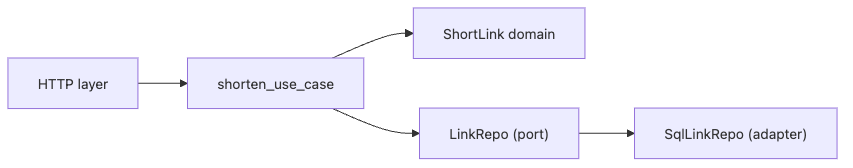

# 작은 프로젝트로 설계 연습

시리즈 전체를 읽고 나면 가장 자연스럽게 남는 질문은 이것입니다. “그래서 이걸 실제 코드에 어떻게 한꺼번에 적용하지?” 개념을 따로따로 이해하는 것과 작은 프로젝트 하나를 끝까지 설계하는 것은 확실히 다른 일입니다.

이 글은 Software Design 101 시리즈의 10번째 글입니다.

여기서는 아주 작은 URL 단축기 예제를 통해 관심사 분리, 의존성 방향, 계층, 데이터 흐름, 포트와 어댑터를 한곳에 모아 봅니다. 목표는 거대한 프레임워크를 만드는 것이 아니라, 작은 코드에서도 설계 습관이 어떻게 자리 잡는지 감각을 얻는 것입니다.

## 이 글에서 다룰 문제

- 작은 프로젝트는 어디서부터 설계를 시작해야 할까요?
- 왜 도메인부터 쓰는 편이 좋을까요?
- 저장소와 키 생성 같은 인프라 세부를 어떻게 막아 둘 수 있을까요?
- 작은 코드에서도 포트와 어댑터가 왜 의미가 있을까요?
- 시리즈에서 다룬 도구들이 한 흐름 안에서 어떻게 연결될까요?

> 작은 프로젝트라도 도메인을 중심에 두고 바깥 세부를 가장자리로 밀어내면 구조는 훨씬 오래 버팁니다.

## 왜 중요한가

좋은 습관은 큰 시스템에서만 필요한 것이 아닙니다. 오히려 작은 프로젝트에서 단순한 형태로 연습해 두면 나중에 더 큰 시스템에서도 같은 감각을 가져가기 쉽습니다.

URL 단축기는 예제가 작으면서도 설계 요소가 고르게 들어 있습니다. 도메인 규칙, 키 생성 정책, 저장소, HTTP 표현 계층, 데이터 흐름을 모두 볼 수 있기 때문에 시리즈의 도구를 한 번에 연결하기 좋습니다.

## 전체 그림


*URL 단축기 예제에서 표현 계층과 유스케이스, 도메인, 포트, 어댑터가 협력하는 전체 구조*

도메인은 가운데 있고, 포트가 필요한 모양을 정의하며, 어댑터가 그 바깥 구현을 맡습니다. 표현 계층은 이 흐름을 호출만 합니다.

## 기본 용어

- <strong>단축 링크</strong>: 긴 URL을 짧은 키로 표현한 값입니다.
- <strong>유스케이스</strong>: 하나의 업무 흐름입니다.
- <strong>포트</strong>: 도메인이 정의한 인터페이스입니다.
- <strong>어댑터</strong>: 포트를 구현하는 인프라 조각입니다.
- <strong>composition root</strong>: 부품을 실제 구현과 연결하는 단일 조립 지점입니다.

## 변경 전과 변경 후

**변경 전**

```python
@app.route("/", methods=["POST"])
def shorten():
    long = request.json["url"]
    key = hashlib.md5(long.encode()).hexdigest()[:6]
    db.execute("INSERT INTO links VALUES (?, ?)", (key, long))
    return {"short": "/r/" + key}
```

**변경 후**

```python
@app.route("/", methods=["POST"])
def shorten_view():
    return shorten_use_case(request.json, repo, key_gen)
```

두 번째 구조에서는 뷰가 얇아지고, 키 생성과 저장 세부가 유스케이스와 도메인 바깥으로 밀려납니다. 다른 채널이나 저장소를 붙이기도 쉬워집니다.

## URL 단축기를 다섯 단계로 만든다

### 1단계 — 도메인부터 쓴다

```python
# 1_domain.py
from dataclasses import dataclass

@dataclass(frozen=True)
class ShortLink:
    key: str
    target: str

    @staticmethod
    def create(key, target):
        if not target.startswith("http"):
            raise ValueError("invalid url")
        return ShortLink(key=key, target=target)
```

도메인에는 규칙이 들어갑니다. URL이 올바른 형식인지 확인하는 규칙은 데이터베이스나 웹 프레임워크가 아니라 도메인 안으로 들어가야 합니다.

### 2단계 — 포트를 정의한다

```python
# 2_ports.py
from typing import Protocol

class LinkRepo(Protocol):
    def save(self, link: ShortLink) -> None: ...
    def get(self, key: str) -> ShortLink | None: ...

class KeyGen(Protocol):
    def __call__(self, target: str) -> str: ...
```

도메인과 유스케이스는 필요한 모양만 말합니다. 어떻게 저장할지, 키를 어떤 알고리즘으로 만들지는 아직 결정하지 않아도 됩니다.

### 3단계 — 유스케이스로 흐름을 만든다

```python
# 3_usecase.py
def shorten_use_case(payload, repo: LinkRepo, key_gen: KeyGen):
    target = payload["url"]
    key = key_gen(target)
    link = ShortLink.create(key, target)
    repo.save(link)
    return {"short": "/r/" + link.key}
```

유스케이스는 입력을 읽고 도메인 규칙을 적용한 뒤 저장소에 넘깁니다. 흐름은 여기서 보이지만, 구체 구현은 아직 가장자리로 밀려 있습니다.

### 4단계 — 어댑터를 붙인다

```python
# 4_adapter.py
class InMemoryLinkRepo:
    def __init__(self): self._d = {}
    def save(self, link): self._d[link.key] = link
    def get(self, key): return self._d.get(key)

def md5_key(target: str) -> str:
    import hashlib
    return hashlib.md5(target.encode()).hexdigest()[:6]
```

메모리 저장소와 md5 키 생성은 교체 가능한 세부 구현입니다. 같은 포트 뒤에 SQL 저장소나 Redis 저장소를 붙여도 유스케이스는 거의 변하지 않아야 합니다.

### 5단계 — 가장자리에서 조립하고 표현한다

```python
# 5_compose.py
from flask import Flask, request
app = Flask(__name__)
repo = InMemoryLinkRepo()
key_gen = md5_key

@app.route("/", methods=["POST"])
def shorten_view():
    return shorten_use_case(request.json, repo, key_gen)

@app.route("/r/<key>")
def redirect_view(key):
    link = repo.get(key)
    return ("not found", 404) if not link else ("", 302, {"Location": link.target})
```

조립은 가장자리에서 한 번만 일어납니다. 표현 계층은 HTTP 입력과 출력만 처리하고, 핵심 규칙은 안쪽에 남겨 둡니다.

## 빠르게 검증해 보기

작은 프로젝트에서는 실제로 한 번 실행해 보는 검증이 가장 좋습니다. 아래 순서대로 최소 동작을 확인해 보세요.

```bash
curl -X POST http://localhost:5000/   -H "Content-Type: application/json"   -d '{"url": "https://example.com/docs"}'
```

**Expected output:** `{"short": "/r/xxxxxx"}` 형태의 응답이 오고, 이어서 `GET /r/<key>` 요청에서 `302`와 `Location` 헤더가 보이면 표현 계층과 유스케이스, 저장소 협력이 정상이라는 뜻입니다.

같은 검증을 메모리 저장소와 SQL 저장소 양쪽에서 해 보면, 포트와 어댑터 분리가 실제 교체 비용을 얼마나 낮추는지도 바로 체감할 수 있습니다.

## 실패 신호와 먼저 볼 것

| 실패 신호 | 먼저 볼 것 |
| --- | --- |
| 뷰 함수에서 해시 생성과 DB 저장을 모두 한다 | 유스케이스와 어댑터로 끌어낼 수 있는지 봅니다 |
| 저장소를 바꾸려는데 뷰와 도메인이 함께 흔들린다 | 포트가 도메인 쪽에 정의됐는지 확인합니다 |
| URL 검증 규칙 테스트에 Flask가 필요하다 | 규칙이 도메인 안에 있는지 점검합니다 |

작은 프로젝트에서 이 세 가지가 깔끔하게 분리되면, 시리즈에서 다룬 설계 도구가 실제로 연결된다는 감각을 얻을 수 있습니다.

## 이 코드에서 먼저 볼 점

- 도메인은 외부 라이브러리를 직접 모르고 있습니다.
- 포트는 도메인과 유스케이스 쪽에서 필요한 모양을 정합니다.
- 어댑터를 바꿔도 도메인 규칙은 비교적 안정적으로 남습니다.
- 데이터는 입력에서 유스케이스를 거쳐 출력으로 한 방향 흐릅니다.
- 표현 계층은 얇게 유지됩니다.

## 어디서 많이 헷갈릴까

작은 프로젝트니까 모든 코드를 뷰 함수에 넣어도 된다고 생각하기 쉽습니다. 실제로 처음 버전은 그렇게 빨리 만들 수 있습니다. 하지만 저장소나 채널이 하나만 더 늘어도 곧 구조가 거칠어집니다. 작은 프로젝트일수록 얇은 경계만 먼저 잡아 두는 편이 낫습니다.

반대로 첫 버전부터 어댑터 네 개, 포트 다섯 개를 만드는 것도 과합니다. 지금 예제의 핵심은 거대한 추상화가 아니라, 변동 가능성이 큰 세부를 도메인 밖에 두는 습관입니다.

## 실무에서는 이렇게 본다

이 패턴은 URL 단축기보다 훨씬 큰 시스템에도 그대로 이어집니다. 결제, 인증, 알림, 재고 관리처럼 여러 도메인에서도 중심은 비슷합니다. 도메인을 가운데 두고, 포트로 필요한 모양을 말하고, 어댑터로 바깥을 막습니다.

시니어 엔지니어는 작은 프로젝트에서도 도메인 단위 테스트를 먼저 떠올립니다. 표현 계층이나 인프라보다 오래 남을 규칙이 무엇인지 먼저 확인하고, 조립은 한곳에 모읍니다.

## 체크리스트

- [ ] 도메인이 인프라 세부에서 자유로운가?
- [ ] 포트가 도메인 또는 유스케이스 쪽에서 정의되는가?
- [ ] 표현 계층이 얇게 유지되는가?
- [ ] 데이터가 한 방향으로 흐르는가?
- [ ] 구현 조립이 한곳에 모여 있는가?

## 연습 문제

1. 위 코드에 `SqlLinkRepo` 어댑터를 추가해 보세요. 도메인은 한 줄도 바뀌지 않아야 합니다.
2. 같은 유스케이스를 호출하는 CLI 표현 계층을 하나 더 만들어 보세요.
3. `ShortLink`에 만료 규칙을 추가하고 도메인 단위 테스트를 작성해 보세요.

## 정리

이 시리즈의 요지는 작은 프로젝트에서도 그대로 통합니다. 도메인을 중심에 두고, 포트로 필요한 모양을 정의하고, 어댑터로 바깥 세부를 막고, 데이터를 한 방향으로 흐르게 하면 구조는 생각보다 오래 건강하게 유지됩니다.

이 글로 Software Design 101 시리즈를 마칩니다. 다음 시스템을 만들 때는 거대한 설계 문서보다 먼저, 무엇을 중심에 둘지와 무엇을 가장자리로 밀어낼지부터 떠올려 보시면 좋겠습니다.

<!-- toc:begin -->
- [소프트웨어 설계란 무엇인가?](./01-what-is-software-design.md)
- [관심사 분리](./02-separation-of-concerns.md)
- [모듈과 경계](./03-modules-and-boundaries.md)
- [의존성 방향](./04-dependency-direction.md)
- [인터페이스와 추상화](./05-interfaces-and-abstraction.md)
- [계층 아키텍처](./06-layered-architecture.md)
- [데이터 흐름 설계](./07-data-flow-design.md)
- [변경 영향 줄이기](./08-reducing-change-impact.md)
- [설계 원칙 모음](./09-design-principles.md)
- **작은 프로젝트로 설계 연습 (현재 글)**
<!-- toc:end -->

## 참고 자료

- [Cosmic Python — Architecture Patterns with Python](https://www.cosmicpython.com/)
- [Hexagonal Architecture (Alistair Cockburn)](https://alistair.cockburn.us/hexagonal-architecture/)
- [Clean Architecture (Uncle Bob)](https://blog.cleancoder.com/uncle-bob/2012/08/13/the-clean-architecture.html)
- [Domain-Driven Design (Eric Evans)](https://martinfowler.com/bliki/DomainDrivenDesign.html)

### 실전 확인용 문서

- [Flask Quickstart](https://flask.palletsprojects.com/en/stable/quickstart/)
- [typing.Protocol](https://docs.python.org/3/library/typing.html#typing.Protocol)
- [dataclasses — Data Classes](https://docs.python.org/3/library/dataclasses.html)


Tags: Computer Science, SoftwareDesign, Practice, Project, Modularity, Architecture
