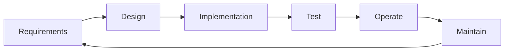

# What Is Software Engineering?

This is the first post in the Software Engineering 101 series.

> Software Engineering 101 series (1/10)

<!-- a-grade-intro:begin -->

**Core question**: If you can write code, are you a software engineer?

> Code is only part of the deliverable. Engineering is code plus time plus people.

<!-- a-grade-intro:end -->

## What You Will Learn

- The difference between coding and software engineering
- The five areas an engineer owns
- Balancing "the right thing" and "doing it right"
- Looking at systems on the time axis
- The big picture of this whole series

## Why It Matters

Most learning stops at "how to write code". Real work is code + collaboration + operations. Understanding this gap shapes the next decade of your learning.

> Code that runs once and a system that survives five years are different things.

## Concept at a Glance



Engineering is a loop that does not break.

## Key Terms

- **Software Engineering**: development that accounts for time and collaboration.
- **Requirements**: agreement on what to build.
- **Design**: decisions about how to build it.
- **Maintenance**: every change after delivery — usually the longest phase.
- **Quality attributes**: correctness, reliability, performance, security, maintainability.

## Before/After

**Before — A coder's view**

```text
need -> code -> works -> done
```

**After — An engineer's view**

```text
need -> design -> code -> test -> operate -> change -> reflect -> repeat
```

Same code, different time horizon.

## Hands-on Step by Step

### Step 1 — "Run Once" Code

```python
# 1_quick.py
import sys
n = int(sys.argv[1])
print(sum(range(n)))
```

Works today, that's enough.

### Step 2 — "Others Will Use It" Code

```python
# 2_reusable.py
def sum_to(n: int) -> int:
    """Sum of 0..n-1."""
    if n < 0: raise ValueError("n must be >= 0")
    return n * (n - 1) // 2
```

Types, docstring, and input validation appear.

### Step 3 — "Production" Code

```python
# 3_prod.py
import logging
log = logging.getLogger(__name__)

def sum_to(n: int) -> int:
    if n < 0:
        log.warning("invalid input n=%s", n)
        raise ValueError("n must be >= 0")
    return n * (n - 1) // 2
```

Logging and observability arrive.

### Step 4 — Add Tests

```python
# 4_test.py
import pytest
from prod import sum_to

def test_sum_to_basic(): assert sum_to(5) == 10
def test_sum_to_zero(): assert sum_to(0) == 0
def test_sum_to_negative():
    with pytest.raises(ValueError): sum_to(-1)
```

Without tests, you cannot change the code.

### Step 5 — Documentation

```text
# 5_README.md
## sum_to
- input: non-negative integer
- output: sum of 0..n-1
- complexity: O(1)
- history: 2026-05 v1
```

Minimum guidance for the next engineer.

## What to Notice in This Code

- The same function takes on more responsibility per step.
- Code grows; cognitive cost shrinks.
- Each step looks at a different time horizon.
- Engineering is the explicit pricing of trade-offs.

## Five Common Mistakes

1. **Coding the moment you hear the requirement.** The fastest path to solving the wrong problem.
2. **Writing tests "later".** Later almost never arrives.
3. **Treating docs as luxury.** It is theft of the next engineer's time.
4. **Operations is "their job".** The author knows the system best.
5. **Deciding alone.** Good decisions come from agreement.

## How This Shows Up in Production

Large organizations record decisions through RFCs and ADRs. SRE is collaboration with engineering, not a separate department. Code review, pair programming, and retrospectives are daily practice.

## How a Senior Engineer Thinks

- The goal is "operable", not just "works".
- The reasons behind decisions are written down.
- More time goes into agreement than into code.
- Code is written for the future self and team.
- Learning is built into the daily routine.

## Checklist

- [ ] Can you state the difference between coding and engineering?
- [ ] Can you list the five areas an engineer owns?
- [ ] Can you separate "the right thing" from "doing it right"?
- [ ] Can you classify your own code into one of the five steps?
- [ ] Can you sketch your next decade of learning?

## Practice Problems

1. Pick one piece of code you wrote recently and classify it across the five steps.
2. Describe a time when "the right thing" and "doing it right" pulled in different directions.
3. Choose your weakest area among the next episodes (requirements, design, review, testing, operations).

## Wrap-up and Next Steps

Engineering is not just another word for code. Next up, where everything starts — understanding requirements.

<!-- toc:begin -->
- **What Is Software Engineering? (current)**
- Understanding Requirements (upcoming)
- Design vs Implementation (upcoming)
- Code Review (upcoming)
- Testing Strategy (upcoming)
- Version Control and Release (upcoming)
- Documentation (upcoming)
- Collaboration Process (upcoming)
- Maintenance and Tech Debt (upcoming)
- What Makes Good Software (upcoming)
<!-- toc:end -->

## References

- [IEEE — SWEBOK Guide v3](https://www.computer.org/education/bodies-of-knowledge/software-engineering)
- [Software Engineering at Google (free book)](https://abseil.io/resources/swe-book)
- [The Pragmatic Programmer — David Thomas, Andrew Hunt](https://pragprog.com/titles/tpp20/the-pragmatic-programmer-20th-anniversary-edition/)
- [Martin Fowler — Articles](https://martinfowler.com/articles.html)

Tags: Computer Science, SoftwareEngineering, Engineering, Process, Quality, Career
