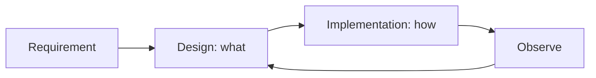

# Design vs Implementation

This is post 3 in the Software Engineering 101 series.

> Software Engineering 101 series (3/10)

<!-- a-grade-intro:begin -->

**Core question**: Is "well-written code" the same as "well-designed system"?

> Design is "what"; implementation is "how". Mixing the two blurs both.

<!-- a-grade-intro:end -->

## What You Will Learn

- Definitions of design and implementation
- ADR (Architecture Decision Record)
- How to capture trade-offs in writing
- Five signs of good design
- How to avoid over-engineering

## Why It Matters

Design decisions outlive code. Bad design cannot be hidden under good code.

> Code can be rewritten; the trace of decisions follows you forever.

## Concept at a Glance



Design sets the ceiling for implementation.

## Key Terms

- **Design**: deciding components, responsibilities, boundaries, and interfaces.
- **Implementation**: realizing those decisions in code.
- **ADR**: a short document of one decision and its reasoning.
- **Trade-off**: what you gain and what you give up.
- **YAGNI**: do not build what you do not need today.

## Before/After

**Before — Designing inside the code**

```text
"Just code it and refactor later" -> decisions hide in the code
```

**After — ADR makes it explicit**

```text
Options A/B/C, choice + reason, reversibility -> simpler code
```

When design is visible, code becomes simpler.

## Hands-on Step by Step

### Step 1 — Interface First

```python
# 1_iface.py
from typing import Protocol

class Notifier(Protocol):
    def send(self, user_id: str, body: str) -> None: ...
```

Interface before implementation.

### Step 2 — Two Implementations

```python
# 2_impls.py
class EmailNotifier:
    def send(self, user_id, body): ...
class SMSNotifier:
    def send(self, user_id, body): ...
```

Polymorphism makes implementations swappable.

### Step 3 — Write the ADR

```text
# 3_adr.md
# ADR 0007: Notification channel abstraction
- Context: email/SMS/push are added often
- Decision: abstract via Notifier protocol
- Alternatives: direct if/elif, external SaaS integration
- Consequences: easy unit testing, negligible perf cost
```

The reasoning fits on one page.

### Step 4 — Apply YAGNI (Subtract)

```python
# 4_remove.py
# class NotifierFactory: ...        # not needed for one channel
# class NotifierRegistry: ...       # current simplicity beats future freedom
```

Today's simplicity over tomorrow's optionality.

### Step 5 — Observability (At Implementation Time)

```python
# 5_obs.py
import logging
log = logging.getLogger(__name__)

class EmailNotifier:
    def send(self, user_id, body):
        log.info("notify", extra={"user": user_id, "channel": "email"})
        # ...
```

Design must intend for observability.

## What to Notice in This Code

- The interface defines responsibility.
- Polymorphism prices the cost of future change.
- ADRs preserve the justification for changes.
- Observability is a design-time decision.

## Five Common Mistakes

1. **Burying design in code.** Reasons disappear.
2. **Over-design (future assumptions).** Unused abstraction is debt.
3. **Sharing implementations without an interface.** Leaks into other callers.
4. **Missing ADRs.** "Why this way?" repeats forever after an incident.
5. **Avoiding redesign.** Reinforcing a wrong decision with more code.

## How This Shows Up in Production

Large organizations keep ADRs in git and change them via PR. System diagrams (C4 model) live in the README. New features always go "design -> review -> implementation".

## How a Senior Engineer Thinks

- ADR before code.
- Make responsibility boundaries explicit through interfaces.
- Today's simplicity over tomorrow's optionality.
- Observability is part of the design.
- Decisions are kept reversible.

## Checklist

- [ ] Do major decisions have ADRs?
- [ ] Are interfaces explicit?
- [ ] Has YAGNI been applied to subtract abstraction?
- [ ] Is observability part of the design?
- [ ] Is the decision reversible?

## Practice Problems

1. Write an ADR for one big decision in your project.
2. Find two unused abstractions and outline how to remove them.
3. Pick a module without observability and list the additions you would make.

## Wrap-up and Next Steps

Design and implementation are different jobs done with different tools. Next we look at the last quality gate before merge — code review.

<!-- toc:begin -->
- [What Is Software Engineering?](./01-what-is-software-engineering.md)
- [Understanding Requirements](./02-understanding-requirements.md)
- **Design vs Implementation (current)**
- Code Review (upcoming)
- Testing Strategy (upcoming)
- Version Control and Release (upcoming)
- Documentation (upcoming)
- Collaboration Process (upcoming)
- Maintenance and Tech Debt (upcoming)
- What Makes Good Software (upcoming)
<!-- toc:end -->

## References

- [Michael Nygard — Documenting Architecture Decisions](https://cognitect.com/blog/2011/11/15/documenting-architecture-decisions)
- [C4 Model — Simon Brown](https://c4model.com/)
- [ThoughtWorks — Architecture Decision Records](https://www.thoughtworks.com/radar/techniques/lightweight-architecture-decision-records)
- [Designing Data-Intensive Applications — Martin Kleppmann](https://dataintensive.net/)

Tags: Computer Science, SoftwareEngineering, Design, Architecture, Implementation, Tradeoff
