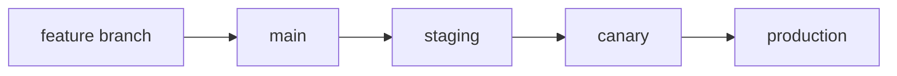

# Version Control and Release

This is post 6 in the Software Engineering 101 series.

> Software Engineering 101 series (6/10)

<!-- a-grade-intro:begin -->

**Core question**: When you ship version 1.4.2, what exactly are you promising the user?

> Semantic versioning is the notation for that promise. Break it and trust collapses.

<!-- a-grade-intro:end -->

## What You Will Learn

- Branching strategies (Trunk-Based vs Git Flow)
- The meaning of Semantic Versioning (SemVer)
- How to generate changelogs automatically
- Safe releases via canary and rollback
- Writing release notes in the user's language

## Why It Matters

A release is the only moment your code meets the user. If something fails here, every prior effort is forgotten.

> Safe releases build trust faster than fast releases.

## Concept at a Glance



Each stage shrinks the cost of recovery.

## Key Terms

- **Trunk-Based**: short branches, frequent merges.
- **Git Flow**: develop/release/hotfix branching model.
- **SemVer**: MAJOR.MINOR.PATCH (breaking/feature/fix).
- **Changelog**: user-facing record of changes.
- **Canary**: small slice of traffic exposed first.

## Before/After

**Before — giant release**

```text
200 PRs every two weeks -> impossible to localize a bug
```

**After — incremental release**

```text
multiple merges per day -> 5% canary -> monitor -> 100%
```

Smaller and more frequent is safer.

## Hands-on: A Small Release Pipeline

### Step 1 — Conventional Commits

```text
# 1_commits.txt
feat(auth): add refresh token rotation
fix(billing): handle zero amount invoices
chore(deps): bump fastapi to 0.110
```

Machine-readable messages are the start of automation.

### Step 2 — Decide SemVer

```text
# 2_semver.md
feat -> MINOR
fix  -> PATCH
BREAKING CHANGE -> MAJOR
```

Commits decide the version.

### Step 3 — Auto changelog

```yaml
# 3_release.yml
- uses: googleapis/release-please-action@v4
  with:
    release-type: python
```

Merging PRs generates a release PR automatically.

### Step 4 — Canary deployment

```yaml
# 4_canary.yml
strategy:
  canary:
    weight: 5
    after: { metrics: error_rate < 0.5%, duration: 10m }
```

Expose to a few first, expand only on healthy signals.

### Step 5 — Instant rollback

```bash
# 5_rollback.sh
kubectl rollout undo deployment/api
```

Rollback should complete inside one minute.

## What to Notice in This Code

- Commit conventions feed automation.
- Canary is a recoverable decision.
- Rollback speed is a measure of safety.
- Changelogs must speak in user language.

## Five Common Mistakes

1. **Manual version numbers.** Humans forget.
2. **Untested rollback.** Your first rehearsal is the incident.
3. **Giant releases.** Impossible to localize a defect.
4. **No commit convention.** Automation stops working.
5. **Release notes in dev jargon.** Trust leaks away.

## How This Shows Up in Production

Mature teams combine trunk-based + feature flags + auto SemVer + canary + instant rollback. Their MTTR (mean time to recovery) is measured in minutes.

## How a Senior Engineer Thinks

- A release must be recoverable in minutes.
- SemVer is a contract with users.
- Frequent shipping is safe shipping.
- Any human-touched step is an automation candidate.
- Design assuming incidents will happen.

## Checklist

- [ ] Is the branching strategy written down?
- [ ] Is version selection automated?
- [ ] Is the changelog in user language?
- [ ] Is there a canary stage?
- [ ] Can you roll back in under a minute?

## Practice Problems

1. Convert ten of your own commit messages to conventional commits.
2. Rewrite a recent release note in user language.
3. Write a one-page rollback runbook.

## Wrap-up and Next Steps

Releases are the interface of trust. Next we capture that trust in writing — documentation.

<!-- toc:begin -->
- [What is Software Engineering?](./01-what-is-software-engineering.md)
- [Understanding Requirements](./02-understanding-requirements.md)
- [Design vs Implementation](./03-design-vs-implementation.md)
- [Code Review](./04-code-review.md)
- [Testing Strategy](./05-testing-strategy.md)
- **Version Control and Release (current)**
- Documentation (upcoming)
- Collaboration Process (upcoming)
- Maintenance and Tech Debt (upcoming)
- What Makes Good Software (upcoming)
<!-- toc:end -->

## References

- [Semantic Versioning 2.0.0](https://semver.org/)
- [Conventional Commits 1.0.0](https://www.conventionalcommits.org/)
- [Trunk-Based Development](https://trunkbaseddevelopment.com/)
- [Google SRE Book — Release Engineering](https://sre.google/sre-book/release-engineering/)

Tags: Computer Science, SoftwareEngineering, Git, VersionControl, Release, SemVer
