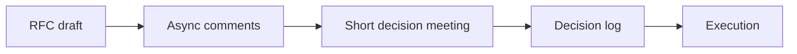

# Collaboration Process

> Software Engineering 101 series (8/10)

<!-- a-grade-intro:begin -->

**Core question**: Why do outcomes get better when there are fewer meetings?

> Async decisions return time to everyone and leave a written trail.

<!-- a-grade-intro:end -->

## What You Will Learn

- How to write an RFC (Request for Comments)
- When to choose sync vs async
- Four patterns to reduce meetings
- Decision-record models (DACI / RAPID)
- Handoff in distributed teams

## Why It Matters

Code can be written alone, but products are not. Without a process, technical decisions get decided by relationships instead of facts.

> A good process protects people.

## Concept at a Glance



Async-first; sync only at the moment of decision.

## Key Terms

- **RFC**: Proposal and discussion document.
- **DACI**: Driver, Approver, Contributor, Informed.
- **Async-first**: Writing first, meetings last.
- **Decision log**: Who decided what, when.
- **Handoff**: Transferring work across time zones.

## Before/After

**Before — meeting-driven**

```text
12 meetings a week, no decision trail -> same debate repeats
```

**After — RFC + decision meeting**

```text
3 days async on RFC -> 30-min decision meeting -> decision log
```

Meetings exist only to make decisions.

## Hands-on: A Tiny RFC and Decision Log

### Step 1 — RFC template

```markdown
# 1_rfc.md
## Title
## Problem
## Proposal
## Alternatives
## Risks
## Open questions
## Reviewers
```

Defining the problem is half the work.

### Step 2 — Async comments

```markdown
# 2_review.md
- @alice [blocking] cost estimate misses infra cost
- @bob [question] migration downtime?
- @carol [nit] terminology inconsistent
```

Tags make the decision boundary visible.

### Step 3 — Short decision meeting

```markdown
# 3_meeting.md
30 minutes, fewer than 5 people, agenda is one RFC link.
```

Decisions only. Discussion stays async.

### Step 4 — Decision log

```markdown
# 4_decision_log.md
| Date | Topic | Decision | Driver | Approver |
|------|-------|----------|--------|----------|
| 2026-05-04 | introduce cache | adopt Redis | A | B |
```

The same debate never happens twice.

### Step 5 — Handoff note

```markdown
# 5_handoff.md
## Up to yesterday
- API spec agreed
## Today
- implement handlers
## Blocked on
- waiting for token format clarification
```

The async interface of distributed teams.

## What to Notice in This Code

- Async-first crosses time zones for free.
- A decision log prevents repeated debates.
- Meetings are decision tools, not discussion tools.
- Handoff notes build trust.

## Five Common Mistakes

1. **Every decision in a meeting.** Time is your most expensive resource.
2. **No decision trail.** The same decision happens again.
3. **Implementing without an RFC.** Post-incident "why?" repeats forever.
4. **No designated approver.** Decisions never close.
5. **Meetings without notes.** The meeting itself becomes void.

## How This Shows Up in Production

Distributed teams (GitLab, Stripe, etc.) standardize on RFC + decision log + short decision meetings. Weekly RFC indices are auto-generated; if the approver is absent, the driver escalates.

## How a Senior Engineer Thinks

- Treat people's time like a resource, the same as code.
- Discuss in writing, decide together.
- Every decision needs an approver.
- Meetings are the last tool you reach for.
- Async-first is the baseline of distributed work.

## Checklist

- [ ] Do large changes have an RFC?
- [ ] Is the decision log searchable?
- [ ] Are meeting agenda and approver set in advance?
- [ ] Is there a handoff note template?
- [ ] Do meetings produce a written decision?

## Practice Problems

1. Replace one meeting this week with an RFC plus async comments.
2. Move five recent decisions into a decision-log table.
3. Draft a one-page handoff note template for your team.

## Wrap-up and Next Steps

Process gives time back to people. Next we look at what every long-lived system meets — maintenance and tech debt.

<!-- toc:begin -->
- [What is Software Engineering?](./01-what-is-software-engineering.md)
- [Understanding Requirements](./02-understanding-requirements.md)
- [Design vs Implementation](./03-design-vs-implementation.md)
- [Code Review](./04-code-review.md)
- [Testing Strategy](./05-testing-strategy.md)
- [Version Control and Release](./06-version-control-and-release.md)
- [Documentation](./07-documentation.md)
- **Collaboration Process (current)**
- Maintenance and Tech Debt (upcoming)
- What Makes Good Software (upcoming)
<!-- toc:end -->

## References

- [GitLab Handbook — Async Collaboration](https://handbook.gitlab.com/handbook/company/culture/all-remote/asynchronous/)
- [Oxide Computer — RFD Process](https://oxide.computer/blog/rfd-1-requests-for-discussion)
- [Atlassian — DACI Framework](https://www.atlassian.com/team-playbook/plays/daci)
- [Basecamp — Shape Up](https://basecamp.com/shapeup)

Tags: Computer Science, SoftwareEngineering, Collaboration, Process, RFC, Async
