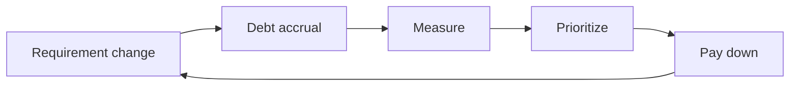

# Maintenance and Tech Debt

This is post 9 in the Software Engineering 101 series.

> Software Engineering 101 series (9/10)

<!-- a-grade-intro:begin -->

**Core question**: Is tech debt always bad?

> No. Deliberate debt is a tool. Inadvertent debt is an incident waiting to happen.

<!-- a-grade-intro:end -->

## What You Will Learn

- The four types of tech debt (Martin Fowler's quadrant)
- How to prioritize debt repayment
- A safe refactoring procedure
- Phased deprecation
- Treating debt as a measurable signal

## Why It Matters

There is no codebase without debt. The question is whether you are aware of it, measuring it, and paying it down.

> Debt is not the problem. Unconscious debt is.

## Concept at a Glance



Debt is a cycle, not an event.

## Key Terms

- **Deliberate-Prudent**: Conscious decision with a plan to pay it off.
- **Deliberate-Reckless**: Knowingly irresponsible.
- **Inadvertent-Prudent**: Debt from inexperience, paid off by learning.
- **Inadvertent-Reckless**: Unaware and irresponsible — the most dangerous.
- **Deprecation**: Phased retirement of an interface.

## Before/After

**Before — "all at once later"**

```text
big-bang refactor at month 12 -> incidents + schedule blow-up
```

**After — 5% per quarter**

```text
5% of each sprint, measured, prioritized -> incremental improvement
```

Small and frequent is safe.

## Hands-on: Treat Debt as Code

### Step 1 — Debt label

```python
# 1_label.py
# DEBT(billing): tax computation leaks into PaymentService
# Due: 2026 Q3, owner: @alice
def charge(amount): ...
```

Debt needs a due date and an owner.

### Step 2 — Debt index

```markdown
# 2_index.md
| ID | Area | Severity | Owner | Due |
|----|------|----------|-------|-----|
| D-12 | billing | high | alice | 2026 Q3 |
| D-13 | auth | mid | bob | 2026 Q4 |
```

Only searchable debt is payable debt.

### Step 3 — Strangler Fig pattern

```python
# 3_strangler.py
def charge(amount):
    if feature("new_billing"):
        return new_billing.charge(amount)
    return legacy.charge(amount)
```

Replace incrementally with a feature flag.

### Step 4 — Deprecation phases

```python
# 4_deprecate.py
import warnings
def old_api(*a, **kw):
    warnings.warn("old_api is deprecated; use new_api", DeprecationWarning, stacklevel=2)
    return new_api(*a, **kw)
```

Warn -> trace callers -> remove (one phase per quarter).

### Step 5 — Debt metrics dashboard

```text
# 5_metrics.md
- Average cyclomatic complexity
- Test coverage delta
- Debt items closed per sprint
- Mean time to recovery (MTTR) on incidents
```

What you do not measure, you do not pay.

## What to Notice in This Code

- Debt has a due date and an owner.
- The Strangler Fig pattern is recoverable replacement.
- Deprecation is phased and measurable.
- Without metrics, debt is forgotten.

## Five Common Mistakes

1. **Big-bang refactor.** A leading cause of incidents.
2. **No debt label.** Unsearchable, unpayable.
3. **Removing a deprecated API immediately.** Callers break.
4. **Blaming people for debt.** Debt is a system outcome.
5. **No debt metric.** Unmeasured, unprioritized.

## How This Shows Up in Production

Mature teams allocate 10~20% of sprint capacity to debt repayment. Strangler Fig + feature flags enable zero-downtime replacement. The debt index is reviewed each quarter.

## How a Senior Engineer Thinks

- Debt is a cycle, not an event.
- Deliberate debt is a tool, unconscious debt is an incident.
- Debt without a due date becomes permanent.
- Incremental beats big-bang almost every time.
- Only what you measure gets paid.

## Checklist

- [ ] Is there a debt index?
- [ ] Does each debt item have an owner and a due date?
- [ ] Is sprint capacity allocated to debt?
- [ ] Are deprecation phases defined?
- [ ] Do debt metrics live on a dashboard?

## Practice Problems

1. Label five debt items in your repo.
2. Decompose your most dangerous debt item using Strangler Fig.
3. Define five debt-metric items for a dashboard.

## Wrap-up and Next Steps

Debt is a cycle. Be aware, measure, pay down each quarter. The final episode ties it all together — what makes good software.

<!-- toc:begin -->
- [What is Software Engineering?](./01-what-is-software-engineering.md)
- [Understanding Requirements](./02-understanding-requirements.md)
- [Design vs Implementation](./03-design-vs-implementation.md)
- [Code Review](./04-code-review.md)
- [Testing Strategy](./05-testing-strategy.md)
- [Version Control and Release](./06-version-control-and-release.md)
- [Documentation](./07-documentation.md)
- [Collaboration Process](./08-collaboration-process.md)
- **Maintenance and Tech Debt (current)**
- What Makes Good Software (upcoming)
<!-- toc:end -->

## References

- [Martin Fowler — Technical Debt Quadrant](https://martinfowler.com/bliki/TechnicalDebtQuadrant.html)
- [Martin Fowler — StranglerFigApplication](https://martinfowler.com/bliki/StranglerFigApplication.html)
- [Refactoring — Martin Fowler](https://martinfowler.com/books/refactoring.html)
- [Working Effectively with Legacy Code — Michael Feathers](https://www.oreilly.com/library/view/working-effectively-with/0131177052/)

Tags: Computer Science, SoftwareEngineering, Maintenance, TechDebt, Refactoring, Legacy
