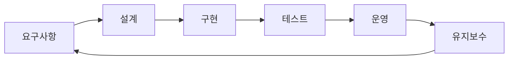

# 소프트웨어 엔지니어링이란 무엇인가?

> Software Engineering 101 시리즈 (1/10)

<!-- a-grade-intro:begin -->

**핵심 질문**: 코딩만 잘하면 소프트웨어 엔지니어인가요?

> 코드는 결과물의 일부일 뿐입니다. 엔지니어링은 코드 + 시간 + 사람의 문제입니다.

<!-- a-grade-intro:end -->

## 이 글에서 배울 것

- 코딩과 소프트웨어 엔지니어링의 차이
- 엔지니어가 책임지는 5가지 영역
- "올바른 것"과 "올바르게"의 균형
- 시간 축 위에서 보는 시스템
- 시리즈 전체의 큰 그림

## 왜 중요한가

대부분의 학습은 "코드를 쓰는 법"에서 멈춥니다. 하지만 실무는 코드 + 협업 + 운영의 결합입니다. 이 차이를 이해하면 다음 10년의 학습 방향이 정해집니다.

> 한 번 동작하는 코드와 5년 동안 살아남는 시스템은 다릅니다.

## 개념 한눈에 보기



엔지니어링은 끊기지 않는 순환입니다.

## 핵심 용어 정리

- **소프트웨어 엔지니어링**: 시간과 협업을 고려한 소프트웨어 개발 활동.
- **요구사항**: "무엇을" 만들지에 대한 합의.
- **설계**: "어떻게" 만들지에 대한 결정.
- **유지보수**: 만든 후의 모든 변화 — 사실 가장 긴 단계.
- **품질 속성**: 정확성, 신뢰성, 성능, 보안, 유지보수성.

## Before/After

**Before — 코더의 시각**

```text
요구 -> 코드 -> 동작 -> 끝
```

**After — 엔지니어의 시각**

```text
요구 -> 설계 -> 코드 -> 테스트 -> 운영 -> 변경 -> 회고 -> 다시
```

같은 코드라도 시야의 길이가 다릅니다.

## 실습: 시야의 차이 체감하기

### 1단계 — "한 번만 동작" 코드

```python
# 1_quick.py
import sys
n = int(sys.argv[1])
print(sum(range(n)))
```

오늘 동작하면 충분합니다.

### 2단계 — "다른 사람도 쓸" 코드

```python
# 2_reusable.py
def sum_to(n: int) -> int:
    """0..n-1 합."""
    if n < 0: raise ValueError("n must be >= 0")
    return n * (n - 1) // 2
```

타입, docstring, 입력 검증이 추가됩니다.

### 3단계 — "프로덕션" 코드

```python
# 3_prod.py
import logging
log = logging.getLogger(__name__)

def sum_to(n: int) -> int:
    if n < 0:
        log.warning("invalid input n=%s", n)
        raise ValueError("n must be >= 0")
    return n * (n - 1) // 2
```

로깅, 모니터링 가능성이 추가됩니다.

### 4단계 — 테스트 추가

```python
# 4_test.py
import pytest
from prod import sum_to

def test_sum_to_basic(): assert sum_to(5) == 10
def test_sum_to_zero(): assert sum_to(0) == 0
def test_sum_to_negative():
    with pytest.raises(ValueError): sum_to(-1)
```

테스트가 있어야 변경이 가능합니다.

### 5단계 — 문서화

```text
# 5_README.md
## sum_to
- 입력: 음이 아닌 정수
- 출력: 0..n-1 합
- 복잡도: O(1)
- 변경 이력: 2026-05 v1
```

다음 사람을 위한 최소한의 안내.

## 이 코드에서 주목할 점

- 같은 함수가 단계마다 더 많은 책임을 집니다.
- 코드 양은 늘지만 사고 비용은 줍니다.
- 각 단계는 다른 시간 축을 봅니다.
- 엔지니어링은 trade-off의 명시적 결정입니다.

## 자주 하는 실수 5가지

1. **요구를 듣자마자 코딩.** 잘못된 문제를 푸는 가장 빠른 길.
2. **테스트를 "나중에".** 거의 영원히 안 옴.
3. **문서 = 사치.** 다음 사람의 시간을 훔치는 일.
4. **운영을 "그쪽 일".** 만든 사람이 가장 잘 압니다.
5. **혼자 결정.** 좋은 결정은 합의에서 나옵니다.

## 실무에서는 이렇게 쓰입니다

대형 조직은 RFC, ADR(Architecture Decision Record)로 의사결정을 기록합니다. SRE는 운영을 별도 직군으로 분리하기보다 협업으로 풀어냅니다. 코드 리뷰, 페어 프로그래밍, 회고가 일상입니다.

## 시니어 엔지니어는 이렇게 생각합니다

- "동작"이 아니라 "운영 가능"을 목표로.
- 결정의 이유를 글로 남깁니다.
- 코드보다 합의에 더 시간을 씁니다.
- 미래의 자신/팀을 위해 씁니다.
- 학습을 일상에 끼워 넣습니다.

## 체크리스트

- [ ] 코드와 엔지니어링의 차이를 한 줄로 답할 수 있는가?
- [ ] 5가지 책임 영역을 말할 수 있는가?
- [ ] "올바른 것"과 "올바르게"를 구분할 수 있는가?
- [ ] 자신의 코드가 어느 단계에 있는지 분류할 수 있는가?
- [ ] 다음 10년의 학습 방향을 한 줄로 적을 수 있는가?

## 연습 문제

1. 본인이 최근에 쓴 코드 한 편을 5단계로 분류해 보세요.
2. "올바른 것"과 "올바르게"의 trade-off가 있었던 경험을 적어 보세요.
3. 다음 시리즈 중 가장 약한 영역을 하나 골라 보세요 (요구/설계/리뷰/테스트/운영).

## 정리 및 다음 단계

엔지니어링은 코드의 다른 이름이 아닙니다. 다음 글에서는 모든 출발점 — 요구사항 이해하기 — 를 봅니다.

<!-- toc:begin -->
- **소프트웨어 엔지니어링이란 무엇인가? (현재 글)**
- 요구사항 이해하기 (예정)
- 설계와 구현의 차이 (예정)
- 코드 리뷰 (예정)
- 테스트 전략 (예정)
- 버전 관리와 릴리스 (예정)
- 문서화 (예정)
- 협업 프로세스 (예정)
- 유지보수와 기술부채 (예정)
- 좋은 소프트웨어의 기준 (예정)
<!-- toc:end -->

## 참고 자료

- [IEEE — SWEBOK Guide v3](https://www.computer.org/education/bodies-of-knowledge/software-engineering)
- [Software Engineering at Google (free book)](https://abseil.io/resources/swe-book)
- [The Pragmatic Programmer — David Thomas, Andrew Hunt](https://pragprog.com/titles/tpp20/the-pragmatic-programmer-20th-anniversary-edition/)
- [Martin Fowler — Articles](https://martinfowler.com/articles.html)

Tags: Computer Science, SoftwareEngineering, Engineering, Process, Quality, Career
