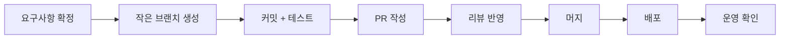

# Software Engineering 101 (1/10): 소프트웨어 엔지니어링이란 무엇인가?

처음 프로그래밍을 배울 때는 대개 코드가 돌아가면 끝이라고 느낍니다. 작은 스크립트 하나를 만들고, 입력을 받아 결과를 출력하면 목표를 달성한 것처럼 보입니다. 학습 단계에서는 맞는 감각입니다. 하지만 팀이 쓰는 제품, 수년 동안 유지할 시스템, 장애와 변경을 반복해서 겪는 서비스를 다루기 시작하면 질문이 완전히 달라집니다.

실무에서 중요한 것은 “코드를 쓸 수 있는가”보다 “시간과 사람의 변화 속에서도 시스템을 운영 가능한 상태로 유지할 수 있는가”입니다. 같은 함수 하나를 작성하더라도 요구사항, 테스트, 배포, 운영, 문서화, 협업까지 함께 책임져야 비로소 엔지니어링이라는 말이 맞아집니다.


*Software Engineering 101 1장 흐름 개요*

## 먼저 던지는 질문

- 코드를 작성하는 일과 소프트웨어 엔지니어링은 무엇이 다를까요?
- 엔지니어는 코드 외에 어떤 영역까지 책임져야 할까요?
- “맞는 일을 고르는 것”과 “일을 제대로 만드는 것”은 어떻게 다를까요?

## 왜 중요한가

학습 자료의 상당수는 문법과 프레임워크 사용법에서 멈춥니다. 그런데 실제 업무는 코드만으로 굴러가지 않습니다. 요구사항을 잘못 이해하면 며칠을 구현해도 틀린 결과가 나오고, 테스트가 없으면 변경 한 번이 두려워지고, 문서가 없으면 팀의 속도가 특정 사람의 기억력에 묶입니다.

그래서 소프트웨어 엔지니어링은 “코드를 더 잘 짜는 기술”보다 넓은 개념입니다. 어떤 문제를 풀어야 하는지 합의하고, 그 해법의 경계를 설계하고, 변경 비용을 낮추는 구조를 만들고, 장애가 났을 때 회복 가능한 시스템을 운영하는 일까지 포함합니다. 한 번 동작하는 코드와 5년 동안 살아남는 시스템이 다른 이유가 여기에 있습니다.

## 한눈에 보는 흐름

소프트웨어 엔지니어링은 시작과 끝이 분리된 직선 작업이 아니라, 계속 되돌아오는 순환입니다.

## 핵심 용어

- **소프트웨어 엔지니어링**: 시간의 흐름과 협업 비용까지 고려하는 개발 방식입니다.
- **요구사항**: 무엇을 만들어야 하는지에 대한 합의입니다.
- 설계: 어떤 경계와 책임으로 만들지 정하는 단계입니다.
- **유지보수**: 배포 이후 발생하는 모든 수정과 개선입니다.
- **품질 속성**: 정확성, 신뢰성, 성능, 보안, 유지보수성처럼 시스템의 성격을 규정하는 기준입니다.

## 전후 비교

**이전 — 코더의 시각**

```text
need -> code -> works -> done
```

**이후 — 엔지니어의 시각**

```text
need -> design -> code -> test -> operate -> change -> reflect -> repeat
```

같은 코드라도 어떤 시간 범위에서 바라보느냐에 따라 전혀 다른 일이 됩니다.

## 단계별로 보는 책임 확장

### 1단계 — 한 번만 실행하는 코드

```python
# 1_quick.py
import sys
n = int(sys.argv[1])
print(sum(range(n)))
```

오늘 한 번 돌리고 끝나는 코드라면 이것만으로도 목적을 달성할 수 있습니다.

### 2단계 — 다른 사람이 써야 하는 코드

```python
# 2_reusable.py
def sum_to(n: int) -> int:
    """0..n-1의 합을 반환합니다."""
    if n < 0: raise ValueError("n must be >= 0")
    return n * (n - 1) // 2
```

재사용되는 순간부터 타입, 입력 검증, 최소한의 설명이 필요해집니다.

### 3단계 — 운영 환경으로 가는 코드

```python
# 3_prod.py
import logging
log = logging.getLogger(__name__)

def sum_to(n: int) -> int:
    if n < 0:
        log.warning("invalid input n=%s", n)
        raise ValueError("n must be >= 0")
    return n * (n - 1) // 2
```

운영 단계에서는 계산 결과만큼이나 실패 상황을 읽을 수 있어야 합니다. 그래서 로깅과 관측성이 들어옵니다.

### 4단계 — 변경 가능한 코드

```python
# 4_test.py
import pytest
from prod import sum_to

def test_sum_to_basic(): assert sum_to(5) == 10
def test_sum_to_zero(): assert sum_to(0) == 0
def test_sum_to_negative():
    with pytest.raises(ValueError): sum_to(-1)
```

테스트가 없으면 코드는 동작하더라도 쉽게 건드릴 수 없습니다. 변화 비용이 바로 올라갑니다.

### 5단계 — 다음 사람을 위한 코드

```text
# 5_README.md
## 합계 계산 예시 함수
- input: non-negative integer
- output: sum of 0..n-1
- complexity: O(1)
- history: 2026-05 v1
```

문서는 화려할 필요가 없습니다. 다음 사람이 안전하게 이어서 작업할 수 있으면 됩니다.

## 빠르게 검증해 보기

지금 맡은 저장소에서 작은 유틸리티나 배치 스크립트 하나를 골라 이 글의 다섯 단계에 대입해 보세요. 코드가 짧더라도 요구사항, 테스트, 운영, 문서 중 어느 층이 비어 있는지 바로 드러납니다.

### 확인 절차

1. 최근 2주 안에 수정한 함수 하나를 고릅니다.
2. 요구사항, 테스트, 로그, 문서, 운영 영향이 각각 존재하는지 메모합니다.
3. 빠진 항목이 있으면 다음 변경에서 무엇을 먼저 보강할지 한 줄로 적습니다.

**예상 결과:**

- 처음에는 "코드는 있지만 운영 정보가 없다"처럼 빈칸이 먼저 보입니다.
- 개인 코드라고 생각했던 항목도 다른 사람이 쓰는 순간 2단계 이상으로 올라간다는 점이 드러납니다.
- 다음 리팩터링이나 문서화 작업의 우선순위를 정하기 쉬워집니다.

### 실패 신호

- 어디까지가 완료 기준인지 팀마다 다르게 답합니다.
- 예외 처리와 로그가 모두 없어서 실패 상황을 설명하지 못합니다.
- 다음 사람이 이 코드를 어디서부터 읽어야 할지 README나 주석에 단서가 없습니다.

## 이 코드에서 먼저 봐야 할 점

- 같은 함수라도 단계가 올라갈수록 책임이 늘어납니다.
- 코드 줄 수는 늘어나지만, 팀이 감당해야 할 인지 비용은 오히려 줄어듭니다.
- 각 단계는 서로 다른 시간 범위를 보고 있습니다.
- 엔지니어링은 트레이드오프를 드러내고 가격을 매기는 일에 가깝습니다.

## 어디서 자주 헷갈릴까요?

첫 번째 오해는 “잘 돌아가는 코드면 충분하다”는 생각입니다. 개인 실험이나 짧은 자동화 스크립트에서는 맞을 수 있습니다. 하지만 제품 코드에서는 장애 대응, 테스트, 변경 기록, 배포 절차가 빠지는 순간 시스템 전체 비용이 올라갑니다.

두 번째 오해는 엔지니어링을 순수하게 기술 난도 문제로만 보는 시각입니다. 실무에서 어려운 일은 대개 합의와 경계 설정에서 시작합니다. 무엇을 만들지 정하지 못한 상태에서 구현을 빨리 시작해도 팀은 빨라지지 않습니다.

세 번째 오해는 운영을 “배포 후의 일”로 밀어 두는 습관입니다. 실제로는 설계와 구현 단계에서 운영 가능성을 같이 넣지 않으면 나중에 복구가 어려운 구조가 남습니다.

## 실무에서는 이렇게 생각합니다

강한 팀은 기능을 만드는 속도보다 변경을 안전하게 반복하는 능력을 더 중요하게 봅니다. 요구사항과 설계가 글로 남고, 코드 리뷰와 테스트가 기본 흐름에 들어가며, 운영에서 얻은 교훈이 다음 요구사항에 다시 반영됩니다. 앞의 다이어그램이 실무에서 계속 도는 이유입니다.

시니어 엔지니어는 보통 “이 코드가 동작하는가”에서 멈추지 않습니다. “이 결정은 왜 내려졌는가”, “6개월 뒤에도 같은 팀이 이 구조를 유지할 수 있는가”, “장애가 나면 누가 어디를 봐야 하는가” 같은 질문을 함께 봅니다. 이 차이가 코더와 엔지니어의 차이를 만듭니다.

## 체크리스트

- [ ] 코딩과 엔지니어링의 차이를 한 문장으로 설명할 수 있나요?
- [ ] 엔지니어가 책임지는 다섯 영역을 떠올릴 수 있나요?
- [ ] 맞는 일을 고르는 것과 일을 제대로 만드는 것을 구분하나요?
- [ ] 내가 최근에 작성한 코드를 다섯 단계 중 어디에 놓을지 판단할 수 있나요?
- [ ] 다음 학습 단계로 무엇을 보완해야 할지 보이나요?

## 연습 문제

1. 최근에 작성한 코드 하나를 고르고, 이 글의 다섯 단계 중 어디에 해당하는지 분류해 보세요.
2. “맞는 일을 고르는 것”과 “일을 제대로 만드는 것”이 충돌했던 경험을 정리해 보세요.
3. 다음 글들 가운데 지금 가장 약한 영역이 무엇인지 적어 보세요.

## 요구사항-리뷰-테스트 연결표

엔지니어링에서 자주 놓치는 지점은 세 문서가 따로 움직이는 상황입니다. 요구사항 문서는 목표만 말하고, 리뷰는 스타일 중심으로 흘러가고, 테스트는 구현 이후에 뒤따라옵니다. 이렇게 분리되면 기능은 동작해도 품질 기준이 흐려집니다. 아래처럼 연결표를 두면 변경 영향이 추적됩니다.

```text
REQ-12: 만료 쿠폰 거부
- Review check: 상태 코드 400 + error_code=coupon_expired 확인
- Test case: test_apply_expired_coupon
- Metric: coupon_expired 발생 비율
```

연결표를 유지하면 "무엇을 만들었는가"가 아니라 "어떤 기준을 만족했는가"로 대화가 바뀝니다. 회고 시점에도 장애 원인을 요구사항 해석, 리뷰 누락, 테스트 공백 중 어디서 시작됐는지 빠르게 찾을 수 있습니다.

### 운영 전환 체크

- 배포 노트에 요구사항 ID와 PR 링크를 함께 남깁니다.
- 온콜 핸드오프 문서에 새 기능의 실패 시그널을 명시합니다.
- 첫 24시간 관찰 지표와 임계치를 릴리스 전에 고정합니다.

이 작은 연결 장치가 있으면 팀 규모가 커져도 품질 기준이 개인 기억에 의존하지 않습니다.

## 실무에서 바로 쓰는 운영 기준

소프트웨어 엔지니어링을 코딩과 구분하는 가장 쉬운 방법은 "결정 근거를 남기고 재현 가능한 흐름을 만든다"는 기준을 두는 것입니다. 개인 작업에서는 머릿속으로 처리하던 판단을 팀 작업에서는 문서와 자동화로 바꿔야 합니다. 그래야 사람이 바뀌어도 품질이 유지됩니다.

### 요구사항 문서 최소 템플릿

아래 템플릿은 기능 하나를 시작하기 전에 반드시 채워 두는 최소 항목입니다. 길게 쓰는 것보다 애매한 문장을 없애는 데 목적이 있습니다.

```markdown
# 기능명
- 배경: 왜 지금 필요한가
- 사용자: 누가 어떤 상황에서 쓰는가
- 성공 기준: 측정 가능한 숫자 1~3개
- 범위 포함: 이번 릴리스에 반드시 포함할 항목
- 범위 제외: 이번 릴리스에서 하지 않을 항목
- 인수 기준: Given/When/Then 3~5개
- 운영 영향: 알람, 로그, 대시보드 변경 여부
- 롤백 계획: 실패 시 되돌리는 절차
```

### 설계 리뷰 체크리스트

설계 문서는 완성도를 뽐내는 문서가 아니라, 위험을 미리 노출하는 문서여야 합니다. 리뷰에서 아래 질문이 모두 "예"여야 구현을 시작합니다.

- 책임 경계가 명확한지 확인합니다.
- 데이터 소유권과 동기화 기준이 분명한지 확인합니다.
- 장애 시 우회 경로와 복구 절차가 있는지 확인합니다.
- 3개월 뒤 변경 요청이 와도 확장 가능한지 확인합니다.
- 관측성(로그/메트릭/트레이스) 설계가 포함되었는지 확인합니다.

### Git 워크플로 다이어그램 예시



이 다이어그램이 단순해 보여도 핵심은 "작게 자주"입니다. 브랜치 수명을 줄이고 PR 크기를 제한하면 리뷰 품질과 배포 안정성이 함께 좋아집니다.

### 기술부채 추적 항목

엔지니어링 조직은 부채를 감정으로 말하지 않고 항목으로 관리합니다. 최소한 다음 필드는 이슈 트래커에 남기는 것이 좋습니다.

- 부채 유형: 구조, 테스트, 운영, 문서
- 발생 이유: 의도적 단축인지, 사고 대응인지
- 현재 비용: 주당 추가 소요 시간 또는 장애 위험
- 상환 계획: 언제 어떤 작업으로 줄일지
- 상환 완료 기준: 측정 가능한 종료 조건

## 엔지니어링 관점의 실행 단위 만들기

소프트웨어 엔지니어링을 업무에 적용하려면 개념을 실행 단위로 바꿔야 합니다. 팀에서는 보통 기능 요청이 들어오면 바로 구현으로 뛰어들고 싶어집니다. 그러나 이때 30분만 투자해 문제 정의, 성공 조건, 검증 방법을 먼저 적어 두면 이후의 혼선이 크게 줄어듭니다.

아래는 기능 착수 전에 작성하는 최소 실행 카드 예시입니다.

```markdown
[기능 실행 카드]
- 문제: 어떤 사용자 불편을 줄이려는가
- 성공 조건: 어떤 지표가 어떻게 변해야 성공인가
- 제외 범위: 이번 변경에서 하지 않을 것은 무엇인가
- 검증 방법: 로컬/스테이징/운영에서 무엇을 확인할 것인가
- 롤백 기준: 어떤 신호가 보이면 즉시 되돌릴 것인가
```

이 카드는 요구사항 문서의 축약본처럼 보이지만, 실제로는 코드 리뷰와 배포 판단까지 연결되는 공통 언어입니다. 팀원 모두가 같은 기준으로 판단할 수 있어야 "잘 만든 코드"가 아니라 "잘 운영되는 기능"을 만들 수 있습니다.

## 운영 품질을 위한 최소 대시보드

엔지니어링의 핵심은 만든 뒤에도 상태를 읽을 수 있게 하는 것입니다. 출시 후 품질을 점검할 때는 아래 4개 신호를 먼저 봅니다.

- 실패율: 요청 실패 비율이 평소 대비 얼마나 증가했는가
- 지연 시간: 핵심 API 응답 시간이 기준선을 벗어났는가
- 변경 빈도: 배포 횟수가 지나치게 낮아지거나 높아지지 않았는가
- 복구 시간: 장애를 감지하고 복구하는 데 걸린 시간이 줄고 있는가

이 지표는 복잡한 관리 도구가 없어도 시작할 수 있습니다. 초기에는 스프레드시트와 간단한 주간 회고만으로도 충분하며, 중요한 것은 숫자 자체보다 같은 척도로 계속 비교하는 습관입니다.

## 엔지니어링 의사결정 로그 예시

팀이 커질수록 같은 논의를 반복하는 비용이 커집니다. 이를 줄이는 가장 단순한 방법은 의사결정 로그를 남기는 것입니다. 형식은 거창할 필요가 없습니다. 중요한 것은 나중에 읽었을 때 "왜 그 결정을 했는지"를 복원할 수 있는가입니다.

```markdown
결정 ID: ADR-SE-001
주제: 사용자 알림 재시도 정책
선택안:
- A: 즉시 3회 재시도
- B: 지수 백오프 5회 재시도
- C: 실패 즉시 수동 재처리
결론: B 선택
이유:
- 외부 API 일시 장애에 강함
- 운영자 개입 없이 회복 가능
- 처리 지연은 증가하지만 실패율 감소 효과가 큼
검증 지표:
- 알림 최종 성공률
- 평균 지연 시간
재검토 시점: 4주 후
```

이 로그는 설계 문서의 축약본이면서 운영 회고의 출발점이 됩니다. 엔지니어링은 한 번의 정답을 찾는 일이 아니라, 결정과 결과를 연결해 학습하는 과정입니다.

## 릴리스 후 점검 루틴

출시 당일의 품질 점검은 아래처럼 시간대별로 나누면 누락이 줄어듭니다.

- 배포 직후 10분: 오류율, 핵심 API 지연 시간, 헬스 체크
- 배포 후 1시간: 사용자 핵심 행동 완료율, 결제/로그인 경로
- 배포 후 24시간: 고객 문의 유형, 운영 경보 발생 패턴

점검 결과는 "정상" 한 줄로 끝내지 않고 근거 수치를 함께 남겨야 합니다. 이런 기록이 누적되면 팀은 릴리스 안정성의 기준선을 확보하게 됩니다.

## 현업 적용을 위한 점검 메모

실무에서는 개별 기술 선택보다 운영 가능한 흐름을 먼저 고정하는 것이 중요합니다. 요구사항, 설계, 구현, 리뷰, 테스트, 배포, 회고를 하나의 루프로 연결하면 팀의 예측 가능성이 높아집니다. 특히 일정이 촉박할수록 문서와 체크리스트를 줄이는 대신 더 짧고 명확한 형식으로 유지해야 합니다.

다음 스프린트에서 바로 적용할 수 있는 최소 실천 항목은 세 가지입니다. 첫째, 모든 변경에 대해 성공 기준과 검증 명령을 남깁니다. 둘째, 실패 시 되돌리는 기준을 수치로 정의합니다. 셋째, 릴리스 후 24시간 이내 회고 메모를 남겨 다음 변경에 반영합니다. 이 세 가지가 자리 잡으면 팀은 바쁜 상황에서도 품질을 우연에 맡기지 않게 됩니다.

## 정리

소프트웨어 엔지니어링은 코드를 더 많이 쓰는 일이 아닙니다. 시간이 지나도 유지 가능한 구조를 만들고, 여러 사람이 함께 일해도 품질이 무너지지 않게 하는 일입니다. 이 시리즈는 그 관점을 요구사항, 설계, 리뷰, 테스트, 릴리스, 문서화, 협업, 유지보수, 품질로 차례로 풀어 갑니다.

다음 글에서는 모든 작업의 출발점인 요구사항을 다룹니다. 듣는 것과 이해하는 것은 왜 다른지, 그리고 좋은 요구사항이 어떻게 테스트 가능한 형태로 바뀌는지 봅니다.

## 처음 질문으로 돌아가기

- **코드를 작성하는 일과 소프트웨어 엔지니어링은 무엇이 다를까요?**
  - 본문의 기준은 소프트웨어 엔지니어링이란 무엇인가?를 한 덩어리 개념으로 보지 않고 입력, 처리, 검증, 운영 신호가 만나는 경계로 나누어 확인하는 것입니다.
- **엔지니어는 코드 외에 어떤 영역까지 책임져야 할까요?**
  - 예제와 그림에서는 어떤 값이 들어오고, 어느 단계에서 바뀌며, 어떤 기준으로 통과 또는 실패하는지를 먼저 확인해야 합니다.
- **“맞는 일을 고르는 것”과 “일을 제대로 만드는 것”은 어떻게 다를까요?**
  - 운영에서는 이 판단을 체크리스트, 로그, 테스트로 남겨 다음 변경에서도 같은 실패가 반복되지 않게 막아야 합니다.

<!-- toc:begin -->
## 시리즈 목차

- **소프트웨어 엔지니어링이란 무엇인가? (현재 글)**
- 요구사항 이해하기 (예정)
- 설계와 구현의 차이 (예정)
- 코드 리뷰 (예정)
- 테스트 전략 (예정)
- 버전 관리와 릴리스 (예정)
- 문서화 (예정)
- 협업 프로세스 (예정)
- 유지보수와 기술부채 (예정)
- 좋은 소프트웨어의 기준 (예정)

<!-- toc:end -->

## 참고 자료

- [Software Engineering 101 예제 코드 (book-examples)](https://github.com/yeongseon-books/book-examples/tree/main/software-engineering-101/ko)
- [IEEE — SWEBOK Guide v3](https://www.computer.org/education/bodies-of-knowledge/software-engineering)
- [Software Engineering at Google (free book)](https://abseil.io/resources/swe-book)
- [The Pragmatic Programmer — David Thomas, Andrew Hunt](https://pragprog.com/titles/tpp20/the-pragmatic-programmer-20th-anniversary-edition/)
- [Martin Fowler — Articles](https://martinfowler.com/articles.html)

Tags: Computer Science, SoftwareEngineering, Engineering, Process, Quality, Career
