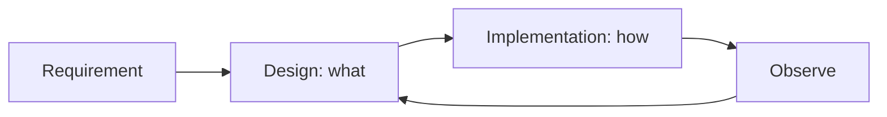

# 설계와 구현의 차이

코드 리뷰를 하다 보면 “코드는 깔끔한데 구조는 불안하다”는 느낌을 받을 때가 있습니다. 반대로 코드 한 줄 한 줄은 화려하지 않아도 전체 경계가 분명해서 오래 버틸 것 같은 시스템도 있습니다. 이 차이는 대개 구현 품질보다 설계 품질에서 나옵니다.

설계와 구현을 같은 일로 취급하면 두 단계가 함께 흐려집니다. 무엇을 분리할지, 어떤 책임을 어디에 둘지, 어떤 선택을 되돌릴 수 있게 만들지 같은 질문이 코드 안에 묻혀 버리기 때문입니다. 그러면 구현은 열심히 했는데도 나중에 왜 그렇게 만들었는지 설명하기 어려운 시스템이 남습니다.

이 글은 Software Engineering 101 시리즈의 세 번째 글입니다. 여기서는 설계와 구현의 차이, ADR로 결정을 남기는 법, 그리고 과한 추상화를 피하면서도 경계를 분명하게 만드는 방법을 다룹니다.

## 이 글에서 다룰 문제

- 잘 작성된 코드와 잘 설계된 시스템은 무엇이 다를까요?
- 설계는 “무엇을”, 구현은 “어떻게”라는 말은 실제로 무슨 뜻일까요?
- ADR은 언제 쓰고, 어떤 수준으로 남겨야 할까요?
- 좋은 설계를 보면 어떤 신호가 보일까요?
- 미래를 대비한다는 이유로 과한 추상화를 넣는 실수는 어떻게 피할까요?

> 설계는 무엇을 만들지 정하는 일이고, 구현은 그 결정을 코드로 실현하는 일입니다. 둘을 섞으면 두 단계 모두 흐려집니다.

## 왜 중요한가

설계 결정은 코드보다 오래 살아남습니다. 구현은 필요하면 갈아엎을 수 있지만, 시스템 경계와 책임 분리가 잘못된 상태에서 기능이 쌓이면 수정 비용이 커집니다. 그래서 잘못된 설계를 좋은 코드로 덮는 일은 오래 가지 못합니다.

또한 설계는 팀 간 합의의 중심입니다. 인터페이스가 무엇인지, 어떤 모듈이 어떤 책임을 가지는지, 성능과 관측성을 어느 수준으로 보장할지 같은 결정은 혼자 머릿속에만 두고 끝낼 수 없습니다. 글로 남겨야 다음 사람이 그 결정을 이해하고 바꿀 수 있습니다.

## 한눈에 보는 흐름



설계는 구현의 방향을 정하고, 구현 이후의 관찰 결과는 다시 설계 판단으로 돌아옵니다.

## 핵심 용어

- 설계: 컴포넌트, 책임, 경계, 인터페이스를 정하는 일입니다.
- 구현: 설계 결정을 실제 코드로 만드는 일입니다.
- **ADR**: 하나의 결정과 이유를 짧게 남기는 문서입니다.
- **트레이드오프**: 얻는 것과 포기하는 것을 함께 보는 관점입니다.
- **YAGNI**: 오늘 필요하지 않은 것을 미리 만들지 않는 원칙입니다.

## 전후 비교

**이전 — 코드 안에 숨은 설계**

```text
"Just code it and refactor later" -> decisions hide in the code
```

**이후 — ADR로 드러난 설계**

```text
Options A/B/C, choice + reason, reversibility -> simpler code
```

설계가 밖으로 드러나면 구현은 오히려 단순해집니다.

## 단계별로 설계와 구현 분리하기

### 1단계 — 인터페이스부터 세우기

```python
# 1_iface.py
from typing import Protocol

class Notifier(Protocol):
    def send(self, user_id: str, body: str) -> None: ...
```

구현보다 먼저 책임 경계를 정의합니다. 누가 무엇을 제공해야 하는지가 먼저 보여야 합니다.

### 2단계 — 구현체를 둘 이상 놓아 보기

```python
# 2_impls.py
class EmailNotifier:
    def send(self, user_id, body): ...
class SMSNotifier:
    def send(self, user_id, body): ...
```

동일한 인터페이스를 따르는 구현체를 놓아 보면, 설계 경계가 실제로 유효한지 빠르게 확인할 수 있습니다.

### 3단계 — ADR로 결정 남기기

```text
# 3_adr.md
# ADR 0007: Notification channel abstraction
- Context: email/SMS/push are added often
- Decision: abstract via Notifier protocol
- Alternatives: direct if/elif, external SaaS integration
- Consequences: easy unit testing, negligible perf cost
```

ADR은 길 필요가 없습니다. 나중에 이유를 다시 찾을 수 있을 정도면 충분합니다.

### 4단계 — YAGNI로 덜어내기

```python
# 4_remove.py
# class NotifierFactory: ...        # 채널이 하나라면 아직 불필요
# class NotifierRegistry: ...       # 미래의 자유보다 현재의 단순함이 낫다
```

설계는 추가하는 일만이 아닙니다. 지금 불필요한 추상화를 빼는 일도 설계입니다.

### 5단계 — 관측성까지 설계에 포함하기

```python
# 5_obs.py
import logging
log = logging.getLogger(__name__)

class EmailNotifier:
    def send(self, user_id, body):
        log.info("notify", extra={"user": user_id, "channel": "email"})
        # ...
```

로그와 메트릭은 구현 마지막에 붙이는 장식이 아니라, 설계 단계에서 의도해야 하는 속성입니다.

## 이 코드에서 먼저 봐야 할 점

- 인터페이스는 책임 경계를 보이게 합니다.
- 다형성은 미래 변경 비용을 어떤 방식으로 지불할지 정하게 만듭니다.
- ADR은 나중에 바꿀 때 필요한 근거를 남깁니다.
- 관측성은 구현 세부사항이 아니라 설계 품질의 일부입니다.

## 어디서 자주 헷갈릴까요?

많이 나오는 오해는 “일단 짜고 나중에 리팩터링하면 된다”는 태도입니다. 작은 실험에는 맞을 수 있어도, 팀 단위 시스템에서는 설계 판단이 코드 깊숙이 숨으면서 변경 비용이 커지기 쉽습니다.

또 다른 오해는 미래를 대비한다는 명분으로 추상화를 너무 일찍 넣는 것입니다. 아직 채널이 하나뿐인데 팩토리, 레지스트리, 플러그인 구조를 다 만들어 두면 오늘의 단순함을 잃고 유지비만 남습니다. 추상화는 가능성보다 실제 변경 압력에 반응해야 합니다.

설계와 구현을 나누는 이유를 문서 작업 증가로만 보는 시각도 흔합니다. 하지만 ADR 한 장이 없어서 사고 후에 같은 질문을 계속 반복하는 비용이 훨씬 큽니다.

## 실무에서는 이렇게 생각합니다

성숙한 팀은 설계 결정을 깃 저장소 안에서 관리합니다. ADR은 PR로 바뀌고, 주요 시스템 경계는 README나 다이어그램에 남고, 큰 기능은 설계 검토를 거친 뒤 구현으로 들어갑니다. 설계가 코드 밖에 존재해야 팀이 그 결정을 같이 검토할 수 있습니다.

시니어 엔지니어는 설계를 “정답 찾기”보다 “되돌릴 수 있는 선택 만들기”로 보는 경우가 많습니다. 지금 단순한 선택이 더 낫다면 그렇게 하고, 바뀔 가능성이 높다면 인터페이스와 관측성만 미리 잡아 둡니다. 설계의 수준은 복잡함의 양이 아니라 변경 비용의 구조로 드러납니다.

## 체크리스트

- [ ] 큰 결정에 ADR이 있나요?
- [ ] 책임 경계가 인터페이스로 드러나나요?
- [ ] 추상화를 추가하기 전에 YAGNI 관점에서 덜어냈나요?
- [ ] 관측성이 설계 범위 안에 들어 있나요?
- [ ] 이 결정을 나중에 되돌릴 수 있나요?

## 연습 문제

1. 프로젝트에서 큰 결정 하나를 골라 ADR 한 장으로 정리해 보세요.
2. 아직 쓰이지 않는 추상화 두 개를 찾아 제거 계획을 적어 보세요.
3. 관측성이 부족한 모듈 하나를 골라 어떤 로그와 메트릭이 필요한지 써 보세요.

## 정리

설계와 구현은 같은 흐름 안에 있지만 다른 질문에 답합니다. 설계는 무엇을 어떤 경계로 만들지 정하고, 구현은 그 결정을 코드로 실현합니다. 이 구분이 선명할수록 코드도 더 단순해지고, 나중에 바꾸기도 쉬워집니다.

다음 글에서는 머지 직전의 마지막 품질 게이트인 코드 리뷰를 다룹니다. 무엇을 자동화로 넘기고, 사람은 어떤 판단에 집중해야 하는지 이어서 정리하겠습니다.

<!-- toc:begin -->
- [소프트웨어 엔지니어링이란 무엇인가?](./01-what-is-software-engineering.md)
- [요구사항 이해하기](./02-understanding-requirements.md)
- **설계와 구현의 차이 (현재 글)**
- 코드 리뷰 (예정)
- 테스트 전략 (예정)
- 버전 관리와 릴리스 (예정)
- 문서화 (예정)
- 협업 프로세스 (예정)
- 유지보수와 기술부채 (예정)
- 좋은 소프트웨어의 기준 (예정)
<!-- toc:end -->

## 참고 자료

- [Michael Nygard — Documenting Architecture Decisions](https://cognitect.com/blog/2011/11/15/documenting-architecture-decisions)
- [C4 Model — Simon Brown](https://c4model.com/)
- [ThoughtWorks — Architecture Decision Records](https://www.thoughtworks.com/radar/techniques/lightweight-architecture-decision-records)
- [Designing Data-Intensive Applications — Martin Kleppmann](https://dataintensive.net/)

Tags: Computer Science, SoftwareEngineering, Design, Architecture, Implementation, Tradeoff
