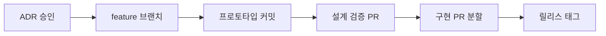

# Software Engineering 101 (3/10): 설계와 구현의 차이

코드 리뷰를 하다 보면 “코드는 깔끔한데 구조는 불안하다”는 느낌을 받을 때가 있습니다. 반대로 코드 한 줄 한 줄은 화려하지 않아도 전체 경계가 분명해서 오래 버틸 것 같은 시스템도 있습니다. 이 차이는 대개 구현 품질보다 설계 품질에서 나옵니다.

설계와 구현을 같은 일로 취급하면 두 단계가 함께 흐려집니다. 무엇을 분리할지, 어떤 책임을 어디에 둘지, 어떤 선택을 되돌릴 수 있게 만들지 같은 질문이 코드 안에 묻혀 버리기 때문입니다. 그러면 구현은 열심히 했는데도 나중에 왜 그렇게 만들었는지 설명하기 어려운 시스템이 남습니다.


*Software Engineering 101 3장 흐름 개요*

## 먼저 던지는 질문

- 잘 작성된 코드와 잘 설계된 시스템은 무엇이 다를까요?
- 설계는 “무엇을”, 구현은 “어떻게”라는 말은 실제로 무슨 뜻일까요?
- ADR은 언제 쓰고, 어떤 수준으로 남겨야 할까요?

## 왜 중요한가

설계 결정은 코드보다 오래 살아남습니다. 구현은 필요하면 갈아엎을 수 있지만, 시스템 경계와 책임 분리가 잘못된 상태에서 기능이 쌓이면 수정 비용이 커집니다. 그래서 잘못된 설계를 좋은 코드로 덮는 일은 오래 가지 못합니다.

또한 설계는 팀 간 합의의 중심입니다. 인터페이스가 무엇인지, 어떤 모듈이 어떤 책임을 가지는지, 성능과 관측성을 어느 수준으로 보장할지 같은 결정은 혼자 머릿속에만 두고 끝낼 수 없습니다. 글로 남겨야 다음 사람이 그 결정을 이해하고 바꿀 수 있습니다.

## 한눈에 보는 흐름

설계는 구현의 방향을 정하고, 구현 이후의 관찰 결과는 다시 설계 판단으로 돌아옵니다.

## 핵심 용어

- 설계: 컴포넌트, 책임, 경계, 인터페이스를 정하는 일입니다.
- 구현: 설계 결정을 실제 코드로 만드는 일입니다.
- **ADR**: 하나의 결정과 이유를 짧게 남기는 문서입니다.
- **트레이드오프**: 얻는 것과 포기하는 것을 함께 보는 관점입니다.
- **YAGNI**: 오늘 필요하지 않은 것을 미리 만들지 않는 원칙입니다.

## 전후 비교

**이전 — 코드 안에 숨은 설계**

```text
"Just code it and refactor later" -> decisions hide in the code
```

**이후 — ADR로 드러난 설계**

```text
Options A/B/C, choice + reason, reversibility -> simpler code
```

설계가 밖으로 드러나면 구현은 오히려 단순해집니다.

## 단계별로 설계와 구현 분리하기

### 1단계 — 인터페이스부터 세우기

```python
# 1_iface.py
from typing import Protocol

class Notifier(Protocol):
    def send(self, user_id: str, body: str) -> None: ...
```

구현보다 먼저 책임 경계를 정의합니다. 누가 무엇을 제공해야 하는지가 먼저 보여야 합니다.

### 2단계 — 구현체를 둘 이상 놓아 보기

```python
# 2_impls.py
class EmailNotifier:
    def send(self, user_id, body): ...
class SMSNotifier:
    def send(self, user_id, body): ...
```

동일한 인터페이스를 따르는 구현체를 놓아 보면, 설계 경계가 실제로 유효한지 빠르게 확인할 수 있습니다.

### 3단계 — ADR로 결정 남기기

```text
# 3_adr.md
# ADR 0007: Notification channel abstraction
- Context: email/SMS/push are added often
- Decision: abstract via Notifier protocol
- Alternatives: direct if/elif, external SaaS integration
- Consequences: easy unit testing, negligible perf cost
```

ADR은 길 필요가 없습니다. 나중에 이유를 다시 찾을 수 있을 정도면 충분합니다.

### 4단계 — YAGNI로 덜어내기

```python
# 4_remove.py
# class NotifierFactory: ...        # 채널이 하나라면 아직 불필요
# class NotifierRegistry: ...       # 미래의 자유보다 현재의 단순함이 낫다
```

설계는 추가하는 일만이 아닙니다. 지금 불필요한 추상화를 빼는 일도 설계입니다.

### 5단계 — 관측성까지 설계에 포함하기

```python
# 5_obs.py
import logging
log = logging.getLogger(__name__)

class EmailNotifier:
    def send(self, user_id, body):
        log.info("notify", extra={"user": user_id, "channel": "email"})
        # ...
```

로그와 메트릭은 구현 마지막에 붙이는 장식이 아니라, 설계 단계에서 의도해야 하는 속성입니다.

## 설계 판단을 검증하는 질문

좋은 설계는 구현 전에 완벽한 구조를 그리는 일이 아니라, 나중에 바꿔야 할 지점을 미리 드러내는 일입니다. 인터페이스와 ADR이 실제로 도움이 되는지 작은 변경 시나리오로 확인해 보세요.

### 확인 절차

1. 지금 예시의 `Notifier`에 새로운 채널 하나를 추가한다고 가정합니다.
2. 새 구현체를 넣을 때 바뀌는 파일 수와 테스트 범위를 적습니다.
3. 왜 이 추상화를 도입했는지 ADR 한 장으로 설명해 봅니다.

**예상 결과:**

- 설계가 맞다면 새 채널 추가가 호출자 전부를 흔들지 않습니다.
- ADR이 있으면 "왜 이렇게 분리했는가"를 몇 줄 안에 다시 설명할 수 있습니다.
- 관측성 포인트가 설계에 포함되어 있지 않으면 로그 추가가 뒤늦게 흩어집니다.

### 실패 신호

- 구현체 하나를 더 넣는데도 기존 호출 코드가 광범위하게 바뀝니다.
- 추상화를 왜 만들었는지 설명이 코드 밖에 남아 있지 않습니다.
- 아직 변경 압력이 없는데도 팩토리, 레지스트리, 플러그인 구조가 한꺼번에 들어가 있습니다.

## 이 코드에서 먼저 봐야 할 점

- 인터페이스는 책임 경계를 보이게 합니다.
- 다형성은 미래 변경 비용을 어떤 방식으로 지불할지 정하게 만듭니다.
- ADR은 나중에 바꿀 때 필요한 근거를 남깁니다.
- 관측성은 구현 세부사항이 아니라 설계 품질의 일부입니다.

## 어디서 자주 헷갈릴까요?

많이 나오는 오해는 “일단 짜고 나중에 리팩터링하면 된다”는 태도입니다. 작은 실험에는 맞을 수 있어도, 팀 단위 시스템에서는 설계 판단이 코드 깊숙이 숨으면서 변경 비용이 커지기 쉽습니다.

또 다른 오해는 미래를 대비한다는 명분으로 추상화를 너무 일찍 넣는 것입니다. 아직 채널이 하나뿐인데 팩토리, 레지스트리, 플러그인 구조를 다 만들어 두면 오늘의 단순함을 잃고 유지비만 남습니다. 추상화는 가능성보다 실제 변경 압력에 반응해야 합니다.

설계와 구현을 나누는 이유를 문서 작업 증가로만 보는 시각도 흔합니다. 하지만 ADR 한 장이 없어서 사고 후에 같은 질문을 계속 반복하는 비용이 훨씬 큽니다.

## 실무에서는 이렇게 생각합니다

성숙한 팀은 설계 결정을 깃 저장소 안에서 관리합니다. ADR은 PR로 바뀌고, 주요 시스템 경계는 README나 다이어그램에 남고, 큰 기능은 설계 검토를 거친 뒤 구현으로 들어갑니다. 설계가 코드 밖에 존재해야 팀이 그 결정을 같이 검토할 수 있습니다.

시니어 엔지니어는 설계를 “정답 찾기”보다 “되돌릴 수 있는 선택 만들기”로 보는 경우가 많습니다. 지금 단순한 선택이 더 낫다면 그렇게 하고, 바뀔 가능성이 높다면 인터페이스와 관측성만 미리 잡아 둡니다. 설계의 수준은 복잡함의 양이 아니라 변경 비용의 구조로 드러납니다.

## 체크리스트

- [ ] 큰 결정에 ADR이 있나요?
- [ ] 책임 경계가 인터페이스로 드러나나요?
- [ ] 추상화를 추가하기 전에 YAGNI 관점에서 덜어냈나요?
- [ ] 관측성이 설계 범위 안에 들어 있나요?
- [ ] 이 결정을 나중에 되돌릴 수 있나요?

## 연습 문제

1. 프로젝트에서 큰 결정 하나를 골라 ADR 한 장으로 정리해 보세요.
2. 아직 쓰이지 않는 추상화 두 개를 찾아 제거 계획을 적어 보세요.
3. 관측성이 부족한 모듈 하나를 골라 어떤 로그와 메트릭이 필요한지 써 보세요.

## 요구사항-리뷰-테스트 연결표

엔지니어링에서 자주 놓치는 지점은 세 문서가 따로 움직이는 상황입니다. 요구사항 문서는 목표만 말하고, 리뷰는 스타일 중심으로 흘러가고, 테스트는 구현 이후에 뒤따라옵니다. 이렇게 분리되면 기능은 동작해도 품질 기준이 흐려집니다. 아래처럼 연결표를 두면 변경 영향이 추적됩니다.

```text
REQ-12: 만료 쿠폰 거부
- Review check: 상태 코드 400 + error_code=coupon_expired 확인
- Test case: test_apply_expired_coupon
- Metric: coupon_expired 발생 비율
```

연결표를 유지하면 "무엇을 만들었는가"가 아니라 "어떤 기준을 만족했는가"로 대화가 바뀝니다. 회고 시점에도 장애 원인을 요구사항 해석, 리뷰 누락, 테스트 공백 중 어디서 시작됐는지 빠르게 찾을 수 있습니다.

### 운영 전환 체크

- 배포 노트에 요구사항 ID와 PR 링크를 함께 남깁니다.
- 온콜 핸드오프 문서에 새 기능의 실패 시그널을 명시합니다.
- 첫 24시간 관찰 지표와 임계치를 릴리스 전에 고정합니다.

이 작은 연결 장치가 있으면 팀 규모가 커져도 품질 기준이 개인 기억에 의존하지 않습니다.

## 설계를 구현 가능하게 만드는 실전 패턴

설계 문서는 추상 개념 설명서가 아니라 구현 경로를 제한하는 계약서입니다. 특히 팀 규모가 커질수록 설계 리뷰에서 경계와 실패 동작을 먼저 고정해야 구현 품질이 흔들리지 않습니다.

### ADR 템플릿(간결 버전)

```markdown
# ADR-012: 결제 상태 조회를 비동기 이벤트 기반으로 전환
- 상태: Accepted
- 배경: 동기 호출 타임아웃으로 주문 완료 지연 발생
- 결정: 결제 완료 이벤트를 소비해 주문 상태를 갱신
- 대안: 폴링, 동기 재시도
- 결과: 평균 지연 1.8초 감소, 운영 복잡도 증가
- 후속 작업: 재처리 큐 모니터링 대시보드 추가
```

### 설계 리뷰 체크리스트

- 변경 불가능한 제약(보안, 규제, SLA)이 반영되었는지 확인합니다.
- 경계 간 호출 방식이 일관적인지 확인합니다.
- 실패 전파 정책(재시도, 서킷 브레이커, 타임아웃)이 있는지 확인합니다.
- 단계적 롤아웃 계획이 있는지 확인합니다.

### 구현 전에 그리는 Git 흐름



큰 PR 하나로 설계와 구현을 동시에 검토하면 핵심 논점이 묻힙니다. 설계 검증 PR과 구현 PR을 분리하면 리뷰 초점이 선명해집니다.

### 기술부채 예방 메모

설계 단계에서 아래 항목을 명시하면 "나중에 정리"로 남는 부채를 줄일 수 있습니다.

- 임시 우회 코드의 삭제 시점
- 실험 플래그 만료일
- 확장 시 예상 병목 지점
- 모듈 경계 위반 허용 범위

## 설계 리뷰 체크리스트

설계는 문서 한 장으로 끝나는 활동이 아니라, 구현 전에 팀이 같은 경계를 공유하는 합의 과정입니다. 아래 체크리스트는 설계 리뷰 회의에서 반복적으로 쓰기 좋은 기본 틀입니다.

- 컴포넌트 경계가 사용자 흐름 기준으로 분리되어 있는가
- 데이터 소유권이 명확한가(누가 생성, 수정, 삭제 권한을 갖는가)
- 실패 지점이 드러나는가(타임아웃, 재시도, 보상 트랜잭션)
- 확장 시 병목이 예상되는 구간이 표시되어 있는가
- 관측 가능성(로그, 메트릭, 트레이싱) 설계가 포함되어 있는가

이 체크리스트를 통과하지 못한 설계는 구현 속도가 빨라 보여도 통합 단계에서 다시 비용을 치르게 됩니다.

## 설계 대안 비교표 예시

설계 결정은 정답을 찾는 과정이 아니라, 트레이드오프를 기록하는 과정입니다.

```markdown
| 대안 | 장점 | 단점 | 적용 조건 |
| --- | --- | --- | --- |
| 단일 서비스 확장 | 구현 단순, 배포 빠름 | 장애 영향 범위 큼 | 초기 트래픽, 소규모 팀 |
| 도메인 분리 | 책임 명확, 확장 용이 | 초기 설계 비용 큼 | 기능 확장 예상, 팀 분업 |
| 이벤트 기반 분리 | 결합도 낮음 | 디버깅 난이도 증가 | 비동기 처리 비중 높음 |
```

표를 남겨 두면 나중에 "왜 이 구조를 선택했는가"를 추적할 수 있습니다. 이 기록은 신입 온보딩과 회고의 품질을 동시에 높이는 자산이 됩니다.

## 경계 설계 예시: 주문 생성 흐름

추상적 설계 논의가 길어질 때는 실제 흐름을 하나 고정해 경계를 그리는 것이 가장 효과적입니다.

```text
[주문 API]
  -> 입력 검증
  -> 재고 확인 서비스 호출
  -> 결제 승인 요청
  -> 주문 상태 저장
  -> 이벤트 발행(주문 생성)
```

이때 설계 문서에는 "어디까지 동기 처리인지", "실패하면 어떤 보상 동작을 하는지"를 반드시 적어야 합니다. 예를 들어 결제 승인 이후 저장 실패가 발생하면 어떤 보상 트랜잭션을 수행할지 결정하지 않으면 운영 단계에서 데이터 정합성 문제가 반복됩니다.

## 설계 리뷰 질문 은행

리뷰어가 즉시 사용할 수 있는 질문 목록을 팀 위키에 고정해 두면 설계 품질이 안정됩니다.

- 장애가 발생했을 때 수동 복구 절차가 정의되어 있는가
- 관측 포인트가 사용자 영향 지표와 연결되어 있는가
- 캐시/큐/데이터베이스 중 병목이 먼저 생길 지점은 어디인가
- 규정 준수(로그 보존, 개인정보 마스킹) 조건이 반영되어 있는가
- 향후 기능 확장 시 변경 범위가 어느 모듈에 집중되는가

설계 리뷰는 정답 심사가 아니라 위험 탐색입니다. 질문 은행은 이 탐색의 품질을 끌어올리는 가장 저비용 도구입니다.

## 현업 적용을 위한 점검 메모

실무에서는 개별 기술 선택보다 운영 가능한 흐름을 먼저 고정하는 것이 중요합니다. 요구사항, 설계, 구현, 리뷰, 테스트, 배포, 회고를 하나의 루프로 연결하면 팀의 예측 가능성이 높아집니다. 특히 일정이 촉박할수록 문서와 체크리스트를 줄이는 대신 더 짧고 명확한 형식으로 유지해야 합니다.

다음 스프린트에서 바로 적용할 수 있는 최소 실천 항목은 세 가지입니다. 첫째, 모든 변경에 대해 성공 기준과 검증 명령을 남깁니다. 둘째, 실패 시 되돌리는 기준을 수치로 정의합니다. 셋째, 릴리스 후 24시간 이내 회고 메모를 남겨 다음 변경에 반영합니다. 이 세 가지가 자리 잡으면 팀은 바쁜 상황에서도 품질을 우연에 맡기지 않게 됩니다.

## 정리

설계와 구현은 같은 흐름 안에 있지만 다른 질문에 답합니다. 설계는 무엇을 어떤 경계로 만들지 정하고, 구현은 그 결정을 코드로 실현합니다. 이 구분이 선명할수록 코드도 더 단순해지고, 나중에 바꾸기도 쉬워집니다.

다음 글에서는 머지 직전의 마지막 품질 게이트인 코드 리뷰를 다룹니다. 무엇을 자동화로 넘기고, 사람은 어떤 판단에 집중해야 하는지 이어서 정리하겠습니다.

## 처음 질문으로 돌아가기

- **잘 작성된 코드와 잘 설계된 시스템은 무엇이 다를까요?**
  - 잘 작성된 코드는 한 함수나 모듈이 읽기 쉬운 상태를 말하지만, 잘 설계된 시스템은 `Notifier` 프로토콜처럼 책임 경계와 교체 지점이 밖으로 드러난 상태를 말합니다. 그래서 새 채널을 추가할 때 호출자 전체를 흔들지 않고, 로그와 메트릭 같은 관측성도 같은 경계 안에서 일관되게 붙일 수 있습니다.
- **설계는 “무엇을”, 구현은 “어떻게”라는 말은 실제로 무슨 뜻일까요?**
  - 설계는 이메일과 SMS를 어떤 인터페이스 아래 둘지, 실패 전파와 관측성을 어디에 둘지처럼 시스템의 책임 배치를 정하는 일입니다. 구현은 그 결정을 `EmailNotifier.send()`나 로그 추가처럼 실제 코드와 호출 흐름으로 구체화하는 일이며, 둘을 섞지 않아야 변경 비용을 읽기 쉬워집니다.
- **ADR은 언제 쓰고, 어떤 수준으로 남겨야 할까요?**
  - 이 글의 ADR 예시는 `Notification channel abstraction`처럼 자주 바뀌거나 나중에 다시 물을 가능성이 큰 결정에 짧게 남기면 충분하다는 점을 보여 줍니다. 배경, 선택, 대안, 결과만 있어도 왜 `if/elif` 대신 프로토콜을 택했는지와 어떤 운영 비용을 감수했는지를 다음 변경 때 바로 회수할 수 있습니다.

<!-- toc:begin -->
## 시리즈 목차

- [Software Engineering 101 (1/10): 소프트웨어 엔지니어링이란 무엇인가?](./01-what-is-software-engineering.md)
- [Software Engineering 101 (2/10): 요구사항 이해하기](./02-understanding-requirements.md)
- **설계와 구현의 차이 (현재 글)**
- 코드 리뷰 (예정)
- 테스트 전략 (예정)
- 버전 관리와 릴리스 (예정)
- 문서화 (예정)
- 협업 프로세스 (예정)
- 유지보수와 기술부채 (예정)
- 좋은 소프트웨어의 기준 (예정)

<!-- toc:end -->

## 참고 자료

- [Software Engineering 101 예제 코드 (book-examples)](https://github.com/yeongseon-books/book-examples/tree/main/software-engineering-101/ko)
- [Michael Nygard — Documenting Architecture Decisions](https://cognitect.com/blog/2011/11/15/documenting-architecture-decisions)
- [C4 Model — Simon Brown](https://c4model.com/)
- [ThoughtWorks — Architecture Decision Records](https://www.thoughtworks.com/radar/techniques/lightweight-architecture-decision-records)
- [Designing Data-Intensive Applications — Martin Kleppmann](https://dataintensive.net/)

Tags: Computer Science, SoftwareEngineering, Design, Architecture, Implementation, Tradeoff
