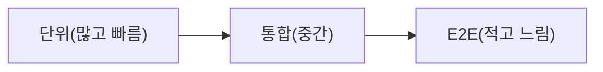

# 테스트 전략

> Software Engineering 101 시리즈 (5/10)


## 이 글에서 다룰 문제

테스트는 변화의 비용을 결정합니다. 좋은 테스트는 두려움 없이 리팩터링하게 하고, 나쁜 테스트는 모든 PR을 망설이게 합니다.

> 테스트가 없는 코드는 사실상 동결된 코드다.

## 개념 한눈에 보기



피라미드는 비용과 속도의 균형입니다.

## Before/After

**Before — 아이스크림 콘**

```text
E2E 80%, 통합 15%, 단위 5%
-> 느린 CI, 잦은 flaky, 디버깅 지옥
```

**After — 피라미드**

```text
단위 70%, 통합 25%, E2E 5%
-> 빠른 CI, 명확한 실패 위치
```

비율이 바뀌면 팀의 속도가 바뀝니다.

## 실습: 작은 테스트 피라미드 만들기

### 1단계 — 단위 테스트

```python
# 1_unit.py
def add(a: int, b: int) -> int:
    return a + b

def test_add():
    assert add(2, 3) == 5
```

가장 빠르고 가장 많이.

### 2단계 — 가짜 의존(Fake)으로 통합

```python
# 2_integration.py
class FakeRepo:
    def __init__(self): self.items = []
    def save(self, x): self.items.append(x)

def test_service_uses_repo():
    repo = FakeRepo()
    service = OrderService(repo)
    service.create({"id": 1})
    assert repo.items == [{"id": 1}]
```

mock보다 fake가 깨지지 않습니다.

### 3단계 — E2E는 시나리오만

```python
# 3_e2e.py
def test_checkout_flow(client):
    client.post("/cart", json={"sku": "A"})
    r = client.post("/checkout")
    assert r.status_code == 200
```

핵심 사용자 여정만, 적게.

### 4단계 — 빠른 CI 분할

```yaml
# 4_ci.yml
jobs:
  unit:
    steps: [{ run: pytest tests/unit -q }]
  integration:
    steps: [{ run: pytest tests/integration -q }]
  e2e:
    if: github.ref == 'refs/heads/main'
    steps: [{ run: pytest tests/e2e -q }]
```

E2E는 main에만 강제하기도 합니다.

### 5단계 — Flaky를 격리

```python
# 5_flaky.py
import pytest
@pytest.mark.flaky(reruns=2)
def test_uses_external_clock(): ...
```

격리하고 다음 스프린트에서 고칩니다. 끄지 않습니다.

## 이 코드에서 주목할 점

- 단위 테스트가 가장 많고 빠릅니다.
- Fake가 mock보다 안정적입니다.
- E2E는 시나리오 중심, 적은 수.
- CI 분할로 피드백 시간을 짧게.

## 자주 하는 실수 5가지

1. **커버리지를 목표로.** 커버리지는 결과지 목표가 아닙니다.
2. **모든 것을 mock.** 깨지는 테스트의 주요 원인.
3. **E2E로 단위 테스트.** 느리고 디버깅 어렵습니다.
4. **Flaky 무시.** 신뢰가 무너지고 모두가 재실행만.
5. **테스트 삭제로 머지.** 결함 통계만 사라집니다.

## 실무에서는 이렇게 쓰입니다

빠른 팀은 PR마다 단위·통합 테스트 통과 강제, E2E는 main 머지나 nightly. 테스트 실행 시간 SLO(예: PR < 5분)를 두고, 넘으면 분할/병렬화.

## 체크리스트

- [ ] 피라미드 비율을 알고 있는가?
- [ ] PR 테스트 시간이 5분 안인가?
- [ ] Flaky 테스트 추적 보드가 있는가?
- [ ] mock보다 fake를 쓰는가?
- [ ] 변경 안전성을 측정 가능한가?

## 정리 및 다음 단계

테스트는 변화의 비용을 결정합니다. 다음 글에서는 테스트한 코드를 안전하게 사용자에게 보내는 — 버전 관리와 릴리스 — 를 봅니다.

<!-- toc:begin -->
- [소프트웨어 엔지니어링이란 무엇인가?](./01-what-is-software-engineering.md)
- [요구사항 이해하기](./02-understanding-requirements.md)
- [설계와 구현의 차이](./03-design-vs-implementation.md)
- [코드 리뷰](./04-code-review.md)
- **테스트 전략 (현재 글)**
- 버전 관리와 릴리스 (예정)
- 문서화 (예정)
- 협업 프로세스 (예정)
- 유지보수와 기술부채 (예정)
- 좋은 소프트웨어의 기준 (예정)
<!-- toc:end -->

## 참고 자료

- [Martin Fowler — Test Pyramid](https://martinfowler.com/bliki/TestPyramid.html)
- [Google Testing Blog — Just Say No to More End-to-End Tests](https://testing.googleblog.com/2015/04/just-say-no-to-more-end-to-end-tests.html)
- [Pytest Docs](https://docs.pytest.org/)
- [Working Effectively with Legacy Code — Michael Feathers](https://www.oreilly.com/library/view/working-effectively-with/0131177052/)

Tags: Computer Science, SoftwareEngineering, Testing, TestPyramid, CI, Quality
