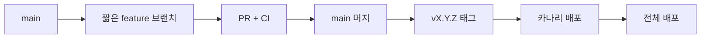

# Software Engineering 101 (6/10): 버전 관리와 릴리스

코드를 잘 작성하고 테스트도 통과했는데, 릴리스 단계에서 사고가 나면 사용자는 그 앞의 노력을 알지 못합니다. 서비스는 결국 배포된 버전으로 평가받습니다. 그래서 버전 관리와 릴리스는 개발의 마지막 절차가 아니라, 사용자 신뢰가 실제로 형성되는 접점입니다.

많은 팀이 릴리스를 한 번의 이벤트로만 봅니다. 버전 번호를 올리고, 체인지로그를 쓰고, 프로덕션에 올리면 끝이라고 생각합니다. 하지만 안정적인 팀은 릴리스를 회복 가능한 과정으로 봅니다. 작은 변경을 자주 보내고, 카나리로 먼저 노출하고, 신호가 나쁘면 즉시 되돌릴 수 있어야 합니다.


*Software Engineering 101 6장 흐름 개요*

## 먼저 던지는 질문

- 브랜치 전략은 언제 trunk-based가 맞고, 언제 Git Flow가 맞을까요?
- 버전 1.4.2 같은 숫자는 사용자에게 무엇을 약속할까요?
- 체인지로그는 어떻게 자동화할 수 있을까요?

## 왜 중요한가

릴리스는 코드와 사용자가 만나는 유일한 순간입니다. 이 단계에서 장애가 나면 그 전의 설계, 구현, 테스트는 모두 뒤로 밀립니다. 반대로 릴리스가 작고 자주, 그리고 회복 가능하게 설계되어 있으면 팀은 더 빠르게 배우고 더 적게 다칩니다.

안정적인 릴리스 문화는 기술 스택보다 운영 습관에서 나옵니다. 버전 결정이 자동화되어 있는지, 체인지로그가 사용자 관점으로 정리되는지, 롤백이 분 단위로 가능한지, 사람 손이 많이 타는 수동 단계가 줄어드는지가 더 중요합니다.

## 한눈에 보는 흐름

단계를 잘게 나누면 이상 신호가 생겼을 때 회수 비용도 같이 줄어듭니다.

## 핵심 용어

- **Trunk-Based Development**: 짧은 브랜치를 자주 main에 합치는 방식입니다.
- **Git Flow**: develop, release, hotfix 브랜치를 두는 전통적 모델입니다.
- **SemVer**: MAJOR, MINOR, PATCH로 호환성 약속을 표현하는 방식입니다.
- **Changelog**: 사용자가 읽는 변경 기록입니다.
- **Canary**: 일부 트래픽에 먼저 새 버전을 노출하는 방식입니다.

## 전후 비교

**이전 — 거대한 릴리스**

```text
200 PRs every two weeks -> impossible to localize a bug
```

**이후 — 점진 릴리스**

```text
multiple merges per day -> 5% canary -> monitor -> 100%
```

작고 자주 보내는 릴리스가 더 안전한 이유는, 문제가 생겨도 범위를 빨리 좁힐 수 있기 때문입니다.

## 단계별로 작은 릴리스 파이프라인 만들기

### 1단계 — Conventional Commits 쓰기

```text
# 1_commits.txt
feat(auth): add refresh token rotation
fix(billing): handle zero amount invoices
chore(deps): bump fastapi to 0.110
```

커밋 메시지가 기계가 읽을 수 있는 형태여야 버전과 체인지로그 자동화가 붙습니다.

### 2단계 — SemVer 규칙 정하기

```text
# 2_semver.md
feat -> MINOR
fix  -> PATCH
BREAKING CHANGE -> MAJOR
```

버전은 감으로 정하지 않는 편이 좋습니다. 변경 유형이 버전을 결정하도록 만들어야 일관성이 생깁니다.

### 3단계 — 체인지로그 자동 생성하기

```yaml
# 3_release.yml
- uses: googleapis/release-please-action@v4
  with:
    release-type: python
```

PR가 머지되면 릴리스 PR과 체인지로그가 자동으로 만들어지게 두는 편이 안전합니다.

### 4단계 — 카나리 단계 두기

```yaml
# 4_canary.yml
strategy:
  canary:
    weight: 5
    after: { metrics: error_rate < 0.5%, duration: 10m }
```

소수 트래픽으로 먼저 건강 상태를 확인하고, 신호가 좋을 때만 전체로 넓혀 가는 흐름입니다.

### 5단계 — 즉시 롤백 가능하게 만들기

```bash
# 5_rollback.sh
kubectl rollout undo deployment/api
```

롤백은 문서에만 있는 절차가 아니라, 실제로 1분 안팎에 끝날 수 있어야 합니다.

## 릴리스 절차를 점검하는 방법

릴리스 안전성은 배포 도구보다 되돌릴 수 있는지에서 더 분명하게 드러납니다. 최근 배포 하나를 골라 버전 결정부터 롤백까지의 시간을 따라가 보세요.

### 확인 절차

1. 최근 릴리스 노트와 관련 커밋 세 개를 엽니다.
2. SemVer가 실제 변경 성격과 맞는지 확인합니다.
3. 카나리 확장 조건과 롤백 명령이 문서로 남아 있는지 점검합니다.

**예상 결과:**

- 커밋 규칙이 일정하면 체인지로그 자동화가 훨씬 매끄럽게 붙습니다.
- 릴리스 노트가 사용자 관점으로 바뀌면 영향 범위를 설명하기 쉬워집니다.
- 롤백 경로가 문서와 실습으로 검증된 팀일수록 배포 빈도를 높이기 쉽습니다.

### 실패 신호

- 버전 번호가 변경 크기와 무관하게 감으로 정해집니다.
- 카나리 단계 없이 바로 전체 트래픽에 노출합니다.
- 롤백 명령은 있지만 마지막으로 연습한 시점을 아무도 모릅니다.

## 이 코드에서 먼저 봐야 할 점

- 커밋 규칙이 자동화의 입력이 됩니다.
- 카나리는 되돌릴 수 있는 배포 결정을 가능하게 합니다.
- 롤백 속도는 릴리스 안전성의 지표입니다.
- 체인지로그는 개발자 내부 메모가 아니라 사용자용 기록이어야 합니다.

릴리스 프로세스에서 가장 중요한 원칙은 되돌릴 수 있는 변경만 배포한다는 것입니다. 데이터베이스 마이그레이션처럼 되돌리기 어려운 변경은 별도 단계로 분리하고, 애플리케이션 코드 배포와 시간차를 두어야 합니다. 이렇게 하면 코드 롤백 시 스키마 불일치로 인한 장애를 예방할 수 있습니다.

## 어디서 자주 헷갈릴까요?

첫 번째 오해는 버전 번호를 단순한 숫자로 보는 것입니다. 사용자는 MAJOR가 올랐을 때 호환성 변화가 있다고 기대하고, PATCH가 올라갔을 때 큰 동작 변화가 없다고 기대합니다. 이 약속이 흔들리면 버전에 대한 신뢰가 사라집니다.

두 번째 오해는 릴리스 노트를 팀 내부 용어로 쓰는 것입니다. 사용자는 어떤 버그가 줄었는지, 어떤 기능이 추가되었는지, 자신에게 영향이 무엇인지 알고 싶습니다. 구현 세부사항만 나열한 노트는 신뢰를 쌓지 못합니다.

세 번째 오해는 롤백 절차를 한 번도 연습하지 않은 채 “문서가 있으니 괜찮다”고 생각하는 것입니다. 실제 장애에서 처음 시도하는 롤백은 대개 늦고 어설픕니다.

## 실무에서는 이렇게 생각합니다

성숙한 팀은 trunk-based 개발, 기능 플래그, 자동 버전 결정, 자동 체인지로그, 카나리 배포, 즉시 롤백을 하나의 세트로 봅니다. 이 흐름이 자리 잡으면 릴리스는 큰 행사보다 일상 작업에 가까워집니다.

시니어 엔지니어는 릴리스 속도만큼 회복 속도를 봅니다. 배포 빈도가 높아도 되돌리는 데 오래 걸리면 안전하다고 말하기 어렵습니다. 반대로 릴리스가 매우 잦아도 회복이 빠르면 전체 위험은 오히려 줄어듭니다.

## 체크리스트

- [ ] 브랜치 전략이 문서로 정리되어 있나요?
- [ ] 버전 선택이 자동화되어 있나요?
- [ ] 체인지로그가 사용자 언어로 작성되나요?
- [ ] 카나리 단계가 있나요?
- [ ] 1분 안팎에 롤백할 수 있나요?

## 연습 문제

1. 최근 커밋 열 개를 Conventional Commits 형식으로 다시 써 보세요.
2. 최근 릴리스 노트 하나를 사용자 관점 문장으로 다시 적어 보세요.
3. 한 장짜리 롤백 런북을 작성해 보세요.

## 요구사항-리뷰-테스트 연결표

엔지니어링에서 자주 놓치는 지점은 세 문서가 따로 움직이는 상황입니다. 요구사항 문서는 목표만 말하고, 리뷰는 스타일 중심으로 흘러가고, 테스트는 구현 이후에 뒤따라옵니다. 이렇게 분리되면 기능은 동작해도 품질 기준이 흐려집니다. 아래처럼 연결표를 두면 변경 영향이 추적됩니다.

```text
REQ-12: 만료 쿠폰 거부
- Review check: 상태 코드 400 + error_code=coupon_expired 확인
- Test case: test_apply_expired_coupon
- Metric: coupon_expired 발생 비율
```

연결표를 유지하면 "무엇을 만들었는가"가 아니라 "어떤 기준을 만족했는가"로 대화가 바뀝니다. 회고 시점에도 장애 원인을 요구사항 해석, 리뷰 누락, 테스트 공백 중 어디서 시작됐는지 빠르게 찾을 수 있습니다.

### 운영 전환 체크

- 배포 노트에 요구사항 ID와 PR 링크를 함께 남깁니다.
- 온콜 핸드오프 문서에 새 기능의 실패 시그널을 명시합니다.
- 첫 24시간 관찰 지표와 임계치를 릴리스 전에 고정합니다.

이 작은 연결 장치가 있으면 팀 규모가 커져도 품질 기준이 개인 기억에 의존하지 않습니다.

## 실무 적용 메모

아래 항목은 실제 팀 운영에서 즉시 적용 가능한 최소 기준입니다.

- 요구사항 ID를 브랜치 이름과 PR 제목에 포함해 추적성을 높입니다.
- 코드 리뷰에서 "변경 위험" 항목을 별도로 두고, 장애 반경을 한 줄로 남깁니다.
- 테스트 결과는 성공 여부만 기록하지 않고 실패 시 복구 절차 링크를 같이 둡니다.
- 배포 후 모니터링 대시보드 URL을 릴리스 노트에 고정합니다.

작은 기록 규칙이 누적되면 협업 비용이 줄고, 동일한 문제를 반복해서 조사하는 시간을 크게 줄일 수 있습니다.

## 릴리스를 반복 가능한 시스템으로 만드는 방법

안정적인 릴리스는 사람의 기억이 아니라 절차와 자동화에서 나옵니다. 같은 품질을 매주 유지하려면 브랜치 전략, 태그 규칙, 승인 절차, 롤백 기준을 문서와 파이프라인으로 고정해야 합니다.

### 릴리스 체크리스트 템플릿

```markdown
# Release v1.8.0
- 범위: 포함 PR 목록과 제외 PR 목록
- 위험 변경: 스키마 변경, 캐시 키 변경 여부
- 배포 전 검증: 스모크 테스트 결과
- 배포 후 검증: 핵심 메트릭 15분 모니터링
- 롤백 기준: 오류율 2배 상승 시 즉시 롤백
- 커뮤니케이션: 공지 채널, 온콜 담당자
```

### Git 워크플로(트렁크 기반 + 릴리스 태그)



### CI/CD 단계 예시

```yaml
name: release
on:
  push:
    tags:
      - 'v*.*.*'
jobs:
  build-test-deploy:
    runs-on: ubuntu-latest
    steps:
      - uses: actions/checkout@v4
      - run: pytest -q
      - run: docker build -t app:${GITHUB_REF_NAME} .
      - run: ./scripts/deploy_canary.sh ${GITHUB_REF_NAME}
      - run: ./scripts/promote_if_healthy.sh ${GITHUB_REF_NAME}
```

### 릴리스 관련 기술부채 관리

- 수동 배포 단계가 남아 있는지 점검합니다.
- 릴리스 노트 작성이 사람 의존인지 확인합니다.
- 롤백 스크립트의 최신성 검증 주기를 둡니다.
- 실패한 릴리스의 사후 분석을 ADR 또는 회고 문서로 남깁니다.

## 버전 관리 흐름 다이어그램으로 배포 리듬 정렬하기

릴리스 품질은 브랜치 정책과 커밋 단위에서 시작됩니다. 팀이 공유하는 흐름을 다이어그램으로 고정해 두면 신규 인원이 들어와도 같은 리듬으로 배포할 수 있습니다.

```text
main  ----o------o---------o----------------
            \      \         feature/a    o--o---o         release/1.2          o----o-----o---tag v1.2.0
hotfix/1.2.1                     o---tag v1.2.1
```

실무에서는 "브랜치 이름"보다 "병합 기준"이 더 중요합니다. 예를 들어 main 병합 조건을 테스트 통과 + 리뷰 1인 승인 + 변경 로그 작성으로 고정하면 릴리스 품질이 안정됩니다.

## 릴리스 체크리스트 예시

- 변경 로그가 사용자 영향 관점으로 작성되었는가
- 마이그레이션 단계와 롤백 절차가 문서화되었는가
- 모니터링 대시보드에 신규 지표가 반영되었는가
- 온콜 담당자와 배포 시간대가 조율되었는가

릴리스는 코드 이벤트가 아니라 운영 이벤트입니다. 체크리스트가 있을 때만 배포가 개인 경험이 아닌 팀 시스템으로 전환됩니다.

## 배포 파이프라인 예시와 롤백 규칙

릴리스는 성공 경로만 설계하면 실패합니다. 실패 경로와 롤백 조건을 먼저 고정해야 안전한 배포가 가능합니다.

```yaml
stages:
  - build
  - test
  - deploy-staging
  - smoke-test
  - deploy-production

rollback:
  condition:
    - error_rate > 2%
    - p95_latency > baseline * 1.5
  action:
    - revert_to_previous_tag
    - run_post_rollback_smoke
```

이 예시의 핵심은 롤백 기준이 수치로 정의되어 있다는 점입니다. "문제가 커 보이면 되돌린다" 같은 주관적 기준은 운영자마다 판단이 달라집니다.

## 릴리스 커뮤니케이션 템플릿

- 배포 범위: 사용자에게 보이는 변경점 3줄
- 위험 지점: 장애 가능 구간과 완화책
- 점검 담당: 시간대별 담당자와 연락 채널
- 종료 조건: 배포 완료 선언 기준

배포 공지는 문서 업무가 아니라 리스크 관리 업무입니다. 공지가 명확할수록 장애 대응 속도가 빨라집니다.

## 현업 적용을 위한 점검 메모

실무에서는 개별 기술 선택보다 운영 가능한 흐름을 먼저 고정하는 것이 중요합니다. 요구사항, 설계, 구현, 리뷰, 테스트, 배포, 회고를 하나의 루프로 연결하면 팀의 예측 가능성이 높아집니다. 특히 일정이 촉박할수록 문서와 체크리스트를 줄이는 대신 더 짧고 명확한 형식으로 유지해야 합니다.

다음 스프린트에서 바로 적용할 수 있는 최소 실천 항목은 세 가지입니다. 첫째, 모든 변경에 대해 성공 기준과 검증 명령을 남깁니다. 둘째, 실패 시 되돌리는 기준을 수치로 정의합니다. 셋째, 릴리스 후 24시간 이내 회고 메모를 남겨 다음 변경에 반영합니다. 이 세 가지가 자리 잡으면 팀은 바쁜 상황에서도 품질을 우연에 맡기지 않게 됩니다.

## 현업 적용을 위한 점검 메모

실무에서는 개별 기술 선택보다 운영 가능한 흐름을 먼저 고정하는 것이 중요합니다. 요구사항, 설계, 구현, 리뷰, 테스트, 배포, 회고를 하나의 루프로 연결하면 팀의 예측 가능성이 높아집니다. 특히 일정이 촉박할수록 문서와 체크리스트를 줄이는 대신 더 짧고 명확한 형식으로 유지해야 합니다.

다음 스프린트에서 바로 적용할 수 있는 최소 실천 항목은 세 가지입니다. 첫째, 모든 변경에 대해 성공 기준과 검증 명령을 남깁니다. 둘째, 실패 시 되돌리는 기준을 수치로 정의합니다. 셋째, 릴리스 후 24시간 이내 회고 메모를 남겨 다음 변경에 반영합니다. 이 세 가지가 자리 잡으면 팀은 바쁜 상황에서도 품질을 우연에 맡기지 않게 됩니다.

## 현업 적용을 위한 점검 메모

실무에서는 개별 기술 선택보다 운영 가능한 흐름을 먼저 고정하는 것이 중요합니다. 요구사항, 설계, 구현, 리뷰, 테스트, 배포, 회고를 하나의 루프로 연결하면 팀의 예측 가능성이 높아집니다. 특히 일정이 촉박할수록 문서와 체크리스트를 줄이는 대신 더 짧고 명확한 형식으로 유지해야 합니다.

다음 스프린트에서 바로 적용할 수 있는 최소 실천 항목은 세 가지입니다. 첫째, 모든 변경에 대해 성공 기준과 검증 명령을 남깁니다. 둘째, 실패 시 되돌리는 기준을 수치로 정의합니다. 셋째, 릴리스 후 24시간 이내 회고 메모를 남겨 다음 변경에 반영합니다. 이 세 가지가 자리 잡으면 팀은 바쁜 상황에서도 품질을 우연에 맡기지 않게 됩니다.

## 현업 적용을 위한 점검 메모

실무에서는 개별 기술 선택보다 운영 가능한 흐름을 먼저 고정하는 것이 중요합니다. 요구사항, 설계, 구현, 리뷰, 테스트, 배포, 회고를 하나의 루프로 연결하면 팀의 예측 가능성이 높아집니다. 특히 일정이 촉박할수록 문서와 체크리스트를 줄이는 대신 더 짧고 명확한 형식으로 유지해야 합니다.

다음 스프린트에서 바로 적용할 수 있는 최소 실천 항목은 세 가지입니다. 첫째, 모든 변경에 대해 성공 기준과 검증 명령을 남깁니다. 둘째, 실패 시 되돌리는 기준을 수치로 정의합니다. 셋째, 릴리스 후 24시간 이내 회고 메모를 남겨 다음 변경에 반영합니다. 이 세 가지가 자리 잡으면 팀은 바쁜 상황에서도 품질을 우연에 맡기지 않게 됩니다.

## 정리

버전 관리와 릴리스는 개발의 끝이 아니라 신뢰의 인터페이스입니다. 커밋 규칙, SemVer, 자동 체인지로그, 카나리, 빠른 롤백이 함께 있을 때 릴리스는 두려운 이벤트가 아니라 반복 가능한 운영 절차가 됩니다.

다음 글에서는 이 신뢰를 글로 남기는 방법, 곧 문서화를 다룹니다. 코드가 설명하지 못하는 왜와 언제를 어떻게 기록해야 하는지 이어서 봅니다.

## 처음 질문으로 돌아가기

- **브랜치 전략은 언제 trunk-based가 맞고, 언제 Git Flow가 맞을까요?**
  - 본문의 기준은 버전 관리와 릴리스를 한 덩어리 개념으로 보지 않고 입력, 처리, 검증, 운영 신호가 만나는 경계로 나누어 확인하는 것입니다.
- **버전 1.4.2 같은 숫자는 사용자에게 무엇을 약속할까요?**
  - 예제와 그림에서는 어떤 값이 들어오고, 어느 단계에서 바뀌며, 어떤 기준으로 통과 또는 실패하는지를 먼저 확인해야 합니다.
- **체인지로그는 어떻게 자동화할 수 있을까요?**
  - 운영에서는 이 판단을 체크리스트, 로그, 테스트로 남겨 다음 변경에서도 같은 실패가 반복되지 않게 막아야 합니다.

<!-- toc:begin -->
## 시리즈 목차

- [Software Engineering 101 (1/10): 소프트웨어 엔지니어링이란 무엇인가?](./01-what-is-software-engineering.md)
- [Software Engineering 101 (2/10): 요구사항 이해하기](./02-understanding-requirements.md)
- [Software Engineering 101 (3/10): 설계와 구현의 차이](./03-design-vs-implementation.md)
- [Software Engineering 101 (4/10): 코드 리뷰](./04-code-review.md)
- [Software Engineering 101 (5/10): 테스트 전략](./05-testing-strategy.md)
- **버전 관리와 릴리스 (현재 글)**
- 문서화 (예정)
- 협업 프로세스 (예정)
- 유지보수와 기술부채 (예정)
- 좋은 소프트웨어의 기준 (예정)

<!-- toc:end -->

## 참고 자료

- [Software Engineering 101 예제 코드 (book-examples)](https://github.com/yeongseon-books/book-examples/tree/main/software-engineering-101/ko)
- [Semantic Versioning 2.0.0](https://semver.org/)
- [Conventional Commits 1.0.0](https://www.conventionalcommits.org/)
- [Trunk-Based Development](https://trunkbaseddevelopment.com/)
- [Google SRE Book — Release Engineering](https://sre.google/sre-book/release-engineering/)

Tags: Computer Science, SoftwareEngineering, Git, VersionControl, Release, SemVer
