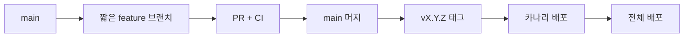

# Software Engineering 101 (6/10): 버전 관리와 릴리스

코드를 잘 작성하고 테스트도 통과했는데, 릴리스 단계에서 사고가 나면 사용자는 그 앞의 노력을 알지 못합니다. 서비스는 결국 배포된 버전으로 평가받습니다. 그래서 버전 관리와 릴리스는 개발의 마지막 절차가 아니라, 사용자 신뢰가 실제로 형성되는 접점입니다.

이 글은 Software Engineering 101 시리즈의 6번째 글입니다.

많은 팀이 릴리스를 한 번의 이벤트로만 봅니다. 버전 번호를 올리고, 체인지로그를 쓰고, 프로덕션에 올리면 끝이라고 생각합니다. 하지만 안정적인 팀은 릴리스를 회복 가능한 과정으로 봅니다. 작은 변경을 자주 보내고, 카나리로 먼저 노출하고, 신호가 나쁘면 즉시 되돌릴 수 있어야 합니다.


*Software Engineering 101 6장 흐름 개요*

> 릴리스는 한 번의 이벤트가 아니라 회복 가능한 과정입니다 — 작게 자주 보내고, 카나리로 먼저 노출하고, 신호가 나쁘면 즉시 되돌릴 수 있어야 사용자 신뢰가 실제로 형성됩니다.

## 이 글에서 다룰 문제

- 브랜치 전략은 언제 trunk-based가 맞고, 언제 Git Flow가 맞을까요?
- 버전 1.4.2 같은 숫자는 사용자에게 무엇을 약속할까요?
- 체인지로그는 어떻게 자동화할 수 있을까요?
- 이 개념을 실무에서 잘못 적용하면 어떤 문제가 생길까요?
- 이 주제에서 초보자가 가장 자주 놓치는 포인트는 무엇일까요?

릴리스는 코드와 사용자가 만나는 유일한 순간입니다. 이 단계에서 장애가 나면 그 전의 설계, 구현, 테스트는 모두 뒤로 밀립니다. 반대로 릴리스가 작고 자주, 그리고 회복 가능하게 설계되어 있으면 팀은 더 빠르게 배우고 더 적게 다칩니다.

안정적인 릴리스 문화는 기술 스택보다 운영 습관에서 나옵니다. 버전 결정이 자동화되어 있는지, 체인지로그가 사용자 관점으로 정리되는지, 롤백이 분 단위로 가능한지, 사람 손이 많이 타는 수동 단계가 줄어드는지가 더 중요합니다.

## 한눈에 보는 흐름

단계를 잘게 나누면 이상 신호가 생겼을 때 회수 비용도 같이 줄어듭니다.

- **Trunk-Based Development**: 짧은 브랜치를 자주 main에 합치는 방식입니다.
- **Git Flow**: develop, release, hotfix 브랜치를 두는 전통적 모델입니다.
- **SemVer**: MAJOR, MINOR, PATCH로 호환성 약속을 표현하는 방식입니다.
- **Changelog**: 사용자가 읽는 변경 기록입니다.
- **Canary**: 일부 트래픽에 먼저 새 버전을 노출하는 방식입니다.

## 전후 비교

**이전 — 거대한 릴리스**

```text
200 PRs every two weeks -> impossible to localize a bug
```

**이후 — 점진 릴리스**

```text
multiple merges per day -> 5% canary -> monitor -> 100%
```

작고 자주 보내는 릴리스가 더 안전한 이유는, 문제가 생겨도 범위를 빨리 좁힐 수 있기 때문입니다.

## 단계별로 작은 릴리스 파이프라인 만들기

### 1단계 — Conventional Commits 쓰기

```text
# 1_commits.txt
feat(auth): add refresh token rotation
fix(billing): handle zero amount invoices
chore(deps): bump fastapi to 0.110
```

커밋 메시지가 기계가 읽을 수 있는 형태여야 버전과 체인지로그 자동화가 붙습니다.

### 2단계 — SemVer 규칙 정하기

```text
# 2_semver.md
feat -> MINOR
fix  -> PATCH
BREAKING CHANGE -> MAJOR
```

버전은 감으로 정하지 않는 편이 좋습니다. 변경 유형이 버전을 결정하도록 만들어야 일관성이 생깁니다.

### 3단계 — 체인지로그 자동 생성하기

```yaml
# 3_release.yml
- uses: googleapis/release-please-action@v4
  with:
    release-type: python
```

PR이 머지되면 릴리스 PR과 체인지로그가 자동으로 만들어지게 두는 편이 안전합니다.

### 4단계 — 카나리 단계 두기

```yaml
# 4_canary.yml
strategy:
  canary:
    weight: 5
    after: { metrics: error_rate < 0.5%, duration: 10m }
```

소수 트래픽으로 먼저 건강 상태를 확인하고, 신호가 좋을 때만 전체로 넓혀 가는 흐름입니다.

### 5단계 — 즉시 롤백 가능하게 만들기

```bash
# 5_rollback.sh
kubectl rollout undo deployment/api
```

롤백은 문서에만 있는 절차가 아니라, 실제로 1분 안팎에 끝날 수 있어야 합니다.

## 프로젝트 관리 예시: 릴리스 캘린더와 온콜 조율

배포가 언제 어떤 팀원의 감시 하에 이루어지는지를 미리 정하면 릴리스 사고 대응이 빨라집니다.

```markdown
[릴리스 캘린더 운영 기준]

정규 릴리스 창:
- 화·목 오전 10시~12시 (온콜 담당자 확인 후 배포)
- 금요일 오후 2시 이후 배포 금지 (긴급 핫픽스 제외)

릴리스 전 확인:
- 배포 대상 PR 목록 공유 (슬랙 #releases 채널)
- 위험 변경 (스키마 변경, 캐시 키 변경) 별도 표시
- 온콜 담당자 배포 시작 메시지 발송

배포 중 모니터링:
- 배포 직후 10분: 에러율, p95 지연 시간
- 카나리 종료 후: 핵심 사용자 흐름 완료율

배포 완료 조건:
- 15분간 에러율 기준 이하 유지
- 온콜 담당자의 "배포 완료" 선언
```

이 기준이 문서화되면 새로 합류한 팀원도 릴리스 프로세스를 독립적으로 수행할 수 있습니다.

## 릴리스 절차를 점검하는 방법

릴리스 안전성은 배포 도구보다 되돌릴 수 있는지에서 더 분명하게 드러납니다. 최근 배포 하나를 골라 버전 결정부터 롤백까지의 시간을 따라가 보세요.

### 확인 절차

1. 최근 릴리스 노트와 관련 커밋 세 개를 엽니다.
2. SemVer가 실제 변경 성격과 맞는지 확인합니다.
3. 카나리 확장 조건과 롤백 명령이 문서로 남아 있는지 점검합니다.

**예상 결과:**

- 커밋 규칙이 일정하면 체인지로그 자동화가 훨씬 매끄럽게 붙습니다.
- 릴리스 노트가 사용자 관점으로 바뀌면 영향 범위를 설명하기 쉬워집니다.
- 롤백 경로가 문서와 실습으로 검증된 팀일수록 배포 빈도를 높이기 쉽습니다.

### 실패 신호

- 버전 번호가 변경 크기와 무관하게 감으로 정해집니다.
- 카나리 단계 없이 바로 전체 트래픽에 노출합니다.
- 롤백 명령은 있지만 마지막으로 연습한 시점을 아무도 모릅니다.

## 자주 하는 실수

| 실수 패턴 | 구체적 증상 | 왜 문제인가 | 개선 방향 |
|---|---|---|---|
| 버전 번호 임의 결정 | "느낌상 MINOR인 것 같다"로 결정 | 사용자 호환성 기대 위반 | Conventional Commits + SemVer 자동화 |
| 릴리스 노트 개발자 언어 사용 | 내부 모듈명과 구현 세부사항만 나열 | 사용자가 영향 범위를 파악 불가 | "사용자 관점 영향"으로 재작성 |
| 롤백 절차 미연습 | 문서에는 있으나 실제로 시도한 적 없음 | 실 장애 시 오작동 또는 지연 | 분기 1회 롤백 드릴(게임 데이 실습) |
| 거대 배포 | 2주치 변경이 한 번에 배포됨 | 장애 원인 좁히기 어려움 | 배포 단위를 PR 1~3개로 제한 |
| 스키마 변경과 코드 동시 배포 | DB 마이그레이션과 앱 배포를 같은 단계에서 실행 | 롤백 시 스키마 불일치 장애 | 스키마 변경을 별도 단계로 분리하고 시간 차를 둠 |

## 어디서 자주 헷갈릴까요?

첫 번째 오해는 버전 번호를 단순한 숫자로 보는 것입니다. 사용자는 MAJOR가 올랐을 때 호환성 변화가 있다고 기대하고, PATCH가 올라갔을 때 큰 동작 변화가 없다고 기대합니다. 이 약속이 흔들리면 버전에 대한 신뢰가 사라집니다.

두 번째 오해는 릴리스 노트를 팀 내부 용어로 쓰는 것입니다. 사용자는 어떤 버그가 줄었는지, 어떤 기능이 추가되었는지, 자신에게 영향이 무엇인지 알고 싶습니다. 구현 세부사항만 나열한 노트는 신뢰를 쌓지 못합니다.

세 번째 오해는 롤백 절차를 한 번도 연습하지 않은 채 "문서가 있으니 괜찮다"고 생각하는 것입니다. 실제 장애에서 처음 시도하는 롤백은 대개 늦고 어설픕니다.

## 실무에서는 이렇게 생각합니다

성숙한 팀은 trunk-based 개발, 기능 플래그, 자동 버전 결정, 자동 체인지로그, 카나리 배포, 즉시 롤백을 하나의 세트로 봅니다. 이 흐름이 자리 잡으면 릴리스는 큰 행사보다 일상 작업에 가까워집니다.

시니어 엔지니어는 릴리스 속도만큼 회복 속도를 봅니다. 배포 빈도가 높아도 되돌리는 데 오래 걸리면 안전하다고 말하기 어렵습니다. 반대로 릴리스가 매우 잦아도 회복이 빠르면 전체 위험은 오히려 줄어듭니다.

## 요구사항-리뷰-테스트 연결표

```text
REQ-12: 만료 쿠폰 거부
- Review check: 상태 코드 400 + error_code=coupon_expired 확인
- Test case: test_apply_expired_coupon
- Metric: coupon_expired 발생 비율
```

연결표를 유지하면 "무엇을 만들었는가"가 아니라 "어떤 기준을 만족했는가"로 대화가 바뀝니다.

### 운영 전환 체크

- 배포 노트에 요구사항 ID와 PR 링크를 함께 남깁니다.
- 온콜 핸드오프 문서에 새 기능의 실패 시그널을 명시합니다.
- 첫 24시간 관찰 지표와 임계치를 릴리스 전에 고정합니다.

## 릴리스 체크리스트 템플릿

```markdown
# Release v1.8.0
- 범위: 포함 PR 목록과 제외 PR 목록
- 위험 변경: 스키마 변경, 캐시 키 변경 여부
- 배포 전 검증: 스모크 테스트 결과
- 배포 후 검증: 핵심 메트릭 15분 모니터링
- 롤백 기준: 오류율 2배 상승 시 즉시 롤백
- 커뮤니케이션: 공지 채널, 온콜 담당자
```

### Git 워크플로(트렁크 기반 + 릴리스 태그)


```mermaid
flowchart LR
    A["main"] --> B["짧은 feature 브랜치"]
    B --> C["PR + CI"]
    C --> D["main 머지"]
    D --> E["vX.Y.Z 태그"]
    E --> F["카나리 배포"]
    F --> G["전체 배포"]
```

### CI/CD 단계 예시

```yaml
name: release
on:
  push:
    tags:
      - 'v*.*.*'
jobs:
  build-test-deploy:
    runs-on: ubuntu-latest
    steps:
      - uses: actions/checkout@v4
      - run: pytest -q
      - run: docker build -t app:${GITHUB_REF_NAME} .
      - run: ./scripts/deploy_canary.sh ${GITHUB_REF_NAME}
      - run: ./scripts/promote_if_healthy.sh ${GITHUB_REF_NAME}
```

## 배포 파이프라인 예시와 롤백 규칙

릴리스는 성공 경로만 설계하면 실패합니다. 실패 경로와 롤백 조건을 먼저 고정해야 안전한 배포가 가능합니다.

```yaml
stages:
  - build
  - test
  - deploy-staging
  - smoke-test
  - deploy-production

rollback:
  condition:
    - error_rate > 2%
    - p95_latency > baseline * 1.5
  action:
    - revert_to_previous_tag
    - run_post_rollback_smoke
```

롤백 기준이 수치로 정의되어 있어야 운영자마다 판단이 달라지지 않습니다.

## 운영 체크리스트

- [ ] 브랜치 전략이 문서로 정리되어 있나요?
- [ ] 버전 선택이 자동화되어 있나요?
- [ ] 체인지로그가 사용자 언어로 작성되나요?
- [ ] 카나리 단계가 있나요?
- [ ] 1분 안팎에 롤백할 수 있나요?

## 연습 문제

1. 최근 커밋 열 개를 Conventional Commits 형식으로 다시 써 보세요.
2. 최근 릴리스 노트 하나를 사용자 관점 문장으로 다시 적어 보세요.
3. 한 장짜리 롤백 런북을 작성해 보세요.

## 정리

버전 관리와 릴리스는 개발의 끝이 아니라 신뢰의 인터페이스입니다. 커밋 규칙, SemVer, 자동 체인지로그, 카나리, 빠른 롤백이 함께 있을 때 릴리스는 두려운 이벤트가 아니라 반복 가능한 운영 절차가 됩니다.

다음 글에서는 이 신뢰를 글로 남기는 방법, 곧 문서화를 다룹니다. 코드가 설명하지 못하는 왜와 언제를 어떻게 기록해야 하는지 이어서 봅니다.

## 처음 질문으로 돌아가기

- **브랜치 전략은 언제 trunk-based가 맞고, 언제 Git Flow가 맞을까요?**
  - 배포 주기가 짧고(하루 여러 번) 기능 플래그를 사용한다면 Trunk-Based Development가 적합합니다. 명확한 버전 릴리스 주기가 필요하거나 여러 버전을 동시 지원해야 한다면 Git Flow가 더 잘 맞습니다. 팀 크기보다는 배포 리듬과 릴리스 정책이 결정 기준입니다.
- **버전 1.4.2 같은 숫자는 사용자에게 무엇을 약속할까요?**
  - SemVer 기준으로 MAJOR.MINOR.PATCH를 뜻합니다. PATCH(2)는 버그 수정으로 기존 동작이 유지됩니다. MINOR(4)는 하위 호환 기능 추가입니다. MAJOR(1)는 하위 비호환 변경을 의미합니다. 이 약속이 지켜질 때 사용자는 업그레이드 비용을 예측할 수 있습니다.
- **체인지로그는 어떻게 자동화할 수 있을까요?**
  - Conventional Commits 규칙으로 커밋 메시지를 작성하면 `release-please`, `semantic-release` 같은 도구가 커밋 유형을 읽어 버전을 결정하고 체인지로그를 자동 생성합니다. 핵심은 커밋 메시지를 기계가 파싱할 수 있는 구조로 유지하는 것입니다. 자동화는 사람이 커밋 규칙을 지키는 것에서 시작됩니다.

<!-- toc:begin -->
## 시리즈 목차

- [Software Engineering 101 (1/10): 소프트웨어 엔지니어링이란 무엇인가?](./01-what-is-software-engineering.md)
- [Software Engineering 101 (2/10): 요구사항 이해하기](./02-understanding-requirements.md)
- [Software Engineering 101 (3/10): 설계와 구현의 차이](./03-design-vs-implementation.md)
- [Software Engineering 101 (4/10): 코드 리뷰](./04-code-review.md)
- [Software Engineering 101 (5/10): 테스트 전략](./05-testing-strategy.md)
- **Software Engineering 101 (6/10): 버전 관리와 릴리스 (현재 글)**
- [Software Engineering 101 (7/10): 문서화](./07-documentation.md)
- [Software Engineering 101 (8/10): 협업 프로세스](./08-collaboration-process.md)
- [Software Engineering 101 (9/10): 유지보수와 기술부채](./09-maintenance-and-tech-debt.md)
- [좋은 소프트웨어의 기준](./10-what-makes-good-software.md)

<!-- toc:end -->

## 참고 자료

- [Software Engineering 101 예제 코드 (book-examples)](https://github.com/yeongseon-books/book-examples/tree/main/software-engineering-101/ko)
- [Semantic Versioning 2.0.0](https://semver.org/)
- [Conventional Commits 1.0.0](https://www.conventionalcommits.org/)
- [Trunk-Based Development](https://trunkbaseddevelopment.com/)
- [Google SRE Book — Release Engineering](https://sre.google/sre-book/release-engineering/)

Tags: Computer Science, SoftwareEngineering, Git, VersionControl, Release, SemVer
