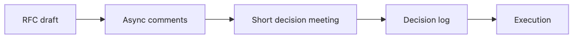

# 협업 프로세스

제품은 혼자 만들 수 없습니다. 코드는 한 사람이 먼저 작성할 수 있어도, 요구사항을 맞추고, 설계를 검토하고, 운영 리스크를 줄이고, 일정과 우선순위를 맞추는 일은 결국 여러 사람이 함께 해야 합니다. 그래서 협업 프로세스가 약하면 기술 결정은 사실보다 관계에 따라 흔들리기 쉽습니다.

회의를 많이 한다고 협업이 좋아지는 것도 아닙니다. 오히려 기록이 없는 긴 회의는 같은 논쟁을 반복하게 만들고, 팀의 시간을 가장 비싼 방식으로 사용하게 만듭니다. 좋은 프로세스는 사람의 시간을 보호하고, 결정의 흔적을 남기고, 동기식 대화를 정말 필요한 순간에만 쓰게 만듭니다.

이 글은 Software Engineering 101 시리즈의 여덟 번째 글입니다. 여기서는 RFC 작성법, 비동기 우선 협업, 짧은 결정 회의, 결정 로그, 분산 팀의 핸드오프 메모를 정리합니다.

## 이 글에서 다룰 문제

- RFC는 어떤 구조로 쓰면 충분할까요?
- 언제 비동기로 논의하고, 언제 짧은 동기 회의를 해야 할까요?
- 회의 시간을 줄이면서도 명확성을 잃지 않으려면 어떤 패턴이 필요할까요?
- DACI 같은 의사결정 모델은 어떤 도움을 줄까요?
- 시차가 있는 팀에서는 핸드오프를 어떻게 남겨야 할까요?

> 비동기 의사결정은 시간을 돌려주고, 동시에 결정의 흔적을 남깁니다.

## 왜 중요한가

코드는 혼자 쓸 수 있어도 제품은 여러 사람이 엮여서 만듭니다. 이때 프로세스가 없으면 누가 더 말을 많이 했는가, 누가 더 직급이 높은가 같은 요소가 사실보다 더 큰 힘을 갖게 됩니다. 반대로 글로 먼저 생각을 정리하고, 짧게 모여 결정을 내리고, 기록을 남기면 협업 비용이 크게 줄어듭니다.

또한 협업 프로세스는 팀의 속도를 결정합니다. 모든 사안을 회의에서 풀려고 하면 시간대가 다른 팀은 느려지고, 메모가 없으면 같은 주제가 반복됩니다. 잘 설계된 프로세스는 사람을 통제하기보다, 반복 낭비를 줄이는 방향으로 작동해야 합니다.

## 한눈에 보는 흐름


*RFC 초안에서 비동기 토론과 결정 로그로 이어지는 협업 흐름*

토론은 비동기로 넓게 받고, 결정은 짧은 동기 회의에서 닫는 편이 효율적입니다.

## 핵심 용어

- **RFC**: 제안과 토론을 담는 문서입니다.
- **DACI**: Driver, Approver, Contributor, Informed로 역할을 나누는 모델입니다.
- **비동기 우선**: 회의보다 문서를 먼저 쓰는 협업 방식입니다.
- **결정 로그**: 누가 언제 무엇을 결정했는지 남기는 기록입니다.
- **핸드오프**: 시차나 역할 경계를 넘어 작업을 넘기는 메모입니다.

## 전후 비교

**이전 — 회의 중심 협업**

```text
12 meetings a week, no decision trail -> same debate repeats
```

**이후 — RFC와 결정 회의 조합**

```text
3 days async on RFC -> 30-min decision meeting -> decision log
```

회의는 논의를 시작하는 자리가 아니라, 충분히 익은 논의를 닫는 자리일 때 효과가 큽니다.

## 단계별로 작은 협업 흐름 만들기

### 1단계 — RFC 템플릿 만들기

```markdown
# 1_rfc.md
## Title
## Problem
## Proposal
## Alternatives
## Risks
## Open questions
## Reviewers
```

좋은 RFC는 해법보다 문제를 먼저 선명하게 적습니다. 문제 정의가 흐리면 토론도 흩어집니다.

### 2단계 — 비동기 코멘트 받기

```markdown
# 2_review.md
- @alice [blocking] cost estimate misses infra cost
- @bob [question] migration downtime?
- @carol [nit] terminology inconsistent
```

태그가 있으면 어떤 코멘트가 머지를 막는지 빠르게 구분할 수 있습니다.

### 3단계 — 짧은 결정 회의 열기

```markdown
# 3_meeting.md
30 minutes, fewer than 5 people, agenda is one RFC link.
```

회의는 하나의 RFC를 닫는 데 집중해야 합니다. 토론 대부분은 문서에서 미리 끝내 두는 편이 좋습니다.

### 4단계 — 결정 로그 남기기

```markdown
# 4_decision_log.md
| Date | Topic | Decision | Driver | Approver |
|------|-------|----------|--------|----------|
| 2026-05-04 | introduce cache | adopt Redis | A | B |
```

결정 로그가 있으면 같은 질문을 다시 처음부터 시작할 일이 줄어듭니다.

### 5단계 — 핸드오프 메모 쓰기

```markdown
# 5_handoff.md
## Up to yesterday
- API spec agreed
## Today
- implement handlers
## Blocked on
- waiting for token format clarification
```

분산 팀에서 핸드오프 메모는 사람 사이를 잇는 비동기 인터페이스 역할을 합니다.

## 협업 흐름을 점검하는 질문

좋은 프로세스는 회의 수가 아니라 재논의 횟수를 줄입니다. 최근 의사결정 하나를 기준으로 RFC, 승인자, 기록이 실제로 남았는지 확인해 보세요.

### 확인 절차

1. 최근 변경 하나를 골라 RFC나 제안 문서가 있었는지 찾습니다.
2. 누가 승인자였는지, 언제 결론이 났는지 기록을 확인합니다.
3. 회의 없이도 다음 담당자가 이어받을 수 있는 핸드오프 메모가 있는지 봅니다.

**예상 결과:**

- 비동기 토론이 충분하면 동기 회의는 30분 안쪽으로 닫히기 쉽습니다.
- 승인자와 결정 로그가 있으면 같은 주제를 다시 처음부터 설명할 일이 줄어듭니다.
- 핸드오프 메모가 있으면 시차가 있어도 작업 흐름이 덜 끊깁니다.

### 실패 신호

- 회의 참가자마다 결론을 다르게 기억합니다.
- 승인자가 없어 코멘트만 쌓이고 결정은 닫히지 않습니다.
- 다음 담당자가 전날 맥락을 슬랙 검색으로만 복원해야 합니다.

## 이 코드에서 먼저 봐야 할 점

- 비동기 우선 방식은 시차 비용을 거의 공짜로 줄여 줍니다.
- 결정 로그는 반복 토론을 줄여 줍니다.
- 회의는 토론 도구보다 결정 도구에 가깝게 써야 합니다.
- 핸드오프 메모는 신뢰와 예측 가능성을 높입니다.

## 어디서 자주 헷갈릴까요?

가장 흔한 실수는 모든 결정을 회의에서 하려는 태도입니다. 회의는 사람의 시간을 동시에 묶기 때문에 가장 비싼 협업 수단입니다. 미리 문서로 쓸 수 있는 내용까지 회의로 끌고 오면 팀 전체 속도가 떨어집니다.

또 다른 실수는 누가 최종 승인자인지 정하지 않는 것입니다. 기여자는 많아도 승인자가 없으면 논의는 닫히지 않고 계속 열려 있습니다. 합의가 아니라 방치 상태가 되는 셈입니다.

회의 메모가 없는 문화도 반복 비용을 키웁니다. 시간이 지나면 참석자마다 다른 기억을 가지고 돌아오고, 결국 같은 주제를 다시 회의에 올리게 됩니다.

## 실무에서는 이렇게 생각합니다

원격 협업이 많은 팀일수록 RFC, 결정 로그, 짧은 결정 회의의 조합을 표준으로 두는 경우가 많습니다. 문서로 충분히 읽고 댓글로 토론한 뒤, 동기 회의는 남은 쟁점을 정리하고 승인하는 데 집중합니다.

시니어 엔지니어는 사람의 시간을 코드와 같은 자원으로 봅니다. 좋은 프로세스는 사람을 더 바쁘게 만드는 절차가 아니라, 같은 결정을 다시 하지 않게 만드는 장치여야 합니다. 프로세스의 품질은 문서가 많으냐가 아니라, 결정이 더 빨리 닫히고 더 오래 설명 가능한가로 드러납니다.

## 체크리스트

- [ ] 큰 변경에 RFC가 있나요?
- [ ] 결정 로그를 검색할 수 있나요?
- [ ] 회의 전에 안건과 승인자가 정해지나요?
- [ ] 핸드오프 메모 템플릿이 있나요?
- [ ] 회의 뒤에 반드시 글로 된 결정이 남나요?

## 연습 문제

1. 이번 주 회의 하나를 RFC와 비동기 코멘트로 바꿔 보세요.
2. 최근 결정 다섯 개를 결정 로그 표로 옮겨 보세요.
3. 팀용 한 장짜리 핸드오프 메모 템플릿을 만들어 보세요.

## 정리

좋은 협업 프로세스는 더 많은 회의를 만드는 것이 아니라, 더 적은 회의로 더 명확한 결정을 내리게 합니다. RFC, 비동기 토론, 짧은 결정 회의, 결정 로그, 핸드오프 메모가 갖춰지면 팀은 같은 시간으로 더 많은 합의를 만들어 낼 수 있습니다.

다음 글에서는 긴 수명을 가진 시스템이 반드시 마주치는 주제, 유지보수와 기술부채를 다룹니다. 부채를 어떻게 측정하고 우선순위를 잡아 안전하게 갚아 나갈지 이어서 정리하겠습니다.

<!-- toc:begin -->
- [소프트웨어 엔지니어링이란 무엇인가?](./01-what-is-software-engineering.md)
- [요구사항 이해하기](./02-understanding-requirements.md)
- [설계와 구현의 차이](./03-design-vs-implementation.md)
- [코드 리뷰](./04-code-review.md)
- [테스트 전략](./05-testing-strategy.md)
- [버전 관리와 릴리스](./06-version-control-and-release.md)
- [문서화](./07-documentation.md)
- **협업 프로세스 (현재 글)**
- 유지보수와 기술부채 (예정)
- 좋은 소프트웨어의 기준 (예정)
<!-- toc:end -->

## 참고 자료

- [GitLab Handbook — Async Collaboration](https://handbook.gitlab.com/handbook/company/culture/all-remote/asynchronous/)
- [Oxide Computer — RFD Process](https://oxide.computer/blog/rfd-1-requests-for-discussion)
- [Atlassian — DACI Framework](https://www.atlassian.com/team-playbook/plays/daci)
- [Basecamp — Shape Up](https://basecamp.com/shapeup)

Tags: Computer Science, SoftwareEngineering, Collaboration, Process, RFC, Async
