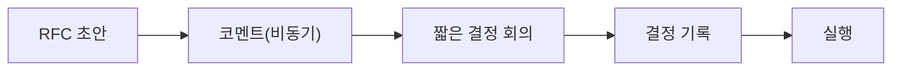

# 협업 프로세스

> Software Engineering 101 시리즈 (8/10)


## 이 글에서 다룰 문제

코드는 혼자 짜도 제품은 같이 만듭니다. 협업 프로세스가 없으면 기술 결정도 인간관계가 결정합니다.

> 좋은 프로세스는 사람을 보호한다.

## 개념 한눈에 보기



비동기 우선, 동기는 결정 순간에만.

## Before/After

**Before — 회의 중심**

```text
주 12회 회의, 결정 흔적 없음 -> 같은 토론 반복
```

**After — RFC + 결정 회의**

```text
RFC 비동기 3일 -> 30분 결정 회의 -> 결정 로그
```

회의는 결정을 위해서만 모입니다.

## 실습: 작은 RFC와 결정 로그

### 1단계 — RFC 템플릿

```markdown
# 1_rfc.md
## Title
## Problem
## Proposal
## Alternatives
## Risks
## Open questions
## Reviewers
```

문제 정의가 절반입니다.

### 2단계 — 비동기 코멘트

```markdown
# 2_review.md
- @alice [blocking] 비용 추정에 인프라 비용 누락
- @bob [question] 마이그레이션 다운타임은?
- @carol [nit] 용어 통일 필요
```

태그가 결정 가능 여부를 만듭니다.

### 3단계 — 짧은 결정 회의

```markdown
# 3_meeting.md
30분, 5명 이하, 어젠다 RFC 링크 1개
```

결정만 합니다. 토론은 비동기에서.

### 4단계 — 결정 로그

```markdown
# 4_decision_log.md
| Date | Topic | Decision | Driver | Approver |
|------|-------|----------|--------|----------|
| 2026-05-04 | cache 도입 | Redis 채택 | A | B |
```

같은 토론을 두 번 하지 않습니다.

### 5단계 — 핸드오프 노트

```markdown
# 5_handoff.md
## 어제까지
- API 스펙 합의됨
## 오늘 할 일
- 핸들러 구현
## 막히는 점
- 인증 토큰 형식 문의 중
```

분산 팀의 비동기 인터페이스입니다.

## 이 코드에서 주목할 점

- 비동기 우선이 시간대를 가로지릅니다.
- 결정 로그가 같은 토론을 막습니다.
- 회의는 결정 도구지 토론 도구가 아닙니다.
- 핸드오프 노트가 신뢰를 만듭니다.

## 자주 하는 실수 5가지

1. **모든 결정을 회의로.** 시간이 가장 비싼 자원입니다.
2. **결정 흔적 없음.** 같은 결정 반복.
3. **RFC 없이 구현.** 사고 후 "왜?"가 영원히 반복.
4. **승인자 미지정.** 결정이 안 납니다.
5. **회의록 없는 회의.** 회의 자체가 무효화됩니다.

## 실무에서는 이렇게 쓰입니다

분산 팀(GitLab, Stripe 등)은 RFC + 결정 로그 + 짧은 결정 회의 패턴이 표준. 매주 RFC 인덱스를 자동 생성, 결정자 부재 시 driver가 escalate.

## 체크리스트

- [ ] 큰 변경에 RFC가 있는가?
- [ ] 결정 로그가 검색 가능한가?
- [ ] 회의 어젠다와 결정자가 미리 정해졌는가?
- [ ] 핸드오프 노트 양식이 있는가?
- [ ] 회의 후 결정 기록이 남는가?

## 정리 및 다음 단계

협업 프로세스는 사람 시간을 돌려줍니다. 다음 글에서는 시스템이 살아 있는 동안 누구나 만나는 — 유지보수와 기술부채 — 를 봅니다.

<!-- toc:begin -->
- [소프트웨어 엔지니어링이란 무엇인가?](./01-what-is-software-engineering.md)
- [요구사항 이해하기](./02-understanding-requirements.md)
- [설계와 구현의 차이](./03-design-vs-implementation.md)
- [코드 리뷰](./04-code-review.md)
- [테스트 전략](./05-testing-strategy.md)
- [버전 관리와 릴리스](./06-version-control-and-release.md)
- [문서화](./07-documentation.md)
- **협업 프로세스 (현재 글)**
- 유지보수와 기술부채 (예정)
- 좋은 소프트웨어의 기준 (예정)
<!-- toc:end -->

## 참고 자료

- [GitLab Handbook — Async Collaboration](https://handbook.gitlab.com/handbook/company/culture/all-remote/asynchronous/)
- [Oxide Computer — RFD Process](https://oxide.computer/blog/rfd-1-requests-for-discussion)
- [Atlassian — DACI Framework](https://www.atlassian.com/team-playbook/plays/daci)
- [Basecamp — Shape Up](https://basecamp.com/shapeup)

Tags: Computer Science, SoftwareEngineering, Collaboration, Process, RFC, Async
