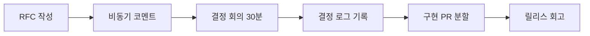

# Software Engineering 101 (8/10): 협업 프로세스

제품은 혼자 만들 수 없습니다. 코드는 한 사람이 먼저 작성할 수 있어도, 요구사항을 맞추고, 설계를 검토하고, 운영 리스크를 줄이고, 일정과 우선순위를 맞추는 일은 결국 여러 사람이 함께 해야 합니다. 그래서 협업 프로세스가 약하면 기술 결정은 사실보다 관계에 따라 흔들리기 쉽습니다.

이 글은 Software Engineering 101 시리즈의 8번째 글입니다.

회의를 많이 한다고 협업이 좋아지는 것도 아닙니다. 오히려 기록이 없는 긴 회의는 같은 논쟁을 반복하게 만들고, 팀의 시간을 가장 비싼 방식으로 사용하게 만듭니다. 좋은 프로세스는 사람의 시간을 보호하고, 결정의 흔적을 남기고, 동기식 대화를 정말 필요한 순간에만 쓰게 만듭니다.


*Software Engineering 101 8장 흐름 개요*

## 먼저 던지는 질문

- RFC는 어떤 구조로 쓰면 충분할까요?
- 언제 비동기로 논의하고, 언제 짧은 동기 회의를 해야 할까요?
- 회의 시간을 줄이면서도 명확성을 잃지 않으려면 어떤 패턴이 필요할까요?

## 왜 중요한가

코드는 혼자 쓸 수 있어도 제품은 여러 사람이 엮여서 만듭니다. 이때 프로세스가 없으면 누가 더 말을 많이 했는가, 누가 더 직급이 높은가 같은 요소가 사실보다 더 큰 힘을 갖게 됩니다. 반대로 글로 먼저 생각을 정리하고, 짧게 모여 결정을 내리고, 기록을 남기면 협업 비용이 크게 줄어듭니다.

또한 협업 프로세스는 팀의 속도를 결정합니다. 모든 사안을 회의에서 풀려고 하면 시간대가 다른 팀은 느려지고, 메모가 없으면 같은 주제가 반복됩니다. 잘 설계된 프로세스는 사람을 통제하기보다, 반복 낭비를 줄이는 방향으로 작동해야 합니다.

## 한눈에 보는 흐름

토론은 비동기로 넓게 받고, 결정은 짧은 동기 회의에서 닫는 편이 효율적입니다.

## 핵심 용어

- **RFC**: 제안과 토론을 담는 문서입니다.
- **DACI**: Driver, Approver, Contributor, Informed로 역할을 나누는 모델입니다.
- **비동기 우선**: 회의보다 문서를 먼저 쓰는 협업 방식입니다.
- **결정 로그**: 누가 언제 무엇을 결정했는지 남기는 기록입니다.
- **핸드오프**: 시차나 역할 경계를 넘어 작업을 넘기는 메모입니다.

## 전후 비교

**이전 — 회의 중심 협업**

```text
12 meetings a week, no decision trail -> same debate repeats
```

**이후 — RFC와 결정 회의 조합**

```text
3 days async on RFC -> 30-min decision meeting -> decision log
```

회의는 논의를 시작하는 자리가 아니라, 충분히 익은 논의를 닫는 자리일 때 효과가 큽니다.

## 단계별로 작은 협업 흐름 만들기

### 1단계 — RFC 템플릿 만들기

```markdown
# 1_rfc.md
## 제목
## 문제 정의
## 제안
## 대안
## 위험 요소
## 열린 질문
## 리뷰 담당자
```

좋은 RFC는 해법보다 문제를 먼저 선명하게 적습니다. 문제 정의가 흐리면 토론도 흩어집니다.

### 2단계 — 비동기 코멘트 받기

```markdown
# 2_review.md
- @alice [blocking] cost estimate misses infra cost
- @bob [question] migration downtime?
- @carol [nit] terminology inconsistent
```

태그가 있으면 어떤 코멘트가 머지를 막는지 빠르게 구분할 수 있습니다.

### 3단계 — 짧은 결정 회의 열기

```markdown
# 3_meeting.md
30 minutes, fewer than 5 people, agenda is one RFC link.
```

회의는 하나의 RFC를 닫는 데 집중해야 합니다. 토론 대부분은 문서에서 미리 끝내 두는 편이 좋습니다.

### 4단계 — 결정 로그 남기기

```markdown
# 4_decision_log.md
| Date | Topic | Decision | Driver | Approver |
|------|-------|----------|--------|----------|
| 2026-05-04 | introduce cache | adopt Redis | A | B |
```

결정 로그가 있으면 같은 질문을 다시 처음부터 시작할 일이 줄어듭니다.

### 5단계 — 핸드오프 메모 쓰기

```markdown
# 5_handoff.md
## 어제까지 진행
- API spec agreed
## 오늘 목표
- implement handlers
## 막힌 지점
- waiting for token format clarification
```

분산 팀에서 핸드오프 메모는 사람 사이를 잇는 비동기 인터페이스 역할을 합니다.

## 협업 흐름을 점검하는 질문

좋은 프로세스는 회의 수가 아니라 재논의 횟수를 줄입니다. 최근 의사결정 하나를 기준으로 RFC, 승인자, 기록이 실제로 남았는지 확인해 보세요.

### 확인 절차

1. 최근 변경 하나를 골라 RFC나 제안 문서가 있었는지 찾습니다.
2. 누가 승인자였는지, 언제 결론이 났는지 기록을 확인합니다.
3. 회의 없이도 다음 담당자가 이어받을 수 있는 핸드오프 메모가 있는지 봅니다.

**예상 결과:**

- 비동기 토론이 충분하면 동기 회의는 30분 안쪽으로 닫히기 쉽습니다.
- 승인자와 결정 로그가 있으면 같은 주제를 다시 처음부터 설명할 일이 줄어듭니다.
- 핸드오프 메모가 있으면 시차가 있어도 작업 흐름이 덜 끊깁니다.

### 실패 신호

- 회의 참가자마다 결론을 다르게 기억합니다.
- 승인자가 없어 코멘트만 쌓이고 결정은 닫히지 않습니다.
- 다음 담당자가 전날 맥락을 슬랙 검색으로만 복원해야 합니다.

## 이 코드에서 먼저 봐야 할 점

- 비동기 우선 방식은 시차 비용을 거의 공짜로 줄여 줍니다.
- 결정 로그는 반복 토론을 줄여 줍니다.
- 회의는 토론 도구보다 결정 도구에 가깝게 써야 합니다.
- 핸드오프 메모는 신뢰와 예측 가능성을 높입니다.

## 어디서 자주 헷갈릴까요?

가장 흔한 실수는 모든 결정을 회의에서 하려는 태도입니다. 회의는 사람의 시간을 동시에 묶기 때문에 가장 비싼 협업 수단입니다. 미리 문서로 쓸 수 있는 내용까지 회의로 끌고 오면 팀 전체 속도가 떨어집니다.

또 다른 실수는 누가 최종 승인자인지 정하지 않는 것입니다. 기여자는 많아도 승인자가 없으면 논의는 닫히지 않고 계속 열려 있습니다. 합의가 아니라 방치 상태가 되는 셈입니다.

회의 메모가 없는 문화도 반복 비용을 키웁니다. 시간이 지나면 참석자마다 다른 기억을 가지고 돌아오고, 결국 같은 주제를 다시 회의에 올리게 됩니다.

## 실무에서는 이렇게 생각합니다

원격 협업이 많은 팀일수록 RFC, 결정 로그, 짧은 결정 회의의 조합을 표준으로 두는 경우가 많습니다. 문서로 충분히 읽고 댓글로 토론한 뒤, 동기 회의는 남은 쟁점을 정리하고 승인하는 데 집중합니다.

시니어 엔지니어는 사람의 시간을 코드와 같은 자원으로 봅니다. 좋은 프로세스는 사람을 더 바쁘게 만드는 절차가 아니라, 같은 결정을 다시 하지 않게 만드는 장치여야 합니다. 프로세스의 품질은 문서가 많으냐가 아니라, 결정이 더 빨리 닫히고 더 오래 설명 가능한가로 드러납니다.

## 체크리스트

- [ ] 큰 변경에 RFC가 있나요?
- [ ] 결정 로그를 검색할 수 있나요?
- [ ] 회의 전에 안건과 승인자가 정해지나요?
- [ ] 핸드오프 메모 템플릿이 있나요?
- [ ] 회의 뒤에 반드시 글로 된 결정이 남나요?

## 연습 문제

1. 이번 주 회의 하나를 RFC와 비동기 코멘트로 바꿔 보세요.
2. 최근 결정 다섯 개를 결정 로그 표로 옮겨 보세요.
3. 팀용 한 장짜리 핸드오프 메모 템플릿을 만들어 보세요.

## 요구사항-리뷰-테스트 연결표

엔지니어링에서 자주 놓치는 지점은 세 문서가 따로 움직이는 상황입니다. 요구사항 문서는 목표만 말하고, 리뷰는 스타일 중심으로 흘러가고, 테스트는 구현 이후에 뒤따라옵니다. 이렇게 분리되면 기능은 동작해도 품질 기준이 흐려집니다. 아래처럼 연결표를 두면 변경 영향이 추적됩니다.

```text
REQ-12: 만료 쿠폰 거부
- Review check: 상태 코드 400 + error_code=coupon_expired 확인
- Test case: test_apply_expired_coupon
- Metric: coupon_expired 발생 비율
```

연결표를 유지하면 "무엇을 만들었는가"가 아니라 "어떤 기준을 만족했는가"로 대화가 바뀝니다. 회고 시점에도 장애 원인을 요구사항 해석, 리뷰 누락, 테스트 공백 중 어디서 시작됐는지 빠르게 찾을 수 있습니다.

### 운영 전환 체크

- 배포 노트에 요구사항 ID와 PR 링크를 함께 남깁니다.
- 온콜 핸드오프 문서에 새 기능의 실패 시그널을 명시합니다.
- 첫 24시간 관찰 지표와 임계치를 릴리스 전에 고정합니다.

이 작은 연결 장치가 있으면 팀 규모가 커져도 품질 기준이 개인 기억에 의존하지 않습니다.

## 실무 적용 메모

아래 항목은 실제 팀 운영에서 즉시 적용 가능한 최소 기준입니다.

- 요구사항 ID를 브랜치 이름과 PR 제목에 포함해 추적성을 높입니다.
- 코드 리뷰에서 "변경 위험" 항목을 별도로 두고, 장애 반경을 한 줄로 남깁니다.
- 테스트 결과는 성공 여부만 기록하지 않고 실패 시 복구 절차 링크를 같이 둡니다.
- 배포 후 모니터링 대시보드 URL을 릴리스 노트에 고정합니다.

작은 기록 규칙이 누적되면 협업 비용이 줄고, 동일한 문제를 반복해서 조사하는 시간을 크게 줄일 수 있습니다.

## 협업 프로세스를 팀 자산으로 정착시키는 방법

협업 프로세스는 사람 성향을 바꾸려는 시도가 아니라, 반복 가능한 합의 장치를 만드는 작업입니다. 특히 분산 팀에서는 문서 중심 의사결정과 짧은 동기식 회의 규칙을 함께 운영해야 속도와 품질을 동시에 확보할 수 있습니다.

### RFC 템플릿(확장형)

```markdown
# RFC-021: 주문 취소 정책 개편
- 문제: 부분 취소 시 정산 오류 발생
- 제안: 취소 상태를 이벤트 소싱으로 분리
- 성공 기준: 정산 오류율 0.2% 이하
- 롤아웃: 내부 팀 -> 10% 사용자 -> 전체
- 실패 시 복구: 기존 동기 처리 경로 즉시 복귀
```

### 의사결정 리뷰 체크리스트

- 의사결정권자(DRI)가 명확한지 확인합니다.
- 반대 의견과 대안이 문서에 기록되었는지 확인합니다.
- 결정 효력 기간(재검토 시점)이 명시되었는지 확인합니다.
- 영향 받는 팀의 승인 절차가 포함되었는지 확인합니다.

### 협업 Git 흐름 예시



### 프로세스 기술부채 추적

협업 프로세스도 부채가 생깁니다. 회의 시간이 길어지고 기록이 누락되면 의사결정 품질이 급격히 떨어집니다.

- 회의 없이 합의 가능한 항목 비율
- 결정 로그 누락 건수
- RFC 승인 리드 타임
- 재논의 비율(이미 결정한 주제 재토론 비율)

## 협업 의사결정 템플릿

협업이 어려운 이유는 사람이 부족해서가 아니라 의사결정 기록이 일관되지 않기 때문인 경우가 많습니다. 아래 템플릿은 리뷰 회의와 비동기 토론에서 모두 사용할 수 있습니다.

```markdown
# 의사결정 노트
- 결정 주제:
- 결정 마감 시점:
- 선택안 A/B/C 요약:
- 평가 기준(성능, 비용, 일정, 리스크):
- 최종 선택과 이유:
- 보류 이슈와 후속 일정:
```

이 기록이 쌓이면 "누가 맞았는가"보다 "당시 어떤 정보로 합리적인 선택을 했는가"를 확인할 수 있습니다. 협업의 신뢰는 기억이 아니라 기록에서 만들어집니다.

## 협업 리듬을 안정시키는 운영 규칙

- 주간 계획 회의에서는 신규 업무보다 진행 중 위험을 먼저 확인합니다.
- 일일 동기화에서는 상태 보고보다 의사결정 필요 항목을 우선 공유합니다.
- 회고에서는 개인 평가 대신 프로세스 병목 1개를 반드시 해결 과제로 등록합니다.
- 모든 핵심 합의는 이슈 또는 PR 코멘트로 링크를 남깁니다.

협업 규칙은 복잡할 필요가 없습니다. 다만 팀이 바쁠수록 지키기 쉬운 최소 규칙으로 고정해야 효과가 납니다.

## 설계 검토 회의 운영안

협업 프로세스의 품질은 회의 횟수가 아니라 회의 단위 산출물로 결정됩니다. 설계 검토 회의는 아래 구조를 권장합니다.

- 5분: 문제와 목표 재확인
- 10분: 선택안 A/B 비교
- 10분: 주요 위험 요소 점검
- 5분: 결정/보류/후속 과제 확정

회의 종료 시에는 반드시 다음 3개를 남깁니다.

1. 오늘의 결정 1~2개
2. 열려 있는 질문과 담당자
3. 다음 검토 시점

## 비동기 협업 코멘트 규칙

- 주장만 쓰지 말고 근거 링크를 함께 남깁니다.
- 반대 의견은 대안과 영향 분석을 함께 제시합니다.
- "좋아요/별로" 대신 검증 가능한 기준으로 표현합니다.
- 결론이 난 스레드는 요약 코멘트로 닫습니다.

비동기 협업의 목적은 메시지를 많이 남기는 것이 아니라, 다음 사람이 읽고 즉시 결정 맥락을 이해하게 만드는 것입니다.

## 현업 적용을 위한 점검 메모

실무에서는 개별 기술 선택보다 운영 가능한 흐름을 먼저 고정하는 것이 중요합니다. 요구사항, 설계, 구현, 리뷰, 테스트, 배포, 회고를 하나의 루프로 연결하면 팀의 예측 가능성이 높아집니다. 특히 일정이 촉박할수록 문서와 체크리스트를 줄이는 대신 더 짧고 명확한 형식으로 유지해야 합니다.

다음 스프린트에서 바로 적용할 수 있는 최소 실천 항목은 세 가지입니다. 첫째, 모든 변경에 대해 성공 기준과 검증 명령을 남깁니다. 둘째, 실패 시 되돌리는 기준을 수치로 정의합니다. 셋째, 릴리스 후 24시간 이내 회고 메모를 남겨 다음 변경에 반영합니다. 이 세 가지가 자리 잡으면 팀은 바쁜 상황에서도 품질을 우연에 맡기지 않게 됩니다.

## 정리

좋은 협업 프로세스는 더 많은 회의를 만드는 것이 아니라, 더 적은 회의로 더 명확한 결정을 내리게 합니다. RFC, 비동기 토론, 짧은 결정 회의, 결정 로그, 핸드오프 메모가 갖춰지면 팀은 같은 시간으로 더 많은 합의를 만들어 낼 수 있습니다.

다음 글에서는 긴 수명을 가진 시스템이 반드시 마주치는 주제, 유지보수와 기술부채를 다룹니다. 부채를 어떻게 측정하고 우선순위를 잡아 안전하게 갚아 나갈지 이어서 정리하겠습니다.

## 처음 질문으로 돌아가기

- **RFC는 어떤 구조로 쓰면 충분할까요?**
  - 본문 기준으로 충분한 RFC는 제목, 문제 정의, 제안, 대안, 위험 요소, 열린 질문, 리뷰 담당자만 있어도 토론을 시작할 수 있습니다. 확장형 템플릿처럼 성공 기준과 롤아웃, 실패 시 복구까지 적으면 주문 취소 정책 같은 큰 변경도 회의 전에 충분히 읽고 판단할 수 있습니다.
- **언제 비동기로 논의하고, 언제 짧은 동기 회의를 해야 할까요?**
  - 이 글은 RFC에 3일 정도 비동기 코멘트를 모아 쟁점을 넓게 드러내고, 남은 선택지만 30분 안쪽의 결정 회의에서 닫는 방식을 권했습니다. 즉, 설명과 의견 수집은 문서에서 처리하고, 승인과 우선순위 확정처럼 동시에 결론이 필요한 순간만 짧게 동기식으로 다루는 편이 효율적입니다.
- **회의 시간을 줄이면서도 명확성을 잃지 않으려면 어떤 패턴이 필요할까요?**
  - DACI나 DRI처럼 승인자를 먼저 정하고, 회의 종료 시 오늘의 결정·열린 질문·다음 검토 시점을 반드시 남기면 같은 주제를 반복해서 다시 열 가능성이 줄어듭니다. 여기에 결정 로그와 핸드오프 메모를 붙이면 시차가 있어도 다음 담당자가 슬랙 검색 없이 맥락을 이어받을 수 있습니다.

<!-- toc:begin -->
## 시리즈 목차

- [Software Engineering 101 (1/10): 소프트웨어 엔지니어링이란 무엇인가?](./01-what-is-software-engineering.md)
- [Software Engineering 101 (2/10): 요구사항 이해하기](./02-understanding-requirements.md)
- [Software Engineering 101 (3/10): 설계와 구현의 차이](./03-design-vs-implementation.md)
- [Software Engineering 101 (4/10): 코드 리뷰](./04-code-review.md)
- [Software Engineering 101 (5/10): 테스트 전략](./05-testing-strategy.md)
- [Software Engineering 101 (6/10): 버전 관리와 릴리스](./06-version-control-and-release.md)
- [Software Engineering 101 (7/10): 문서화](./07-documentation.md)
- **협업 프로세스 (현재 글)**
- 유지보수와 기술부채 (예정)
- 좋은 소프트웨어의 기준 (예정)

<!-- toc:end -->

## 참고 자료

- [Software Engineering 101 예제 코드 (book-examples)](https://github.com/yeongseon-books/book-examples/tree/main/software-engineering-101/ko)
- [GitLab Handbook — Async Collaboration](https://handbook.gitlab.com/handbook/company/culture/all-remote/asynchronous/)
- [Oxide Computer — RFD Process](https://oxide.computer/blog/rfd-1-requests-for-discussion)
- [Atlassian — DACI Framework](https://www.atlassian.com/team-playbook/plays/daci)
- [Basecamp — Shape Up](https://basecamp.com/shapeup)

Tags: Computer Science, SoftwareEngineering, Collaboration, Process, RFC, Async
