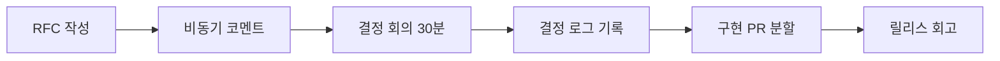

# Software Engineering 101 (8/10): 협업 프로세스

제품은 혼자 만들 수 없습니다. 코드는 한 사람이 먼저 작성할 수 있어도, 요구사항을 맞추고, 설계를 검토하고, 운영 리스크를 줄이고, 일정과 우선순위를 맞추는 일은 결국 여러 사람이 함께 해야 합니다. 그래서 협업 프로세스가 약하면 기술 결정은 사실보다 관계에 따라 흔들리기 쉽습니다.

이 글은 Software Engineering 101 시리즈의 8번째 글입니다.

회의를 많이 한다고 협업이 좋아지는 것도 아닙니다. 오히려 기록이 없는 긴 회의는 같은 논쟁을 반복하게 만들고, 팀의 시간을 가장 비싼 방식으로 사용하게 만듭니다. 좋은 프로세스는 사람의 시간을 보호하고, 결정의 흔적을 남기고, 동기식 대화를 정말 필요한 순간에만 쓰게 만듭니다.


*Software Engineering 101 8장 흐름 개요*

> 좋은 협업 프로세스는 사람의 시간을 보호하고 결정의 흔적을 남깁니다 — 회의를 늘리는 것이 협업이 아니라, 동기식 대화를 정말 필요한 순간에만 쓰고 나머지는 기록과 비동기로 흐르게 만드는 것이 핵심입니다.

## 이 글에서 다룰 문제

- RFC는 어떤 구조로 쓰면 충분할까요?
- 언제 비동기로 논의하고, 언제 짧은 동기 회의를 해야 할까요?
- 회의 시간을 줄이면서도 명확성을 잃지 않으려면 어떤 패턴이 필요할까요?
- 이 개념을 실무에서 잘못 적용하면 어떤 문제가 생길까요?
- 이 주제에서 초보자가 가장 자주 놓치는 포인트는 무엇일까요?

코드는 혼자 쓸 수 있어도 제품은 여러 사람이 엮여서 만듭니다. 이때 프로세스가 없으면 누가 더 말을 많이 했는가, 누가 더 직급이 높은가 같은 요소가 사실보다 더 큰 힘을 갖게 됩니다. 반대로 글로 먼저 생각을 정리하고, 짧게 모여 결정을 내리고, 기록을 남기면 협업 비용이 크게 줄어듭니다.

또한 협업 프로세스는 팀의 속도를 결정합니다. 모든 사안을 회의에서 풀려고 하면 시간대가 다른 팀은 느려지고, 메모가 없으면 같은 주제가 반복됩니다. 잘 설계된 프로세스는 사람을 통제하기보다, 반복 낭비를 줄이는 방향으로 작동해야 합니다.

## 한눈에 보는 흐름

토론은 비동기로 넓게 받고, 결정은 짧은 동기 회의에서 닫는 편이 효율적입니다.

- **RFC**: 제안과 토론을 담는 문서입니다.
- **DACI**: Driver, Approver, Contributor, Informed로 역할을 나누는 모델입니다.
- **비동기 우선**: 회의보다 문서를 먼저 쓰는 협업 방식입니다.
- **결정 로그**: 누가 언제 무엇을 결정했는지 남기는 기록입니다.
- **핸드오프**: 시차나 역할 경계를 넘어 작업을 넘기는 메모입니다.

## 전후 비교

**이전 — 회의 중심 협업**

```text
12 meetings a week, no decision trail -> same debate repeats
```

**이후 — RFC와 결정 회의 조합**

```text
3 days async on RFC -> 30-min decision meeting -> decision log
```

회의는 논의를 시작하는 자리가 아니라, 충분히 익은 논의를 닫는 자리일 때 효과가 큽니다.

## 단계별로 작은 협업 흐름 만들기

### 1단계 — RFC 템플릿 만들기

```markdown
# 1_rfc.md
## 제목
## 문제 정의
## 제안
## 대안
## 위험 요소
## 열린 질문
## 리뷰 담당자
```

좋은 RFC는 해법보다 문제를 먼저 선명하게 적습니다. 문제 정의가 흐리면 토론도 흩어집니다.

### 2단계 — 비동기 코멘트 받기

```markdown
# 2_review.md
- @alice [blocking] cost estimate misses infra cost
- @bob [question] migration downtime?
- @carol [nit] terminology inconsistent
```

태그가 있으면 어떤 코멘트가 머지를 막는지 빠르게 구분할 수 있습니다.

### 3단계 — 짧은 결정 회의 열기

```markdown
# 3_meeting.md
30 minutes, fewer than 5 people, agenda is one RFC link.
```

회의는 하나의 RFC를 닫는 데 집중해야 합니다. 토론 대부분은 문서에서 미리 끝내 두는 편이 좋습니다.

### 4단계 — 결정 로그 남기기

```markdown
# 4_decision_log.md
| Date | Topic | Decision | Driver | Approver |
|------|-------|----------|--------|----------|
| 2026-05-04 | introduce cache | adopt Redis | A | B |
```

결정 로그가 있으면 같은 질문을 다시 처음부터 시작할 일이 줄어듭니다.

### 5단계 — 핸드오프 메모 쓰기

```markdown
# 5_handoff.md
## 어제까지 진행
- API spec agreed
## 오늘 목표
- implement handlers
## 막힌 지점
- waiting for token format clarification
```

분산 팀에서 핸드오프 메모는 사람 사이를 잇는 비동기 인터페이스 역할을 합니다.

## 프로젝트 관리 예시: 스프린트에서 RFC 프로세스 운영하기

RFC 프로세스는 대규모 변경뿐 아니라 중간 규모의 기술 결정에도 적용할 수 있습니다. 아래는 "알림 시스템 채널 추가" 기능에 RFC를 적용한 스프린트 운영 예시입니다.

```markdown
[스프린트 N: 알림 채널 추가 의사결정]

D-1: RFC 초안 작성
- 작성자: @alice (Driver)
- 배포 범위: 이메일 + SMS 동시 지원 여부
- 위험 요소: SMS API 비용, 발송 실패 재시도 정책
- 대안: 이메일만 먼저, SMS는 다음 분기

D0~D2: 비동기 리뷰
- @bob: "SMS 실패 시 이메일로 fallback 하는 동작 명시 필요" [blocking]
- @carol: "비용 추정에 월 1만 건 기준 수치 추가 요청" [question]
- @alice: 두 코멘트 반영 후 RFC v2 업데이트

D3: 결정 회의 (30분)
- 참석: Driver(@alice), Approver(@manager), Contributors(@bob, @carol)
- 결론: 이메일 우선 + SMS는 Q3에 Feature Flag로 분리 출시
- 결정 로그 기록 후 RFC 상태 "Accepted" 업데이트

D4~D9: 구현
- RFC 링크를 PR 본문에 포함
- 결정 이유가 코드 리뷰에서 재논쟁되지 않음
```

이 프로세스가 팀에 자리잡으면 "왜 이렇게 만들었는가"를 구현 후에 설명하는 일이 줄어듭니다.

## 협업 흐름을 점검하는 질문

좋은 프로세스는 회의 수가 아니라 재논의 횟수를 줄입니다. 최근 의사결정 하나를 기준으로 RFC, 승인자, 기록이 실제로 남았는지 확인해 보세요.

### 확인 절차

1. 최근 변경 하나를 골라 RFC나 제안 문서가 있었는지 찾습니다.
2. 누가 승인자였는지, 언제 결론이 났는지 기록을 확인합니다.
3. 회의 없이도 다음 담당자가 이어받을 수 있는 핸드오프 메모가 있는지 봅니다.

**예상 결과:**

- 비동기 토론이 충분하면 동기 회의는 30분 안쪽으로 닫히기 쉽습니다.
- 승인자와 결정 로그가 있으면 같은 주제를 다시 처음부터 설명할 일이 줄어듭니다.
- 핸드오프 메모가 있으면 시차가 있어도 작업 흐름이 덜 끊깁니다.

### 실패 신호

- 회의 참가자마다 결론을 다르게 기억합니다.
- 승인자가 없어 코멘트만 쌓이고 결정은 닫히지 않습니다.
- 다음 담당자가 전날 맥락을 슬랙 검색으로만 복원해야 합니다.

## 자주 하는 실수

| 실수 패턴 | 구체적 증상 | 왜 문제인가 | 개선 방향 |
|---|---|---|---|
| 모든 결정을 회의에서 처리 | 주간 회의가 2시간 이상 지속 | 팀 시간을 가장 비싸게 소모 | RFC로 사전 정리 후 30분 결정 회의로 전환 |
| 승인자 미지정 | 코멘트가 쌓이지만 결론이 안 남 | 합의 없이 방치 상태로 종결 | DACI 모델로 Approver 명시 의무화 |
| 회의 메모 없음 | 참석자마다 다른 결론을 기억 | 같은 주제로 2~3주 후 재회의 | 회의 종료 시 결정 1~2개 + 열린 질문 + 후속 담당자 문서화 |
| 기술 결정 구두로만 전달 | "아까 슬랙에서 말했는데요" | 새 팀원 합류 시 맥락 없음 | 슬랙 대화도 결정 시 PR·이슈로 링크 이전 |
| 비동기 협업에서 근거 없는 주장 | "좋을 것 같다"처럼 데이터 없는 의견 | 논의가 취향 대결로 변질 | "근거 링크 + 영향 분석"을 코멘트 형식으로 의무화 |

## 어디서 자주 헷갈릴까요?

가장 흔한 실수는 모든 결정을 회의에서 하려는 태도입니다. 회의는 사람의 시간을 동시에 묶기 때문에 가장 비싼 협업 수단입니다. 미리 문서로 쓸 수 있는 내용까지 회의로 끌고 오면 팀 전체 속도가 떨어집니다.

또 다른 실수는 누가 최종 승인자인지 정하지 않는 것입니다. 기여자는 많아도 승인자가 없으면 논의는 닫히지 않고 계속 열려 있습니다. 합의가 아니라 방치 상태가 되는 셈입니다.

회의 메모가 없는 문화도 반복 비용을 키웁니다. 시간이 지나면 참석자마다 다른 기억을 가지고 돌아오고, 결국 같은 주제를 다시 회의에 올리게 됩니다.

## 실무에서는 이렇게 생각합니다

원격 협업이 많은 팀일수록 RFC, 결정 로그, 짧은 결정 회의의 조합을 표준으로 두는 경우가 많습니다. 문서로 충분히 읽고 댓글로 토론한 뒤, 동기 회의는 남은 쟁점을 정리하고 승인하는 데 집중합니다.

시니어 엔지니어는 사람의 시간을 코드와 같은 자원으로 봅니다. 좋은 프로세스는 사람을 더 바쁘게 만드는 절차가 아니라, 같은 결정을 다시 하지 않게 만드는 장치여야 합니다. 프로세스의 품질은 문서가 많으냐가 아니라, 결정이 더 빨리 닫히고 더 오래 설명 가능한가로 드러납니다.

## 요구사항-리뷰-테스트 연결표

```text
REQ-12: 만료 쿠폰 거부
- Review check: 상태 코드 400 + error_code=coupon_expired 확인
- Test case: test_apply_expired_coupon
- Metric: coupon_expired 발생 비율
```

연결표를 유지하면 "무엇을 만들었는가"가 아니라 "어떤 기준을 만족했는가"로 대화가 바뀝니다.

### 운영 전환 체크

- 배포 노트에 요구사항 ID와 PR 링크를 함께 남깁니다.
- 온콜 핸드오프 문서에 새 기능의 실패 시그널을 명시합니다.
- 첫 24시간 관찰 지표와 임계치를 릴리스 전에 고정합니다.

## RFC 템플릿(확장형)

```markdown
# RFC-021: 주문 취소 정책 개편
- 문제: 부분 취소 시 정산 오류 발생
- 제안: 취소 상태를 이벤트 소싱으로 분리
- 성공 기준: 정산 오류율 0.2% 이하
- 롤아웃: 내부 팀 -> 10% 사용자 -> 전체
- 실패 시 복구: 기존 동기 처리 경로 즉시 복귀
```

### 협업 Git 흐름 예시


```mermaid
flowchart LR
    A["RFC 작성"] --> B["비동기 코멘트"]
    B --> C["결정 회의 30분"]
    C --> D["결정 로그 기록"]
    D --> E["구현 PR 분할"]
    E --> F["릴리스 회고"]
```

## 설계 검토 회의 운영안

협업 프로세스의 품질은 회의 횟수가 아니라 회의 단위 산출물로 결정됩니다.

- 5분: 문제와 목표 재확인
- 10분: 선택안 A/B 비교
- 10분: 주요 위험 요소 점검
- 5분: 결정/보류/후속 과제 확정

회의 종료 시에는 반드시 다음 3개를 남깁니다.

1. 오늘의 결정 1~2개
2. 열려 있는 질문과 담당자
3. 다음 검토 시점

## 비동기 협업 코멘트 규칙

- 주장만 쓰지 말고 근거 링크를 함께 남깁니다.
- 반대 의견은 대안과 영향 분석을 함께 제시합니다.
- "좋아요/별로" 대신 검증 가능한 기준으로 표현합니다.
- 결론이 난 스레드는 요약 코멘트로 닫습니다.

비동기 협업의 목적은 메시지를 많이 남기는 것이 아니라, 다음 사람이 읽고 즉시 결정 맥락을 이해하게 만드는 것입니다.

## 운영 체크리스트

- [ ] 큰 변경에 RFC가 있나요?
- [ ] 결정 로그를 검색할 수 있나요?
- [ ] 회의 전에 안건과 승인자가 정해지나요?
- [ ] 핸드오프 메모 템플릿이 있나요?
- [ ] 회의 뒤에 반드시 글로 된 결정이 남나요?

## 연습 문제

1. 이번 주 회의 하나를 RFC와 비동기 코멘트로 바꿔 보세요.
2. 최근 결정 다섯 개를 결정 로그 표로 옮겨 보세요.
3. 팀용 한 장짜리 핸드오프 메모 템플릿을 만들어 보세요.

## 정리

좋은 협업 프로세스는 더 많은 회의를 만드는 것이 아니라, 더 적은 회의로 더 명확한 결정을 내리게 합니다. RFC, 비동기 토론, 짧은 결정 회의, 결정 로그, 핸드오프 메모가 갖춰지면 팀은 같은 시간으로 더 많은 합의를 만들어 낼 수 있습니다.

다음 글에서는 긴 수명을 가진 시스템이 반드시 마주치는 주제, 유지보수와 기술부채를 다룹니다. 부채를 어떻게 측정하고 우선순위를 잡아 안전하게 갚아 나갈지 이어서 정리하겠습니다.

## 처음 질문으로 돌아가기

- **RFC는 어떤 구조로 쓰면 충분할까요?**
  - 최소 다섯 섹션이면 충분합니다. 제목과 문제 정의, 제안 내용, 검토한 대안, 위험 요소, 열린 질문입니다. 형식보다 중요한 것은 "문제"를 먼저 명확하게 적는 것입니다. 문제 정의가 흐리면 솔루션 논쟁이 엉뚱한 방향으로 흐릅니다. 길게 쓰는 것보다 팀이 3일 안에 비동기 코멘트를 달 수 있는 분량이 적절합니다.
- **언제 비동기로 논의하고, 언제 짧은 동기 회의를 해야 할까요?**
  - 정보 공유, 초안 검토, 의견 수집은 비동기가 적합합니다. 서로 다른 해석을 빠르게 좁혀야 하거나, 감정적 긴장이 있거나, 즉각 결정이 필요할 때만 동기 회의를 씁니다. 기준은 "이 토론이 3일 비동기로 진행되어도 결론이 날 수 있는가?"입니다. 그렇다면 비동기로 먼저 시작합니다.
- **회의 시간을 줄이면서도 명확성을 잃지 않으려면 어떤 패턴이 필요할까요?**
  - 세 가지 패턴이 핵심입니다. 첫째 회의 전 RFC나 안건 문서를 공유해 참석자가 사전 준비를 마칩니다. 둘째 회의는 토론이 아닌 결정 도구로 씁니다. 토론은 이미 비동기에서 끝냅니다. 셋째 회의 후 반드시 "오늘의 결정, 열린 질문, 다음 담당자"를 글로 남깁니다. 이 세 가지가 자리잡으면 90분짜리 회의가 30분으로 줄어듭니다.

<!-- toc:begin -->
## 시리즈 목차

- [Software Engineering 101 (1/10): 소프트웨어 엔지니어링이란 무엇인가?](./01-what-is-software-engineering.md)
- [Software Engineering 101 (2/10): 요구사항 이해하기](./02-understanding-requirements.md)
- [Software Engineering 101 (3/10): 설계와 구현의 차이](./03-design-vs-implementation.md)
- [Software Engineering 101 (4/10): 코드 리뷰](./04-code-review.md)
- [Software Engineering 101 (5/10): 테스트 전략](./05-testing-strategy.md)
- [Software Engineering 101 (6/10): 버전 관리와 릴리스](./06-version-control-and-release.md)
- [Software Engineering 101 (7/10): 문서화](./07-documentation.md)
- **Software Engineering 101 (8/10): 협업 프로세스 (현재 글)**
- [Software Engineering 101 (9/10): 유지보수와 기술부채](./09-maintenance-and-tech-debt.md)
- [좋은 소프트웨어의 기준](./10-what-makes-good-software.md)

<!-- toc:end -->

## 참고 자료

- [Software Engineering 101 예제 코드 (book-examples)](https://github.com/yeongseon-books/book-examples/tree/main/software-engineering-101/ko)
- [GitLab Handbook — Async Collaboration](https://handbook.gitlab.com/handbook/company/culture/all-remote/asynchronous/)
- [Oxide Computer — RFD Process](https://oxide.computer/blog/rfd-1-requests-for-discussion)
- [Atlassian — DACI Framework](https://www.atlassian.com/team-playbook/plays/daci)
- [Basecamp — Shape Up](https://basecamp.com/shapeup)

Tags: Computer Science, SoftwareEngineering, Collaboration, Process, RFC, Async
