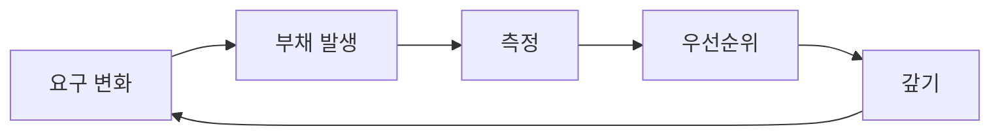

# 유지보수와 기술부채

> Software Engineering 101 시리즈 (9/10)


## 이 글에서 다룰 문제

부채가 없는 코드는 없습니다. 문제는 그 부채를 의식하느냐, 측정하느냐, 갚느냐입니다.

> 부채는 문제가 아니다. 무의식적 부채가 문제다.

## 전체 흐름


부채는 사이클입니다, 사건이 아닙니다.

## Before/After

**Before — "나중에 한 번에"**

```text
12개월 후 빅뱅 리팩터 -> 사고 + 일정 폭발
```

**After — 분기마다 5%**

```text
스프린트마다 부채 5%, 측정 후 우선순위 -> 점진적 개선
```

작게 자주가 안전합니다.

## 부채를 코드로 다루기

### 1단계 — 부채 라벨

```python
# 1_label.py
# DEBT(billing): tax 계산이 PaymentService에 새고 있음
# 만기: 2026 Q3, 담당: @alice
def charge(amount): ...
```

부채에 만기와 담당이 있어야 합니다.

### 2단계 — 부채 인덱스

```markdown
# 2_index.md
| ID | Area | Severity | Owner | Due |
|----|------|----------|-------|-----|
| D-12 | billing | high | alice | 2026 Q3 |
| D-13 | auth | mid | bob | 2026 Q4 |
```

검색 가능한 부채만이 갚을 수 있는 부채입니다.

### 3단계 — Strangler Fig 패턴

```python
# 3_strangler.py
def charge(amount):
    if feature("new_billing"):
        return new_billing.charge(amount)
    return legacy.charge(amount)
```

기능 플래그로 점진 교체.

### 4단계 — Deprecation 단계

```python
# 4_deprecate.py
import warnings
def old_api(*a, **kw):
    warnings.warn("old_api is deprecated; use new_api", DeprecationWarning, stacklevel=2)
    return new_api(*a, **kw)
```

경고 -> 호출 추적 -> 제거(분기마다 한 단계).

### 5단계 — 부채 지표 대시보드

```text
# 5_metrics.md
- 코드 복잡도(평균 cyclomatic)
- 테스트 커버리지 변화율
- 스프린트당 부채 처리 건수
- 사고 시 평균 복구 시간(MTTR)
```

측정되지 않으면 갚지 않게 됩니다.

## 이 코드에서 주목할 점

- 부채에 만기와 담당이 있습니다.
- Strangler Fig는 회수 가능한 교체입니다.
- Deprecation은 단계적, 측정 가능합니다.
- 지표가 없으면 부채는 잊힙니다.

## 자주 하는 실수 5가지

1. **빅뱅 리팩터.** 가장 빈번한 사고 원인.
2. **부채 라벨 없음.** 검색 불가, 갚기 불가.
3. **Deprecation 즉시 제거.** 호출자 깨짐.
4. **부채를 사람 핑계로.** 부채는 시스템의 결과.
5. **부채 지표 없음.** 측정 불가, 우선순위 불가.

## 실무에서는 이렇게 쓰입니다

성숙한 팀은 스프린트마다 capacity의 10~20%를 부채 처리에 할당. Strangler Fig + feature flag로 무중단 교체. 분기마다 부채 인덱스 정리.

## 체크리스트

- [ ] 부채 인덱스가 있는가?
- [ ] 각 부채에 만기와 담당이 있는가?
- [ ] 스프린트마다 부채 처리 capacity가 있는가?
- [ ] Deprecation 단계가 정의되어 있는가?
- [ ] 부채 지표가 대시보드에 있는가?

## 정리 및 다음 단계

부채는 사이클입니다. 의식하고, 측정하고, 분기마다 갚습니다. 마지막 글에서는 이 모든 것을 묶는 — 좋은 소프트웨어의 기준 — 을 봅니다.

<!-- toc:begin -->
- [소프트웨어 엔지니어링이란 무엇인가?](./01-what-is-software-engineering.md)
- [요구사항 이해하기](./02-understanding-requirements.md)
- [설계와 구현의 차이](./03-design-vs-implementation.md)
- [코드 리뷰](./04-code-review.md)
- [테스트 전략](./05-testing-strategy.md)
- [버전 관리와 릴리스](./06-version-control-and-release.md)
- [문서화](./07-documentation.md)
- [협업 프로세스](./08-collaboration-process.md)
- **유지보수와 기술부채 (현재 글)**
- 좋은 소프트웨어의 기준 (예정)
<!-- toc:end -->

## 참고 자료

- [Martin Fowler — Technical Debt Quadrant](https://martinfowler.com/bliki/TechnicalDebtQuadrant.html)
- [Martin Fowler — StranglerFigApplication](https://martinfowler.com/bliki/StranglerFigApplication.html)
- [Refactoring — Martin Fowler](https://martinfowler.com/books/refactoring.html)
- [Working Effectively with Legacy Code — Michael Feathers](https://www.oreilly.com/library/view/working-effectively-with/0131177052/)

Tags: Computer Science, SoftwareEngineering, Maintenance, TechDebt, Refactoring, Legacy
