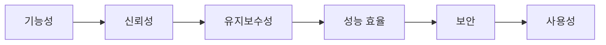

# 좋은 소프트웨어의 기준

> Software Engineering 101 시리즈 (10/10)


## 이 글에서 다룰 문제

기능이 동작한다는 것은 시작이지 끝이 아닙니다. 좋은 소프트웨어는 시간을 견디고 사람을 키웁니다.

> 단순한 것이 오래 살아남는다.

## 개념 한눈에 보기



품질은 한 축이 아니라 여러 축의 균형입니다.

## Before/After

**Before — 기능 중심**

```text
"잘 동작합니다" 만 측정 -> 6개월 후 변경 비용 폭증
```

**After — 품질 속성 측정**

```text
변경 리드 타임, 사고율, MTTR, 유지보수성 점수 -> 의사결정 가능
```

측정 가능한 품질만 개선됩니다.

## 실습: 작은 품질 점검 키트

### 1단계 — SRP 점검(SOLID의 S)

```python
# 1_srp.py
class Invoice:           # 책임 1: 데이터
    ...
class InvoicePrinter:    # 책임 2: 출력
    ...
```

한 클래스에 한 가지 변경 이유.

### 2단계 — DIP 점검(SOLID의 D)

```python
# 2_dip.py
class OrderService:
    def __init__(self, repo: "Repo"):  # 인터페이스에 의존
        self.repo = repo
```

추상에 의존, 구체에 의존 금지.

### 3단계 — 단순성 측정

```bash
# 3_complexity.sh
radon cc app/ -a -nb
```

복잡도가 일정 임계 이상이면 분해.

### 4단계 — 변경 리드 타임 측정

```bash
# 4_lead_time.sh
git log --pretty='%H %as' -- app/ | head
```

코드 작성부터 배포까지 시간을 추적합니다.

### 5단계 — 외부 신호 4가지

```text
# 5_signals.md
- 새 입사자의 첫 PR까지 시간
- 사고 평균 복구 시간
- 기능 추가 평균 리드 타임
- 사용자 만족도(NPS, CSAT)
```

내부 코드보다 외부 신호가 진실에 가깝습니다.

## 이 코드에서 주목할 점

- 한 클래스, 한 변경 이유.
- 추상 의존이 변경 비용을 결정합니다.
- 복잡도는 측정 가능합니다.
- 외부 신호가 품질의 진실을 말합니다.

## 자주 하는 실수 5가지

1. **기능만 측정.** 변경 비용은 곧 폭증합니다.
2. **SOLID를 교조로.** 원칙은 도구지 신앙이 아닙니다.
3. **추상화를 너무 많이.** 단순성을 죽입니다.
4. **외부 신호 무시.** 사용자 신뢰가 진짜 지표.
5. **품질을 마지막에.** 처음부터 측정해야 합니다.

## 실무에서는 이렇게 쓰입니다

좋은 팀은 DORA 4 metrics(배포 빈도, 리드 타임, 변경 실패율, MTTR)를 추적, 분기마다 회고. 새 기능 결정 시 품질 속성 영향(reliability/security)을 명시.

## 체크리스트

- [ ] 품질 속성 6가지를 알고 있는가?
- [ ] DORA 4 metrics를 측정하는가?
- [ ] 복잡도와 리드 타임이 대시보드에 있는가?
- [ ] SOLID를 도구로(교조 아님) 쓰는가?
- [ ] 외부 신호를 분기마다 본다?

## 정리 및 다음 단계

좋은 소프트웨어는 단순하고, 측정 가능하며, 사람을 키웁니다. 이 시리즈는 여기서 끝나지만, 위 다섯 글의 원칙은 다음 시리즈(Clean Code, Design Patterns, API Design 등)에서 더 깊어집니다.

<!-- toc:begin -->
- [소프트웨어 엔지니어링이란 무엇인가?](./01-what-is-software-engineering.md)
- [요구사항 이해하기](./02-understanding-requirements.md)
- [설계와 구현의 차이](./03-design-vs-implementation.md)
- [코드 리뷰](./04-code-review.md)
- [테스트 전략](./05-testing-strategy.md)
- [버전 관리와 릴리스](./06-version-control-and-release.md)
- [문서화](./07-documentation.md)
- [협업 프로세스](./08-collaboration-process.md)
- [유지보수와 기술부채](./09-maintenance-and-tech-debt.md)
- **좋은 소프트웨어의 기준 (현재 글)**
<!-- toc:end -->

## 참고 자료

- [ISO/IEC 25010 — Product Quality Model](https://iso25000.com/index.php/en/iso-25000-standards/iso-25010)
- [Robert C. Martin — SOLID Principles](https://en.wikipedia.org/wiki/SOLID)
- [DORA — State of DevOps](https://dora.dev/)
- [A Philosophy of Software Design — John Ousterhout](https://web.stanford.edu/~ouster/cgi-bin/aposd.php)

Tags: Computer Science, SoftwareEngineering, Quality, SOLID, Simplicity, Engineering
