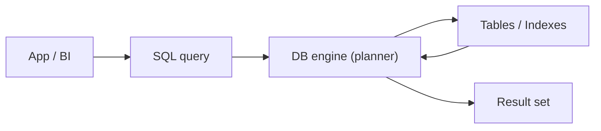

# What Is SQL?

> SQL 101 series (1/10)

<!-- a-grade-intro:begin -->

**Core question**: Why did the era of *moving rows by hand* end? How did we get a language where you only have to *describe what you want*?

> *SQL is the language for stating *what you want*, not *how to get it*.*

<!-- a-grade-intro:end -->

## What You Will Learn

- What *SQL* is and the heart of the *relational model*
- What it means for a language to be *declarative*
- The split between *DDL / DML / DCL*
- Five steps to your first query
- Five common mistakes

## Why It Matters

Analysts, backend engineers, and data engineers *all share* SQL. The moment data outgrows a spreadsheet, *one SQL line saves a day*. And SQL has been *useful for over 40 years*, so the time you spend learning it *keeps paying off*.

> *As data grows, SQL becomes the only *reasonable* tool.*

## Concept at a Glance



## Key Terms

- **Table**: the basic unit, made of *rows* and *columns*.
- **Row / Column**: *one fact* and *one attribute*.
- **Schema**: the *blueprint* of tables and their relations.
- **Query**: a *sentence* asking the database something.
- **Result set**: the *rows* a query returns.

## Before/After

**Before**: You chain three *VLOOKUPs* across split spreadsheets to find an answer.

**After**: One SQL statement does the *join, aggregation, and filter* in one shot.

## Hands-on: Your First Query in Five Steps

### Step 1 — Create a table

```sql
CREATE TABLE users (
    id INT PRIMARY KEY,
    name TEXT NOT NULL,
    signup_at DATE NOT NULL
);
```

### Step 2 — Insert data

```sql
INSERT INTO users (id, name, signup_at) VALUES
    (1, 'Ada', '2026-01-01'),
    (2, 'Linus', '2026-02-15'),
    (3, 'Grace', '2026-03-30');
```

### Step 3 — Read everything

```sql
SELECT * FROM users;
```

### Step 4 — Filter

```sql
SELECT name FROM users WHERE signup_at >= '2026-02-01';
```

### Step 5 — Count

```sql
SELECT COUNT(*) AS total FROM users;
```

## What to Notice in This Code

- You never said *how* to fetch the data — only *what* you want.
- The engine decides *whether to use an index*, *how to sort*.
- The same result can be expressed in *many ways*.

## Five Common Mistakes

1. **Using `SELECT *` *by reflex*.** As columns grow, *network and memory* grow with them.
2. **Storing everything as *strings*.** Aggregations later become *misery*.
3. **Treating NULL like *0*.** NULL means *unknown* — a separate value.
4. **Mixing *case styles* randomly.** Pick a team convention to keep queries *readable*.
5. **Eyeballing results.** Verify with *COUNT, SUM* — actual numbers.

## How This Shows Up in Production

Dashboards, user metrics, A/B test results, revenue reports — *most analytics* starts as one or two SQL queries. Backends *read and tune SQL* even when an *ORM* is in front. Most *ETL* steps are SQL.

## How a Senior Engineer Thinks

- *SQL is the language *closest to the data*.*
- *Reading time is longer than writing time.*
- *If you don't read the *plan*, you are not tuning.*
- *Handle NULL *explicitly*.*
- *Break large queries into *CTEs* with named layers.*

## Checklist

- [ ] I can explain *SELECT, FROM, WHERE* out loud.
- [ ] I know the difference between *table, row, column*.
- [ ] I know what *NULL* means.
- [ ] I can tell *DDL* from *DML*.

## Practice Problems

1. Count the total rows in an *orders* table.
2. List the *names* of users who signed up *after March 2026*.
3. Explain to a teammate why `SELECT *` is *risky*.

## Wrap-up and Next Steps

SQL describes the *result*, not the steps. The next post takes a careful look at *SELECT*, the most-used statement.

<!-- toc:begin -->
- **What Is SQL? (current)**
- SELECT Basics (upcoming)
- WHERE and Conditions (upcoming)
- JOIN (upcoming)
- GROUP BY and Aggregates (upcoming)
- Subquery (upcoming)
- Window Function (upcoming)
- INSERT, UPDATE, DELETE (upcoming)
- Index and Query Plan (upcoming)
- Practical Analysis SQL (upcoming)
<!-- toc:end -->

## References

- [PostgreSQL Tutorial — SQL](https://www.postgresql.org/docs/current/tutorial-sql.html)
- [SQLBolt — Interactive SQL Lessons](https://sqlbolt.com/)
- [Use The Index, Luke](https://use-the-index-luke.com/)
- [Mode — SQL Tutorial](https://mode.com/sql-tutorial/)

Tags: SQL, Database, RDBMS, Postgres, Analytics
