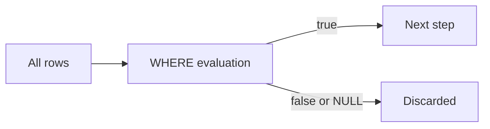

# WHERE and Conditions

> SQL 101 series (3/10)

<!-- a-grade-intro:begin -->

**Core question**: How does *one condition* drop millions of rows, and where do the *NULLs we miss* sneak in?

> *WHERE is the *front gate* for data. It must block precisely and pass precisely.*

<!-- a-grade-intro:end -->

## What You Will Learn

- *Comparison operators* and the precedence of *AND / OR*
- The differences between *IN, BETWEEN, LIKE*
- Why NULL comparisons are different
- How condition shape affects *performance*
- Five common mistakes

## Why It Matters

A single line in WHERE often decides *90% of the cost*. Whether an *index hits*, how many rows scan, how much memory the server uses — it all flows from WHERE. And *NULL* is the most common silent corruptor of results.

> *Returning a *wrong answer fast* happens *more often than people think*.*

## Concept at a Glance



## Key Terms

- **Predicate**: a *condition expression* deciding row passage.
- **Sargable**: a condition shape that *can use an index*.
- **Three-valued logic**: true / false / NULL.
- **Operator precedence**: AND binds *before* OR.
- **Pattern matching**: `LIKE` with `%` and `_`.

## Before/After

**Before**: `WHERE name LIKE '%kim%' OR age > 30` — *intent is unclear*.

**After**: `WHERE (name LIKE '%kim%' OR age > 30) AND active = TRUE` — parentheses make intent *explicit*.

## Hands-on: Five Conditions

### Step 1 — Comparison

```sql
SELECT * FROM users WHERE age >= 18;
```

### Step 2 — Range

```sql
SELECT * FROM orders WHERE total BETWEEN 100 AND 500;
```

### Step 3 — Membership

```sql
SELECT * FROM users WHERE country IN ('KR', 'JP', 'US');
```

### Step 4 — Pattern

```sql
SELECT * FROM users WHERE email LIKE '%@example.com';
```

### Step 5 — NULL-safe

```sql
SELECT * FROM users WHERE deleted_at IS NULL;
```

## What to Notice in This Code

- `LIKE '%xxx'` *cannot use an index*. Trailing wildcards are *expensive*.
- `IN` works for *small lists*. For larger ones, switch to a *join*.
- Only `IS NULL` matches NULL. `= NULL` is *always false*.

## Five Common Mistakes

1. **Comparing with `= NULL`.** The result is treated as false, so rows *vanish*.
2. **Skipping AND/OR parentheses.** AND binds first and *changes meaning*.
3. **Wrapping the column in a function.** `WHERE LOWER(email) = ...` *kills the index*.
4. **`LIKE '%kim%'`** scans *millions of rows*.
5. **Type mismatch.** `age = '18'` triggers an *implicit cast* that *defeats the index*.

## How This Shows Up in Production

Dashboard filters, *search boxes*, and *permission checks* all funnel into WHERE. Search is usually offloaded to a *full-text index* or a *dedicated search engine*. NULL handling becomes a *team convention*.

## How a Senior Engineer Thinks

- *Never wrap the column in a function.*
- *Handle NULL *explicitly*.*
- *Look at the *selectivity* of each predicate.*
- *Always parenthesize AND/OR.*
- *Big OR lists belong in a *join or IN*.*

## Checklist

- [ ] I know the difference between `IS NULL` and `= NULL`.
- [ ] I know AND/OR precedence.
- [ ] I know when `LIKE` is expensive.
- [ ] I can define *sargable*.

## Practice Problems

1. Return only users where `deleted_at` is NULL.
2. Filter rows where `signup_at` falls in *Q1 2026*.
3. Rewrite `country IN ('KR','JP')` using *OR* and compare.

## Wrap-up and Next Steps

WHERE is the *gatekeeper*. The next post is *JOIN*.

<!-- toc:begin -->
- [What Is SQL?](./01-what-is-sql.md)
- [SELECT Basics](./02-select-basics.md)
- **WHERE and Conditions (current)**
- JOIN (upcoming)
- GROUP BY and Aggregates (upcoming)
- Subquery (upcoming)
- Window Function (upcoming)
- INSERT, UPDATE, DELETE (upcoming)
- Index and Query Plan (upcoming)
- Practical Analysis SQL (upcoming)
<!-- toc:end -->

## References

- [PostgreSQL — WHERE clause](https://www.postgresql.org/docs/current/queries-table-expressions.html#QUERIES-WHERE)
- [PostgreSQL — Pattern Matching](https://www.postgresql.org/docs/current/functions-matching.html)
- [Use The Index, Luke — Where Clause](https://use-the-index-luke.com/sql/where-clause)
- [Mode — WHERE](https://mode.com/sql-tutorial/sql-where/)

Tags: SQL, WHERE, Filter, Database, NULL
