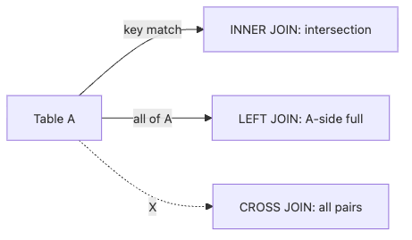

# JOIN

Once you leave single-table questions behind, SQL gets more powerful and more dangerous at the same time. The query still looks readable, but one wrong join assumption can double a metric, erase unmatched rows, or explode the result size before anyone notices.

That is why JOIN is less about memorizing keywords and more about thinking in relationships. The real skill is predicting how many matches each row can have before you trust any aggregate built on top of the result.

This is post 4 in the SQL 101 series. Here we treat JOIN as a relationship operation between row sets, not as a formatting trick for columns.

## Questions this chapter answers

- How do INNER, LEFT, RIGHT, FULL, and CROSS JOIN differ?
- Why should you inspect join keys and cardinality before anything else?
- Why do row counts sometimes grow unexpectedly after a join?
- What is the safest pattern for finding rows without a match?
- How should you verify multi-table joins before aggregating?

> JOIN combines rows according to a relationship. If the relationship assumption is wrong, the result can still look tidy while the metric becomes wrong.

## Why It Matters

Most real queries include a join somewhere in the middle. Reports pull users, orders, products, payments, and events together; application debugging queries walk relationships to explain what happened to one customer. In all of those cases, the central risk is not the keyword itself. It is the hidden multiplicity behind the relationship.

Strong SQL reviewers do not just read the ON clause. They ask what kind of match count is expected on each side and whether a later SUM or COUNT will stay stable after that expansion.

## JOIN result flow


## Key Terms

- **Join key**: the columns that *connect two tables*.
- **Cardinality**: how many *partners* one row has.
- **Equi-join**: the most common form, joined on `=`.
- **Self-join**: a table joined to *itself*.
- **Anti-join**: rows with *no partner*.

## Before/After

**Before**: `SELECT SUM(o.total) FROM orders o JOIN payments p ON o.id = p.order_id;` — split payments *double the total*.

**After**: Join against an *aggregated subquery* on payments to keep cardinality *1:1*.

## Hands-on: Five JOIN Patterns

### Step 1 — INNER JOIN

```sql
SELECT u.name, o.id AS order_id
FROM users u
INNER JOIN orders o ON o.user_id = u.id;
```

### Step 2 — LEFT JOIN

```sql
SELECT u.name, o.id AS order_id
FROM users u
LEFT JOIN orders o ON o.user_id = u.id;
```

### Step 3 — Anti-join (users with no orders)

```sql
SELECT u.id, u.name
FROM users u
LEFT JOIN orders o ON o.user_id = u.id
WHERE o.id IS NULL;
```

**Expected output:**

| id | name |
| --- | --- |
| 3 | Grace |

### Step 4 — Self-join (direct manager)

```sql
SELECT e.name AS emp, m.name AS manager
FROM employees e
LEFT JOIN employees m ON m.id = e.manager_id;
```

### Step 5 — Multi-join

```sql
SELECT u.name, p.name AS product
FROM users u
JOIN orders o ON o.user_id = u.id
JOIN order_items oi ON oi.order_id = o.id
JOIN products p ON p.id = oi.product_id;
```

## What to Notice in This Code

- A NULL after LEFT JOIN is a *signal of no match*.
- Anti-join is often *clearer than NOT EXISTS* and *easier to tune*.
- Multi-joins go fastest when the *driving table is smallest*.

## Five Common Mistakes

1. **Summing without checking *cardinality*.** Totals *inflate*.
2. **Turning LEFT JOIN into INNER via WHERE.** `WHERE o.x = ...` *drops the NULL rows*.
3. **Mixing `USING` and `ON`** in one query — readability *suffers*.
4. **Accidental CROSS JOIN.** *Cartesian explosion*.
5. **Type mismatch on join keys.** Implicit casts *kill the index*.

## How This Shows Up in Production

Reports usually join *event + user + product* — three to five tables. The *fact table* sits in the middle and *dimensions* are LEFT-joined around it. We verify cardinality with *COUNT comparisons*.

## How a Senior Engineer Thinks

- *Write down the cardinality assumption *before* joining.*
- *Always remember what NULLs in LEFT JOIN mean.*
- *Often you should aggregate *before* joining.*
- *Multi-joins read better as *CTEs*.*
- *Join keys must have *indexes* to be fast.*

## Checklist

- [ ] I can sketch INNER, LEFT, RIGHT, FULL.
- [ ] I can define cardinality.
- [ ] I can write anti-join two ways.
- [ ] I know the danger of CROSS JOIN.

## Practice Problems

1. Find *users with no orders* using an anti-join.
2. Compute *revenue per product* by *aggregating before joining*.
3. Use a *self-join* to attach the *manager name*.

## Wrap-up and Next Steps

JOIN is the language of *sets*. Next up: *GROUP BY and aggregates*.

<!-- toc:begin -->
## In this series

- [What Is SQL?](./01-what-is-sql.md)
- [SELECT Basics](./02-select-basics.md)
- [WHERE and Conditions](./03-where-and-conditions.md)
- **JOIN (current)**
- GROUP BY and Aggregates (upcoming)
- Subquery (upcoming)
- Window Function (upcoming)
- INSERT, UPDATE, DELETE (upcoming)
- Index and Query Plan (upcoming)
- Practical Analysis SQL (upcoming)

<!-- toc:end -->

## References

- [PostgreSQL — Joins](https://www.postgresql.org/docs/current/tutorial-join.html)
- [SQLBolt — Multi-table queries with JOIN](https://sqlbolt.com/lesson/select_queries_with_joins)
- [Mode — JOIN](https://mode.com/sql-tutorial/sql-joins/)
- [Use The Index, Luke — Joins](https://use-the-index-luke.com/sql/join)
- [PostgreSQL — Table Expressions](https://www.postgresql.org/docs/current/queries-table-expressions.html)

Tags: SQL, Database, Postgres, Analytics
