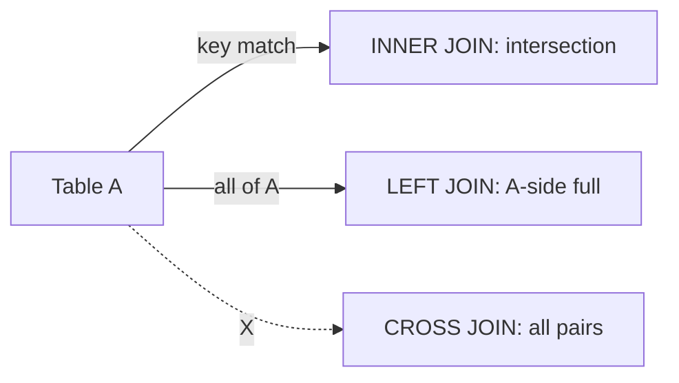

# JOIN

This is post 4 in the SQL 101 series.

> SQL 101 series (4/10)

<!-- a-grade-intro:begin -->

**Core question**: Why does combining two tables come in *five flavors*, and why do results sometimes *grow*?

> *JOIN combines *rows*, not columns.*

<!-- a-grade-intro:end -->

## What You Will Learn

- Differences between *INNER, LEFT, RIGHT, FULL, CROSS*
- *Join keys* and *cardinality*
- How results *blow up*
- A safe approach to *multi-table joins*
- Five common mistakes

## Why It Matters

Most production queries include a JOIN. Misreading the *cardinality* doubles your totals. Joining well is what makes an analyst *trustable*.

> *JOIN is the *math of sets*, not string concatenation.*

## Concept at a Glance



## Key Terms

- **Join key**: the columns that *connect two tables*.
- **Cardinality**: how many *partners* one row has.
- **Equi-join**: the most common form, joined on `=`.
- **Self-join**: a table joined to *itself*.
- **Anti-join**: rows with *no partner*.

## Before/After

**Before**: `SELECT SUM(o.total) FROM orders o JOIN payments p ON o.id = p.order_id;` — split payments *double the total*.

**After**: Join against an *aggregated subquery* on payments to keep cardinality *1:1*.

## Hands-on: Five JOIN Patterns

### Step 1 — INNER JOIN

```sql
SELECT u.name, o.id AS order_id
FROM users u
INNER JOIN orders o ON o.user_id = u.id;
```

### Step 2 — LEFT JOIN

```sql
SELECT u.name, o.id AS order_id
FROM users u
LEFT JOIN orders o ON o.user_id = u.id;
```

### Step 3 — Anti-join (users with no orders)

```sql
SELECT u.id, u.name
FROM users u
LEFT JOIN orders o ON o.user_id = u.id
WHERE o.id IS NULL;
```

### Step 4 — Self-join (direct manager)

```sql
SELECT e.name AS emp, m.name AS manager
FROM employees e
LEFT JOIN employees m ON m.id = e.manager_id;
```

### Step 5 — Multi-join

```sql
SELECT u.name, p.name AS product
FROM users u
JOIN orders o ON o.user_id = u.id
JOIN order_items oi ON oi.order_id = o.id
JOIN products p ON p.id = oi.product_id;
```

## What to Notice in This Code

- A NULL after LEFT JOIN is a *signal of no match*.
- Anti-join is often *clearer than NOT EXISTS* and *easier to tune*.
- Multi-joins go fastest when the *driving table is smallest*.

## Five Common Mistakes

1. **Summing without checking *cardinality*.** Totals *inflate*.
2. **Turning LEFT JOIN into INNER via WHERE.** `WHERE o.x = ...` *drops the NULL rows*.
3. **Mixing `USING` and `ON`** in one query — readability *suffers*.
4. **Accidental CROSS JOIN.** *Cartesian explosion*.
5. **Type mismatch on join keys.** Implicit casts *kill the index*.

## How This Shows Up in Production

Reports usually join *event + user + product* — three to five tables. The *fact table* sits in the middle and *dimensions* are LEFT-joined around it. We verify cardinality with *COUNT comparisons*.

## How a Senior Engineer Thinks

- *Write down the cardinality assumption *before* joining.*
- *Always remember what NULLs in LEFT JOIN mean.*
- *Often you should aggregate *before* joining.*
- *Multi-joins read better as *CTEs*.*
- *Join keys must have *indexes* to be fast.*

## Checklist

- [ ] I can sketch INNER, LEFT, RIGHT, FULL.
- [ ] I can define cardinality.
- [ ] I can write anti-join two ways.
- [ ] I know the danger of CROSS JOIN.

## Practice Problems

1. Find *users with no orders* using an anti-join.
2. Compute *revenue per product* by *aggregating before joining*.
3. Use a *self-join* to attach the *manager name*.

## Wrap-up and Next Steps

JOIN is the language of *sets*. Next up: *GROUP BY and aggregates*.

<!-- toc:begin -->
- [What Is SQL?](./01-what-is-sql.md)
- [SELECT Basics](./02-select-basics.md)
- [WHERE and Conditions](./03-where-and-conditions.md)
- **JOIN (current)**
- GROUP BY and Aggregates (upcoming)
- Subquery (upcoming)
- Window Function (upcoming)
- INSERT, UPDATE, DELETE (upcoming)
- Index and Query Plan (upcoming)
- Practical Analysis SQL (upcoming)
<!-- toc:end -->

## References

- [PostgreSQL — Joins](https://www.postgresql.org/docs/current/tutorial-join.html)
- [SQLBolt — Multi-table queries with JOIN](https://sqlbolt.com/lesson/select_queries_with_joins)
- [Mode — JOIN](https://mode.com/sql-tutorial/sql-joins/)
- [Use The Index, Luke — Joins](https://use-the-index-luke.com/sql/join)

Tags: SQL, JOIN, Relational, Database, Query
