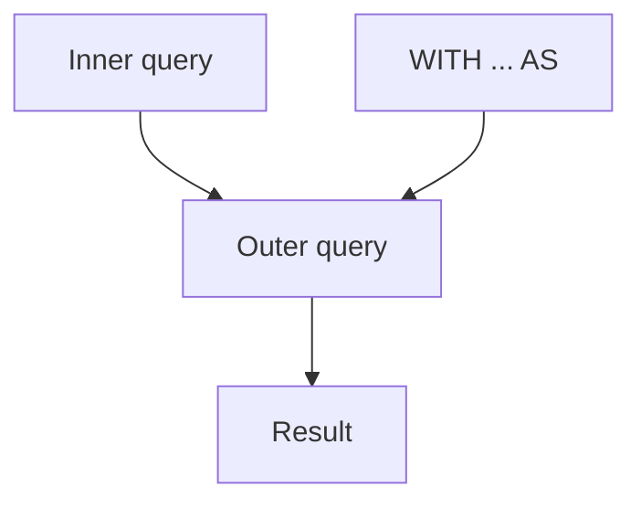

# Subquery

This is post 6 in the SQL 101 series.

> SQL 101 series (6/10)

<!-- a-grade-intro:begin -->

**Core question**: When and how should you split a query that *won't fit on one line*, and why have *CTEs* become the *team standard*?

> *A subquery is a *small question inside a question*. The big answer is right only when the small one is.*

<!-- a-grade-intro:end -->

## What You Will Learn

- *Scalar subqueries* and *IN / EXISTS*
- *Inline views (subquery in FROM)*
- *CTEs (`WITH`)* and readability
- *Correlated subqueries* — meaning and cost
- Five common mistakes

## Why It Matters

Real analysis is *layered*. Cramming everything into one statement makes it *unreadable* and *unmaintainable*. CTEs and subqueries split the work into *named steps* the team can read together.

> *A query you can read is a query you can fix.*

## Concept at a Glance



## Key Terms

- **Scalar subquery**: returns a *single value*.
- **Inline view**: `FROM (SELECT ...) AS t`.
- **CTE**: `WITH name AS (...)` — a *named* subquery.
- **Correlated subquery**: references the *outer row*.
- **EXISTS**: tests *existence only*.

## Before/After

**Before**: a 200-line *blob* — no idea where to start reading.

**After**: four CTEs naming each step — anyone can *read and modify* it.

## Hands-on: Five Subquery Patterns

### Step 1 — Scalar

```sql
SELECT name,
    (SELECT COUNT(*) FROM orders o WHERE o.user_id = u.id) AS order_count
FROM users u;
```

### Step 2 — IN

```sql
SELECT * FROM users
WHERE id IN (SELECT user_id FROM orders WHERE total > 1000);
```

### Step 3 — EXISTS

```sql
SELECT * FROM users u
WHERE EXISTS (
    SELECT 1 FROM orders o WHERE o.user_id = u.id
);
```

### Step 4 — Inline view

```sql
SELECT t.country, t.users
FROM (
    SELECT country, COUNT(*) AS users
    FROM users GROUP BY country
) AS t
WHERE t.users > 100;
```

### Step 5 — CTE

```sql
WITH big_orders AS (
    SELECT user_id, SUM(total) AS spend
    FROM orders GROUP BY user_id
    HAVING SUM(total) > 1000
)
SELECT u.name, b.spend
FROM big_orders b
JOIN users u ON u.id = b.user_id;
```

## What to Notice in This Code

- *EXISTS* is *NULL-safe* and can *short-circuit*, unlike `IN`.
- An inline view and a CTE mean the same thing, but the *CTE reads better*.
- A correlated subquery may run *once per row* — *expensive*.

## Five Common Mistakes

1. **`NOT IN (subquery)`** with NULLs in the subquery returns *no rows*.
2. **Correlated subqueries causing *N+1*.** Switch to *join + aggregate*.
3. **CTEs that are *too deep*.** Past five steps, *split the file*.
4. **Inline view without an alias** — some DBs *error out*.
5. **`SELECT *` inside EXISTS.** Use `SELECT 1` to communicate intent.

## How This Shows Up in Production

ETL pipelines are mostly CTE-based *named transformations*. *Cohort analysis*, *funnels*, and *retention* fit cleanly into *three to five CTEs*.

## How a Senior Engineer Thinks

- *Layer to manage complexity.*
- *Prefer NOT EXISTS to NOT IN.*
- *Name CTEs by *what they mean*, not what they do.*
- *For correlated subqueries, ask if a *join* would work.*
- *Use EXISTS for cheap *existence checks*.*

## Checklist

- [ ] I know scalar vs inline vs CTE.
- [ ] I know EXISTS vs IN.
- [ ] I know the cost of correlated subqueries.
- [ ] I can split a query into CTEs.

## Practice Problems

1. List users *with at least one order* using EXISTS.
2. Compute *users per country* with both an inline view and a CTE.
3. Find each *big spender's last order date* using two CTEs.

## Wrap-up and Next Steps

Subqueries split a question into pieces. Next up: *Window functions*.

<!-- toc:begin -->
- [What Is SQL?](./01-what-is-sql.md)
- [SELECT Basics](./02-select-basics.md)
- [WHERE and Conditions](./03-where-and-conditions.md)
- [JOIN](./04-join.md)
- [GROUP BY and Aggregates](./05-group-by-and-aggregate.md)
- **Subquery (current)**
- Window Function (upcoming)
- INSERT, UPDATE, DELETE (upcoming)
- Index and Query Plan (upcoming)
- Practical Analysis SQL (upcoming)
<!-- toc:end -->

## References

- [PostgreSQL — Subqueries](https://www.postgresql.org/docs/current/functions-subquery.html)
- [PostgreSQL — WITH Queries (CTE)](https://www.postgresql.org/docs/current/queries-with.html)
- [Mode — Subqueries](https://mode.com/sql-tutorial/sql-sub-queries/)
- [Use The Index, Luke — IN vs EXISTS](https://use-the-index-luke.com/sql/where-clause/null/not-in)

Tags: SQL, Subquery, CTE, Database, Query
