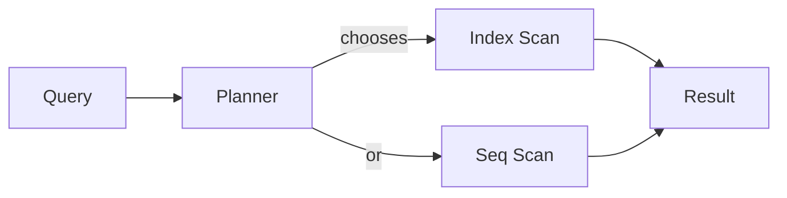

# Index and Query Plan

> SQL 101 series (9/10)

<!-- a-grade-intro:begin -->

**Core question**: Same SQL, *0.1 second* vs *30 seconds* — where does the gap come from, and how do we *read EXPLAIN* and *fix* what we see?

> *Tuning without reading the plan is *guessing*. Guesses are *wrong most of the time*.*

<!-- a-grade-intro:end -->

## What You Will Learn

- How a *B-tree* index works
- How to read `EXPLAIN` and `EXPLAIN ANALYZE`
- Five reasons an *index gets skipped*
- Design principles for *composite indexes*
- Five common mistakes

## Why It Matters

Tuning value *grows non-linearly* with data. One read of the plan can *save a server*. Indexes are *not free* — *where to put them* and *where not to* is a design skill.

> *Reads get faster but writes get slower. Indexing is a *trade*.*

## Concept at a Glance



## Key Terms

- **B-tree index**: the most common *balanced-tree* index.
- **Seq scan**: read *every row* in order.
- **Index scan**: find rows fast through the index, then *fetch them*.
- **Selectivity**: how much a condition *narrows* the result.
- **Covering index**: the query is answered *from the index alone*.

## Before/After

**Before**: `WHERE LOWER(email) = 'x'` becomes a *Seq scan*.

**After**: `WHERE email = 'x'`, or a *function index* `CREATE INDEX ... ON users (LOWER(email))`.

## Hands-on: A Five-Step Tuning Loop

### Step 1 — EXPLAIN

```sql
EXPLAIN
SELECT * FROM users WHERE email = 'a@b.com';
```

### Step 2 — EXPLAIN ANALYZE

```sql
EXPLAIN ANALYZE
SELECT * FROM users WHERE email = 'a@b.com';
```

### Step 3 — Add an index

```sql
CREATE INDEX idx_users_email ON users (email);
```

### Step 4 — Composite index

```sql
CREATE INDEX idx_orders_user_date
ON orders (user_id, created_at DESC);
```

### Step 5 — Partial index

```sql
CREATE INDEX idx_users_active
ON users (id) WHERE deleted_at IS NULL;
```

## What to Notice in This Code

- A composite index's *column order* matters — only the *leftmost prefix* is usable.
- *Partial indexes* are *small and fast* when the predicate is *clear*.
- `EXPLAIN ANALYZE` *actually runs* the query — be careful in production.

## Five Common Mistakes

1. **Function on the column** — index *not used*.
2. **Implicit type cast** — index *defeated*.
3. **`LIKE '%x'`** trailing wildcard — *no index*.
4. **Too many ORs** — planner picks a *Seq scan*.
5. **Indexing everything** — write costs *explode*.

## How This Shows Up in Production

Performance work is mostly *slow-query log → EXPLAIN → index or query change*, repeated. Composite index design considers both *predicates and ordering*. *Partial indexes* pair well with *soft deletes*.

## How a Senior Engineer Thinks

- *Read the plan, don't *guess*.*
- *Indexes are a *read/write trade-off*.*
- *Only the *leftmost prefix* of a composite index helps.*
- *Avoid functions and casts on indexed columns.*
- *Always keep the *slow-query log* on.*

## Checklist

- [ ] I can tell Seq from Index scans in EXPLAIN.
- [ ] I know why composite column order matters.
- [ ] I can use partial indexes.
- [ ] I know when a function index is needed.

## Practice Problems

1. Use EXPLAIN to see why a search by `email` is a Seq scan.
2. Tune *recent orders* with a composite `(user_id, created_at DESC)`.
3. Explain why a partial index on `deleted_at IS NULL` *stays small*.

## Wrap-up and Next Steps

Tuning starts with *reading the plan*. Next: *practical analysis SQL*.

<!-- toc:begin -->
- [What Is SQL?](./01-what-is-sql.md)
- [SELECT Basics](./02-select-basics.md)
- [WHERE and Conditions](./03-where-and-conditions.md)
- [JOIN](./04-join.md)
- [GROUP BY and Aggregates](./05-group-by-and-aggregate.md)
- [Subquery](./06-subquery.md)
- [Window Function](./07-window-function.md)
- [INSERT, UPDATE, DELETE](./08-insert-update-delete.md)
- **Index and Query Plan (current)**
- Practical Analysis SQL (upcoming)
<!-- toc:end -->

## References

- [PostgreSQL — Indexes](https://www.postgresql.org/docs/current/indexes.html)
- [PostgreSQL — EXPLAIN](https://www.postgresql.org/docs/current/sql-explain.html)
- [Use The Index, Luke](https://use-the-index-luke.com/)
- [PostgreSQL — Partial Indexes](https://www.postgresql.org/docs/current/indexes-partial.html)

Tags: SQL, Index, QueryPlan, Performance, Postgres
