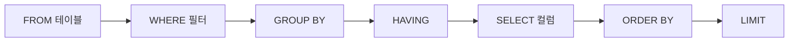

# SELECT 기본

> SQL 101 시리즈 (2/10)


## 이 글에서 다룰 문제

분석가가 하루에 *수백 번* 치는 명령이 SELECT 입니다. *작성 습관 하나* 가 *읽기 속도, 비용, 신뢰* 를 바꿉니다. 특히 *컬럼 명시* 와 *명확한 별칭* 은 *6개월 뒤의 자기 자신* 을 도와줍니다.

> *SELECT 는 *말하기 쉬운 만큼 *오해받기 쉽다*.*

## 전체 흐름


## Before/After

**Before**: `SELECT * FROM orders ORDER BY id;` 로 *수십만 행* 을 *전부* 받아 본다.

**After**: 필요한 *3개 컬럼* 만 가져오고 `LIMIT 50` 으로 *화면에 맞춘다*.

## 자주 쓰는 5가지

### 1단계 — 컬럼을 *명시* 한다

```sql
SELECT id, name, signup_at FROM users;
```

### 2단계 — 별칭으로 *읽기 좋게*

```sql
SELECT name AS user_name, signup_at AS joined_on FROM users;
```

### 3단계 — 정렬

```sql
SELECT id, name FROM users ORDER BY signup_at DESC;
```

### 4단계 — 상위 N 개만

```sql
SELECT id, name FROM users ORDER BY id LIMIT 10;
```

### 5단계 — 중복 제거

```sql
SELECT DISTINCT country FROM users;
```

## 이 코드에서 주목할 점

- *작성 순서* 는 `SELECT ... FROM ... WHERE ...` 지만, *논리 평가 순서* 는 *FROM → WHERE → SELECT*.
- 별칭은 *WHERE* 에서는 못 쓰지만 *ORDER BY* 에서는 쓸 수 있다.
- `DISTINCT` 는 *정렬 또는 hash* 가 필요해 *비용이 든다*.

## 자주 하는 실수 5가지

1. **`SELECT *` 로 *모든 컬럼* 가져오기.** 인덱스가 *덜 활용* 되고 네트워크가 *팽창* 한다.
2. **`ORDER BY 1` 로 *컬럼 위치* 에 의존.** 컬럼 추가 시 *깨진다*.
3. **`LIMIT` 없이 *대용량 조회*.** UI 가 *얼어붙는다*.
4. **`DISTINCT` 로 *중복을 숨긴다*.** 원인이 되는 *조인 카디널리티* 를 *못 본다*.
5. **별칭에 *공백/한글* 을 넣고 quote 안 함.** *문법 오류*.

## 실무에서는 이렇게 쓰입니다

대시보드는 보통 `SELECT 필요컬럼 + ORDER BY + LIMIT` 패턴을 *수백 번* 반복합니다. 분석 노트북에서는 *상위 50행* 을 먼저 보고 패턴을 잡은 뒤 본 쿼리로 갑니다.

## 체크리스트

- [ ] `SELECT *` 없이 쿼리를 짤 수 있다.
- [ ] 별칭과 ORDER BY 관계를 안다.
- [ ] LIMIT 의 의미를 안다.
- [ ] DISTINCT 비용을 설명할 수 있다.

## 정리 및 다음 단계

SELECT 는 *문장 구조* 를 익히는 일입니다. 다음 글은 *WHERE 와 조건* 입니다.

<!-- toc:begin -->
- [SQL이란 무엇인가?](./01-what-is-sql.md)
- **SELECT 기본 (현재 글)**
- WHERE와 조건 (예정)
- JOIN (예정)
- GROUP BY와 aggregate (예정)
- Subquery (예정)
- Window Function (예정)
- INSERT, UPDATE, DELETE (예정)
- Index와 Query Plan (예정)
- 실전 분석 SQL (예정)
<!-- toc:end -->

## 참고 자료

- [PostgreSQL — SELECT](https://www.postgresql.org/docs/current/sql-select.html)
- [SQLBolt — SELECT queries](https://sqlbolt.com/lesson/select_queries_introduction)
- [Mode — SELECT statement](https://mode.com/sql-tutorial/sql-select-statement/)
- [SQL Style Guide](https://www.sqlstyle.guide/)

Tags: SQL, SELECT, Query, Database, Postgres
