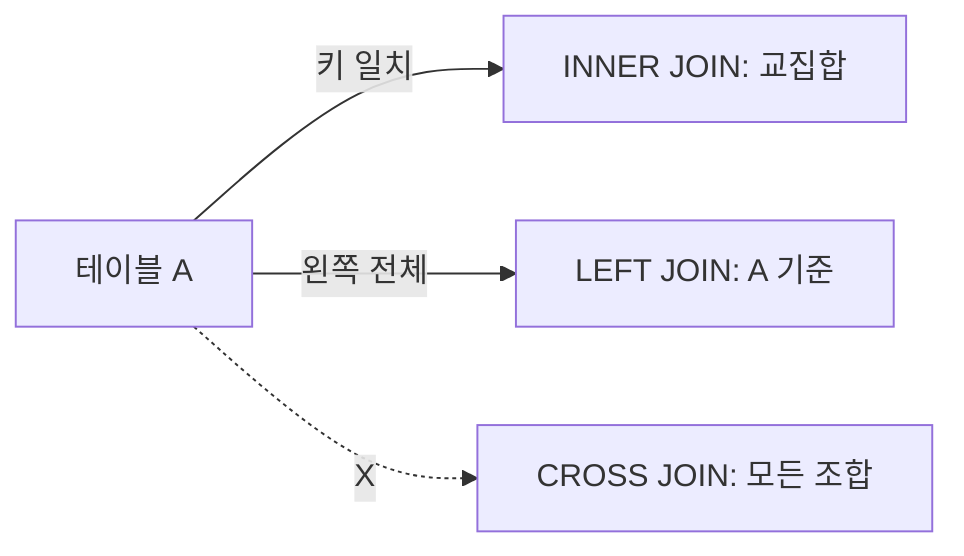

# JOIN

> SQL 101 시리즈 (4/10)


## 이 글에서 다룰 문제

실무 쿼리의 *대부분* 이 JOIN 을 포함합니다. 여기서 *카디널리티* 를 잘못 보면 *합계가 두 배* 가 됩니다. JOIN 을 정확히 다루는 것이 *분석가의 신뢰* 와 직결됩니다.

> *JOIN 은 *집합의 수학* 이지 *문자열 결합* 이 아니다.*

## 개념 한눈에 보기



## Before/After

**Before**: `SELECT SUM(o.total) FROM orders o JOIN payments p ON o.id = p.order_id;` — 결제가 *2회 분할* 이면 합이 *두 배* 가 된다.

**After**: 결제를 *먼저 집계한 subquery* 와 조인해 *카디널리티 1:1* 을 보장한다.

## 실습: 5가지 JOIN

### 1단계 — INNER JOIN

```sql
SELECT u.name, o.id AS order_id
FROM users u
INNER JOIN orders o ON o.user_id = u.id;
```

### 2단계 — LEFT JOIN

```sql
SELECT u.name, o.id AS order_id
FROM users u
LEFT JOIN orders o ON o.user_id = u.id;
```

### 3단계 — Anti-join (주문 없는 사용자)

```sql
SELECT u.id, u.name
FROM users u
LEFT JOIN orders o ON o.user_id = u.id
WHERE o.id IS NULL;
```

### 4단계 — Self-join (직속 상사)

```sql
SELECT e.name AS emp, m.name AS manager
FROM employees e
LEFT JOIN employees m ON m.id = e.manager_id;
```

### 5단계 — 다중 JOIN

```sql
SELECT u.name, p.name AS product
FROM users u
JOIN orders o ON o.user_id = u.id
JOIN order_items oi ON oi.order_id = o.id
JOIN products p ON p.id = oi.product_id;
```

## 이 코드에서 주목할 점

- LEFT JOIN 결과의 NULL 은 *짝이 없다* 는 *신호*.
- Anti-join 은 *서브쿼리* 보다 *명시적* 이고 *튜닝 가능*.
- 다중 JOIN 은 *기준 테이블* 을 *제일 작게* 두면 빠르다.

## 자주 하는 실수 5가지

1. **카디널리티 *확인 없이* 합계.** 결과가 *부풀어* 오른다.
2. **WHERE 로 LEFT JOIN 을 *INNER 로 만들기*.** `WHERE o.x = ...` 가 *NULL 행을 제거*.
3. **`USING` 과 `ON` *섞어 쓰기*.** 가독성이 *깨진다*.
4. **CROSS JOIN 을 *실수로*.** *카르테시안 폭발*.
5. **조인 키 *타입 불일치*.** *암시적 변환* 으로 *index 무력*.

## 실무에서는 이렇게 쓰입니다

리포트는 *이벤트 + 사용자 + 상품* 처럼 *3~5 테이블 조인* 이 기본입니다. 보통 *fact 테이블* 을 가운데 두고 *dimension* 들을 LEFT JOIN 으로 붙입니다. 카디널리티 검증은 *COUNT 비교* 로 합니다.

## 체크리스트

- [ ] INNER, LEFT, RIGHT, FULL 의 차이를 그림으로 안다.
- [ ] 카디널리티를 정의할 수 있다.
- [ ] anti-join 을 두 가지 방식으로 쓸 수 있다.
- [ ] CROSS JOIN 의 위험을 안다.

## 정리 및 다음 단계

JOIN 은 *집합* 의 언어입니다. 다음 글은 *GROUP BY 와 aggregate*.

<!-- toc:begin -->
- [SQL이란 무엇인가?](./01-what-is-sql.md)
- [SELECT 기본](./02-select-basics.md)
- [WHERE와 조건](./03-where-and-conditions.md)
- **JOIN (현재 글)**
- GROUP BY와 aggregate (예정)
- Subquery (예정)
- Window Function (예정)
- INSERT, UPDATE, DELETE (예정)
- Index와 Query Plan (예정)
- 실전 분석 SQL (예정)
<!-- toc:end -->

## 참고 자료

- [PostgreSQL — Joins](https://www.postgresql.org/docs/current/tutorial-join.html)
- [SQLBolt — Multi-table queries with JOIN](https://sqlbolt.com/lesson/select_queries_with_joins)
- [Mode — JOIN](https://mode.com/sql-tutorial/sql-joins/)
- [Use The Index, Luke — Joins](https://use-the-index-luke.com/sql/join)

Tags: SQL, JOIN, Relational, Database, Query
